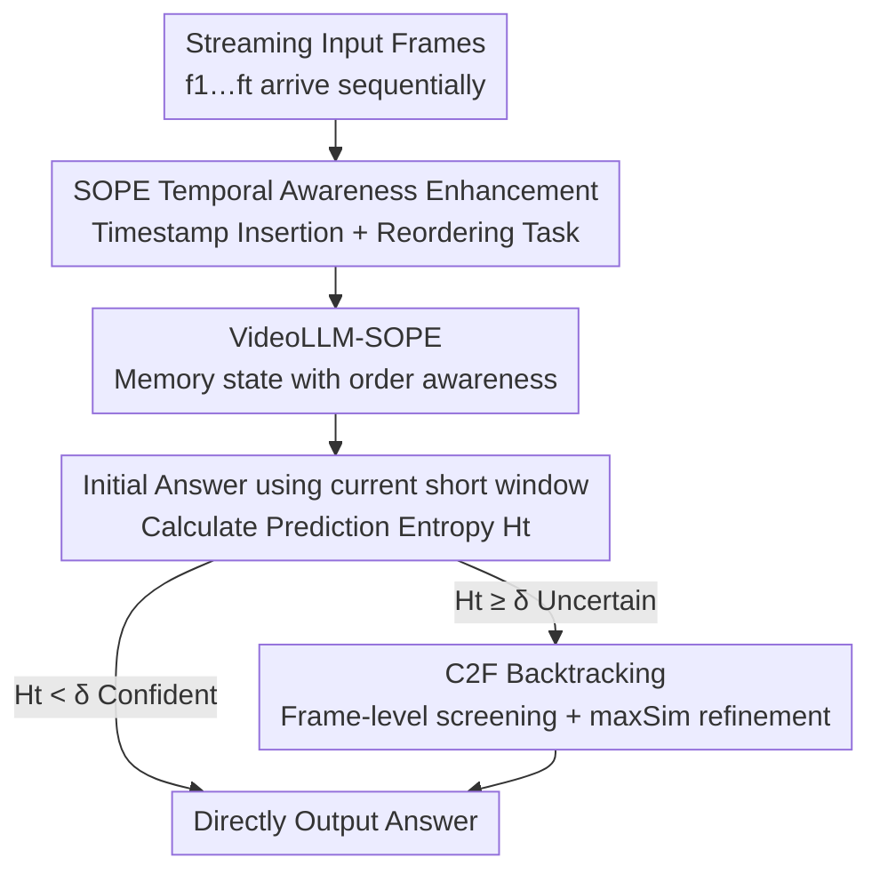

# WeaveTime: Streaming from Earlier Frames into Emergent Memory in VideoLLMs

**Conference**: CVPR 2026  
**Paper**: [CVF Open Access](https://openaccess.thecvf.com/content/CVPR2026/html/Zhang_WeaveTime_Streaming_from_Earlier_Frames_into_Emergent_Memory_in_VideoLLMs_CVPR_2026_paper.html)  
**Code**: Available (Weights and code released per paper)  
**Area**: Multimodal VLM / Video Understanding  
**Keywords**: Streaming VideoLLM, Temporal Awareness, Memory Retrieval, Uncertainty Gating, Plug-and-play

## TL;DR
WeaveTime addresses two chronic issues in streaming VideoLLMs—the inability to distinguish event order and the confusion between "now" and the "past"—via a two-step approach: "teaching temporal order during training + using temporal order during inference." It injects a sense of sequence during training through a temporal reordering auxiliary task that requires no specialized streaming data. During inference, it employs an uncertainty gate triggered by prediction entropy and a coarse-to-fine (C2F) retrieval strategy to access historical memory as needed. As a plug-and-play module for existing VideoLLMs, it simultaneously improves accuracy and reduces latency on OVO-Bench and Streaming-Bench.

## Background & Motivation

**Background**: Mainstream VideoLLMs follow the "Encoder-Projector-LLM" architecture but are almost exclusively designed for **offline** scenarios—assuming the entire video and the query are provided at once, with visual information packed into a fixed-length context via sampling, pruning, or compression. While this "post-hoc processing" is powerful on standard benchmarks, it is inherently unsuitable for **streaming** scenarios (e.g., autonomous driving, human-robot interaction, real-time monitoring, online meetings) where frames arrive sequentially, the future is unknown, and the current state is observed only once.

**Limitations of Prior Work**: The authors performed a rigorous diagnostic experiment—**shuffling the frames before feeding them to the model resulted in almost no drop in accuracy, and even improved performance on certain temporal tasks** (indicated by red cells in Table 1). In contrast, humans fail at temporal or action-based tasks when frames are shuffled and only recover when timestamps are provided. This indicates that existing VideoLLMs do not truly construct or utilize temporal order but rather guess answers based on "beginning-end" position biases and spatial-temporal shortcuts. The authors term this root cause **Time-Agnosticism**: models treat video as an unordered bag of evidence rather than a causal temporal sequence.

**Key Challenge**: Time-Agnosticism manifests as two coupled failure modes in streaming contexts:
- **Temporal Order Ambiguity**: A query may correspond to multiple historical segments with similar semantics but different occurrence orders; correct answering depends on referencing them in the right sequence. Without encoded order, attention drifts to temporally mismatched evidence (e.g., misinterpreting "leaving the room" as "entering the room," thus identifying outside flowers as being inside).
- **Past–Current Focus Blindness**: Some queries can be answered using only the current frame, while others require targeted historical backtracking. Models either scan through monotonically growing memory indiscriminately or fixate solely on the current frame, leading to unnecessary history searches when the focus should be on the "now" and missing history when backtracking is required.

**Goal / Key Insight**: Instead of forcefully creating a streaming model through massive specialized streaming instruction data and expensive training, the authors argue that temporal ambiguity and inefficient memory access are fundamentally entangled. Robust online understanding "emerges" only by simultaneously improving **temporal awareness during training** and **retrieval behavior during inference**.

**Core Idea**: **Teach order first, then use it.** Inclusion of a lightweight temporal reconstruction auxiliary task during training embeds "when things happened" into the representation. During inference, an uncertainty gate combined with C2F retrieval accesses history on demand. This system requires no architectural changes and can be plugged into any VideoLLM.

## Method

### Overall Architecture
WeaveTime addresses Streaming VQA: frames $f_1, f_2, \dots, f_T$ arrive sequentially, and a question $q$ is posed at time $t$. The model must answer causally using only **observed frames** $\{f_1, \dots, f_t\}$. Built upon a retrieval-based VideoLLM baseline—comprising a visual encoder, connector, and LLM—it utilizes a growing memory cache. During encoding, sliding window attention for each new frame $f_t$ generates key-value pairs $(K_t, V_t)$, which are appended to memory $\mathcal{M}_t = \mathrm{Append}(\mathcal{M}_{t-1}, (K_t, V_t))$. Upon a query, relevant frames are retrieved Top-K from memory to generate the answer.

WeaveTime integrates two orthogonal components: **SOPE** (training-side awareness) and **PCDF-Cache** (inference-side on-demand backtracking), with PCDF-Cache utilizing **C2F retrieval** for precise and efficient history access.

### Key Designs

**1. SOPE: Teaching "When Events Occurred" via Temporal Reconstruction**

To address temporal order ambiguity, the authors force "order signals" during training. In the token sequence $\mathbf{X} = [\tilde{\mathbf{v}}_{1,1}, \dots, \tilde{\mathbf{v}}_{1,N_f}, \tilde{\mathbf{v}}_{2,1}, \dots]$, a **timestamp token** $\mathbf{ts}_i$ is inserted before each frame. The **frame content is then shuffled while retaining explicit timestamps**, resulting in:

$$\mathbf{X}' = [\mathbf{ts}_1, \tilde{\mathbf{v}}_{2,1}, \dots, \tilde{\mathbf{v}}_{2,N_f}, \mathbf{ts}_2, \tilde{\mathbf{v}}_{1,1}, \dots]$$

An **instruction is appended** before the QA prompt: "These segments are shuffled, list the true time range for each," requiring the model to **restore the correct order before answering the question**. The design leverages the LLM's inherent next-token prediction capabilities for reordering without adding external heads or extra loss. This upgrades the memory from an "unordered cache" to an "ordered causal chain" **without requiring specialized streaming datasets**, using only lightweight fine-tuning on standard offline video data.

**2. PCDF-Cache: "Focus on Now, Recall if Necessary" via Entropy Gating**

To solve past–current focus blindness, PCDF-Cache avoids indiscriminate history searches. When query $q$ arrives at time $t$, the model **first uses only the current short window** $\mathcal{M}_{t-1}[-C:]$ to produce an initial answer $a_t^{(0)}$. The prediction entropy $H_t = \mathrm{Entropy}(a_t^{(0)})$ is compared against a threshold $\delta$:

$$a_t = \begin{cases} a_t^{(0)}, & H_t < \delta \\ \mathrm{Answer}(\mathrm{Load_{C2F}}(\mathcal{M}_t, q),\, q), & \text{otherwise} \end{cases}$$

Low entropy (confidence) bypasses long-term memory, reducing redundancy and latency. High entropy (uncertainty) triggers backtracking. This gate relies on SOPE to ensure that once backtracking is triggered, the model can correctly locate "when" events happened.

**3. C2F Retrieval: Coarse Screening + Max-Sim Refinement**

To balance efficiency and accuracy in history retrieval, C2F uses two steps: first, frame-level cosine similarity narrows the search space to a candidate set $\mathcal{M}_{\text{coarse}}$. Within these candidates, fine-grained matching is performed using **multi-vector late-interaction max-sim scoring**. For frame visual tokens $\{f^v_{i,k}\}$ and query tokens $\{f^q_j\}$:

$$\mathrm{maxSim}(\{f^v_{i,k}\}, \{f^q_j\}) = \sum_{j=1}^{N_q} \max_{1 \le k \le N_i} \langle f^q_j,\, f^v_{i,k} \rangle$$

The Top-K frames are then selected. This approach provides token-level precision while avoiding the "memory wall" (OOM) encountered by pure fine-grained retrieval in streaming contexts.

### Loss & Training
SOPE **reuses next-token prediction** for the reordering task. Training data is randomly sampled from the LLaVA-Video-178K set (30K **offline samples** total), using **no streaming-specific data**. Training is performed for 1 epoch using LoRA, a learning rate of $1\times10^{-5}$, and 8 GPUs. Inference is modified from the ReKV codebase, with up to 64 frames of backtracking and an entropy threshold $\delta = 0.6$.

## Key Experimental Results

The backbone used is LLaVA-OV-7B (also validated on Qwen2-VL-7B). WeaveTime is compared against model-agnostic streaming methods StreamBridge and ReKV following the StreamBridge multi-turn protocol.

### Main Results

| Setting (LLaVA-OV-7B Multi-turn) | OVO-Bench Real-Time AVG | Streaming-Bench Real-Time AVG |
|--------------------------|-------------------------|-------------------------------|
| + StreamBridge | 61.64 | 68.39 |
| + ReKV† | 61.72 | 66.15 |
| **+ WeaveTime (Ours)** | **68.82** | **72.13** |

Compared to the best baseline, it achieves up to **+7.10%** on OVO-Bench and **+3.74%** on Streaming-Bench. Gains are particularly stark on temporal-sensitive tasks: Action Perception (ACP) +7.56%, Event Understanding (EU) +9.04%, and Action Recognition (ACR) +11.09%.

### Ablation Study

| TP (Timestamp Training) | TR (Reordering Task) | PCDF-Cache | OVO-Bench Overall | Streaming Real-Time |
|:---:|:---:|:---:|:---:|:---:|
| — | — | — (ReKV Baseline) | 53.56 | 66.15 |
| ✔ | | | 49.88 (**-3.68**) | 65.91 |
| ✔ | ✔ | | 55.70 (**+5.82**) | 68.49 |
| ✔ | ✔ | ✔ | **57.57** (+1.87) | **72.13** (+3.64) |

### Key Findings
- **Timestamp training alone drops performance (-3.68%)**: Fine-tuning on offline videos without the reordering task hurts streaming performance due to distribution mismatch. The reordering task (TR) is essential, indicating gains come from "learning order" rather than "more data."
- **Entropy threshold $\delta$ as a precision-efficiency knob**: Performance peaks at $\delta=0.6$, while latency decreases monotonically as the threshold increases.
- **Data/Compute Efficiency**: SOPE uses only 30K offline samples, 0 streaming samples, and 8 GPUs to achieve significant gains, whereas StreamForest requires orders of magnitude more samples and 32 GPUs for comparable results.
- **Verification of Sequence Learning**: In 100 evaluated cases, the reordering overlap mean was 78.38%, showing the model learned temporal structure rather than shortcuts.

## Highlights & Insights
- **Diagnostic Value**: The "shuffle frames without drop" experiment effectively exposes the time-agnosticism of current VideoLLMs, providing a more robust motivation than simple leaderboard scores.
- **Auxiliary Supervision via Prompting**: Formulating the temporal task as next-token prediction instead of adding a separate head is an efficient engineering choice that leverages the LLM's sequence capabilities while allowing parameter reuse within the same conversation.
- **Uncertainty Gating**: Using prediction entropy as a retrieval trigger is an elegant, training-free, and plug-and-play solution that optimizes latency for RAG-like systems.
- **C2F Formula**: The "coarse screening to avoid memory wall + late-interaction for precision" recipe answers the practical implementation problem of how to handle large-scale historical retrieval in streaming.

## Limitations & Future Work
- **Static Entropy Threshold**: A global fixed threshold (0.6) may not be optimal for all video lengths or tasks; adaptive thresholding was not explored.
- **Reordering Accuracy**: A 78.38% overlap suggests some temporal information is still lost, which may propagate errors during retrieval in long or sparse videos.
- **Retrieval-Based Bottleneck**: Retaining all visual memory externally may hit storage limits in extremely long streams, and the 64-frame backtracking limit may be insufficient for massive temporal horizons.

## Related Work & Insights
- **vs StreamForest / Streaming Instruction Tuning**: These methods rely on large-scale specialized streaming data and high compute. WeaveTime achieves similar gains with 30K offline samples and zero streaming data by injecting temporal priors as a structural inductive bias.
- **vs Compressive Memory (Flash-VStream)**: Those methods compress features, which is fast but lossy. WeaveTime uses retrieval-based lossless memory with C2F to maintain performance upper bounds.
- **vs ReKV (Retrieval-based Memory)**: While ReKV provides a high ceiling, its frequent reloads are slow. WeaveTime serves as a controller for "when and how to retrieve," maintaining the performance of retrieval while optimizing efficiency.

## Rating
- Novelty: ⭐⭐⭐⭐⭐ 
- Experimental Thoroughness: ⭐⭐⭐⭐ 
- Writing Quality: ⭐⭐⭐⭐⭐ 
- Value: ⭐⭐⭐⭐⭐ 

<!-- RELATED:START -->

## Related Papers

- [\[CVPR 2026\] WeaveTime: Stream from Earlier Frames into Emergent Memory in VideoLLMs](weavetime_streaming_video_llm_memory.md)
- [\[CVPR 2026\] Explore with Long-term Memory: A Benchmark and Multimodal LLM-based Reinforcement Learning Framework for Embodied Exploration](explore_with_long-term_memory_a_benchmark_and_multimodal_llm-based_reinforcement.md)
- [\[CVPR 2026\] Streaming Video Instruction Tuning (Streamo)](streaming_video_instruction_tuning.md)
- [\[CVPR 2026\] Seeing Clearly, Reasoning Confidently: Plug-and-Play Remedies for Vision Language Model Blindness](seeing_clearly_reasoning_confidently_plug-and-play_remedies_for_vision_language_.md)
- [\[CVPR 2026\] CropVLM: Learning to Zoom for Fine-Grained Vision-Language Perception](cropvlm_learning_to_zoom_for_fine_grained_vision_language_perception.md)

<!-- RELATED:END -->
