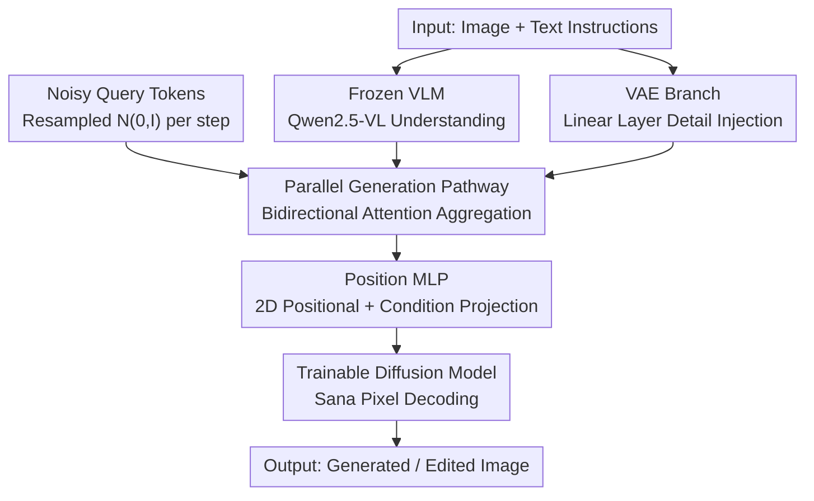

# WeMMU: Enhanced Bridging of Vision-Language Models and Diffusion Models via Noisy Query Tokens

**Conference**: CVPR 2026  
**Paper**: [CVF Open Access](https://openaccess.thecvf.com/content/CVPR2026/html/Yang_WeMMU_Enhanced_Bridging_of_Vision_Language_Models_and_Diffusion_Models_via_CVPR_2026_paper.html)  
**Code**: To be confirmed  
**Area**: Multimodal VLM / Unified Understanding and Generation  
**Keywords**: Noisy query tokens, VLM-diffusion bridging, continual learning, image editing, task generalization collapse  

## TL;DR
WeMMU bridges a frozen VLM (Qwen2.5-VL) and a trainable diffusion model (Sana) using a set of "noisy query tokens" resampled from $\mathcal{N}(0,I)$ at each step, alongside an external VAE linear branch to recover fine-grained details. This design resolves the "task generalization collapse" observed when fixed learnable queries migrate to new tasks, enabling efficient and sustainable learning for unified multimodal generation and editing.

## Background & Motivation

**Background**: There are two primary approaches to integrating "understanding" and "generation" into a single Multimodal Large Language Model (MLLM). The first approach, exemplified by Bagel and Mogao, directly trains diffusion parameters within the MLLM. While effective, this requires training generation from scratch, consuming massive data and compute. The second approach is more efficient: it connects a pre-trained VLM (understanding) and a pre-trained diffusion model (generation) using a lightweight "bridge," training only the bridge itself. MetaQueries, which uses a set of **learnable query tokens** as a bridge, is a representative of this path, matching competitors with only 25M data and 4 epochs.

**Limitations of Prior Work**: The authors identify a critical flaw in the second path: **task generalization collapse**. Learnable query tokens become "rigid" after pre-training on "text-to-image + image reconstruction." When moved to an "image editing" task, the model ignores text instructions and mechanically reconstructs the input image. Consequently, adding any significantly different new task requires reverting to early stages and retraining all tasks together, hindering sustainable learning.

**Key Challenge**: An intuitive fix would be to freeze the pre-trained models and only fine-tune or re-initialize the query tokens—but this leads to **rapid training collapse**. The authors diagnose that learnable queries quickly converge to a task-specific "mean point" with limited expressiveness, which cannot support generalization across diverse new tasks.

**Key Insight / Core Idea**: Since a "fixed point" is insufficient, the intermediate representation bridging the VLM and the generator should be a **distribution rather than a point**. Specifically, the authors introduce **Noisy Query Tokens**: using query tokens as sampling starting points from a distribution, resampled from a standard normal distribution at each step. This forces the model to learn a robust and generalizable intermediate feature space rather than memorizing task-specific shortcuts. A VAE branch is added to recover fine-grained details lost during VLM semantic compression.

## Method

### Overall Architecture

WeMMU adheres to the principle of "division of labor": allowing the frozen VLM to focus on image understanding and instruction following, and the trainable diffusion model to focus on decoding this information into pixels. The backbone consists of Qwen2.5-VL-3B (understanding, **frozen throughout**) and Sana 1.6B (generation, unfrozen during fine-tuning).

Bridging occurs within the VLM: the authors **replicate a parameter-trainable "parallel generation pathway"** alongside the frozen VLM (initialized from VLM weights). At each step, a set of Noisy Query Tokens enters this pathway and uses bidirectional attention to aggregate all image and text tokens, while the original VLM tokens maintain standard attention patterns. Parallel to this, a VAE branch injects high-frequency details into the LLM via a single linear layer. Finally, a Position MLP adds 2D positional encodings to the features and projects them into condition vectors for the diffusion model. The entire pipeline is a unidirectional "input → bridge → pixel" feed-forward process.

### Key Designs

**1. Noisy Query Tokens: Changing Intermediate Representation from "a Point" to "a Distribution"**

This is the core of the paper, directly addressing "task generalization collapse." Traditional methods use fixed learnable query vectors, which overfit task-specific means. WeMMU's approach is simple but counter-intuitive: **instead of fixed vectors, it resamples $Q_{noisy}\sim\mathcal{N}(0,I)$ at every training step**. Since the queries change constantly, the model cannot develop "path dependency" on specific queries and is forced to learn a robust, generalizable **distribution** of intermediate representations. To maintain compatibility with dynamic resolutions, the number of tokens matches the image patches from the VLM visual encoder, utilizing image-style positional encodings (e.g., Qwen2.5-VL's M-RoPE). Analysis shows that while learnable queries strongly bias toward image tokens, Noisy Queries shift focus toward text tokens, prioritizing instruction execution over verbatim copying.

**2. VAE Branch + Linear Layer: Recovering Details Lost in LLM Semantic Compression**

While Noisy Queries solve generalization, fidelity remains a challenge. The authors found that Qwen2.5-VL's raw ViT features can achieve high-fidelity reconstruction if fed **directly** to the diffusion model (Sana 1.6B). However, once these features pass through the **LLM + query token** pathway, reconstruction collapses to "semantic approximation." To solve this, a separate branch takes features from the **frozen VAE encoder** of the diffusion model and injects them into the LLM via a **single linear layer**. This branch handles high-frequency details, allowing the VLM to focus on multimodal operations.

**3. Parallel Generation Pathway + Position MLP: Extracting Generation Conditions without Damaging VLM Knowledge**

To empower the VLM with generation capabilities while preserving its understanding, WeMMU replicates a **trainable generation pathway** beside the frozen original. Noisy Query Tokens interact with all tokens via **bidirectional attention** in this pathway. The output passes through a **Position MLP**, which superimposes a learnable 2D absolute positional encoding (dynamically cropped from a large matrix to match current resolution) and projects features to the required dimensions for the diffusion model. This "frozen understanding + trainable bypass" design is model-agnostic.

**4. Loss & Training: Four-Stage Progressive Training + Contrastive Flow Matching**

The training uses flow matching. In Conditional Flow Matching (CFM), a vector field $v_\theta(x_t,t,y)$ is learned to push noise $\epsilon$ toward data $x_0$, with the loss:

$$\mathcal{L}_{CFM}(\theta)=\mathbb{E}\big[\,\lVert v_\theta(x_t,t,y)-(\epsilon-x_0)\rVert^2\,\big]$$

Early pre-training utilizes **Contrastive Flow Matching ($\Delta$FM)** to accelerate convergence by pushing away from negative samples $v^-$ in the same batch:

$$\mathcal{L}_{\Delta FM}(\theta)=\mathbb{E}\big[\,\lVert v_\theta-v^+\rVert^2-\lambda\lVert v_\theta-v^-\rVert^2\,\big]$$

Training follows four stages: Stage 1 (Bridge warmup, 512×512, $\Delta$FM) → Stage 2 (Unfreeze Sana, 1024×1024, CFM) → Stage 3 (High-quality data for single-image editing) → Stage 4 (Complex tasks like multi-image editing).

## Key Experimental Results

Backbone: Qwen2.5-VL-3B + Sana 1.6B. Total ~8B parameters.

### Main Results: Generation (GenEval / DPG-Bench)

| Type | Method | Scale | GenEval Position↑ | GenEval Overall↑ | DPG Overall↑ |
|------|------|------|------|------|------|
| Gen.Only | SD3-Medium | 2B | 0.33 | 0.74 | 84.08 |
| Unified | QWen-Image | 27B | 0.76 | 0.87 | 88.32 |
| Unified | Bagel* | 14B | 0.78 | 0.88 | 85.07 |
| Unified | Query-Kontext* | 17B | 0.85 | 0.88 | – |
| **Ours (Stage 3)** | – | **8B** | **0.86** | **0.88** | 83.69 |

WeMMU achieves the highest GenEval scores among models **without RL fine-tuning** despite its 8B scale. Performance remains stable even after the Stage 4 multitask training.

### Main Results: Editing (ImageEdit / GEdit-EN)

| Method | Scale | ImageEdit Overall↑ | GEdit G_SC↑ | GEdit G_O↑ |
|------|------|------|------|------|
| Bagel | 14B | 3.2 | 7.36 | 6.52 |
| OmniGen2 | 7B | 3.44 | 7.16 | 6.41 |
| **Ours (Stage 4)** | 8B | 3.30 | 5.85 | 5.77 |

Stage 4 confirms that after learning complex multi-image editing, the model does not suffer from catastrophic forgetting regarding single-image editing or generation.

### Ablation Study: Query Token Design (ImageEdit)

| Configuration | Hybrid↑ | Action↑ | Overall↑ |
|------|------|------|------|
| Learnable Fixed Query | 1.87 | 2.21 | 2.53 |
| Learnable Dynamic Query | 2.02 | 2.60 | 2.88 |
| Noisy Query (No VAE) | 2.36 | 2.75 | 2.98 |
| Noisy Query + VAE Branch (Full) | **2.82** | **3.15** | **3.31** |

### Key Findings
- **Noisy Query is the primary performance driver**: Moving from fixed queries (2.53) to Noisy Queries (2.98) provides the largest gain.
- **Simplest VAE injection works best**: A single linear layer converged more stably than deeper ViT-based connections.
- **Multitask robustness**: Noisy Queries successfully handle multi-image tasks (e.g., replacing subject in Image A with Subject in Image B) where fixed queries failed.

## Highlights & Insights
- **"Distribution > Point" logic**: Solving generalization collapse by turning the bridge representation into a per-step resampled noise distribution is a highly efficient, parameter-free design.
- **Precise Diagnosis**: The identification of the LLM information integration process as the bottleneck for pixel fidelity adds significant grounding to the VAE bypass design.
- **Transferable Paradigm**: The "frozen backbone + parallel trainable pathway + noisy query" framework can be applied to any VLM-to-Generator bridging scenario requiring continual learning.

## Limitations & Future Work
- **Image Quality**: G_PQ scores trail some competitors, likely due to data constraints; future work will explore high-quality data or RL fine-tuning.
- **Scale**: The 8B backbone is relative small; scaling to larger models like Qwen2.5-VL-72B is a logical next step.
- **Artifacts**: Multi-image editing still shows occasional artifacts at image boundaries.

## Related Work & Insights
- **vs MetaQueries**: WeMMU improves upon the fixed learnable query bridge by using noise distributions to prevent task collapse.
- **vs OmniGen2**: Unlike methods using dense VLM features (which increase generation burden), WeMMU uses compact queries coupled with a detail-specific VAE bypass.
- **Efficiency**: WeMMU matches 14B-20B models with only 8B parameters while requiring fewer training resources than native unified models like Bagel.

## Rating
- Novelty: ⭐⭐⭐⭐⭐ 
- Experimental Thoroughness: ⭐⭐⭐⭐ 
- Writing Quality: ⭐⭐⭐⭐ 
- Value: ⭐⭐⭐⭐ 

<!-- RELATED:START -->

## Related Papers

- [\[CVPR 2026\] Do Vision Language Models Need to Process Image Tokens?](do_vision_language_models_need_to_process_image_tokens.md)
- [\[CVPR 2026\] Grounding Everything in Tokens for Multimodal Large Language Models](grounding_everything_in_tokens_for_multimodal_large_language_models.md)
- [\[CVPR 2026\] Diffusion Guided Chain-of-Vision for Large Autoregressive Vision Models](diffusion_guided_chain-of-vision_for_large_autoregressive_vision_models.md)
- [\[CVPR 2026\] Cubic Discrete Diffusion: Discrete Visual Generation on High-Dimensional Representation Tokens](cubic_discrete_diffusion_discrete_visual_generation_on_high-dimensional_represen.md)
- [\[CVPR 2026\] Sparse-LaViDa: Sparse Multimodal Discrete Diffusion Language Models](sparse-lavida_sparse_multimodal_discrete_diffusion_language_models.md)

<!-- RELATED:END -->
