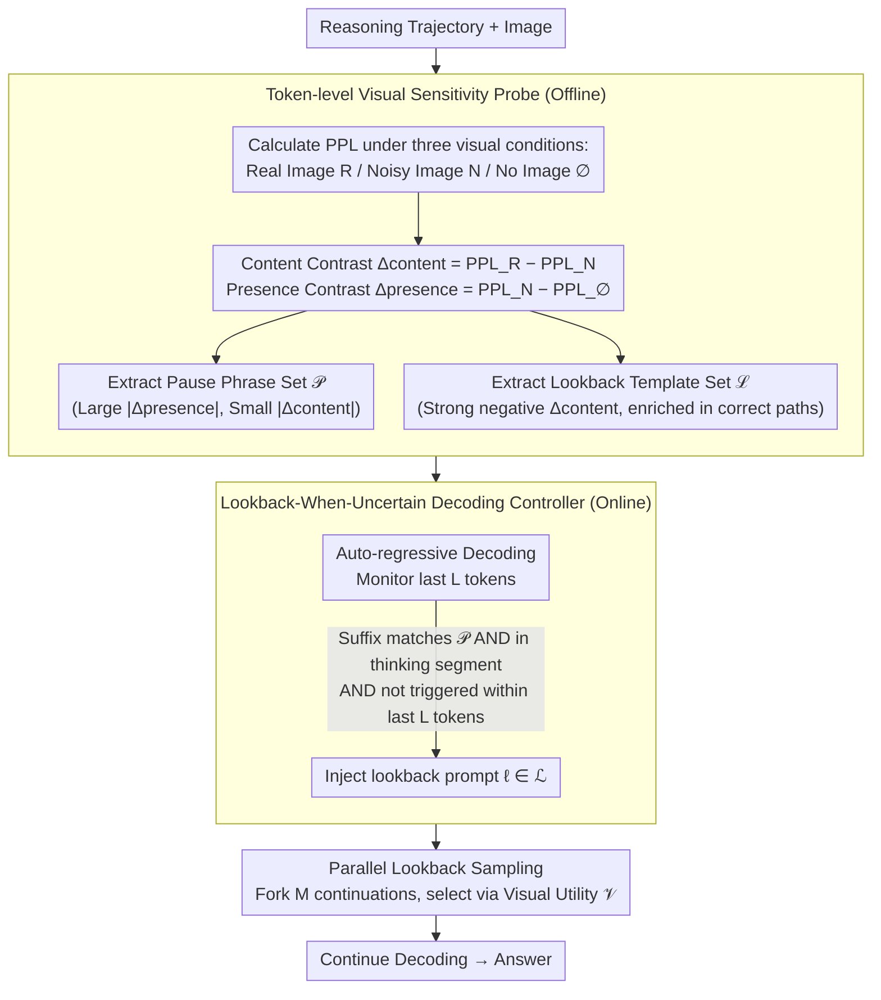

# When to Think and When to Look: Uncertainty-Guided Lookback

**Conference**: CVPR 2026  
**arXiv**: [2511.15613](https://arxiv.org/abs/2511.15613)  
**Code**: None  
**Area**: Multimodal VLM  
**Keywords**: Visual Reasoning, Chain-of-Thought, Large Vision-Language Models, Adaptive Decoding, Uncertainty-Guided

## TL;DR
This paper provides the first systematic analysis of the impact of test-time thinking on visual reasoning in LVLMs. It discovers that "thinking more is often inferior to looking more"—lengthy reasoning chains frequently overlook the image, leading to "long-wrong" trajectories. Based on this, the authors propose an uncertainty-guided lookback decoding strategy. By injecting visual lookback prompts when the reasoning chain drifts, the method improves performance on 6 benchmarks including MMMU by 2-6 points without modifying the model.

## Background & Motivation

1. **Background**: Test-time thinking (generating explicit chains of thought at inference) has shown powerful results in LLMs. Recent LVLM families like InternVL3.5 and Qwen3-VL have begun providing thinking modes (e.g., `<think>` tokens), reporting SOTA results on benchmarks like MMMU.

2. **Limitations of Prior Work**: Although thinking mode is generally helpful, its effectiveness versus harm in visual reasoning has not been systematically studied. In practice, the "long-wrong" phenomenon frequently occurs: models generate long reasoning chains but produce incorrect answers because the reasoning gradually deviates from the image content into pure textual hallucination.

3. **Key Challenge**: Thinking mode is effective for reasoning-intensive STEM problems but can be harmful for categories requiring visual recognition/retrieval (e.g., Literature, History, Art), where long chains introduce noise rather than useful steps. A deeper contradiction is that current thinking modes apply "deep thinking" uniformly to all questions, lacking adaptive control.

4. **Goal**: (a) When is thinking beneficial for visual reasoning? (b) how to balance reasoning breadth (sampling counts) vs. depth (thinking mode)? (c) can thinking be adaptively controlled for better visual perception?

5. **Key Insight**: Through token-level perplexity contrastive experiments (original image vs. noisy image vs. no image), the authors found frequent "lookback" phrases (explicitly referring back to the image) in correct trajectories, which are absent in incorrect ones. They identified two types of phrases: pause/uncertainty phrases (indicating drift) and lookback phrases (re-anchoring to the image).

6. **Core Idea**: Automatically inject visual lookback prompts when uncertainty signals appear in the reasoning chain, transforming "blind deep thinking" into "lookback-on-demand."

## Method

### Overall Architecture
This paper addresses the ignored question of when LVLM thinking modes help or hinder visual reasoning. The authors conclude "thinking more is inferior to looking more"—long reasoning chains risk falling into the "long-wrong" trap. The method is divided into offline and online phases. Offline, a token-level probe scans reasoning trajectories to identify: a pause phrase set $\mathcal{P}$ (e.g., "hmm", "wait") indicating the start of drift, and a lookback template set $\mathcal{L}$ (e.g., "Looking back at the image, ...") that pulls attention back to the image. During online decoding, the system monitors the generated tail for pause phrases; upon a match, it inserts a lookback prompt to anchor the reasoning back to the image, optionally using parallel sampling to select the most visually anchored continuation. This process requires no weight updates.

### Key Designs

**1. Token-level visual sensitivity probe: Quantifying image usage via PPL differences across three visual conditions.**

To determine where a reasoning chain loses visual contact, the authors calculate the perplexity of each token $s$ under three contexts: real image $c=R$, noisy image $c=N$, and no image $c=\varnothing$. **Content Contrast** $\Delta_{content}(s) = PPL_R(s) - PPL_N(s)$ measures if the specific visual content helps predict the token. **Presence Contrast** $\Delta_{presence}(s) = PPL_N(s) - PPL_\varnothing(s)$ measures the impact of image existence. Combination signals a drift: a large $|\Delta_{presence}|$ but small $|\Delta_{content}|$ suggests the model knows it "should" look at the image but fails to utilize the content. Conversely, strongly negative $\Delta_{content}$ indicates successful visual reasoning; phrases at these tokens are collected into $\mathcal{L}$. Using a noisy image instead of an unrelated real image avoids semantic interference.

**2. Lookback-When-Uncertain Decoding Controller: Pulling the model's gaze back at the moment of hesitation.**

The offline-mined pause phrase set $\mathcal{P}$ is used online. The controller monitors the last $L$ tokens for n-gram matches in $\mathcal{P}$. If a match occurs while the model is still in the thinking phase and has not recently triggered a lookback, a prompt $\ell \in \mathcal{L}$ is immediately injected. Pause words like "hmm" or "wait" often appear where the model is uncertain; inserting "Looking back at the image" here prevents further reasoning drift. Restrictions on the answer segment and trigger frequency prevent degenerate lookback loops. Since PPL estimation is offline, the online n-gram matching adds negligible latency.

**3. Parallel Lookback Sampling: Branching and selecting the most visually anchored path.**

To ensure the model follows the lookback prompt, the authors add a safeguard: at the trigger point, they sample $M$ parallel continuations of length $H$. Each is scored via visual utility:

$$\mathcal{V}^{(m)} = -\frac{1}{H}\sum_{t=s}^{s+H-1}\Delta_{content}^{(m)}(t)$$

This measures the average contribution of visual content (the more negative $\Delta_{content}$, the higher $\mathcal{V}$). The branch with the highest $\mathcal{V}$ is selected. Since lookback events are sparse, the additional token consumption is limited, while significantly improving robustness for smaller models.

### Loss & Training
The method is entirely training-free. PPL estimation for phrase mining is done offline on MMMUval with 10 samples, requiring no additional training during inference.

## Key Experimental Results

### Main Results (MMMU + 5 Additional Benchmarks)

| Model | Method | MMMU Pass@1 | Token Usage% | MMBench | MMStar | MathVista | MathVision | MathVerse |
|------|------|-----------|-----------|---------|--------|-----------|------------|-----------|
| Qwen3-VL-4B | Original | 67.0 | 100 | 86.7 | 73.2 | 79.5 | 60.0 | 75.2 |
| | Ours (lookback) | **69.7**(+2.7) | 57.2 | **89.5**(+2.8) | **75.0**(+1.8) | **84.3**(+4.8) | **64.2**(+4.2) | **77.2**(+2.0) |
| | Ours (+sampling) | **73.0**(+6.0) | 59.5 | 88.2(+1.5) | **75.7**(+2.5) | **85.0**(+5.5) | **65.5**(+5.5) | **78.7**(+3.5) |
| Qwen3-VL-32B | Original | 75.3 | 100 | 90.8 | 79.4 | 83.8 | 70.2 | 82.6 |
| | Ours (lookback) | **81.7**(+6.4) | 66.2 | **93.6**(+2.8) | **81.2**(+1.8) | **85.6**(+1.8) | **72.0**(+1.8) | **84.4**(+1.8) |
| | Ours (+sampling) | **79.2**(+3.9) | 70.3 | **93.9**(+3.1) | **82.5**(+3.1) | **85.9**(+2.1) | **73.3**(+3.1) | **84.7**(+2.1) |

### Key Findings
- **Thinking is not always beneficial**: For recognition-heavy tasks, thinking adds noise; instruct mode is often better.
- **Breadth vs. Depth Trade-off**: Benefits of sampling (pass@k) diminish after $k \ge 8$; thinking improves quality per sample but also hits diminishing returns.
- **Capacity affects efficiency**: 32B models have shorter correct reasoning trajectories than 4B models.
- **Lookback phrases are naturally enriched in correct trajectories**: Large-scale statistics confirm that "looking back" correlates with visual reasoning success.
- **Periodic injection is ineffective**: Inserting lookback prompts at fixed intervals ($n=1\dots5$) is inferior to uncertainty-guided triggers.
- **Generalization**: The strategy scales to InternVL3.5-Think with consistent improvements.

## Highlights & Insights
- **The "Long-wrong" vs "Quiet-wrong" dichotomy**: "Long-wrong" occurs when reasoning drift happens in long chains, while "Quiet-wrong" stems from insufficient capacity to initiate reasoning. These require different interventions.
- **PPL-contrast as a visual probe**: Using three visual conditions (Real/Noisy/None) provides a zero-shot, automated metric for quantifying visual dependency without annotations.
- **Training-free and compatible with streaming**: Offline mining and online n-gram matching allow for low-latency deployment.
- **Achieving higher accuracy while using 35-45% fewer tokens**, effectively pushing the Pareto frontier.

## Limitations & Future Work
- Requires token-level log-probabilities, which are not available for some black-box models.
- Analysis is primarily based on MMMU; applicability to VQA or captioning remains to be verified.
- Mined triggers are specific to model families.
- Visual utility scoring still requires online PPL calculation at sparse trigger points.

## Related Work & Insights
- **vs DEER/DeepConf/REFRAIN**: These are text-domain adaptive CoT methods. They ignore visual modality specifics. This method outperforms them on MMMU by incorporating visual anchoring.
- **vs VCoT/Visual Sketchpad**: Those methods require external tools or sketches. This method is training-free and self-contained.
- **vs Self-Consistency**: While voting uses breadth, this work shows that injecting lookback at precise moments is more efficient than simply increasing sample counts.

## Rating
- Novelty: ⭐⭐⭐⭐⭐ 
- Experimental Thoroughness: ⭐⭐⭐⭐⭐ 
- Writing Quality: ⭐⭐⭐⭐⭐ 
- Value: ⭐⭐⭐⭐⭐ 

<!-- RELATED:START -->

## Related Papers

- [\[CVPR 2026\] Breaking the Illusion: When Positive Meets Negative in Multimodal Decoding](breaking_the_illusion_when_positive_meets_negative_in_multimodal_decoding.md)
- [\[CVPR 2026\] The Coherence Trap: When MLLM-Crafted Narratives Exploit Manipulated Visual Contexts](the_coherence_trap_when_mllm-crafted_narratives_exploit_manipulated_visual_conte.md)
- [\[CVPR 2026\] When Visualizing is the First Step to Reasoning: MIRA, a Benchmark for Visual Chain-of-Thought](when_visualizing_is_the_first_step_to_reasoning_mira_a_benchmark_for_visual_chai.md)
- [\[CVPR 2026\] When Token Pruning is Worse than Random: Understanding Visual Token Information in VLLMs](when_token_pruning_is_worse_than_random_understanding_visual_token_information_i.md)
- [\[CVPR 2026\] VisionLeaf: Entropy-Guided Leaf-First Reasoning for Efficient and Accurate Think-with-Image](visionleaf_entropy-guided_leaf-first_reasoning_for_efficient_and_accurate_think-.md)

<!-- RELATED:END -->
