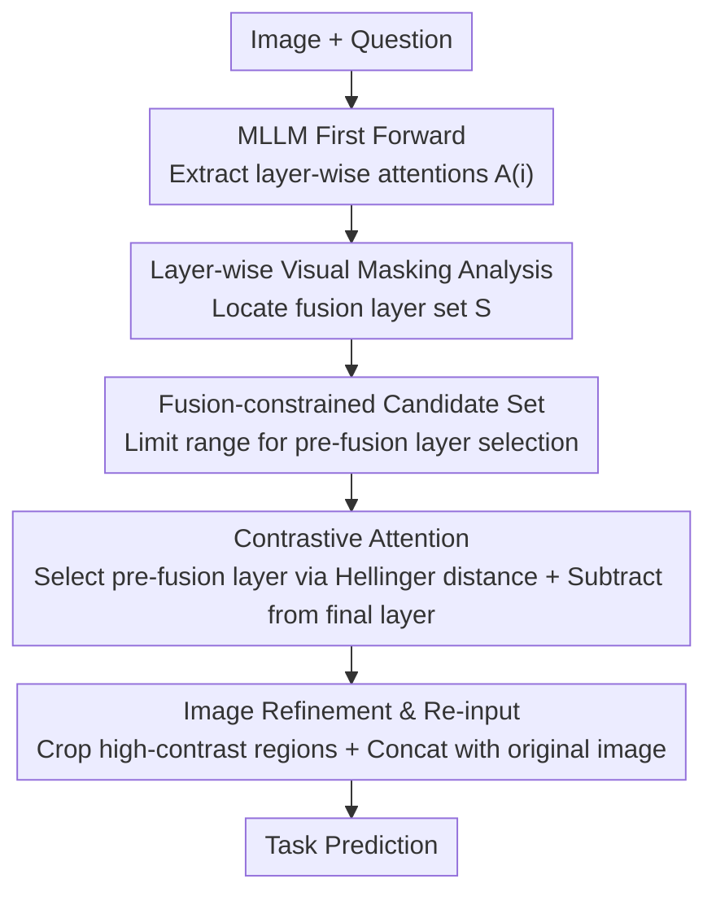

# Where Does Vision Meet Language? Understanding and Refining Visual Fusion in MLLMs via Contrastive Attention

**Conference**: CVPR 2026  
**Paper**: [CVF Open Access](https://openaccess.thecvf.com/content/CVPR2026/html/Song_Where_Does_Vision_Meet_Language_Understanding_and_Refining_Visual_Fusion_CVPR_2026_paper.html)  
**Code**: TBD  
**Area**: Multimodal VLM  
**Keywords**: MLLM Interpretability, Vision-Language Fusion, Layer-wise Masking, Contrastive Attention, Training-free

## TL;DR
This paper first uses "layer-wise visual masking" to dissect where visual information is integrated into the language stream (finding fusion concentrated in shallow-to-middle layers, with "reviewing" in deep layers), then proposes a **training-free** contrastive attention method. By subtracting "pre-fusion layer" attention from final layer attention, it extracts truly task-relevant image regions for secondary inference, achieving stable performance gains across 7 MLLMs and multiple VQA benchmarks.

## Background & Motivation

**Background**: MLLMs (such as LLaVA and Qwen2-VL) concatenate image and text tokens into a single sequence fed into the LLM backbone, where vision-language fusion occurs "naturally" through stacked Transformer layers. However, which layers fusion occurs in and how visual information is progressively injected into language representations remains a black box. Existing interpretability works either focus on single-layer attention visualization or use causal tracing to estimate patch contributions to the output, neither of which characterizes the "layer-wise, multi-stage" fusion process.

**Limitations of Prior Work**: Visualizing layer-wise attention in LLaVA-1.5 (Fig. 2, question "What plane is this?", key being the "LAPE" logo on the fuselage) reveals two phenomena. First, attention **does** gradually focus on the correct region as depth increases (peaking around layer 20). Second, there is **persistent high-attention noise**—irrelevant regions like the tail remain highlighted from shallow to deep layers, and this noise propagates and amplifies across layers. Consequently, in the final layer's attention map, the correct region is often submerged in noise.

**Key Challenge**: Since noise is "shared and inherited across layers," any method based on **static single-layer attention** (such as ViCrop, which manually fixes an extraction layer per model/dataset) will inherit this noise. Furthermore, fixing layers requires per-model and per-dataset tuning, leading to poor generalization. The truly discriminative signal is not the absolute attention of a single layer, but the **direction of change** in attention across layers—specifically, which regions receive increased focus under textual guidance.

**Goal**: (1) Systematically clarify which layers visual fusion occurs in and how it is distributed in MLLMs; (2) Design a training-free mechanism independent of fixed layers to suppress shared noise and highlight task-relevant regions.

**Key Insight**: Conduct perturbation experiments using "layer-wise visual masking"—setting image tokens to zero at layer $i$ and measuring the performance drop. A large drop indicates strong dependence on visual input at that layer, marking it as a critical fusion layer. Additionally, quantify the fusion progress by measuring the Hellinger distance between each layer's attention and the final layer.

**Core Idea**: Instead of relying on static attention from a single layer, **contrast two layers**. Select a "pre-fusion layer" (where vision has just begun interacting with text but semantics haven't fully fused) and subtract its attention from the final layer. Regions with large differences are task-relevant areas that the model "learned" to focus on during fusion. These regions are then cropped and re-fed to the model.

## Method

### Overall Architecture
The paper is divided into two parts: **Understanding**, which uses layer-wise masking and Hellinger distance analysis to identify where fusion occurs; and **Refining**, which translates these insights into a training-free contrastive attention inference pipeline. During inference, the pipeline is as follows: given an image and a question, the MLLM performs a first forward pass to obtain attention maps $A^{(i)}$ for each layer. A "pre-fusion layer" $A^{(i^*)}$ with the maximum Hellinger distance from the final layer is selected from a candidate set. Contrastive attention $I_A$ is calculated by subtracting the pre-fusion attention from the final layer attention. This $I_A$ is used to crop the most task-relevant regions, which are then re-fed to the MLLM along with the original image for a second inference pass to output the answer. No parameters are updated during this process.

### Key Designs

**1. Layer-wise Visual Masking Analysis: Locating Fusion Layers**

To answer where vision is fused, the authors perform perturbations: since image tokens have fixed positions in the sequence, they **set these token features to zero** at a specific layer and observe the change in downstream performance. A significant drop suggests the layer relies heavily on raw visual input (a critical fusion layer); a negligible drop indicates fusion is complete, and the model has transitioned to textual semantic reasoning. Experiments across 7 MLLMs and 6 VQA datasets reveal a consistent **two-stage** pattern: masking at shallow layers causes a catastrophic collapse (vision not yet fused, model relies heavily on image input), but after approximately layers 18–20, performance remains stable even if visual tokens are masked (fusion is largely complete). Furthermore, fusion is concentrated in a few "fusion layers" (red triangles in figures), with surprisingly similar distributions across different architectures. A **"review" phenomenon** was also discovered: in LLaVA-1.5/Next, InstructBLIP, and VIP-LLaVA, masking at very deep layers (around layer 29) causes another performance drop, suggesting the model "looks back at the image" before outputting—similar to human decision-making. Qwen2-VL/2.5-VL do not exhibit this secondary fusion.

**2. Contrastive Attention: Selecting Pre-fusion Layers via Hellinger Distance**

Single-layer attention inherits cross-layer noise, necessitating a "two-layer contrast." The final layer (e.g., $k=28$) is treated as a **post-fusion layer** $A^{(k)}$ where semantics and vision are fully integrated. A **pre-fusion layer** $A^{(i^*)}$ is selected from a candidate set $C$, representing the early perception stage where vision begins interacting with text but is not yet assimilated. The selection criterion is the layer with the **maximum distributional difference** from the final layer:

$$i^* = \arg\max_{i\in C} H\!\left(A^{(i)}, A^{(k)}\right)$$

Where $H$ is the Hellinger distance, measuring the difference between two probability distributions:

$$H(P, Q) = \frac{1}{\sqrt{2}}\sqrt{\sum_{j=1}^{d}\left(\sqrt{p_j}-\sqrt{q_j}\right)^2}$$

Here $d$ is the number of image tokens. The contrastive attention is defined as $I_A = A^{(k)} - A^{(i^*)}$. This works because positions with large differences are regions where attention increased most during the "early perception to final understanding" process—the regions the model learned to attend to under textual guidance. Shared high-attention noise is canceled out because it is present in both layers.

**3. Contrastive Attention-based Image Refinement and Re-input**

To make the model "re-examine" these regions, $I_A$ guides **image-level segmentation**. Patches with high contrastive attention values (most informative for reasoning) are used to create a refined image $I_{seg}$, which is fed back into the MLLM **alongside** the original image $I_{orig}$ for a second forward pass. Retaining the original image is crucial to prevent the loss of global context. This allows the model to explicitly revisit its high-attention areas and reinforce task-relevant cues without losing the overall scene.

**4. Fusion-constrained Candidate Set Strategy**

The range for selecting the pre-fusion layer determines the quality of contrastive attention. Four candidate sets $C$ were compared: (a) unconstrained all layers, (b) deep layers only (>17), (c) shallow layers only (<16), and (d) the fusion layer set $S$ identified in Design 1. The results showed that deep layers are the worst (they already contain cross-modal information), while the **Fusion set $S$ is best**. Restricting the selection to empirically confirmed fusion layers avoids the "contaminated" deep layers and fits the definition of initial visual processing better than purely shallow layers.

### Loss & Training
No training is required. The method is an inference-time attention contrast and refinement process that does not update any MLLM parameters and can be applied to off-the-shelf models.

## Key Experimental Results

### Main Results
Comparing 4 training-free enhancement methods (CD, DoLA, OPERA, ViCrop) across 3 backbones and 7 benchmarks (Average of GQA / VQAv2 / OKVQA / VizWiz / TextVQA / DocVQA / MMBench):

| Backbone | Base | CD | DoLA | OPERA | ViCrop | Ours |
|----------|------|------|------|-------|--------|------|
| LLaVA-1.5 | 56.34 | 57.36 | 57.10 | 58.11 | 57.60 | **59.16** |
| LLaVA-Next | 66.22 | 65.62 | 66.42 | 67.73 | 67.40 | **68.65** |
| Qwen2.5-VL | 75.15 | 75.83 | 75.84 | 76.89 | 77.29 | **77.66** |

Ours achieves the highest average accuracy across all three backbones, with more significant relative gains on weaker base models like LLaVA-1.5 (+2.82 over Base).

### Ablation Study
Pre-fusion layer candidate set strategy (Accuracy on select datasets):

| Candidate Set | GQA | VQAv2 | TextVQA | Description |
|--------|------|-------|---------|------|
| Base | 66.03 | 74.06 | 57.21 | No contrastive attention |
| All | 65.40 | 72.97 | 52.50 | Contaminated by deep layers; performance drops |
| Deep | 60.30 | 70.11 | 56.10 | Worst; deep layers already contain fused info |
| Shallow | 68.30 | 76.49 | 58.00 | Significantly better than All/Deep |
| **Fusion (S)** | **69.40** | **77.59** | **59.80** | Best performance |

Inference latency (GQA, single RTX A6000, seconds):

| Method | SAM | CLIP | CD | ViCrop | OPERA | Ours |
|------|------|------|------|--------|-------|------|
| Time (s) | 4.187 | 1.302 | 2.871 | 1.357 | 1.990 | 1.392 |

### Key Findings
- **Fusion is concentrated in fewer shallow-to-middle layers**: Layer-wise masking shows no performance drop after layers 18–20. Combined with early output experiments where accuracy jumps only after layer 18, three lines of evidence (masking, Hellinger distance, early output) confirm fusion occurs in shallow-middle layers.
- **Candidate set strategy is critical**: Choosing the wrong range (Deep) can drop performance by 5–6 points compared to Base. The benefits of contrastive attention depend entirely on selecting the pre-fusion layer from the fusion layers.
- **"Reviewing" phenomenon differs by architecture**: LLaVA models show a rise in Hellinger distance at layer 29 (secondary fusion), while Qwen models remain stable after layer 24, suggesting differing visual utilization patterns.
- **Negligible overhead**: At 1.392s, the method is comparable to the fastest method (ViCrop at 1.357s) and much faster than SAM-based methods, adding minimal computational cost.

## Highlights & Insights
- **Clever noise cancellation**: The observation that noise is shared across layers lead to the "layer subtraction" idea—canceling shared terms and retaining changes to highlight task-relevant signals more effectively than complex regularization (e.g., OPERA).
- **Analysis and Method form a closed loop**: Layer-wise masking is not just an "interpretability story"; its output (set $S$) acts as the constraint for selecting contrastive layers.
- **"Reviewing Phenomenon" is a significant discovery**: Linking deep-layer visual dependence to human-like decision-making and quantifying it via Hellinger distance provides a diagnostic metric for MLLM behavior.
- **Transferability**: Using the "direction of attention change" rather than absolute values is a transferable concept for token pruning, hallucination suppression, and visual grounding.

## Limitations & Future Work
- **Validated only on VQA tasks**: Effectiveness on long-form generation, complex reasoning, or open-ended dialogue is unknown.
- **Dependency on empirical fusion sets**: Set $S$ is identified via masking on specific datasets. Whether $S$ remains stable for entirely new architectures or niche datasets requires further discussion.
- **Fixed cost of secondary forward pass**: Although the overhead is "minimal," it essentially doubles the inference cost, which may be a concern for latency-sensitive or massive model deployments.
- **Missing details on refinement thresholds**: Specific parameters for patch selection and segmentation granularity are not fully detailed in the main text.

## Related Work & Insights
- **vs ViCrop**: Both use a "crop + re-input" paradigm, but ViCrop uses manually fixed layers and per-model hyperparameters, whereas this method uses Hellinger distance for **dynamic** layer selection.
- **vs CD / DoLA**: CD contrasts log probabilities between expert/amateur LMs, and DoLA contrasts early/late layer logits. Both operate at the **output logit level** to improve factuality; this method operates at the **visual input level** via attention contrast.
- **vs OPERA**: OPERA penalizes over-attentive self-attention; this method does not modify weights but uses attention differences to refine the image input.

## Rating
- Novelty: ⭐⭐⭐⭐ Layer-wise subtraction to cancel noise and the "reviewing" discovery are novel, though the re-input paradigm follows ViCrop.
- Experimental Thoroughness: ⭐⭐⭐⭐ 7 MLLMs across multiple benchmarks with multi-perspective analysis, though limited to VQA.
- Writing Quality: ⭐⭐⭐⭐ Logical flow from analysis to method is clear; some implementation details are brief.
- Value: ⭐⭐⭐⭐ Training-free, low-overhead, and plug-and-play for both interpretability and inference enhancement.

<!-- RELATED:START -->

## Related Papers

- [\[CVPR 2026\] Where MLLMs Attend and What They Rely On: Explaining Autoregressive Token Generation](where_mllms_attend_and_what_they_rely_on_explaining_autoregressive_token_generat.md)
- [\[CVPR 2026\] Multi-Hierarchical Contrastive Spectral Fusion for Multi-View Clustering](multi-hierarchical_contrastive_spectral_fusion_for_multi-view_clustering.md)
- [\[CVPR 2026\] The More, the Merrier: Contrastive Fusion for Higher-Order Multimodal Alignment](the_more_the_merrier_contrastive_fusion_for_higher-order_multimodal_alignment.md)
- [\[ICLR 2026\] When MLLMs Meet Compression Distortion: A Coding Paradigm Tailored to MLLMs](../../ICLR2026/multimodal_vlm/when_mllms_meet_compression_distortion_a_coding_paradigm_tailored_to_mllms.md)
- [\[CVPR 2026\] Hugging Visual Prompt and Segmentation Tokens: Consistency Learning for Fine-Grained Visual Understanding in MLLMs](hugging_visual_prompt_and_segmentation_tokens_consistency_learning_for_fine-grai.md)

<!-- RELATED:END -->
## Related Papers

- [\[CVPR 2026\] Attention-space Contrastive Guidance for Efficient Hallucination Mitigation in LVLMs](attention-space_contrastive_guidance_for_efficient_hallucination_mitigation_in_l.md)
- [\[CVPR 2026\] Where MLLMs Attend and What They Rely On: Explaining Autoregressive Token Generation](where_mllms_attend_and_what_they_rely_on_explaining_autoregressive_token_generat.md)
- [\[CVPR 2026\] Does Language Shift Break Medical Vision-Language Models? Indonesian Radiology Visual Question Answering Case Study](does_language_shift_break_medical_vision-language_models_indonesian_radiology_vi.md)
- [\[CVPR 2026\] The More, the Merrier: Contrastive Fusion for Higher-Order Multimodal Alignment](the_more_the_merrier_contrastive_fusion_for_higher-order_multimodal_alignment.md)
- [\[CVPR 2026\] Hugging Visual Prompt and Segmentation Tokens: Consistency Learning for Fine-Grained Visual Understanding in MLLMs](hugging_visual_prompt_and_segmentation_tokens_consistency_learning_for_fine-grai.md)

<!-- RELATED:END -->
