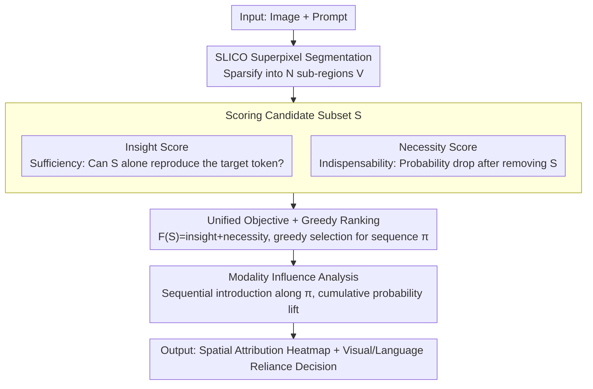

# Where MLLMs Attend and What They Rely On: Explaining Autoregressive Token Generation

**Conference**: CVPR 2026  
**arXiv**: [2509.22496](https://arxiv.org/abs/2509.22496)  
**Code**: [https://ruoyuchen10.github.io/EAGLE/](https://ruoyuchen10.github.io/EAGLE/)  
**Area**: Multimodal VLM  
**Keywords**: MLLM Interpretability, Attribution Analysis, Hallucination Diagnosis, Language Prior vs. Perceptual Evidence, Black-box Method

## TL;DR
Eagle is proposed as a lightweight black-box attribution framework that performs spatial attribution for MLLM autoregressive token generation using a unified objective function of insight score (sufficiency) and necessity score (indispensability). It quantifies whether each token relies on language priors or perceptual evidence, significantly outperforming existing methods in faithfulness, localization, and hallucination diagnosis while substantially reducing GPU memory requirements.

## Background & Motivation
**Background**: MLLMs have made significant progress in vision-language understanding and generation, but the degree to which generated tokens depend on the visual modality remains poorly understood, limiting interpretability and reliability.

**Limitations of Prior Work**: (a) Attention visualization methods fail to capture complex cross-modal interactions; (b) Gradient methods (LLaVA-CAM/IGOS++) are interfered with by text priors, are sensitive to cumulative effects in long sequences, and have high memory overhead; (c) Activation map methods (TAM) only support single-token attribution and are not generalizable; (d) Subset selection-based VPS is limited to grounding/detection tasks, and its objective function cannot be directly migrated to MLLMs.

**Key Challenge**: Autoregressive generation makes classification-based attribution methods difficult to adapt—there is a need for methods capable of handling multi-token combination attribution. Simultaneously, activation/gradient methods lack a direct causal link between input and output, making them insufficiently faithful.

**Goal**: (a) Perform faithful spatial attribution for any selected output tokens of an MLLM; (b) Quantify whether generated tokens rely on visual evidence or language priors.

**Key Insight**: Design a black-box framework that does not rely on internal model structures (attention/gradients) but attributes by observing probability changes during forward inference.

**Core Idea**: A unified objective function for sufficiency and necessity + greedy subset search + modality influence analysis.

## Method

### Overall Architecture
Eagle aims to answer two questions: **where the MLLM looks** when generating a token and **to what extent it relies on the image**. It decomposes both into observables via pure forward inference without touching internal attention or gradients, making it applicable to any MLLM (even via API). The process is as follows: first, use SLICO superpixel segmentation to sparsify the image into $V=\{\mathbf{x}_1,\dots,\mathbf{x}_N\}$ sub-regions, turning "where to look" into a discrete problem of "picking a subset from these $N$ blocks." Next, a score is assigned to the selected subset measuring both "sufficiency" and "indispensability." Greedy search is used to rank sub-regions into an ordered sequence $\pi$ by importance. Finally, by sequentially reintroducing image blocks along this sequence and observing target token probability changes, it determines whether the reliance is on visual evidence or language priors.

### Key Designs

**1. Insight Score: Can the model still generate the original word using only these regions?**

This represents the "sufficiency" half. Given a candidate subset $S$, all regions in the image outside of $S$ are masked. The model is presented only with $S$ and asked for the probability of generating the original target tokens:

$$s_{insight}(S) = \sum_{i=1}^n p\big(y_{t_i}=v_i \mid S,\ \text{Prompt},\ \mathbf{y}_{<t_i}\big)$$

A higher probability indicates that the regions in $S$ are "sufficient" to support the model's decision. This addresses a pain point where attention maps show where weight is placed but do not guarantee that the region is the cause of generation; Insight uses a direct input-output causal test to find visual evidence that truly explains the decision.

**2. Necessity Score: Will the model fail to generate it if these regions are removed?**

Sufficiency alone is inadequate—a background region highly correlated with the subject might be "sufficient" but not "indispensable" if the output remains unchanged without it. Necessity addresses this: $S$ is removed from the image, leaving $V\setminus S$, to see how much the target token probability drops:

$$s_{necessity}(V \setminus S) = \sum_{i=1}^n \big(1 - p(y_{t_i}=v_i \mid V \setminus S,\ \text{Prompt},\ \mathbf{y}_{<t_i})\big)$$

The sharper the drop in probability after removing $S$, the larger this term, indicating $S$ is more irreplaceable. Insight answers "these are enough," and Necessity answers "it won't work without these." Together, they filter for regions that are both sufficient and necessary.

**3. Unified Objective + Greedy Ranking: Turning attribution into an optimizable ordered selection**

Eagle does not optimize the two scores separately but combines them into a single objective, allowing one search to account for both sufficiency and necessity:

$$\mathcal{F}(S) = s_{insight}(S) + s_{necessity}(V \setminus S)$$

Subset selection is NP-hard, but this objective is inspired by submodularity and exhibits diminishing marginal returns, making greedy search an effective approximation: at each step, the region from the remaining set that provides the largest increment to $\mathcal{F}$ is added. This gradually approaches the optimum and yields an **ordered sequence** $\pi$ ranked by importance. The process requires approximately $\frac{1}{2}|V|^2 + \frac{1}{2}|V|$ forward inferences—this is the source of Eagle's latency, but because it is pure forward inference without storing gradients, it saves significantly more GPU memory than gradient methods.

**4. Modality Influence Analysis: Is this word based on the image or language inertia?**

With the ordered sequence $\pi$, the true visual reliance of each token can be quantified. Instead of a simple "image vs. no-image" probability difference, which misses non-monotonic cases where probability rises then falls, Eagle reintroduces regions sequentially along $\pi$. It calculates the cumulative probability lift relative to the lowest point in the process as the perceptual influence score:

$$I_{t_i} = \sum_r \Big(p(\cdot \mid \pi_{:r},\cdot) - \min_j p(\cdot \mid \pi_{:j},\cdot)\Big)$$

A high $I_{t_i}$ indicates the word is supported by visual evidence (e.g., "red," specific object names); a low $I_{t_i}$ indicates reliance on language priors (e.g., articles, prepositions). This quantifies which words are looking at the image and which are guessing, providing a direct handle for hallucination diagnosis.

## Key Experimental Results

### Main Results—Sentence-level Faithfulness (MS COCO Image Caption)

| Method | Model | Ins.↑ | Del.↓ | GPU Memory |
|------|-------|-------|-------|------------|
| LLaVA-CAM | LLaVA-1.5 7B | 0.5298 | 0.5317 | 37.25 GB |
| IGOS++ | LLaVA-1.5 7B | 0.5293 | 0.5168 | 48.18 GB |
| **Ours (Eagle)** | **LLaVA-1.5 7B** | **0.5970** | **0.4554** | **16.07 GB** |
| LLaVA-CAM | Qwen2.5-VL 7B | 0.5605 | 0.5464 | 47.17 GB |
| **Ours (Eagle)** | **Qwen2.5-VL 7B** | **0.7006** | **0.4597** | **17.68 GB** |

### Ablation Study—Localization and Hallucination

| Metric | Method | Description |
|------|------|------|
| Point Game (bbox) | Eagle vs TAM | **Gain: +36.42%** |
| Point Game (mask) | Eagle vs TAM | **Gain: +42.63%** |
| Hallucination Repair | Eagle | Removing minimal regions can correct hallucinations |

### Key Findings
- Eagle comprehensively outperforms existing methods across all models (LLaVA-1.5/Qwen2.5-VL/InternVL3.5) and tasks (Caption/VQA).
- Faithfulness improved by an average of 20.0% (insertion) and 13.4% (deletion), with even larger gains for sensitive tokens (29-42%).
- GPU memory requirement reduced by 50-80%: 16.07 GB on LLaVA-1.5 vs. 48.18 GB for IGOS++.
- The advantage in VQA tasks is smaller than in captioning—since VQA generation depends more on reasoning and language priors.
- Hallucination Diagnosis: Eagle precisely identifies visual regions causing hallucinations; removing a very small area (<10%) can correct the hallucination.

## Highlights & Insights
- **Black-box + Lightweight**: Does not rely on gradients or attention maps, compatible with any MLLM (including API models), and GPU overhead is much lower than gradient methods—crucial for utility in the large model era.
- **Unified Insight + Necessity**: A single objective function captures both "what regions are sufficient" and "what regions are indispensable," providing a more complete view than either alone.
- **Value of Modality Analysis**: Explicitly identifies which tokens rely on vision (e.g., "red," object names) and which rely on language priors (e.g., articles, prepositions), which is valuable for hallucination understanding and model debugging.
- **Token-Agnostic Property**: Even when applied to tokens dominated by language priors, spatial attribution remains robust (whereas gradient methods might collapse if the wrong token is chosen).

## Limitations & Future Work
- Significant increase in inference time (Eagle ~250-800s vs. Gradient methods ~15-60s) due to $O(|V|^2)$ forward passes.
- Granularity of superpixel segmentation ($N$ regions) is fixed; different images may require different granularities.
- Scalability to video or multi-image inputs has not been verified.
- The "remove all regions" baseline in the necessity score might be too extreme.
- Despite the strength of the black-box design, it does not provide an explanation of internal model mechanisms.

## Related Work & Insights
- **vs. LLaVA-CAM/IGOS++** (Gradient methods): Gradient methods depend on choosing the correct token, have high memory usage, and are affected by sequence accumulation; Eagle's black-box design avoids these issues.
- **vs. TAM** (Activation map method): TAM can only attribute single tokens and is only effective on Qwen2-VL; Eagle supports arbitrary token combinations and is cross-model generalizable.
- **vs. VPS** (Subset selection method): VPS is used only for object detection/grounding; Eagle extends the objective function to be applicable to autoregressive generation.

## Rating
- Novelty: ⭐⭐⭐⭐ Unified insight/necessity + modality analysis is a creative framework design.
- Experimental Thoroughness: ⭐⭐⭐⭐⭐ 3 models × 3 task types, comprehensive evaluation across multiple metrics.
- Writing Quality: ⭐⭐⭐⭐ Clear framework with good alignment between motivation and method.
- Value: ⭐⭐⭐⭐ Provides a practical and universal tool for MLLM interpretability.

<!-- RELATED:START -->

## Related Papers

- [\[CVPR 2026\] From Where Things Are to What They Are For: Benchmarking Spatial–Functional Intelligence in Multimodal LLMs](from_where_things_are_to_what_they_are_for_benchmarking_spatial-functional_intel.md)
- [\[CVPR 2026\] Do Vision-Language Models Leak What They Learn? Adaptive Token-Weighted Model Inversion Attacks](vlm_model_inversion_adaptive_token_weight.md)
- [\[CVPR 2026\] Where Does Vision Meet Language? Understanding and Refining Visual Fusion in MLLMs via Contrastive Attention](where_does_vision_meet_language_understanding_and_refining_visual_fusion_in_mllm.md)
- [\[CVPR 2026\] Token Warping Helps MLLMs Look from Nearby Viewpoints](token_warping_helps_mllms_look_from_nearby_viewpoints.md)
- [\[CVPR 2026\] Explaining CLIP Zero-shot Predictions Through Concepts](explaining_clip_zero-shot_predictions_through_concepts.md)

<!-- RELATED:END -->
