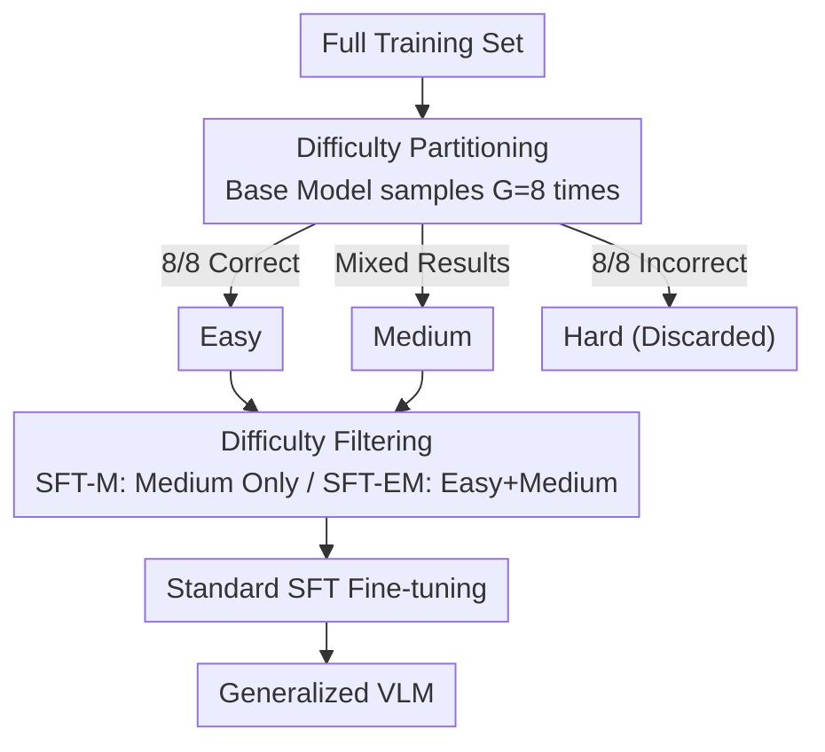

# Why Does RL Generalize Better Than SFT? A Data-Centric Perspective on VLM Post-Training

**Conference**: CVPR 2026  
**Paper**: [CVF Open Access](https://openaccess.thecvf.com/content/CVPR2026/html/Lu_Why_Does_RL_Generalize_Better_Than_SFT_A_Data_Centric_Perspective_CVPR_2026_paper.html)  
**Code**: https://github.com/byyx666/DC-SFT  
**Area**: Multimodal VLM / Post-training Generalization Analysis  
**Keywords**: VLM post-training, RL vs SFT, OOD generalization, data difficulty, GRPO

## TL;DR
This paper explains why RL (GRPO) post-trained VLMs generalize better to out-of-distribution (OOD) data than SFT from a "data perspective": the advantage of RL does not stem from the algorithm itself, but from its advantage function naturally concentrating training signals on "medium-difficulty" samples, acting as an implicit data filter. Accordingly, the authors propose DC-SFT—explicitly removing hard samples before standard SFT—obtaining results that surpass RL on OOD while being more stable and 3–5 times faster.

## Background & Motivation
**Background**: Adapting large vision-language models (VLMs) to downstream tasks primarily relies on two post-training paradigms: Supervised Fine-Tuning (SFT) and Reinforcement Learning (RL, represented by GRPO). A recurring observation is that RL-trained models are significantly more robust on out-of-distribution (OOD) data than SFT, which tends to overfit the in-distribution (ID) training set.

**Limitations of Prior Work**: Mainstream explanations for "why RL generalizes better" attribute it to the **optimization objective**—exploratory sampling and learning from reward feedback—allowing it to generalize beyond supervised samples. However, these explanations remain at the "algorithmic mechanism" level, making them difficult to verify quantitatively or apply directly to improve SFT. If RL's advantage were intrinsic to the algorithm, SFT would be inherently limited; however, the authors suspect a simpler cause.

**Key Challenge**: There is an overlooked fundamental difference between SFT and RL in "how they learn from samples." **SFT updates all training samples equally**, whereas RL **implicitly treats samples differently based on difficulty** due to advantage function normalization. Specifically, if a model always answers correctly (easy) or always answers incorrectly (hard), the within-group reward variance is zero, resulting in a normalized advantage $A_k=0$ and nearly zero gradient updates. Effective gradients are generated only by medium-difficulty questions with mixed correct/incorrect answers. This implies RL effectively learns only on a "medium-difficulty subset."

**Goal**: To decompose this observation into two falsifiable sub-problems: (1) Does the difficulty of training data truly dictate OOD generalization? (2) if so, can RL's "implicit filtering" be explicitly replicated in SFT to match or even surpass RL's generalization advantage?

**Key Insight**: Rather than seeking answers from the optimization objective, the authors investigate the **data distribution**. By using the model's own multiple samplings to partition the training set into easy/medium/hard categories and performing SFT on each, they observe the trade-off between ID and OOD performance. This approach translates "RL advantage" into a controllable variable: "on which data to train."

**Core Idea**: The generalization advantage of RL ≈ an implicit "difficulty filter." By explicitly removing hard samples before standard SFT (termed DC-SFT), one can achieve OOD generalization equal to or better than RL in a simpler, more stable, and more efficient manner.

## Method

### Overall Architecture
The study consists of a two-stage research process:

1.  **Validation of Data-Centric Hypothesis** (Section 4): Deriving a difficulty classification and the theoretical basis for "RL implicit filtering," then proving via controlled experiments that SFT on hard samples severely damages OOD performance while SFT on medium/easy samples maintains generalization.
2.  **DC-SFT Method** (Section 5): Since RL's benefit comes from "learning only from medium-difficulty," this step is made explicit. First, the base model samples $G=8$ outputs for each instance; data is partitioned by correctness, and hard samples are removed before standard SFT. Two variants are provided: SFT-M (medium only, replicating RL's implicit filtering) and SFT-EM (easy + medium, excluding only hard samples).

The data pipeline for DC-SFT is illustrated below:

### Key Designs

**1. Difficulty Classification: Partitioning samples via self-sampling**

To verify that "data difficulty affects generalization," an objective definition of difficulty is required. Rather than using human labels or external scorers, the authors let the base VLM generate $G=8$ responses for each prompt $x$. Instances with 8/8 correct are **Easy**, 8/8 incorrect are **Hard**, and mixed results are **Medium**. Correctness is defined by the task: classification requires case-insensitive label matching; grounding requires IoU ≥ 0.5. This definition **naturally aligns with RL reward signals**, as the same "sampling + correctness" logic is used by GRPO to calculate within-group advantages.

**2. Theoretical Explanation of RL Implicit Filtering: Zero gradients for Easy/Hard samples**

This is the theoretical pivot of the paper. GRPO samples a group of $G$ responses for each prompt and normalizes rewards into advantages using within-group mean and variance:

$$A_k = \frac{r(x,y_k) - \mathrm{mean}(\{r(x,y_k)\})}{\mathrm{std}(\{r(x,y_k)\}) + \delta}$$

For **Easy** samples (all correct, rewards at maximum) and **Hard** samples (all incorrect, rewards at minimum), the within-group rewards are identical, resulting in $A_k=0$ for every response. Consequently, the policy gradient term $\min\{r_k^t(\theta)A_k,\ \mathrm{clip}(\cdot)A_k\}$ becomes zero—these samples contribute almost nothing to parameter updates. Only **Medium** samples with mixed success provide non-zero variance and meaningful gradients. In other words, GRPO training is **dominated by medium-difficulty samples, automatically filtering out easy and hard ones**.

**3. DC-SFT: Explicit Filtering and the Importance of Removing Hard Samples**

While **SFT-M** replicates RL's focus on medium samples, the authors discovered in experiments that **Easy samples also preserve OOD performance** (though ID gains are lower than Medium). The real "poison" to generalization is the small subset of Hard samples. Thus, **SFT-EM** (Excluding Hard, retaining Easy + Medium) was proposed. SFT-EM proved stronger than SFT-M, indicating that the poor generalization of standard SFT is **not due to a lack of focus on medium samples, but due to treating hard samples and others equally**.

### Loss & Training
DC-SFT utilizes the standard SFT negative log-likelihood loss $\mathcal{L}_{\text{SFT}}(\theta)=-\mathbb{E}_{(x,y)\sim D}\sum_t \log\pi_\theta(y_t\mid x,y_{<t})$, where the dataset $D$ is difficulty-filtered. Implementation uses the ms-swift framework with Qwen2.5-VL-3B/7B. Difficulty partitioning uses a temperature of 0.9, top-p 1.0, and $G=8$. Fine-tuning uses LoRA (rank 32, alpha 64), AdamW, and a learning rate of $1\times10^{-5}$. Baseline GRPO uses identical sampling settings, a KL coefficient of 0.04, and trains for 600 steps (~1 epoch).

## Key Experimental Results

### SFT Validation by Difficulty (Core Evidence)
SFT was performed separately on Easy/Medium/Hard subsets to observe ID vs. OOD changes (ImageNet-R/A are OOD):

| Model | SFT Data | ImageNet (ID) | ImageNet-R (OOD) | ImageNet-A (OOD) |
|------|----------|---------------|------------------|------------------|
| Qwen2.5-VL-7B | Baseline | 78.26 | 57.32 | 41.13 |
| Qwen2.5-VL-7B | Easy | 79.22 (+0.96) | 59.37 (+2.05) | 42.16 (+1.03) |
| Qwen2.5-VL-7B | Medium | 85.52 (+7.26) | 58.67 (+1.35) | 42.49 (+1.36) |
| Qwen2.5-VL-7B | Hard | 85.34 (+7.08) | **43.25 (-14.07)** | **34.93 (-6.20)** |

The conclusion is clear: **SFT on hard samples results in a 7% ID gain but a 14% OOD crash**; medium/easy samples stabilize or slightly improve both ID and OOD.

### Comparison of Paradigms (DC-SFT vs SFT vs GRPO)
Using full data, standard SFT is compared with GRPO and DC-SFT variants (OOD Avg is the mean of four OOD datasets):

| Model | Paradigm | ImageNet-R | ImageNet-A | Ref-L4 | Lisa | OOD Avg |
|------|------|-----------|-----------|--------|------|---------|
| Qwen2.5-VL-7B | SFT | 49.58 | 39.14 | 72.15 | 69.60 | 57.62 |
| Qwen2.5-VL-7B | GRPO | 51.38 | 43.65 | 71.60 | 71.29 | 59.48 (+1.86) |
| Qwen2.5-VL-7B | SFT-M | 55.79 | 42.49 | 73.20 | 70.14 | 60.41 (+2.79) |
| Qwen2.5-VL-7B | SFT-EM | **55.90** | **44.57** | **73.40** | 70.51 | **62.10 (+4.48)** |

SFT-M (replicating RL implicit filtering) matches or slightly exceeds GRPO (+0.93%), validating that RL's advantage stems from data selection. SFT-EM further improves OOD Avg to 62.10, outperforming SFT by 4.48% and GRPO by 2.62%.

### Ablation of Hard Samples as "Trace Toxin"
Gradually adding hard samples back into SFT-EM quantifies their harm (Qwen2.5-VL-7B):

| Hard Sample Proportion | OOD Change Relative to SFT-EM |
|--------------|--------------------------|
| 0% (SFT-EM) | Baseline |
| +5% hard | ImageNet-R −3.74%, ImageNet-A −2.51% |
| 13.5% hard (Standard SFT) | Significantly lower than SFT-EM |

**Only 5% hard samples can drop OOD performance by 3–4 points**, suggesting the harm of hard data is not a threshold effect but is significant even at low proportions. Gradient analysis shows that hard samples have significantly larger gradient norms, dominating the optimization trajectory and forcing the model to aggressively update based on noise/ambiguity.

### Key Findings
- **Hard samples are the culprit for poor SFT generalization**, harming performance by dominating optimization with large gradient norms; removing them is more critical than focusing solely on medium samples (SFT-EM > SFT-M).
- **RL's generalization advantage can be explicitly replicated**: SFT-M (Standard SFT with filtered data) matches GRPO, proving the advantage comes from data selection rather than the RL algorithm.
- Conclusions are consistent across tasks (classification/grounding/reasoning), models (Qwen/MiniCPM), and fine-tuning methods (LoRA/Full Parameter).

## Highlights & Insights
- **Translating an "empirical intuition" into a computable mechanism**: Deriving $A_k=0$ for easy/hard samples from the GRPO advantage normalization formula is the paper's strongest contribution—it turns "RL generalizes better" from an observation into a replicable data phenomenon.
- **Dual evidence of "toxic hard samples" and "oversized gradients"**: Combining the find that 5% hard data drops OOD by 3-4 points with gradient norm analysis explains the mechanism of harm.
- **Simplicity is counter-intuitive**: Not changing the loss, architecture, or using RL, but simply deleting a segment of data before training, outperforms RL and is 3–5x faster.
- **Transferable logic**: Rejection sampling and teacher distillation methods can incorporate this difficulty filter to prioritize Easy+Medium samples and exclude persistent failures.

## Limitations & Future Work
- **Dependence on base model sampling**: Partitioning requires 8 samples per instance. Although efficient relative to RL, costs could grow on massive datasets.
- **Difficulty is relative to the base model**: A sample's difficulty might change during training; dynamic curriculum-based partitioning was not explored.
- **"Hard = All Wrong" may include noisy data**: 8/8 incorrect could be due to labeling errors or ambiguity. The paper removes these without distinguishing between "truly difficult" and "erroneous" data.
- **Task Scope**: Experiments focused on verifiable tasks (classification, grounding, math); the framework's validity for open-ended generation without objective rewards remains unclear.

## Related Work & Insights
- **vs. Optimization-based explanations**: Unlike works attributing RL generalization to exploration, this paper argues the benefit comes from **implicit data selection**, using SFT-M to match RL performance as counter-evidence.
- **vs. Standard SFT data synthesis**: While synthesis focuses on "high-quality correct answers," this paper notes that **difficulty distribution is equally critical**, and adding hard (all incorrect) samples is counter-productive.
- **vs. RL Post-training**: The conclusion does not negate RL's effectiveness but suggests its generalization gains can be achieved more stably and cheaply via DC-SFT, providing a tool to fix SFT's generalization deficit.

## Rating
- Novelty: ⭐⭐⭐⭐⭐ Uses a data perspective and advantage normalization to turn RL benefits into a replicable SFT mechanism.
- Experimental Thoroughness: ⭐⭐⭐⭐⭐ Comprehensive evidence across tasks, models, and ablation studies.
- Writing Quality: ⭐⭐⭐⭐ Clear logic, progressing from hypothesis to validation to method.
- Value: ⭐⭐⭐⭐⭐ Highly practical; discarding specific data segments is 3-5x faster than RL and more effective for OOD generalization.

<!-- RELATED:START -->

## Related Papers

- [\[CVPR 2026\] TableMix: Enhancing Multimodal Table Reasoning in MLLMs from a Data-Centric Perspective](tablemix_enhancing_multimodal_table_reasoning_in_mllms_from_a_data-centric_persp.md)
- [\[ICLR 2026\] Why Reinforcement Fine-Tuning Preserves Prior Knowledge Better: A Data Perspective](../../ICLR2026/multimodal_vlm/why_reinforcement_fine-tuning_enables_mllms_preserve_prior_knowledge_better_a_da.md)
- [\[AAAI 2026\] Revisiting the Data Sampling in Multimodal Post-training from a Difficulty-Distinguish View](../../AAAI2026/multimodal_vlm/revisiting_the_data_sampling_in_multimodal_post-training_from_a_difficulty-disti.md)
- [\[ICML 2026\] Med-Scout: Curing MLLMs' Geometric Blindness in Medical Perception via Geometry-Aware RL Post-Training](../../ICML2026/multimodal_vlm/med-scout_curing_mllms_geometric_blindness_in_medical_perception_via_geometry-aw.md)
- [\[ICLR 2026\] Shuffle-R1: Efficient RL Framework for Multimodal Large Language Models via Data-centric Dynamic Shuffle](../../ICLR2026/multimodal_vlm/shuffle-r1_efficient_rl_framework_for_multimodal_large_language_models_via_data-.md)

<!-- RELATED:END -->
