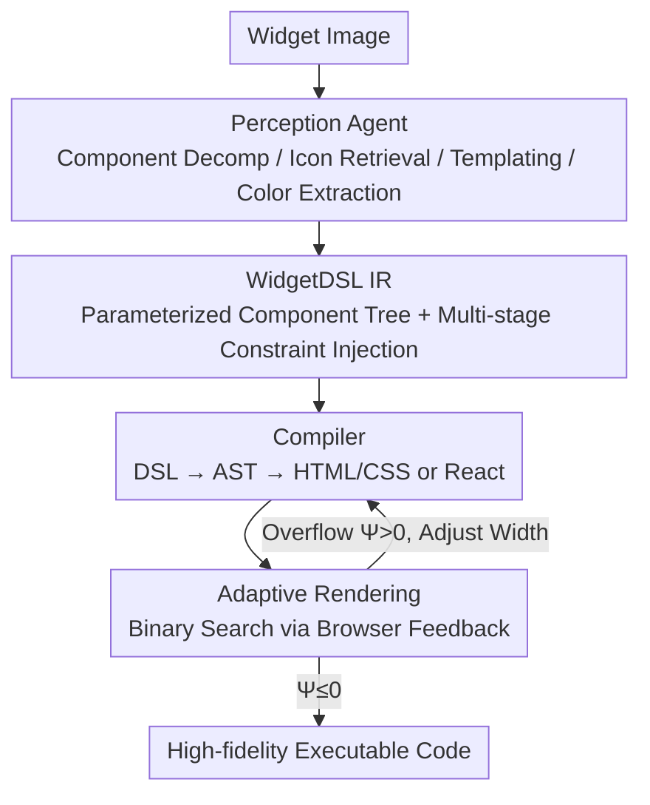

# Widget2Code: From Visual Widgets to UI Code via Multimodal LLMs

**Conference**: CVPR 2026  
**arXiv**: [2512.19918](https://arxiv.org/abs/2512.19918)  
**Code**: [https://djanghao.github.io/widget2code](https://djanghao.github.io/widget2code)  
**Area**: Multimodal VLM  
**Keywords**: UI code generation, Widget reconstruction, Multimodal Large Language Models, Domain-Specific Language, Visual perception

## TL;DR
This paper formally defines the Widget-to-Code task for the first time, constructs the first image-only widget dataset and a multi-dimensional evaluation system, and proposes a modular baseline based on Perception Agents and WidgetFactory infrastructure. It achieves high-fidelity widget reconstruction through component decomposition, icon retrieval, reusable visual templates, and adaptive rendering.

## Background & Motivation

1. **Background**: UI-to-Code (UI2Code) is a critical direction in automated frontend development, aiming to generate executable code from visual design drafts. With the advancement of Multimodal Large Language Models (MLLMs), the field has shifted from rule-based/supervised pipelines to MLLM-driven approaches. Existing work primarily focuses on web and mobile UIs, which possess rich hierarchical contexts and accessible annotated data.

2. **Limitations of Prior Work**: Widgets (small components like weather cards, calendar modules, etc.) are a unique class of micro-interfaces—they are compact, context-free, and convey information through dense typography and icons under strict spatial constraints. However, widget designs are often proprietary, lacking public source code or annotated data, and there is no existing (image, code) paired dataset. Existing UI2Code methods optimized for web/mobile perform poorly when directly transferred to widgets.

3. **Key Challenge**: Widgets exhibit high visual complexity (including icons, data visualizations, and artistic color schemes) within extremely compact spaces, yet no training supervision is available. While general MLLMs perform better than specialized UI2Code methods, they still produce code with visual inconsistencies and unreliable structures—content overflow, dimension mismatch, and color deviations are prevalent.

4. **Goal**: (a) Formalize the Widget2Code task and establish evaluation standards; (b) Bridge the gap between pixel-level perception and geometry-aware code generation; (c) Establish a unified baseline framework and infrastructure.

5. **Key Insight**: At the perception level—follow Apple widget design principles to decompose widgets into atomic components; at the system level—design a widget-specific DSL and compiler to replace the direct generation of verbose code.

6. **Core Idea**: Transform widget reconstruction from end-to-end MLLM code generation into a structured, controllable pipeline through component decomposition via Perception Agents and the DSL intermediate representation of WidgetFactory.

## Method

### Overall Architecture
The paper addresses the challenge of reconstructing high-fidelity, executable frontend code from a raw image of a widget (compact micro-interfaces like weather cards or calendar components). Since widgets lack public source code and annotations, and end-to-end MLLM generation is error-prone, the proposed solution adopts a "perception-then-translation" logic: the input image is first decomposed by a **Perception Agent** into atomic components while extracting clues like icons, color schemes, and layouts. Then, **WidgetFactory** writes these clues into an intermediate representation called WidgetDSL. A compiler deterministically generates HTML/CSS or React code, and finally, adaptive rendering iteratively fine-tunes dimensions based on browser feedback until no overflow occurs. The authors also collected the first image-only widget benchmark from platforms like Figma and Dribbble. This pipeline replaces "end-to-end code generation" with a controllable "Perception → IR → Compilation → Rendering Correction" workflow.

### Key Designs

**1. Perception Agent: Decomposing widgets into atomic components rather than end-to-end generation**

Directly asking MLLMs to write code from images often leads to incorrect icons, fabricated chart data, and color deviations because the model manages too many details simultaneously. The Perception Agent splits this into four specialized sub-modules. **Component Extraction** uses MLLMs to detect and classify visual components (icons, buttons, text, charts, etc.), recording each as $e=[r, b, t, c]$, representing the crop area, bounding box, text description, and category. **Icon Retrieval** avoids hallucination by building a 50k SVG icon library; it uses SigLIP to extract visual and text embeddings, performing coarse filtering for Top-50 visual similarity and reranking via text similarity to select the Top-5. **Reusable Component Templates** pre-define DSL-formatted templates, allowing MMLMs to fill parameters into detected components instead of describing structures from scratch. **Color Extraction** converts images to a perceptually uniform color space and uses K-means to cluster primary colors and their proportions $\mathcal{P} = \{(\mu_k, w_k)\}_{k=1}^K$. Each module uses the most suitable method for its task, resulting in significantly higher perception accuracy than end-to-end approaches.

**2. WidgetDSL: Using a compact parameterized component tree as IR instead of direct verbose code**

Directly generated HTML/CSS/JS is often long and difficult to control, with unreliable structures. WidgetDSL encodes a widget into a parameterized component tree where each node corresponds to a functional unit (icon, chart, text block), with attributes specifying geometry, color, and style. DSL generation employs multi-stage constraint injection, progressively layering constraints onto the base prompt: (1) layout bounding boxes, (2) color palettes, (3) component specifications (preventing hallucinated chart data), (4) icon candidate sets, and finally (5) dynamically inferred component types. Each layer narrows the generation space. Once the DSL is ready, the compiler uses a two-stage pipeline (DSL → AST → Target Code) for deterministic translation into HTML/CSS or React. This intermediate layer balances simplicity and expressiveness, suppressing hallucinations and redundancy while supporting cross-platform compilation, similar to an IR in compiler design.

**3. Adaptive Rendering: Binary search using browser layout feedback to eliminate overflow**

Existing methods often ignore the rendering step, leading to distorted aspect ratios, mismatched sizes, and content overflow—issues that are fatal for compact widgets. Adaptive Rendering treats this as a closed-loop optimization: given the input widget aspect ratio $r = w/h$, it performs a feedback-guided binary search on width $w$ to satisfy the violation function $\Psi(w) \leq 0$.

$$\Psi(w) = \text{aggregate}(\text{viewport overflow},\ \text{sub-element boundary violation})$$

$\Psi(w)$ aggregates the actual layout feedback reported by the browser rendering engine. After each render, $\Psi(w_t)$ is reported, and the width is adjusted until convergence within a tolerance $|\Psi(w_t)| < \epsilon$ (approximately one pixel). This step uses real rendering results rather than model guesswork to finalize the output.

### A Complete Example
Following a weather widget: The Perception Agent decomposes it into atomic components like weather icons, temperature text, temperature range line charts, and city labels, each recorded as $[r,b,t,c]$. Instead of being drawn by the MLLM, the weather icon is retrieved from the 50k library based on visual and text similarity ("sun/cloud"). Color extraction calculates main colors via K-means. These clues are fed into WidgetFactory to generate WidgetDSL—a component tree constrained by bounding boxes, palettes, and chart data specs. The compiler translates the DSL to HTML/CSS. Finally, adaptive rendering performs a binary search on width according to the original aspect ratio $r$. If the first render shows the temperature text overflowing ($\Psi>0$), the width is adjusted and re-rendered until $\Psi$ falls within the one-pixel tolerance, resulting in a final widget that is compact and overflow-free.

### Evaluation Metrics
Based on Apple Human Interface Guidelines, a five-dimensional fine-grained evaluation is designed:
- **Layout**: Margin symmetry, content aspect ratio similarity, area ratio similarity.
- **Legibility**: Text Jaccard, contrast similarity, local contrast similarity.
- **Style**: Palette distance, vibrancy consistency, polarity consistency.
- **Perceptual**: SSIM, LPIPS, CLIP Score.
- **Geometry**: Aspect ratio and normalized dimension comparison.

## Key Experimental Results

### Main Results

| Method | Layout-Margin | Layout-Content | Layout-Area | Text | Palette | SSIM | Geometry |
|------|-------------|---------------|------------|------|---------|------|----------|
| GPT-4o | 63.48 | 59.04 | 64.41 | 60.20 | 47.03 | 0.698 | 91.93 |
| Gemini2.5-Pro | 65.35 | 62.74 | 79.66 | 59.48 | 48.99 | 0.701 | 90.25 |
| Qwen3-VL | 64.75 | 60.15 | 69.53 | 61.17 | 47.44 | 0.703 | 95.15 |
| Design2Code | 36.34 | 47.81 | 49.68 | 17.50 | 30.92 | 0.512 | 15.72 |
| DCGen | 43.17 | 40.14 | 64.55 | 50.36 | 35.56 | 0.598 | 31.59 |
| **Ours** | **72.15** | **66.08** | **82.24** | **70.60** | **58.09** | **0.721** | **100.00** |

### Ablation Study

| Configuration | Margin | Content | Area | Text | Palette | SSIM | Geometry |
|------|--------|---------|------|------|---------|------|----------|
| Qwen3-VL baseline | 64.75 | 60.15 | 69.53 | 61.17 | 47.44 | 0.703 | 95.15 |
| + WidgetFactory | 69.97 | 64.60 | 82.46 | 67.99 | 42.36 | 0.683 | 100 |
| + Components | 70.83 | 64.90 | 82.30 | 67.49 | 42.61 | 0.676 | 100 |
| + Color analysis | 71.29 | 65.43 | 83.03 | 68.62 | 57.56 | 0.705 | 100 |
| + Layout | 71.49 | 65.33 | 81.92 | 68.89 | 56.10 | 0.710 | 100 |
| + Icon (Full) | 72.15 | 66.08 | 82.24 | 70.60 | 58.09 | 0.721 | 100 |

### Key Findings
- Specialized UI2Code models (Design2Code, DCGen, etc.) perform significantly worse than general MLLMs on widgets, indicating that widgets require specialized designs.
- WidgetFactory contributes most to the Geometry metric—raising it from 95.15 to 100, perfectly restoring widget dimensions.
- The Color analysis module contributes most to the Palette metric (42.61 → 57.56, +35%), showing that MLLMs have significant deficiencies in color restoration.
- Icon retrieval significantly helps Text and SSIM metrics, proving that accurate icons are key to visual fidelity.

## Highlights & Insights
- Formally defining the Widget2Code task is a significant contribution—widget micro-interfaces are fundamentally different from web/mobile UIs (compact, context-free, icon-dense) and deserve study as an independent task.
- The strategy of using icon retrieval instead of direct generation is practical and effective—MLLMs are indeed unreliable for generating precise icons, while retrieval is both accurate and controllable.
- WidgetDSL as an intermediate representation bridges perception and code generation, similar to IR in compiler design; this pattern can be transferred to other complex code generation tasks.
- The closed-loop optimization of adaptive rendering using browser feedback is a simple yet universally overlooked critical step.

## Limitations & Future Work
- The dataset size is moderate (2,825 widgets, 1,000 for testing); while comparable to similar benchmarks, a larger scale might reveal more issues.
- Currently focuses on static widgets, without addressing interactive or dynamic widget behaviors.
- Dependency on Qwen3-VL API as the base model poses potential cost and latency bottlenecks for practical deployment.
- While the evaluation metrics are fine-grained, they lack functional correctness evaluation (whether the generated code is truly interactive).
- WidgetFactory could be used as a data engine to synthesize (image, code) pairs for end-to-end fine-tuning.

## Related Work & Insights
- **vs Design2Code**: Design2Code targets full-page website designs where widget compactness causes failure. Widget2Code's component decomposition strategy is better suited for dense layouts.
- **vs DCGen**: DCGen uses divide-and-conquer prompting for webpages, but widgets lack decomposable hierarchical structures. WidgetDSL provides a more appropriate structured representation.
- **vs GPT-4o / Gemini**: General MLLMs have better visual understanding but generate redundant and uncontrollable code. Widget2Code amplifies their advantages through DSL constraints and modular perception.

## Rating
- Novelty: ⭐⭐⭐⭐ First to formalize the Widget2Code task with a dedicated evaluation system and DSL.
- Experimental Thoroughness: ⭐⭐⭐⭐ Comprehensive comparisons (General MLLMs + Specialized UI2Code) and clear ablations, though the dataset is relatively small.
- Writing Quality: ⭐⭐⭐⭐ Clear motivation and detailed system design descriptions.
- Value: ⭐⭐⭐⭐ Opens a new task direction and provides a complete benchmark, baseline, and infrastructure.

<!-- RELATED:START -->

## Related Papers

- [\[CVPR 2026\] UI-Lens: Assessing General MLLMs' Potential to Automate UI Display Quality Assurance](ui-lens_assessing_general_mllms_potential_to_automate_ui_display_quality_assuran.md)
- [\[CVPR 2026\] CodePercept: Code-Grounded Visual STEM Perception for MLLMs](codepercept_code-grounded_visual_stem_perception_for_mllms.md)
- [\[CVPR 2026\] GeoTikzBridge: Advancing Multimodal Code Generation for Geometric Perception and Reasoning](geotikzbridge_advancing_multimodal_code_generation_for_geometric_perception_and_.md)
- [\[CVPR 2026\] FAVE: A Structured Benchmark for Fine-Grained Audio-Visual Temporal Evaluation in Multimodal LLMs](fave_a_structured_benchmark_for_fine-grained_audio-visual_temporal_evaluation_in.md)
- [\[CVPR 2026\] PersonaVLM: Long-Term Personalized Multimodal LLMs](personavlm_long_term_personalized_multimodal_llms.md)

<!-- RELATED:END -->
