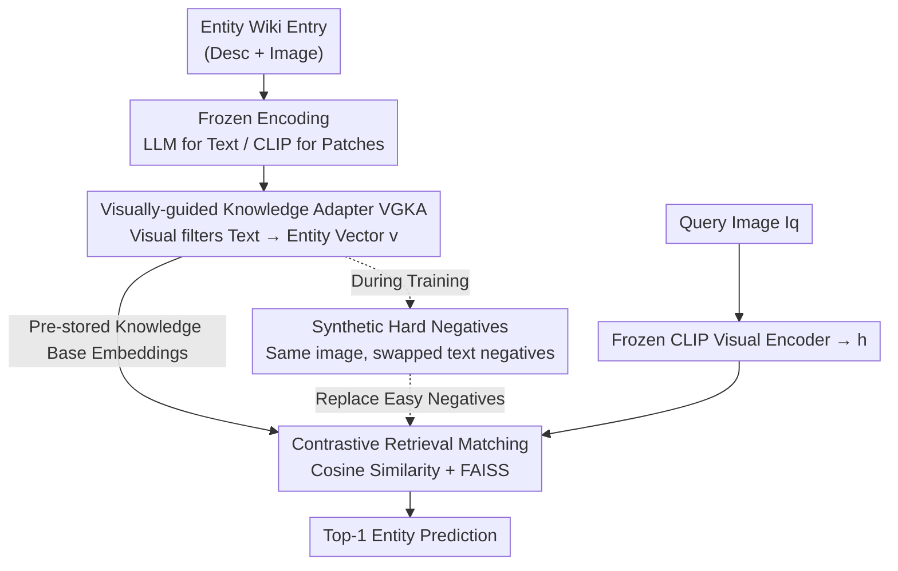

# WikiCLIP: An Efficient Contrastive Baseline for Open-domain Visual Entity Recognition

**Conference**: CVPR 2026  
**Paper**: [CVF Open Access](https://openaccess.thecvf.com/content/CVPR2026/html/Ning_WikiCLIP_An_Efficient_Contrastive_Baseline_for_Open-domain_Visual_Entity_Recognition_CVPR_2026_paper.html)  
**Code**: https://github.com/WikiCLIP (Project page, available)  
**Area**: Multimodal VLM  
**Keywords**: Visual Entity Recognition, Contrastive Learning, CLIP, LLM Knowledge Representation, Hard Negatives

## TL;DR
WikiCLIP revives the contrastive learning paradigm for open-domain Visual Entity Recognition (VER), which has recently been overshadowed by generative methods. It utilizes an LLM to encode Wikipedia text as knowledge representations and employs visual features at the patch level to filter out irrelevant text, resulting in "knowledge-aware entity vectors." Combined with synthetic hard negatives, it outperforms the 13B generative SOTA (AutoVER) by 3.4 points on OVEN unseen entities while being nearly 100 times faster during inference.

## Background & Motivation
**Background**: Open-domain Visual Entity Recognition (VER) aims to map an image to a specific named entity within a knowledge base (e.g., Wikipedia). The label space often spans millions of entities and suffers from a severe long-tail distribution. In recent years, generative paradigms (GER-ALD, REW, AutoVER) have dominated by "translating" query images into text to match encyclopedia entries, showing strong performance.

**Limitations of Prior Work**: Generative methods have three major drawbacks: (1) **Slow inference**: Autoregressive decoding generates tokens sequentially; AutoVER 13B takes 1569 ms per image. (2) **Poor generalization**: They often fail to recognize entities not seen during training (unseen). (3) **High cost**: AutoVER uses 13B parameters, and REW training consumes 47M image-text pairs. When integrated into larger pipelines as intermediate modules, their slowness, inflexibility, and error accumulation are magnified.

**Key Challenge**: Contrastive dual-encoders (like CLIP) are inherently parallel, support pre-computed embeddings, and offer fast inference. However, traditional CLIP underperforms generative methods on VER. The root cause is that CLIP pre-training uses short captions, whereas encyclopedia descriptions are long and noisy. CLIP neither handles long text well (due to token limits) nor extracts "discriminative" information from structured long descriptions.

**Goal**: To elevate the accuracy and generalization of contrastive VER to a level competitive with generative methods without sacrificing efficiency. This is divided into two sub-problems: ① How to provide a "knowledge-rich yet visually discriminative" representation for entities; ② How to enable contrastive training to learn fine-grained entity differences.

**Key Insight**: The authors observe that **LLM text embeddings themselves encode rich encyclopedic semantics**. By feeding entity descriptions to an LLM, one can obtain knowledge representations. The missing piece is "visual grounding"—using visual cues to select parts of the long text truly relevant to the entity and filter out noise.

**Core Idea**: Use a "Visually-guided Knowledge Adapter (VGKA) + Synthetic Hard Negatives" to bridge frozen LLM knowledge and frozen CLIP visual space using a lightweight 0.08B cross-attention module for efficient contrastive retrieval.

## Method

### Overall Architecture
WikiCLIP employs a **dual-encoder** architecture. On the query side, a frozen CLIP visual encoder maps the query image $I_q$ into a vector $h$. On the entity side, a trainable entity encoder processes each entity $e=(E_{desc}, E_{img})$ in the knowledge base. It uses a frozen LLM to encode the Wikipedia description $E_{desc}$ into token-level text representations and a frozen CLIP to encode the entity image $E_{img}$ into patch-level visual features. These are passed through the **VGKA**, where visual features guide the filtering of text tokens to pool into a compact entity vector $v$. During training, InfoNCE loss aligns matching $(h, v)$ pairs, and **synthetic hard negatives** replace easy in-batch negatives with "same image, different text" hard negatives. For inference, all entity vectors can be pre-computed and stored, requiring only a single similarity calculation and FAISS retrieval per query image.

The pipeline (entity side database construction → query side encoding → retrieval matching) is illustrated below:

### Key Designs

**1. Visually-guided Knowledge Adapter (VGKA): Using visual cues to extract "identifiable" parts from verbose encyclopedia text.**

The Problem: Encyclopedia descriptions are long and noisy. Encoding the entire text introduces irrelevant information, and the CLIP text encoder is limited by length and selection capability. VGKA uses the **visual feature as the query and text as the key/value** in a multi-head cross-attention mechanism to select text tokens truly relevant to the entity image. Specifically, the CLIP visual encoder extracts patch-level features $P_e \in \mathbb{R}^{N_p\times D}$, and the LLM text tokens are projected via $W_{proj}$ to align with the visual dimension as $T_t \in \mathbb{R}^{N_t\times D}$. Then:

$$V' = F_A(P_e, T_t, T_t), \qquad v = \text{MeanPool}(V')$$

where $F_A(\cdot)=\text{FFN}(\text{MHA}(\cdot))$ is a multi-head attention block. $V'$ represents visually filtered token-level entity representations, which are mean-pooled into a compact entity vector $v\in\mathbb{R}^D$ compatible with the CLIP space.

Why it works: It combines the "knowledge volume of LLMs" with the "visual discriminability of the CLIP space." It retains content that is **highly descriptive, visually distinguishable, and entity-specific**. Since both the LLM and CLIP remain frozen, only the two-layer Transformer decoder (0.08B parameters) is trained, avoiding costly gradient backpropagation through large backbones.

**2. Synthetic Hard Negatives: Creating "same image, different text" samples to force the model to learn textual details.**

The Problem: Contrastive learning is more effective with harder negatives. In open-domain VER, random in-batch negatives are often visually distinct and thus too "easy," preventing the model from learning fine-grained differences. The authors create hard negatives in two steps. First, **Visual Clustering**: Use CLIP visual features $H$ of query images to group visually similar queries into the same minibatch. Second, **Synthesis**: For each sample, keep the original entity image but randomly replace the text description with descriptions of other entities in the same batch to generate $N_{sync}$ (=8) synthetic entity representations $\tilde v_i$.

The key is "selective replacement"—only replace if the synthetic negative is harder than the original in-batch negative. Formally, for a query $i$ and its in-batch negative $v_j$, if:

$$\text{Sim}(h_i, \tilde v_j) > \text{Sim}(h_i, v_j)$$

(where $\text{Sim}$ is cosine similarity), the easy $v_j$ is replaced by the synthetic hard negative $\tilde v_j$. These "same image, different text" negatives push the model to focus on **subtle textual differences that define entity identity** rather than relying on coarse visual distinctions. Ablations show that neither visual clustering nor synthesis alone provides significant gains; they **must be used together**.

**3. Retrieval-based Inference with Pre-computed Embeddings: Exploiting the efficiency of the contrastive paradigm.**

Generative methods are slow because every query image requires autoregressive decoding. WikiCLIP reverses this: every entity vector $v_i$ in the knowledge base can be **computed offline and stored** (building the entire database takes about 6 hours for the largest variant). At inference time, the query image only passes through CLIP once to obtain $h$, followed by a similarity calculation:

$$S(I_q, e) = \max_{i\in\{1,\dots,N_e\}} \frac{h\cdot v_i}{\|h\|\,\|v_i\|}$$

The entity with the highest score is selected (multiple images per entity are handled by taking the maximum similarity). Matching is accelerated using FAISS. This results in an inference latency of only 14.49 ms per image, nearly two orders of magnitude faster than AutoVER 13B (1569 ms).

## Key Experimental Results

Training utilized a category-balanced subset of the OVEN Entity training set (max 200 samples per entity, 1M pairs, 7943 entities), supplemented by self-supervised Wikipedia documents to 1.9M. The visual encoder used EVA-CLIP-8B (ViT, 224×224), and text encoders included LLaMa 3.2, categorized as WikiCLIP-S (1B) and WikiCLIP-L (3B). Max text length $N_t=256$, $N_{sync}=8$, 1 epoch, trained on 8×A100 for 19-23 hours.

### Main Results (OVEN Entity Val, Top-1 Accuracy)

| Category | Method | Latency (ms) | Unseen | Seen | HM |
|------|------|---------|--------|------|-----|
| Generative | GiT-Large (REW-47M) | 83.95 | 25.1 | 36.0 | 29.6 |
| Generative | AutoVER 7B | 993 | 21.7 | 61.5 | 32.1 |
| Generative | AutoVER 13B | 1569 | 24.5 | 63.6 | 35.6 |
| Contrastive | CLIP2CLIP | 13.84 | 10.5 | 12.6 | 11.5 |
| Contrastive | CLIPFusion | 15.93 | 4.8 | 33.6 | 8.4 |
| Contrastive | **WikiCLIP-S** | 14.49 | 27.0 | 36.8 | 31.1 |
| Contrastive | **WikiCLIP-L** | 14.49 | 28.5 | 35.5 | 31.6 |

Points: ① Previous contrastive SOTAs are outperformed—HM increased from 11.5 (CLIP2CLIP) to 31.6. ② **Unseen performance surpasses 13B generative models**—28.5 vs. 24.5 for AutoVER 13B (+4 points), using only 0.08B trainable parameters and 1.9M data (compared to GiT-Large's 47M). ③ Latency is ~100x faster (14.49 ms vs. 1569 ms). Note that the generative AutoVER (63.6) still significantly leads on Seen entities.

### Generalization (INFOSEEK / E-VQA, Overall Accuracy)

| Dataset | Method | Unseen | Seen | Overall |
|--------|------|--------|------|---------|
| INFOSEEK | Echosight (fined-tuned) | - | - | 53.2 |
| INFOSEEK | **WikiCLIP-L** | 60.3 | 69.6 | **62.7** |
| E-VQA | Echosight (fined-tuned) | - | - | 36.5 |
| E-VQA | Google Lens | - | - | 47.4 |
| E-VQA | **WikiCLIP-L** | 30.7 | 35.6 | 31.9 |

WikiCLIP achieves SOTA on INFOSEEK **without fine-tuning on its training set** (62.7, exceeding the specifically fine-tuned Echosight). On E-VQA, it is comparable to Echosight but trails Google Lens (a commercial tool).

### Ablation Study (INFOSEEK, 100k Knowledge Base)

| Configuration | Unseen | Seen | Overall | Description |
|------|--------|------|---------|------|
| Entity Image Only | 39.5 | 60.4 | 44.8 | Lacks text → Insufficient discriminability |
| Text Description Only | 47.9 | 59.1 | 50.8 | Lacks image → Gap between query and entity |
| Image + Text (VGKA) | 56.8 | 68.0 | 59.7 | Complementary |
| + Visual Clustering Only | 56.8 | 68.2 | 59.7 | Almost no gain from clustering alone |
| + Synthetic Negatives Only | 57.0 | 64.6 | 58.9 | No obvious gain from synthesis alone |
| Full (Clustering + Synthesis) | 58.5 | 69.3 | 61.2 | Effective only when combined |

### Key Findings
- **VGKA image-text complementarity is fundamental**: Using only images or only text leads to significant performance drops. Combining both (59.7) validates that "knowledge-rich + visually discriminable" representations are essential.
- **Hard negatives require both steps**: Visual clustering or synthesis alone provides little to no gain. Clustering creates the similarity context, while synthesis injects the fine-grained perturbation.
- **Text isn't "the longer the better"**: Performance peaks at 256 tokens. Longer text introduces noise and harms structured knowledge extraction.
- **LLMs outperform CLIP text encoders**: Larger LLMs are generally better (with diminishing returns). Switching to CLIP's text encoder significantly degrades performance due to its limited world knowledge and shorter context.

## Highlights & Insights
- **"Contrastive paradigms aren't dead; they just weren't used correctly"**: This work's greatest value is proving that a contrastive VER can outperform a 13B generative model in unseen generalization by leveraging LLM knowledge and visual filtering.
- **"Fully frozen + 0.08B adapter" is a highly efficient migration paradigm**: Not backpropagating through LLM/CLIP makes it cheaper than LoRA. This "frozen large model + visually guided lightweight bridge" can be migrated to any retrieval task involving long-text knowledge bases and image queries.
- **Selective replacement of hard negatives is a clever trick**: By only replacing negatives when they are truly harder, it avoids noise, providing a reusable contrastive learning strategy.
- **"Same image, different text" for hard negatives** forces the model to scrutinize textual details rather than guessing based on visual cues, addressing the core difficulty of fine-grained long-tail VER.

## Limitations & Future Work
- **Ours still trails on Seen entities**: WikiCLIP's Seen accuracy (35.5) is far below AutoVER 13B (63.6); its advantage is currently restricted to unseen generalization and efficiency.
- **Dependency on knowledge base quality**: As a retrieval method, it fails if an entity is missing from the database or lacks descriptions. Building the database (6 hours) is also required for updates.
- **Crude text utilization**: 256-token truncation and mean pooling are likely suboptimal. Better methods for identifying "which part is most useful" in a long text are needed.
- **Falling behind Google Lens on E-VQA**: It remains less effective than specialized/commercial solutions in certain downstream VQA retrieval scenarios.

## Related Work & Insights
- **vs. AutoVER (Generative SOTA)**: AutoVER uses contrastive pre-training + seq2seq generation with constrained decoding (13B params, 1569 ms). WikiCLIP uses pure contrastive retrieval (0.08B trainable params, 14.49 ms). Both use hard negatives, but AutoVER uses visual-anchored mining, while WikiCLIP uses **text-perturbed synthesis**.
- **vs. CLIP2CLIP / CLIPFusion (Standard OVEN baselines)**: These fine-tune CLIP dual-encoders directly and cannot handle long Wikipedia descriptions. WikiCLIP solves this via LLM encoding and VGKA filtering.
- **vs. Echosight (Retrieval VQA)**: Echosight is fine-tuned for E-VQA; WikiCLIP outperforms it on INFOSEEK with zero fine-tuning, demonstrating a more generalizable knowledge representation.

## Rating
- Novelty: ⭐⭐⭐⭐ Simple framework, but the combination of LLM embeddings + visual filtering + synthetic negatives successfully revitalizing the contrastive paradigm is compelling.
- Experimental Thoroughness: ⭐⭐⭐⭐ Covers three benchmarks, extensive ablations, and analysis of encoders/text length/LLM scale.
- Writing Quality: ⭐⭐⭐⭐ Clear motivation, complete formulas, and intuitive efficiency comparisons.
- Value: ⭐⭐⭐⭐⭐ Returning contrastive VER to SOTA competition while being 100x faster offers high practical value for efficient pipelines.

<!-- RELATED:START -->

## Related Papers

- [\[CVPR 2026\] Guiding Diffusion-based Reconstruction with Contrastive Signals for Balanced Visual Representation](guiding_diffusion-based_reconstruction_with_contrastive_signals_for_balanced_vis.md)
- [\[CVPR 2026\] Attention-space Contrastive Guidance for Efficient Hallucination Mitigation in LVLMs](attention-space_contrastive_guidance_for_efficient_hallucination_mitigation_in_l.md)
- [\[CVPR 2026\] The LLM Bottleneck: Why Open-Source Vision LLMs Struggle with Hierarchical Visual Recognition](the_llm_bottleneck_why_open-source_vision_llms_struggle_with_hierarchical_visual.md)
- [\[CVPR 2026\] DialogueVPR: Towards Conversational Visual Place Recognition](dialoguevpr_towards_conversational_visual_place_recognition.md)
- [\[ACL 2026\] E2E-GMNER: End-to-End Generative Grounded Multimodal Named Entity Recognition](../../ACL2026/multimodal_vlm/e2e-gmner_end-to-end_generative_grounded_multimodal_named_entity_recognition.md)

<!-- RELATED:END -->
