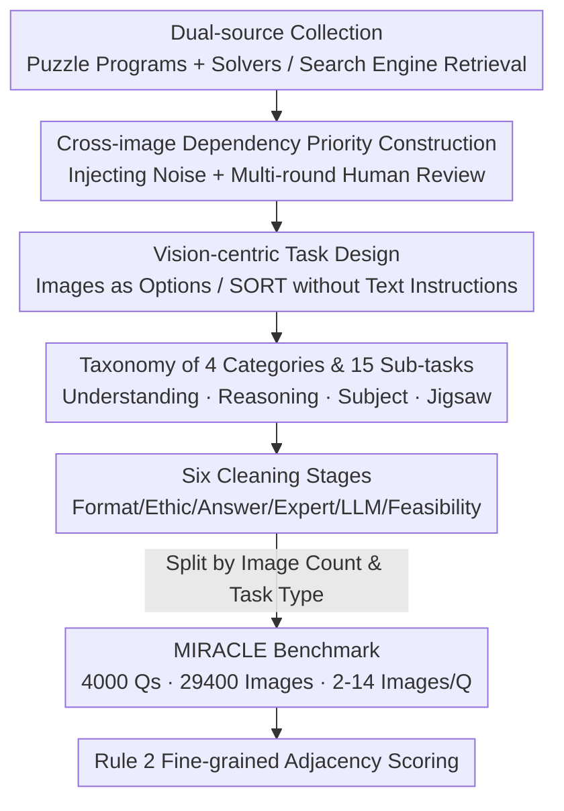

# Will Multimodal Models Be Dazzled by Multi-Image Visual Puzzles?

**Conference**: CVPR 2026  
**Paper**: [CVF Open Access](https://openaccess.thecvf.com/content/CVPR2026/html/Zhu_Will_Multimodal_Models_Be_Dazzled_by_Multi_Image_Visual_Puzzles_CVPR_2026_paper.html)  
**Code**: https://huggingface.co/datasets/queyuecanyang/MIRACLE (Dataset)  
**Area**: Multimodal VLM  
**Keywords**: Multi-image Reasoning, Visual Puzzles, Benchmark, Cross-image Dependency, Sorting Tasks

## TL;DR
This paper proposes the **MIRACLE** benchmark—an evaluation set containing 4,000 problems and 29,400 images, with an average of 7.35 images per problem (up to 14). It forces models to perform cross-image relational reasoning to arrive at correct answers. Results indicate that even the strongest model, Gemini-2.5-Pro, achieves only 55.91%. All models collapse on high visual density tasks like jigsaw puzzles and numerical constraint reasoning, exposing significant weaknesses in current MLLMs regarding structured and collaborative visual reasoning.

## Background & Motivation
**Background**: Multimodal Large Language Models (MLLMs) have progressed rapidly in multi-image understanding over the past two years. The community has introduced several multi-image benchmarks such as MuirBench, MMIU, BLINK, and MileBench to measure these capabilities.

**Limitations of Prior Work**: Existing benchmarks suffer from three systematic flaws. First, the **number of images is too small**—most tasks involve only 2–4 images (e.g., BLINK averages 1.9, Mantis-Eval 2.5), which cannot support true "dense visual reasoning." Second, **relationship modeling is shallow**—while MUIR is structured, inter-image relationships remain superficial and tasks are relatively simple. Third, the **test formats are monotonous**, and many problems can be solved via single-image shortcuts or text priors without requiring the model to truly "see the relationships between images." Conversational benchmarks like MMDU and Q-Bench include multiple images but focus on context memory and text generation rather than systematic evaluation of inter-image understanding.

**Key Challenge**: Existing benchmarks fall short in three dimensions: "image scale × inter-image relationship complexity × mandatory cross-image reasoning." Consequently, they **cannot measure the true boundaries of model capabilities**—it remains unclear whether high scores stem from genuine cross-image reasoning or from exploiting single-image/textual shortcuts.

**Goal**: To create a multi-image reasoning benchmark that pushes models to their limits by: (1) mandating cross-image reasoning and blocking single-image shortcuts; (2) providing a large number of images with high visual information density; and (3) categorizing task types for diagnostic-level analysis.

**Key Insight**: Visual puzzles such as jigsaw puzzles, Sudoku, 15-puzzles, and Slitherlink naturally possess properties like "multi-image, strong structural dependency, unique solutions, and being programmable for generation and verification." These are ideal for testing cross-image structural reasoning. When paired with real-world image sets (landscapes, comics, movie frames), they cover a spectrum of visual complexity from concrete to abstract.

**Core Idea**: Guided by "relationship-centric" design principles, the authors organize visual puzzles and real-world image sets into problems with strong cross-image dependencies and high image density. Accompanied by a fine-grained adjacency relationship scoring system, they developed a diagnostic benchmark designed to "dazzle" MLLMs.

## Method
As a benchmark paper, the "method" refers to the **data construction pipeline, task design, and evaluation protocol**. The overall objective is to ensure every problem satisfies the condition that "correct answers require understanding the structural, semantic, or temporal relationships across multiple images," with tasks subdivided by relationship type for precise diagnostics.

### Overall Architecture
The construction of MIRACLE follows a pipeline: "dual-source collection → multi-round filtering → pre-annotation → strict cleaning → categorical splitting" (corresponding to Figure 3 in the paper). Metadata originates from two pipelines: **Programmatic Synthesis**, using puzzle game programs and solvers to generate structured, reasoning-rich tasks like Sudoku and 15-puzzles while injecting noise (e.g., misleading steps) to create causal image sequences; and **Real-world Retrieval**, using search engine APIs to fetch semantically coherent image sets (landscapes, comics, movie frames). All metadata undergoes quality filtering, pre-annotation (designing prompts and answers), and cleaning (removing errors) before being categorized into 4,000 problems. Tasks include single-choice questions (SCQ), multiple-choice questions (MCQ), and sorting/jigsaw (SORT) tasks.

### Key Designs

**1. Cross-image Dependency Priority: Blocking Single-image Shortcuts**

MIRACLE focuses on "strong cross-image dependency" during both collection and filtering. In the collection phase, the synthesis pipeline deliberately **injects noise or misleading steps** into puzzle sequences to create image sets with clear causal chains. In the filtering phase, all image groups undergo **multi-round human review and cross-verification** to ensure that clear structural, semantic, or temporal connections exist even without text prompts. Any image sets with ambiguous relationships or low quality are discarded. This ensures that models cannot answer by looking at only one image or reading only the text description.

**2. Taxonomy of 4 Categories and 15 Sub-tasks: From Total Scores to Diagnostics**

To pinpoint where models fail, tasks are divided into four main categories and 15 sub-tasks based on data source and relationship nature. **Understanding** (861 questions) focuses on semantic perception, requiring the identification of visual elements and semantic links (spatial, temporal, causal). **Reasoning** (1131 questions) focuses on state modeling, involving rule-based games that require inferring implicit state transitions (complex geometry, spatial state transitions, numerical constraints). **Subject** (1095 questions, inspired by MMMU) focuses on cross-image knowledge reasoning across disciplines. **Jigsaw** (900 questions) requires models to perceive edge textures, color distributions, and semantic continuity to reassemble fragments. This coordinates system identifies specific failures in Jigsaw–Strange Shape and Number–Constraint Reasoning.

**3. Vision-centric Task Design: Images as Options and Minimal Text**

In MIRACLE, **images not only appear in the prompt but also serve as options**, forcing models to perform cross-image comparative analysis. Sorting (SORT) and Jigsaw tasks take this further by **omitting explicit text instructions**, providing only a set of images and requiring the model to infer the correct sequence or spatial arrangement solely through visual understanding. This isolates the ability to capture cross-image structural and semantic relationships without linguistic aids.

**4. Rule 2 Fine-grained Adjacency Scoring: Distinguishing Model Performance**

Traditional binary scoring (Rule 1: 1 for perfect, 0 otherwise) fails for sorting/jigsaw tasks because most models cannot perfectly reconstruct a sequence, resulting in low variance and indistinguishable scores. The authors introduce **Rule 2**, which evaluates the **correctness of adjacent relationships**. For temporal sorting, it checks if the neighbors of each element are correct, normalizing the score by the number of correct adjacent pairs relative to the total possible pairs. The scoring formula is:

$$S = \frac{1}{|\mathcal{A}|} \sum_{(i,j)\in\mathcal{A}} \mathbb{I}\left[(i,j)\in\hat{\mathcal{A}} \text{ and } \mathrm{dir}(i,j)=\mathrm{dir}(\hat{i},\hat{j})\right]$$

where $\mathcal{A}$ is the set of adjacent pairs in the ground truth layout, $\hat{\mathcal{A}}$ represents the predicted pairs, and $\mathrm{dir}(i,j)$ encodes the relative direction. This provides partial credit for correctly placing adjacent images.

### Six Data Cleaning Stages
The data must pass: **Format check → Ethic check → Answer check → Expert verification → LLM verification → Feasibility test**. The core principles are: unique and correct answers, requirement of deep reasoning, and alignment with human intuition.

## Key Experimental Results

### Main Results
The evaluation used the VLMEvalKit framework, covering models like GPT-4o, OpenAI o3, Claude-3.7V, Seed-1.6, Gemini-2.5-Pro, and open-source models like InternVL2.5 and Qwen2.5-VL.

| Model | Total Score | ≤7 Images | >7 Images | SORT | Jigsaw |
|------|------|-------|-------|------|--------|
| Gemini-2.5-Pro | **55.91** | 70.17 | 42.93 | 36.82 | 53.37 |
| OpenAI o3 | 51.86 | 63.27 | 41.47 | 29.90 | 51.03 |
| Seed-1.6-Thinking | 45.30 | 57.12 | 34.54 | 21.19 | 47.12 |
| GPT-4o | 37.20 | 51.00 | 24.64 | 25.56 | 19.89 |
| Qwen2.5-VL-72B (Best Open) | 32.15 | 46.31 | 19.24 | 15.45 | 19.84 |
| Ovis2-34B | 28.82 | 42.21 | 16.64 | 11.21 | 18.13 |
| Qwen2.5-VL-7B | 22.40 | 35.33 | 10.63 | 6.93 | 11.39 |

Gemini-2.5-Pro leading with 55.91%, followed by OpenAI o3 at 51.86%. Qwen2.5-VL-72B leads the open-source camp but remains significantly behind commercial models.

### Key Findings
- **High visual density breaks models**: Performance drops sharply as the number of images increases from ≤7 to >7, indicating poor scalability of current MLLMs for large-scale structural visual information.
- **Structural Reasoning ≠ Disciplined Knowledge**: Models perform best on "Subject" tasks but collapse on "Jigsaw" and "Number-Constraint" tasks, suggesting they "know facts but cannot perform structural/combinatorial reasoning."
- **Two major weaknesses revealed**: In Number-Constraint tasks, models identify shallow state changes (A→B) but cannot model high-order transformations. In Jigsaw–Strange Shape tasks, models describe individual fragments but fail at spatial arrangement due to limited geometric perception.
- **Thinking mechanisms are effective**: "Thinking" models consistently outperform standard versions, suggesting that reasoning mechanisms aid multi-image structural modeling.

## Highlights & Insights
- **Puzzle-based Probing**: Using visual puzzles as probes is clever because they are multi-image, rule-dependent, have unique solutions, and are programmable, making them harder to "game" than human-annotated sets.
- **Removing Language Crutches**: By using images as options and removing text instructions, the benchmark reflects pure visual reasoning capability.
- **Diagnostic Value**: The 15 sub-tasks allowed the authors to pinpoint Jigsaw–Strange Shape and Number-Constraint as the weakest links, providing a clear roadmap for future research.

## Limitations & Future Work
- **Evaluation vs. Solution**: The paper provides a diagnosis but does not propose new model architectures to solve the identified problems.
- **Distribution Gap**: While programmatic puzzles are controllable, there is a distribution gap between these rule-based games and open-world multi-image tasks (e.g., long-video frame reasoning).
- **Scope of Scoring**: Most tasks are still multiple-choice; open-ended reasoning and explainability evaluation remain relatively weak.

## Related Work & Insights
- **vs MuirBench / MMIU**: MIRACLE emphasizes stronger cross-image dependency and structural reasoning with higher image counts (avg. 7.35 vs. ~2-4).
- **vs MMMU**: While Subject tasks are inspired by MMMU, MIRACLE adds the Reasoning/Jigsaw dimensions, revealing the stark contrast between knowledge retrieval and structural visual reasoning.

## Rating
- Novelty: ⭐⭐⭐⭐
- Experimental Thoroughness: ⭐⭐⭐⭐⭐
- Writing Quality: ⭐⭐⭐⭐
- Value: ⭐⭐⭐⭐

<!-- RELATED:START -->

## Related Papers

- [\[CVPR 2026\] MMSD3.0: A Multi-Image Benchmark for Real-World Multimodal Sarcasm Detection](mmsd30_a_multi-image_benchmark_for_real-world_multimodal_sarcasm_detection.md)
- [\[CVPR 2026\] Multi-Modal Image Fusion via Intervention-Stable Feature Learning](multi-modal_image_fusion_via_intervention-stable_feature_learning.md)
- [\[CVPR 2026\] Rethinking BCE Loss for Multi-Label Image Recognition with Fine-Tuning](rethinking_bce_loss_for_multi-label_image_recognition_with_fine-tuning.md)
- [\[CVPR 2026\] Multimodal RewardBench 2: Evaluating Omni Reward Models for Interleaved Text and Image](multimodal_rewardbench_2_evaluating_omni_reward_models_for_interleaved_text_and_.md)
- [\[CVPR 2026\] Multi-SpatialMLLM: Multi-Frame Spatial Understanding with Multi-Modal Large Language Models](multi-spatialmllm_multi-frame_spatial_understanding_with_multi-modal_large_langu.md)

<!-- RELATED:END -->
