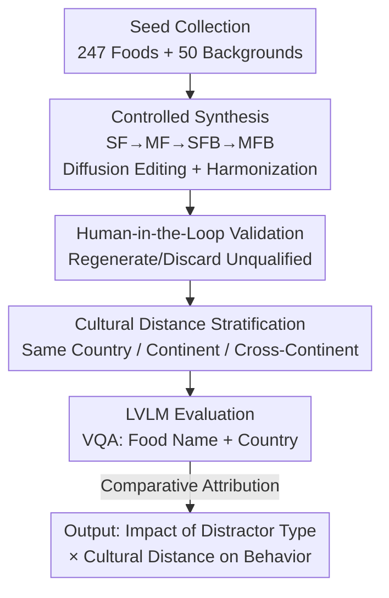

# World in a Frame: Understanding Culture Mixing as a New Challenge for Vision-Language Models

**Conference**: CVPR 2026  
**Paper**: [CVF Open Access](https://openaccess.thecvf.com/content/CVPR2026/html/Kim_World_in_a_Frame_Understanding_Culture_Mixing_as_a_New_CVPR_2026_paper.html)  
**Code**: https://huggingface.co/datasets/EunsuKim/CultureMix (Dataset released)  
**Area**: Multimodal VLM  
**Keywords**: Culture Mixing, Food VQA, Cross-cultural Understanding, Benchmark, Contextual Bias

## TL;DR
The authors introduce **CultureMix**, a food VQA benchmark utilizing diffusion models to synthesize 23,000 images featuring "co-occurring multiple cultural elements" (across 4 sub-tasks). The study evaluates 10 Large Vision-Language Models (LVLMs) on their ability to recognize food and its country of origin in mixed-culture scenarios. Findings indicate that models rely heavily on background cues and are frequently misled by "cultural distractors" (accuracy drops by 14% after adding backgrounds). Preliminary evidence suggests that Supervised Fine-Tuning (SFT) can significantly mitigate this vulnerability.

## Background & Motivation
**Background**: In a globalized reality, multiple cultural elements frequently appear in the same frame—such as a ramen shop near the Eiffel Tower or diverse international dishes at a buffet. The authors define this phenomenon of "coexistence and blending of multiple cultural cues within a single scene" as **culture mixing**. Simultaneously, existing work has evaluated the cultural understanding of LVLMs using VQA formats (e.g., WorldCuisines, WorldWideDishes).

**Limitations of Prior Work**: Existing cultural understanding benchmarks almost exclusively depict **single-cultural context** scenarios—where an image contains elements from only one country, requiring the model to perform only single-culture recognition. However, the real world is mixed. Whether models can **distinguish and maintain the individual cultural identity of each element** when multiple, potentially conflicting cultural cues appear simultaneously remains a systematic research gap.

**Key Challenge**: Each cultural element should retain its cultural identity regardless of its location or co-occurring elements (e.g., pizza is Italian and sushi is Japanese—sushi does not become Indian just because it is next to Indian cuisine). However, models trained on monocultural data likely learn "shortcuts" by guessing culture based on context. If the context (especially background landmarks/street views) and the target food originate from different cultures, this shortcut becomes detrimental.

**Goal**: (1) Define culture mixing as a new challenge for LVLMs; (2) Construct a benchmark that **systematically decomposes distractor types** (None/Food/Background/Both) to quantify model behavior at different mixing levels; (3) Explore preliminary solutions to improve model robustness.

**Key Insight**: By using "**cultural distractors**" as controllable variables for controlled experiments—fixing the target food and gradually introducing food distractors, background distractors, or both, while controlling the **cultural distance** (Same Country/Same Continent/Cross-Continent)—the study cleanly observes which cues and at what cultural distance the model is misled.

**Core Idea**: Operationalize "culture mixing" into a synthetic VQA benchmark with a **2×2 distractor type + cultural distance** matrix. Instead of using noisy real-world images, controlled comparisons are used to precisely attribute cross-cultural failures in LVLMs.

## Method
As a **benchmark paper**, the "Method" comprises the dataset construction pipeline and evaluation protocols. The pipeline addresses a core difficulty: real-world mixed-culture images are rare and uncontrollable (backgrounds, people, and text interfere with attribution). Therefore, the authors employ **controllable synthesis via diffusion models + human-in-the-loop validation** to create a controlled dataset where distractors are introduced incrementally.

### Overall Architecture
The input consists of **seed food images** (247 dishes from 30 countries) and **seed background images** (50 landmarks/street views from 5 continents) sampled from existing multicultural VQA datasets. The pipeline consists of three steps: first, cropping seed food into single dishes on white backgrounds (SF), then pairing them into multi-dish images (MF); next, vertically concatenating backgrounds and using diffusion models for **image harmonization** to produce SFB and MFB. Every step undergoes multiple rounds of human validation. The four sub-tasks increase in "distractor type" complexity:

- **SF (Single Food)**: Single dish on a plain white background, no cultural distractor; serves as the baseline.
- **MF (Multiple Foods)**: Two dishes co-occurring; introduces **food-type** distractors.
- **SFB (SF + Background)**: Single dish + cultural background; introduces **background-type** distractors.
- **MFB (MF + Background)**: Multiple dishes + background; **overlapping** food and background distractors.

Evaluation is conducted via VQA asking: "What is the name of this (left) food, and which country does it most likely originate from?" to measure **food name recognition** and **origin country identification** accuracy.

### Key Designs

**1. Controlled Synthesis of Four Sub-tasks: Isolating Cultural Distractors**

This addresses the pain point of uncontrollable real-world mixed-culture images. Instead of scraping noisy photos, editing-based text-to-image diffusion models (FLUX.1-Kontext and Qwen-Image-Edit) are used for hierarchical synthesis. First, original backgrounds are replaced with plain white to remove text, people, and landscapes to create SF. Two SFs are concatenated for MF. Background images are then vertically concatenated into SF/MF followed by **image harmonization** (making the food and background a natural single image) to create SFB/MFB. Consequently, only the **distractor type varies** between sub-tasks (None → Food → Background → Both). The drop from SF to MF is attributed purely to food distractors, while the drop from SF to SFB is attributed to background distractors.

**2. Cultural Distance Stratification: Quantifying Vulnerability**

The authors investigate the role of the **cultural relationship between the distractor and the target** using **geographic proximity** as a proxy for "cultural distance," categorized into: (i) Same country, (ii) Same continent but different country, (iii) Different continent. Each food is paired with distractors across these three distances, totaling 948 food pairs. Cases are also categorized by difficulty based on baseline model performance (Qwen2.5-VL-72B, GPT-image, Gemini-2.5-flash). This allows for plotting monotonicity curves of "Accuracy/Prediction Entropy vs. Cultural Distance."

**3. Human-in-the-Loop QC + Real-world Evidence: Ensuring Credibility**

To counter concerns about diffusion artifacts, **multiple rounds of human validation** are employed. Each sub-task followed strict screening criteria (fidelity, harmony, etc.). For evaluation, food names are matched using a weighted Jaccard character n-gram similarity ($0.7$ bigram + $0.3$ unigram, threshold $0.4$), and origin countries use exact string matching. Human auditing of 100 pairs confirmed that food name scoring was 95% correct and country scoring was 100% correct. Crucially, a **CultureMix-real** set (100 real MF images, 219 cropped SF) was built to replicate the degradation trends observed in the synthetic set.

### A Complete Example
Using Japanese "Katsudon" as an example: In **SF** (white background), most models correctly identify "Katsudon / Japan." In **MF** (paired with Spanish Arroz con Pollo), food distractors cause some models to falter. In **SFB** (paired with a Mexican landmark background), country predictions shift heavily toward the culture suggested by the background—on average, 15% of predictions jump directly to the distractor's country, and 12% to the same continent. In **MFB**, the prediction distribution diverges further.

## Key Experimental Results

### Main Results
Evaluated 10 LVLMs (2 closed-source: GPT-5, Gemini-2.5-Pro; 8 open-source: InternVL3, Ovis2.5, QwenVL3, Molmo). General trend: **SF ≳ MF > MFB ≳ SFB**, indicating background distractors are more detrimental than food distractors.

| Experimental Setting | Change in Country Accuracy | Change in Food Name Accuracy | Key Finding |
|----------|------------------|---------------|---------|
| SF → MF (Add Food Distractor) | Baseline | Baseline | Relatively robust to food distractors (40–80% retention) |
| SF → SFB (Add Background Distractor) | Avg. **13%** lower than MF | Avg. **7%** lower than MF | Background is a stronger cultural signal |
| Background vs. Food-only Baseline | Accuracy drops **14%** | — | Models rely heavily on context over the target |
| Closed-source vs. Open-source | Gemini/GPT lead | — | Ovis2.5-9B is strongest among open-source given its size |

### Mitigation Strategy Experiments (Ovis2.5-9B / InternVL3-8B)
Explored three strategies: **PromptDirect** (ignore background), **PromptCoT** (Chain of Thought), and **SFT** (progressive fine-tuning on CultureMix).

| Configuration | MFB Entropy ($\downarrow$) | SFB Accuracy ($\uparrow$) | MFB Accuracy ($\uparrow$) | Description |
|------|-----------|---------------|---------------|------|
| Ovis2.5 Base | 3.07 | 5.65 | 6.14 | Baseline |
| + PromptDirect | 2.99 | 6.00 | 6.07 | Slight gain in simple scenes |
| + PromptCoT | 3.21 | 6.62 | 6.73 | Accuracy rises occasionally; consistency often worsens |
| + SFT | **2.36** | **8.59** | **8.95** | Only statistically significant ($p<0.01$) improvement |
| InternVL3 Base | 3.43 | 2.14 | 3.33 | Baseline |
| + SFT | **2.45** | **4.16** | **5.14** | Most obvious improvement in background tasks |

### Key Findings
- **Backgrounds mislead more than food**: Prediction plots show MF has high retention/low drift, while SFB has low retention/high drift (approx. 40%), proving background provides a stronger cultural signal.
- **Cultural Distance Impact**: Accuracy is **highest and entropy lowest when target and distractor share the same country**. Performance is worst for cross-continental pairings, showing a monotonic relationship where consistent cultural cues act as "mutual confirmation."
- **Failure stems from context shortcuts**: Using culture-neutral objects (apple, car, etc.) as distractors leads to higher accuracy than cultural distractors, proving that **cultural signals**, rather than mere visual complexity, drive the performance drop.
- **CoT is not always beneficial**: Chain-of-Thought may improve accuracy but can harm consistency by **amplifying the model's reliance on background cues** and over-strengthening misleading signals during multi-source conflict.
- **SFT is the most reliable solution**: Especially in complex mixed scenes involving backgrounds, where simple prompt engineering is insufficient.

## Highlights & Insights
- **"Controlled Comparison of Distractors" is a clever methodology**: By varying only one variable (type or distance), the study transforms vague observations into a causal analysis of why LVLMs fail under culture mixing—a paradigm applicable to other visual robustness studies.
- **Exposing hidden shortcut learning**: Models use "environmental culture" as a shortcut. This is invisible in monocultural data but causes failure in cultural conflicts, acting as a sharp diagnostic for whether LVLMs truly "understand" objects vs. reading context.
- **Evidence of WEIRD bias**: In SF tasks, African/Asian countries are often misidentified as India or China, while European countries are often misidentified as the US, quantifying the model's cultural centralization.
- **CoT amplifying misleading cues**: This counter-intuitive finding suggests CoT might be detrimental in tasks requiring the aggregation of conflicting cultural/social cues.

## Limitations & Future Work
- **Exploratory Solutions**: Optimal "culture-mixing-oriented" training objectives remain open; while SFT is significant, absolute accuracy remains low (single digits for MFB).
- **Narrow Domain**: The benchmark focuses on "food + background." Whether conclusions generalize to clothing, architecture, or festivals is unverified.
- **Synthetic Gap**: Despite validation, differences between diffusion-synthesized images and the real world (or artifacts from harmonization) might affect absolute numerical results.
- **Coarse Metrics**: Using character n-gram similarity for food names may misjudge synonyms or transliterations.
- **Future Directions**: Upgrading cultural distance to a continuous similarity measure; exploring contrastive learning/debiasing rather than pure SFT; expanding to more (>2) co-occurring cultural elements.

## Related Work & Insights
- **vs. Monocultural VQA (WorldCuisines, etc.)**: These evaluate recognition in single contexts. This work **introduces the "culture mixing" dimension**, using cultural distractors as controllable variables to reveal shortcut learning.
- **vs. Cultural Bias/Fairness (Image Captioning, T2I)**: While previous work focuses on generation/retrieval bias, this study focuses on **identity maintenance during recognition** in mixed contexts.
- **vs. General Robustness/Co-occurrence Bias**: By using culture-neutral objects as controls, this paper cleanly separates "cultural signal-driven drift" from general interference complexity.

## Rating
- Novelty: ⭐⭐⭐⭐⭐ First to define "culture mixing" as an LVLM challenge; clean controlled synthesis design.
- Experimental Thoroughness: ⭐⭐⭐⭐⭐ 10 models × 4 sub-tasks × cultural distance, plus real-world evidence and three mitigation strategies.
- Writing Quality: ⭐⭐⭐⭐ Clear logic and rich visualization, though mitigation results are preliminary.
- Value: ⭐⭐⭐⭐ Opens a meaningful new benchmark with high diagnostic value; robustness remains an open problem.

<!-- RELATED:START -->
<!-- RELATED:END -->

## Related Papers

- [\[CVPR 2026\] Chain-of-Frames: Advancing Video Understanding in Multimodal LLMs via Frame-Aware Reasoning](chain-of-frames_advancing_video_understanding_in_multimodal_llms_via_frame-aware.md)
- [\[CVPR 2026\] Concept Regions Matter: Benchmarking CLIP with a New Cluster-Importance Approach](concept_regions_matter_benchmarking_clip_with_a_new_cluster-importance_approach.md)
- [\[CVPR 2026\] Small Object, Great Challenge: A Benchmark for Small Object Visual Grounding](small_object_great_challenge_a_benchmark_for_small_object_visual_grounding.md)
- [\[ICML 2026\] TimeSpot: Benchmarking Geo-Temporal Understanding in Vision-Language Models in Real-World Settings](../../ICML2026/multimodal_vlm/timespot_benchmarking_geo-temporal_understanding_in_vision-language_models_in_re.md)
- [\[ICLR 2026\] Mixing Importance with Diversity: Joint Optimization for KV Cache Compression in Large Vision-Language Models](../../ICLR2026/multimodal_vlm/mixing_importance_with_diversity_joint_optimization_for_kv_cache_compression_in_.md)

<!-- RELATED:END -->
