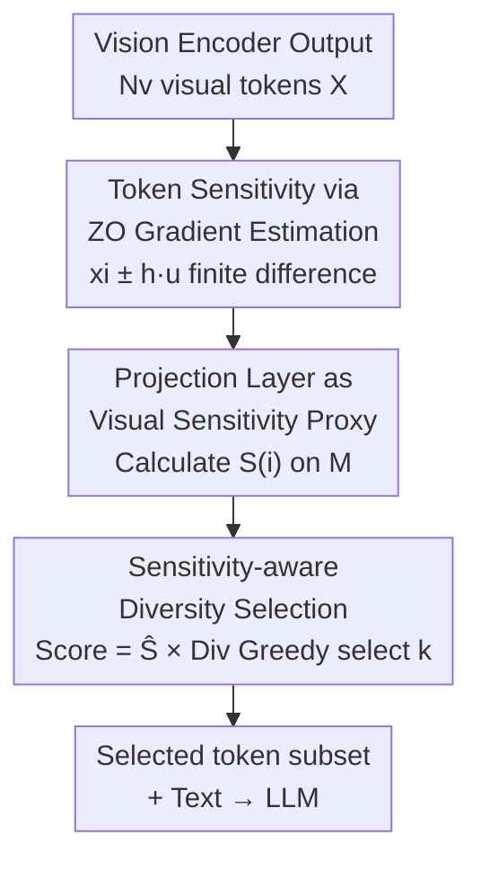

# ZOO-Prune: Training-Free Token Pruning via Zeroth-Order Gradient Estimation in Vision-Language Models

**Conference**: CVPR 2026  
**Paper**: [CVF Open Access](https://openaccess.thecvf.com/content/CVPR2026/html/Kim_ZOO-Prune_Training-Free_Token_Pruning_via_Zeroth_Order_Gradient_Estimation_in_Vision_Language_CVPR_2026_paper.html)  
**Code**: https://aim-skku.github.io/ZOO-Prune  
**Area**: Multimodal VLM / Model Compression  
**Keywords**: Visual token pruning, Zeroth-order gradient estimation, Training-free, VLM inference acceleration, Sensitivity  

## TL;DR
ZOO-Prune utilizes "zeroth-order gradient estimation" on a lightweight projection layer to measure the "sensitivity" of each visual token. By multiplying sensitivity with feature diversity into a hybrid score for greedy selection, it achieves completely training-free pruning of up to 94.4% of visual tokens, reaching a 2.30× end-to-end inference speedup with negligible accuracy loss.

## Background & Motivation

**Background**: Large Vision-Language Models (VLMs, e.g., LLaVA, Qwen-VL) encode an image into hundreds or thousands of visual tokens—576 tokens for a single image in LLaVA-1.5 and up to 2880 tokens in high-resolution LLaVA-NeXT—whereas the text side often contains only a few tokens (e.g., "describe this image in one sentence"). This severe imbalance causes inference latency and VRAM overhead to be dominated by redundant visual tokens, making "visual token pruning" a practical means for VLM acceleration. Among these, **training-free** pruning is most favored as it requires no calibration data or fine-tuning and can be used "plug-and-play."

**Limitations of Prior Work**: Existing training-free pruning methods are divided into two categories, each with significant drawbacks. **Attention-based methods** (FastV, VisionZip, SparseVLM) score tokens based on attention magnitude, but attention often concentrates on background regions and is unstable across layers and heads, tending to retain clusters of redundant tokens—e.g., for an image of a "laptop on a table," it might keep numerous background tokens while missing critical tokens near the screen used for answering questions. **Diversity-based methods** (DivPrune) instead select tokens furthest apart in feature space to maximize coverage and robustness, but they treat all tokens equally without considering task relevance, potentially discarding the most visually critical areas.

**Key Challenge**: Attention scores do not equate to the true influence of a token on the model's output—prior work has indicated that attention weights and actual token impact are uncorrelated. What truly should be measured is the **sensitivity** of a token: how much the model output changes given a small perturbation to that token. However, calculating sensitivity directly via gradients requires backpropagation through the entire LLM, which is prohibitively expensive during inference and requires ground-truth outputs to define a supervised loss—labels that are unavailable during inference-time pruning.

**Goal**: Find a sensitivity measure that reflects the actual impact of tokens on output without requiring backpropagation or labels, while simultaneously balancing "information value" and "coverage" during selection.

**Key Insight**: The authors employ **zeroth-order (ZO) gradient estimation**—approximating gradients using finite differences via forward queries only, naturally bypassing backpropagation. However, performing ZO directly on the vision encoder would be computationally explosive due to multiple forward passes per direction (500 tokens × 64 directions ≈ 6.4×10⁶ GFLOPs). A key observation is that pruning only requires the **relative ranking** of token importance, not exact gradients. The **projection layer** acts as a natural "modality alignment bottleneck" that compresses high-level semantics from the vision encoder into the language embedding space; sensitivity rankings calculated here are highly consistent with those from the full vision encoder (Spearman correlation of 0.55/0.49 on MMMU/POPE).

**Core Idea**: Estimate the sensitivity of each token using zeroth-order finite differences on the lightweight projection layer, then multiply this by diversity to form a hybrid score for greedy selection—"measuring token impact via forward perturbations instead of backpropagation, and selecting tokens based on Sensitivity × Diversity instead of a single criterion."

## Method

### Overall Architecture

ZOO-Prune is positioned after the vision encoder and before the LLM as a purely forward-pass, training-free token selection module. Given $N_v$ visual tokens $X \in \mathbb{R}^{N_v \times d_v}$ output by the vision encoder, it follows two steps: ① **ZOO Sensitivity Estimation**—apply positive and negative Gaussian perturbations $x_i \pm h u_j$ to each token, pass them through the projection layer $M$, and define sensitivity $S(i)$ based on the average magnitude of finite difference responses; ② **Sensitivity-aware Diversity Selection**—multiply normalized sensitivity and feature diversity into a hybrid score to greedily select a subset $\mathcal{P}$ of $k$ tokens. Finally, only the selected tokens are fed into the LLM alongside the text.

### Key Designs

**1. Token Sensitivity via ZO Gradient Estimation: Quantifying impact using forward perturbations instead of backpropagation**

To address the issue that "attention scores do not equal real impact" and "direct gradient calculation is too expensive and requires labels," ZOO-Prune uses zeroth-order finite differences. For the $i$-th token $x_i$, $m$ random directions $u_j \sim \mathcal{N}(0, I_{d_v})$ with unit norm are sampled to calculate the symmetric (central difference) response:

$$\delta_{i,j} = \frac{M(x_i + h u_j) - M(x_i - h u_j)}{2h}$$

where $M$ is the projection layer and $h$ is a small step size. The sensitivity of token $i$ is defined as the average response magnitude across $m$ directions:

$$S(i) = \frac{1}{m}\sum_{j=1}^{m}\|\delta_{i,j}\|_2$$

The elegance lies in the fact that while traditional Random Gradient Estimators (RGE) aim to reconstruct the gradient **direction**, this method only requires the **magnitude** of the response. Proposition 3.1 in the paper proves that when $h$ is sufficiently small, $S(x) = \mathbb{E}_u[\|J(x)u\|_2] + O(h^2)$—meaning $S(i)$ approximates the average response magnitude of the Jacobian to random perturbations, serving as a scalar measure of "how much the output changes on average when this token is moved." The entire process uses only forward queries, requires no backpropagation or labels, and is thus applicable to non-differentiable or large-model scenarios during inference.

**2. Projection Layer as Visual Sensitivity Proxy: Moving ZO estimation to a lightweight bottleneck to avoid expensive forward passes on the vision encoder**

If Design 1 were applied directly to the vision encoder, it would require $2nm$ complete encoder forward passes (500 tokens × 64 directions ≈ 6.4×10⁶ GFLOPs), which is prohibitively expensive. This design solves the "ZO cost" problem. The authors argue that token pruning only requires the **relative ranking** of importance rather than exact gradients, allowing the use of a cheaper layer. The **projection layer** consists of only a few layers with negligible additional inference overhead and acts as the "modality alignment bottleneck"—integrating high-level semantics and mapping them to the language embedding space, naturally emphasizing tokens important for downstream prediction. Empirically, the authors compared the Spearman correlation between "vision encoder rankings" and "projection layer rankings" (0.55/0.49 on MMMU/POPE), confirming sufficient consistency. Thus, $M$ is set as the projection layer, and sensitivity is computed directly on projected embeddings, preserving rankings while minimizing overhead.

**3. Sensitivity-aware Diversity Selection: Multiplying sensitivity and diversity to retain high-impact tokens while ensuring content coverage**

Relying solely on sensitivity might result in clusters of the most "sensitive" tokens without covering diverse visual content; relying solely on diversity (DivPrune) ignores semantically critical regions. This design integrates both. For a selected set $\mathcal{P}$, the diversity of token $i$ is defined as the complement of its maximum cosine similarity to tokens already in the set:

$$\mathrm{Div}(i, \mathcal{P}) = 1 - \max_{j \in \mathcal{P}} \cos(Z_i, Z_j)$$

The final selection score multiplies the normalized sensitivity $\widehat{S}(i)$ (min-max normalized to [0,1]) with diversity:

$$\mathrm{Score}(i) = \widehat{S}(i) \cdot \mathrm{Div}(i, \mathcal{P})$$

Then, in each round, $\arg\max_i \mathrm{Score}(i)$ is greedily added to $\mathcal{P}$ until $k$ tokens are selected. Multiplication is used instead of weighted summation to **avoid introducing additional weight hyperparameters**. Compared to DivPrune, there are two key changes: ① For the first token, DivPrune picks the one furthest from all tokens, whereas ZOO-Prune picks the one with the highest sensitivity; ② For subsequent selections, DivPrune looks only at diversity, while ZOO-Prune considers Sensitivity × Diversity. This ensures the selected subset is both sensitivity-driven (informative) and diversity-driven (comprehensive coverage).

## Key Experimental Results

Evaluations covered LLaVA-1.5-7B/13B, LLaVA-NeXT-7B, and Qwen2.5-VL-7B across 9 benchmarks, all training-free and calibration-free, with $m=64, h=0.01$. Performance is reported as the average retention rate (Avg.) relative to the unpruned baseline.

### Main Results

Average performance retention rates under different token budgets on LLaVA-1.5-7B (gaps widen at more aggressive pruning):

| Token Budget | Pruning Rate | FastV (Attn) | VisionZip (Attn) | DivPrune (Div) | ZOO-Prune |
|--------------|--------------|--------------|------------------|----------------|-----------|
| 192          | 66.7%        | 87.75%       | 97.66%           | 97.78%         | **98.27%**|
| 128          | 77.8%        | 81.22%       | 96.20%           | 96.73%         | **97.62%**|
| 64           | 88.9%        | 71.10%       | 92.74%           | 94.42%         | **95.20%**|

LLaVA-NeXT-7B (2880 tokens) remains stable under extreme pruning: retaining 640 tokens (77.8% pruned) maintains 98.3%, and retaining 160 tokens (94.4% pruned) still yields 95.4%, significantly outperforming VisionZip (90.4%) and DivPrune (92.4%). On Qwen2.5-VL-7B, it achieves 96.2% at a 20% budget and 90.8% at a 10% budget, verifying cross-architecture generalization. Regarding efficiency, end-to-end latency is reduced by 2.30× and prefilling by 2.59× at the aggressive 160-token setting, while sensitivity estimation overhead itself is negligible.

### Ablation Study

Ablation of selection criteria on LLaVA-NeXT-7B (640 tokens retained, 77.8% pruned):

| Configuration              | Avg. Retention | Description                                                                 |
|----------------------------|----------------|-----------------------------------------------------------------------------|
| Sensitivity-only           | 96.7%          | Good for inference, but performance drops in context-heavy tasks like TextVQA|
| Diversity-only (DivPrune)  | 97.1%          | Broad coverage but misses key cues                                          |
| Fusion (Sum)               | 98.1%          | Addition of sensitivity and diversity                                       |
| Fusion (Multiply)          | **98.3%**      | Multiplication, no additional hyperparameters, optimal                      |

### Key Findings
- **Sensitivity and Diversity are Complementary**: Neither criterion alone matches the fused performance; multiplication outperforms addition and avoids extra weighting hyperparameters. The advantage of fusion becomes more pronounced at aggressive pruning levels (95.4% vs 91.2%/92.4% for single criteria at 160 tokens).
- **Hyperparameter Robustness**: Performance is stable across $m=16\sim160$ and $h=10^{-4}\sim1$ on POPE; the authors fixed $m=64$ and $h=0.01$ for all tasks without per-task tuning.
- **Sensitivity Signal vs. Attention**: Attention-based T2V variants exhibit positional biases (toward query vicinity, often at the image bottom), while V2V variants retain redundant tokens. Zeroth-order sensitivity provides an architecture-agnostic, stable importance signal, outperforming both attention variants across all compression ratios.

## Highlights & Insights
- **"Downgrading" Zeroth-Order Optimization appropriately**: ZO gradient estimation was originally designed for black-box optimization/adversarial attacks/efficient LLM fine-tuning. The authors realized pruning only requires relative ranking, not exact gradients, thus extracting only the response **magnitude** to turn a heavy task into a lightweight one—a "downgrading requirements for efficiency" mindset worth transferring.
- **Projection Layer as Sensitivity Proxy is a masterstroke**: Direct ZO on the vision encoder would be too expensive; authors confirmed ranking consistency using Spearman correlation and "modality alignment" intuition, moving computation to a few layers with negligible cost. This "finding a cheap proxy layer" approach is generalizable.
- **Parameter-free Multiplicative Fusion**: Using Sensitivity × Diversity instead of a weighted sum eliminates the troublesome hyperparameter of "how to balance two criteria," enabling plug-and-play engineering.
- **Training-free + Attention-agnostic**: The method does not rely on attention maps, allowing it to be used directly on non-LLaVA architectures like Qwen2.5-VL with dynamic resolution and variable-length tokens, showing excellent generalization.

## Limitations & Future Work
- **Proxy Consistency is "Sufficient" but not "High"**: The Spearman correlation between projection layer and vision encoder rankings is only 0.55/0.49 (moderate correlation). While sufficient for pruning, this implies potential risks in downstream tasks more sensitive to ranking precision, which the authors did not explore.
- **$2m$ Projection Forward passes per token**: Though the projection layer is lightweight, sensitivity estimation still involves $O(N_v \cdot m)$ projection passes. In scenarios with extreme token counts, this overhead requires more detailed FLOPs breakdown. LLaVA-NeXT further employs low-rank decomposition ($k=128$) on the projection layer to speed up, suggesting the original cost isn't entirely negligible.
- **Sensitivity $\neq$ Task Correctness**: $S(i)$ measures "how much the output changes under perturbation," but high sensitivity doesn't guarantee a positive contribution to the correct answer; "sensitive but misleading" tokens may still be retained.
- **Future Directions**: Incorporating text/question information into sensitivity estimation (currently task-agnostic) or adaptively allocating the number of perturbation directions $m$ per token.

## Related Work & Insights
- **vs. VisionZip / FastV (Attention-based)**: These use attention magnitude for scoring, suffering from positional bias and redundancy issues; ZOO-Prune replaces attention with ZO sensitivity, providing a stable, architecture-agnostic signal with clear advantages at aggressive pruning (95.20% vs 71.10% for FastV at 64 tokens).
- **vs. DivPrune (Diversity-based)**: Both use max-min diversity, but DivPrune treats all tokens equally. ZOO-Prune injects "task relevance" via sensitivity multiplication, consistently outperforming DivPrune.
- **vs. Tuning/Calibration-based Pruning (VTW, FitPrune, CrossGET)**: Those methods require calibration sets or extra adaptation, limiting flexibility; ZOO-Prune is entirely training-free and plug-and-play.
- **Insight**: "Approximating sensitivity via forward perturbations + lightweight proxy layers" is a general-purpose tool transferable to other scenarios where token/feature importance is needed but backpropagation is inconvenient (e.g., black-box models, inference-time feature compression).

## Rating
- Novelty: ⭐⭐⭐⭐ Introducing ZO sensitivity to VLM pruning with projection proxies and multiplicative fusion is clever.
- Experimental Thoroughness: ⭐⭐⭐⭐⭐ Comprehensive coverage across 4 models and 9 benchmarks, including ablation, hyperparameter, and efficiency analyses.
- Writing Quality: ⭐⭐⭐⭐ Clear motivation-observation-method chain; theoretical support via Propositions provided. Discussion on proxy consistency limits could be deeper.
- Value: ⭐⭐⭐⭐ Training-free, plug-and-play, 2.30× speedup with near-zero loss—highly practical for resource-constrained VLM deployment.

<!-- RELATED:START -->

## Related Papers

- [\[CVPR 2026\] HAWK: Head Importance-Aware Visual Token Pruning in Multimodal Models](hawk_head_importance-aware_visual_token_pruning_in_multimodal_models.md)
- [\[AAAI 2026\] Branch, or Layer? Zeroth-Order Optimization for Continual Learning of Vision-Language Models](../../AAAI2026/multimodal_vlm/branch_or_layer_zeroth-order_optimization_for_continual_lear.md)
- [\[ICML 2026\] CLIP Tricks You: Training-free Token Pruning for Efficient Pixel Grounding in Large Vision-Language Models](../../ICML2026/multimodal_vlm/clip_tricks_you_training-free_token_pruning_for_efficient_pixel_grounding_in_lar.md)
- [\[ICLR 2026\] IVC-Prune: Revealing the Implicit Visual Coordinates in LVLMs for Vision Token Pruning](../../ICLR2026/multimodal_vlm/ivc-prune_revealing_the_implicit_visual_coordinates_in_lvlms_for_vision_token_pr.md)
- [\[CVPR 2026\] Octopus: History-Free Gradient Orthogonalization for Continual Learning in Multimodal Large Language Models](octopus_history-free_gradient_orthogonalization_for_continual_learning_in_multim.md)

<!-- RELATED:END -->
