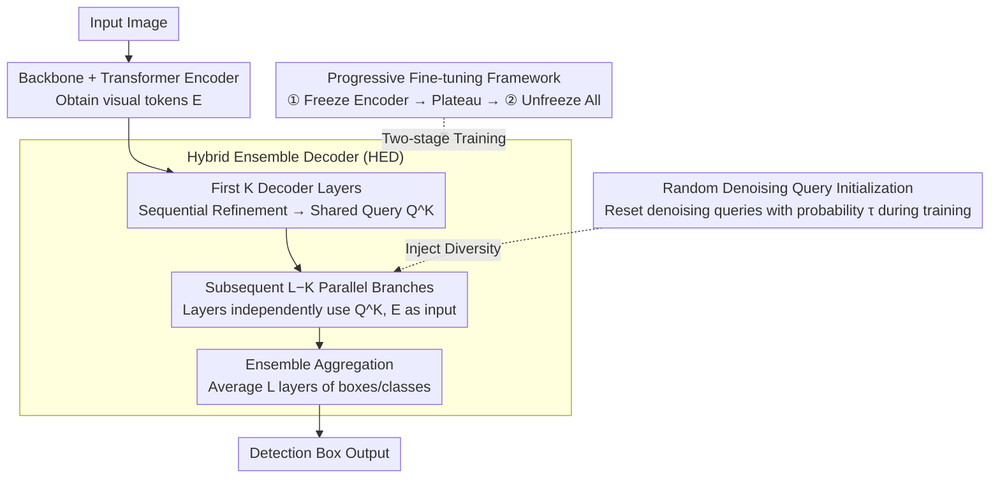

# A Closer Look at Cross-Domain Few-Shot Object Detection: Fine-Tuning Matters and Parallel Decoder Helps

**Conference**: CVPR 2026  
**arXiv**: [2603.28182](https://arxiv.org/abs/2603.28182)  
**Code**: [https://github.com/Intellindust-AI-Lab/FT-FSOD](https://github.com/Intellindust-AI-Lab/FT-FSOD)  
**Area**: Object Detection  
**Keywords**: Few-shot object detection, cross-domain transfer, Hybrid Ensemble Decoder, progressive fine-tuning, OOD robustness

## TL;DR
This paper proposes the Hybrid Ensemble Decoder (HED) and a progressive fine-tuning strategy for cross-domain few-shot object detection (CD-FSOD). By parallelizing part of the decoding layers and introducing prediction diversity through randomly initialized denoising queries, the method achieves SOTA performance on CD-FSOD, ODinW-13, and RF100-VL benchmarks without introducing any additional parameters.

## Background & Motivation

**Background**: Few-shot object detection (FSOD) aims to detect novel categories using a limited number of annotated samples, leveraging large-scale pre-trained models (e.g., GroundingDINO) for rapid adaptation. In practical applications, significant domain shifts (e.g., industrial images, documents) are frequently encountered.

**Limitations of Prior Work**: (1) Data augmentation methods (ETS/Domain-RAG) involve high computational costs; (2) Large-scale foundation models (SAM3/GDINO 1.5 Pro) reach SOTA but suffer from high deployment costs; (3) Few-shot fine-tuning is prone to overfitting and unstable optimization.

**Key Challenge**: While pre-trained models possess strong transfer capabilities, direct fine-tuning under few-shot and domain-shift conditions leads to rapid overfitting. The challenge lies in better utilizing pre-trained weights without adding parameters.

**Key Insight**: Instead of complex data generation or increasing model size, improvements can be achieved solely through fine-tuning strategies and decoder architecture design.

**Core Idea**: (1) Parallelization of partial decoding layers + random denoising queries $\rightarrow$ implicit ensemble for enhanced generalization; (2) Progressive unfreezing fine-tuning $\rightarrow$ stable few-shot optimization.

## Method

### Overall Architecture
The method is built upon the open-vocabulary detector MMGroundingDINO (DETR paradigm). The goal is to stabilize the transfer of pre-trained weights in cross-domain few-shot scenarios without adding any parameters. The pipeline remains "Image $\rightarrow$ Backbone $\rightarrow$ Transformer Encoder $\rightarrow$ Decoder $\rightarrow$ Detection Box". The authors modify two components: the decoder is transformed from a "fully sequential $L$-layer" structure to a Hybrid Ensemble Decoder (HED) featuring "sequential refinement for the first $K$ layers + parallelization for the subsequent $L-K$ layers." During inference, predictions from all layers are averaged. During training, diversity is introduced by injecting randomly reset denoising queries into the parallel branches with probability $\tau$. The entire process is wrapped in a two-stage progressive fine-tuning framework to stabilize optimization.

### Key Designs

**1. Hybrid Ensemble Decoder (HED): Converting Sequential Decoding to Parallel for Free Deep Ensemble**

Standard DETR decoders consist of $L$ layers connected in series for refinement, where essentially only the last layer provides the final prediction, making it a single model prone to overfitting. HED retains the sequential refinement of the first $K$ layers to obtain an intermediate query $Q^K$, but executes the remaining $(L-K)$ layers in **parallel**. Each layer independently takes the same $Q^K$ and encoder features $E$ as input to produce an individual prediction:

$$Q^{K+m} = \text{DecoderLayer}^{K+m}(Q^K, E), \quad m \in \{1,\dots,L-K\}$$

During inference, the bounding boxes and classification probabilities from all layers are averaged: $\hat{b} = \frac{1}{L}\sum_{l=1}^L \hat{b}^l$ and $\hat{p} = \frac{1}{L}\sum_{l=1}^L \hat{p}^l$. This is effective because the pre-trained weights of each decoder layer are inherently different; connecting them in parallel is equivalent to a deep ensemble where "sub-models with different behaviors" vote on the same input. This improves generalization with zero additional parameters by reusing pre-trained weights.

**2. Random Denoising Query Initialization: Creating Input Diversity to Prevent Ensemble Degeneracy**

If parallel branches start from the same $Q^K$ and use weights from the same pre-trained model, their outputs may converge, resulting in a loss of diversity. To counter this, during training, the **denoising queries** of the subsequent parallel branches are reset to a newly initialized version with probability $\tau$ (while object queries remain clean for semantic stability). This forces different parallel branches to receive distinct input signals, pushing them toward different solutions during training. When $\tau=0$, inputs are identical, and the structure reverts to standard. This step is crucial for the ensemble effect of HED.

**3. Progressive Fine-Tuning: Two-Stage Unfreezing + Plateau-Based Switching**

Direct end-to-end fine-tuning in few-shot settings often leads to overfitting due to the high number of trainable parameters relative to the samples. This paper utilizes a unified training process: data augmentation is limited to stable operations like random flipping, color jittering, and mixup, while learning rates are managed by a plateau scheduler. The **two-stage progressive fine-tuning** first freezes the encoder to stabilize the rest of the model. Once the plateau scheduler reduces the learning rate (indicating a plateau), it automatically switches to the second stage, unfreezing all parameters for full fine-tuning. This gradual release prevents sparse few-shot gradients from shocking the pre-trained representations.

### Loss & Training
The method follows the standard DETR loss $\mathcal{L}_{total} = \mathcal{L}_{match} + \lambda_{dn}\mathcal{L}_{dn}$, where matching loss includes classification BCE, box L1, and GIoU losses, plus a denoising loss for the denoising branch. HED and progressive unfreezing do not change the loss functions but modify the forward pass structure and the parameter update schedule.

## Key Experimental Results

### Main Results (CD-FSOD Benchmark, 6 Cross-Domain Datasets)

| Method | Backbone | 1-shot Avg | 5-shot Avg | 10-shot Avg |
|------|----------|------------|------------|-------------|
| CDFormer | DINOv2-L | 26.8 | 37.1 | - |
| ETS | Swin-B | 28.7 | - | - |
| Domain-RAG | Swin-B | 33.6 | - | - |
| **Ours** | Swin-B | **34.9** | - | - |

### Main Results (RF100-VL Benchmark, 100 Cross-Domain Datasets, 10-shot)

| Method | Average Score |
|------|--------|
| SAM3 | 35.7 |
| **Ours** | **41.9** |

On the challenging RF100-VL, the method outperforms SAM3 by 6.2 points.

### Ablation Study (OOD Robustness Analysis)

| Configuration | High-Confidence OOD Predictions ↓ |
|------|-------------------|
| Standard Decoder | High |
| HED (Parallel Decoding) | **Significantly Reduced** |

### Key Findings
- HED effectively improves generalization without adding parameters, especially in scenarios with large domain shifts.
- Progressive fine-tuning consistently outperforms one-step end-to-end fine-tuning across all shot settings.
- Random denoising query initialization is critical for ensemble diversity; removing it leads to a performance drop.
- OOD robustness analysis shows HED produces fewer overconfident predictions, indicating better calibration via the ensemble.
- Significant performance gains over SAM3 on 100 heterogeneous datasets (RF100-VL) prove the broad applicability of the method.

## Highlights & Insights
- **Zero-Parameter Implicit Ensemble**: Achieving model ensemble effects by parallelizing existing decoder layers elegantly reuses pre-trained weights for DETR-like architectures.
- **FSOD from a Fine-Tuning Perspective**: Achieving significant gains solely through better fine-tuning strategies without relying on complex data augmentation or larger models.
- **Value of OOD Analysis**: The construction of mixed-domain test sets provides a reference for evaluating the deployment safety of detectors.

## Limitations & Future Work
- The choice of parallel layers $(L-K)$ is a hyperparameter that may require manual adjustment for different tasks.
- Progressive fine-tuning requires a validation set to detect plateaus, which might not be available in zero-shot or extreme few-shot scenarios.
- Validated only on MMGroundingDINO; applicability to other DETR variants needs confirmation.
- RF100-VL datasets each have only 10 images, which may involve statistical noise.

## Related Work & Insights
- **vs Domain-RAG/ETS**: Those require complex data augmentation and high computation; this method is lighter and more effective.
- **vs SAM3/GDINO 1.5 Pro**: Those use significantly larger models but are outperformed on RF100-VL by this method.
- **vs DE-ViT/CD-ViTO**: DINOv2-based methods show lower performance compared to the proposed OVOD-based fine-tuning method.

## Rating
- Novelty: ⭐⭐⭐⭐ The Hybrid Ensemble Decoder is a clever, zero-parameter idea.
- Experimental Thoroughness: ⭐⭐⭐⭐⭐ Evaluated on three large benchmarks (including 100 datasets) with OOD analysis and comprehensive ablations.
- Writing Quality: ⭐⭐⭐⭐ The method is concise and the experimental design is clear.
- Value: ⭐⭐⭐⭐⭐ Highly practical, establishing a strong baseline for FSOD.

<!-- RELATED:START -->

## Related Papers

- [\[CVPR 2026\] Remedying Target-Domain Astigmatism for Cross-Domain Few-Shot Object Detection](remedying_target-domain_astigmatism_for_cross-domain_few-shot_object_detection.md)
- [\[CVPR 2026\] SubspaceAD: Training-Free Few-Shot Anomaly Detection via Subspace Modeling](subspacead_training-free_few-shot_anomaly_detection_via_subspace_modeling.md)
- [\[CVPR 2026\] FastRef: Fast Prototype Refinement for Few-shot Industrial Anomaly Detection](fastref_fast_prototype_refinement_for_few-shot_industrial_anomaly_detection.md)
- [\[CVPR 2026\] FB-CLIP: Fine-Grained Zero-Shot Anomaly Detection with Foreground-Background Disentanglement](fb-clip_fine-grained_zero-shot_anomaly_detection_with_foreground-background_dise.md)
- [\[ICLR 2026\] Towards Anomaly-Aware Pre-Training and Fine-Tuning for Graph Anomaly Detection](../../ICLR2026/object_detection/towards_anomaly-aware_pre-training_and_fine-tuning_for_graph_anomaly_detection.md)

<!-- RELATED:END -->
