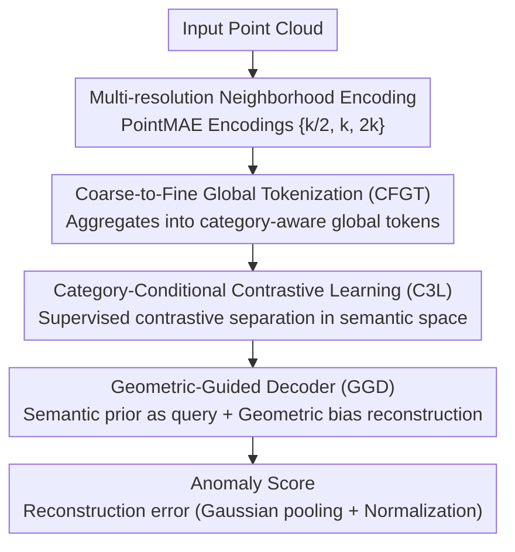

# A Semantically Disentangled Unified Model for Multi-category 3D Anomaly Detection

**Conference**: CVPR 2026  
**arXiv**: [2603.25159](https://arxiv.org/abs/2603.25159)  
**Code**: [Project Page](https://spoiuy3.github.io/SeDiR/)  
**Area**: Object Detection
**Keywords**: 3D Anomaly Detection, Unified Model, Semantic Disentanglement, Inter-category Entanglement, Contrastive Learning

## TL;DR
The SeDiR framework is proposed to achieve semantically disentangled unified 3D anomaly detection through three modules: Coarse-to-Fine Global Tokenization (CFGT), Category-Conditional Contrastive Learning (C3L), and Geometric-Guided Decoder (GGD). It addresses the Inter-Category Entanglement (ICE) problem and outperforms SOTA by 2.8% and 9.1% AUROC on Real3D-AD and Anomaly-ShapeNet, respectively.

## Background & Motivation
**Background**: 3D Anomaly Detection (3D-AD) aims to detect defects in 3D point clouds by training only on normal data. Traditional methods train separate models for each category, which incurs excessive maintenance costs in multi-category industrial scenarios.

**Necessity of Unified Models**: Using a single model to cover multiple categories reduces system redundancy and improves deployment efficiency. While methods like MC3D-AD have explored this, their performance remains limited.

**Core Problem — Inter-Category Entanglement (ICE)**:
   - In unified models, latent features of different categories overlap in space (e.g., severe mixing of chicken/duck/gemstone in t-SNE visualizations).
   - This leads the model to reconstruct using incorrect category priors (e.g., reconstructing parts of a chair using table geometry).
   - This is not a failure of "detecting anomalies," but a failure of "establishing object identity."

**Key Insight**: Reconstruction fails not necessarily because an object is abnormal, but because the model fails to clarify "what is being reconstructed" before the reconstruction process.

**Core Idea**: Understand before reconstructing — redefine unified 3D-AD as a "semantically conditional reconstruction" problem.

## Method

### Overall Architecture
SeDiR addresses the problem where different category features are entangled (ICE) within the same unified model, preventing the model from identifying "what is being reconstructed." The strategy reformulates unified 3D-AD as "semantically conditional reconstruction," where object identity is established before reconstruction. The pipeline operates as follows: input point clouds undergo multi-resolution neighborhood encoding (based on pre-trained PointMAE) to obtain local geometric features; the CFGT module aggregates these local features into a category-aware global token; C3L utilizes contrastive learning to separate and disentangle this global token by category in semantic space; the GGD decoder then reconstructs the point cloud conditioned on the disentangled semantic prior and geometric guidance. Finally, the reconstruction error is used as the anomaly score. The core intuition is that once the identity is clear, normal regions can be reconstructed accurately, while abnormal regions will exhibit large errors due to their deviation from the category prior.

### Key Designs

**1. Coarse-to-Fine Global Tokenization (CFGT): Aggregating local features into instance-level global semantics**

Local geometric features only describe "what this small patch looks like" and cannot answer "which category this entire object belongs to," which is the root of the ICE problem. CFGT performs aggregation across multiple scales: for shared center points, it constructs neighborhoods at symmetric resolutions $\mathcal{R} = \{k/2, k, 2k\}$, encoding them with pre-trained PointMAE to capture both detailed and structural geometry. To fuse the global context into a single token, a learnable adaptive context token $\mathbf{t}_{\text{act}}$ is inserted before the base resolution sequence. After transformer encoding, this token absorbs global information. The final global representation concatenates the global average pooling of the three resolutions and the ACT token: $\mathbf{f}_{\text{global}} = \text{concat}([\mathbf{g}^{(k)}, \mathbf{g}^{(2k)}, \mathbf{g}^{(k/2)}, \mathbf{t}^{\text{enc}}_{\text{act}}])$. Two auxiliary losses constrain this representation: a cross-scale alignment loss $\mathcal{L}_{\text{cos}} = \frac{1}{g}\sum_{m=1}^{g}\sum_{r}[1 - \cos(\tilde{\mathbf{f}}_m^{(k)}, \tilde{\mathbf{f}}_m^{(r)})]$ ensures consistency between features at different resolutions, and an auxiliary classification loss $\mathcal{L}_{\text{cls}} = \text{CrossEntropy}(\hat{\mathbf{y}}, \mathbf{y})$ directly supervises the global token’s ability to recognize categories. Compared to using only local features, this multi-scale global aggregation provides the model with a vector representing instance identity.

**2. Category-Conditional Contrastive Learning (C3L): Explicitly separating categories in semantic space to dismantle ICE**

A global token alone is insufficient if tokens from different categories remain clustered in space (as seen in the severe mixing of chicken/duck/gemstone in t-SNE). C3L maintains a dynamic buffer $\mathcal{B}$ of size 64 and applies supervised contrastive learning to the global token $\mathbf{z}$:

$$\mathcal{L}_{\text{scl}}(i) = \frac{1}{|\mathcal{P}(i)|}\sum_{\mathbf{z}_{\text{pos}} \in \mathcal{P}(i)} -\log \frac{\exp(\mathbf{z}_i^\top \mathbf{z}_{\text{pos}} / \tau)}{\sum_{\mathbf{z}_a \in \mathcal{A}(i)} \exp(\mathbf{z}_i^\top \mathbf{z}_a / \tau)}$$

By treating samples of the same category as positives and different categories as negatives, the model pulls intra-class representations together while pushing inter-class representations apart. The total objective for C3L combines this contrastive loss with the previous CFGT supervision terms: $\mathcal{L}_{\text{C3L}} = \lambda_{\text{scl}}\mathcal{L}_{\text{scl}} + \lambda_{\text{cls}}\mathcal{L}_{\text{cls}} + \lambda_{\text{cos}}\mathcal{L}_{\text{cos}}$. Its value lies in directly enforcing "intra-class compactness and inter-class separation" through a contrastive objective, rather than indirectly relying on classification loss.

**3. Geometric-Guided Decoder (GGD): Aligning reconstruction with both semantic priors and geometric evidence**

Even with a correct semantic prior, reconstruction can fail if the attention mechanism ignores local geometric details, leading to blurred surfaces. GGD treats the disentangled semantic prior $\mathbf{z}$ as the query and the encoded feature sequence as the key/value, while adding a geometric bias to the attention score:

$$\text{Attention}(\mathbf{Q}, \mathbf{K}, \mathbf{V}) = \text{softmax}\left(\frac{\mathbf{Q}\mathbf{K}^\top}{\sqrt{d}} + \beta \mathbf{B}_{\text{geo}}\right)\mathbf{V}$$

Here, $\mathbf{B}_{\text{geo}}$ encodes local normal vectors and curvature changes, with $\beta$ controlling its weight. Consequently, attention is determined by both "what category this is" (semantic prior) and "how the local surface curves" (geometric evidence), ensuring the reconstructed geometry aligns with the actual normal surface and making anomalies clearly distinguishable.

### Loss & Training
The total loss is the sum of semantic disentanglement and reconstruction components:

$$\mathcal{L}_{\text{total}} = \mathcal{L}_{\text{C3L}} + \mathcal{L}_{\text{rec}}$$

The reconstruction loss uses the L2 error of the base resolution features: $\mathcal{L}_{\text{rec}} = \frac{1}{g}\sum_j \|\hat{\mathbf{f}}_j^{(k)} - \mathbf{f}_j^{(k)}\|_2^2$. During inference, the reconstruction error is processed via Gaussian pooling and normalization to obtain the final anomaly score.

## Key Experimental Results

### Main Results (Real3D-AD, Object-level AUROC %)

| Method | Type | Airplane | Car | Duck | Fish | Gemstone | Mean |
|------|------|----------|-----|------|------|----------|------|
| Group3AD | Category-Specific | 74.4 | 72.8 | 67.9 | 97.6 | 53.9 | 75.1 |
| ISMP | Category-Specific | 85.8 | 73.1 | 71.2 | 94.5 | 46.8 | 76.7 |
| MC3D-AD | Unified | 85.0 | 74.9 | 83.1 | 86.5 | 56.0 | 78.2 |
| **Ours (SeDiR)** | **Unified** | **86.0** | **78.3** | **86.2** | **93.8** | **62.7** | **81.0** |

### Ablation Study

| Configuration | Key Metric (AUROC) | Description |
|------|---------|------|
| Baseline (No CFGT/C3L/GGD) | ~78.2 | Comparable to MC3D-AD |
| + CFGT | Gain | Effectiveness of global semantic representation |
| + C3L | Further Gain | t-SNE shows clear category separation |
| + GGD | **81.0** | Geometric guidance ensures reconstruction consistency |
| Correlation (Cls Score vs Rec Error) | Low Cls score → High Rec error | Quantitative validation of the ICE problem |

### Key Findings
- The unified model surpasses all category-specific models: 81.0 vs 76.7 (Prev. SOTA category-specific).
- Improvement is most significant for similar categories (chicken, duck, gemstone) — exactly where ICE is most severe.
- t-SNE Visualization: Severe mixing of chicken/duck/gemstone in MC3D-AD → Clear separation in SeDiR.
- Strong correlation between classification scores and reconstruction errors validates the necessity of "understanding before reconstructing."

## Highlights & Insights
- **The discovery and characterization of the ICE problem** is a significant contribution: redefining the bottleneck of unified 3D-AD from "how to reconstruct anomalies" to "how to establish identity."
- The **"Understand before reconstructing" paradigm** is intuitive and effective, aligning with human inspection logic.
- The combination of **multi-resolution processing, global tokens, and contrastive learning** covers the entire pipeline from feature extraction to spatial separation and conditional reconstruction.
- The unified model outperforming category-specific models suggests that multi-category learning itself is beneficial (shared generalized knowledge).

## Limitations & Future Work
- Requires category labels for contrastive learning, limiting adaptability in unlabeled scenarios.
- When the number of categories is very large, the dynamic buffer in C3L may not sufficiently cover all negative samples.
- Currently processes only point clouds; RGB-D or multi-modal fusion may provide further improvements.
- Lack of generalization analysis for extremely rare or entirely new categories.

## Related Work & Insights
- Introduces contrastive learning strategies from 2D anomaly detection (e.g., SupCon) into the 3D domain.
- Observations regarding the ICE problem can be generalized to other multi-category unified models (e.g., unified object detection or segmentation).
- The "understand before reconstruct" paradigm may be applicable to other reconstruction-based methods.

## Rating
- Novelty: ⭐⭐⭐⭐ Valuable discovery of the ICE problem and novel module combination.
- Experimental Thoroughness: ⭐⭐⭐⭐ Detailed comparisons across 12 Real3D-AD classes plus ablations and visualizations.
- Writing Quality: ⭐⭐⭐⭐⭐ Extremely clear motivation and high-quality figures.
- Value: ⭐⭐⭐⭐ Directly relevant to industrial 3D quality inspection.

<!-- RELATED:START -->

## Related Papers

- [\[AAAI 2026\] SM3Det: A Unified Model for Multi-Modal Remote Sensing Object Detection](../../AAAI2026/object_detection/sm3det_a_unified_model_for_multi-modal_remote_sensing_object_detection.md)
- [\[CVPR 2026\] Geometry-Aligned and Anomaly-Aware Reconstruction for 3D Anomaly Detection](geometry-aligned_and_anomaly-aware_reconstruction_for_3d_anomaly_detection.md)
- [\[CVPR 2026\] UniMMAD: Unified Multi-Modal and Multi-Class Anomaly Detection via MoE-Driven Feature Decompression](unimmad_unified_multi-modal_and_multi-class_anomaly_detection_via_moe-driven_fea.md)
- [\[CVPR 2026\] Towards an Incremental Unified Multimodal Anomaly Detection: Augmenting Multimodal Denoising From an Information Bottleneck Perspective](towards_an_incremental_unified_multimodal_anomaly_detection_augmenting_multimoda.md)
- [\[CVPR 2026\] NoOVD: Novel Category Discovery and Embedding for Open-Vocabulary Object Detection](noovd_novel_category_discovery_and_embedding_for_open-vocabulary_object_detectio.md)

<!-- RELATED:END -->
