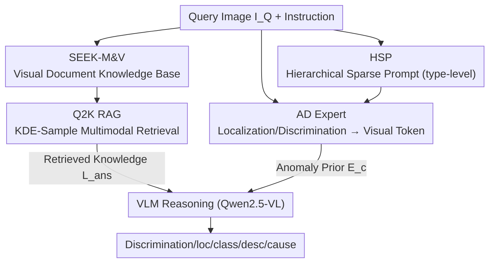

# ADSeeker: A Knowledge-Grounded Reasoning Framework for Industry Anomaly Detection and Reasoning

**Conference**: CVPR 2026  
**Paper**: [CVF Open Access](https://openaccess.thecvf.com/content/CVPR2026/html/Zhang_ADSeeker_A_Knowledge-Grounded_Reasoning_Framework_for_Industry_Anomaly_Detection_and_CVPR_2026_paper.html)  
**Code**: To be confirmed  
**Area**: Multimodal VLM / Industrial Anomaly Detection  
**Keywords**: Industrial Anomaly Detection, Multimodal RAG, Zero-shot Anomaly Detection, Anomaly Reasoning, Visual Document Knowledge Base

## TL;DR
ADSeeker is a large-scale pre-training-free, plug-and-play industrial anomaly detection (IAD) assistant. It injects domain-specific knowledge into a general MLLM using the first visual document knowledge base SEEK-M&V and a multimodal retrieval framework Q2K RAG. Combined with an AD Expert that fuses defect localization/discrimination information into visual tokens and a Hierarchical Sparse Prompt (HSP) to extract type-level defect features, it achieves SOTA in zero-shot anomaly detection and MMAD anomaly reasoning across 12 industrial and medical datasets.

## Background & Motivation
**Background**: Applying Multimodal Large Language Models (MLLM) to industrial anomaly detection has become a prominent research direction in recent years. Existing works like AnomalyGPT, Anomaly-OV, and Myriad follow the path of "direct fine-tuning on IAD data / attaching expert perception modules" to inject domain knowledge into base models for defect detection, description, and analysis.

**Limitations of Prior Work**: The authors identify two specific bottlenecks: ① **Insufficient integration of anomaly detection knowledge during the pre-training phase**, leading to inaccurate localization and coarse defect analysis; ② **Lack of technically precise and context-aware language generation capabilities**, resulting in anomaly reasoning quality (explaining types, locations, causes, and consequences) far below that of human inspection experts. Furthermore, the fine-tuning approach introduces new problems—standard fine-tuning often causes **catastrophic forgetting** of the base model's alignment capabilities, and due to the small size of IAD datasets, models tend to overfit narrow answer templates, leading to poor generalization.

**Key Challenge**: There is a trade-off between making the model "specialized" (understanding the anomaly domain via training) and maintaining its "generality" (generalization and linguistic capabilities). Additionally, existing ZSAD methods typically use **object-level prompts** (e.g., "wood", "leather"), which fail to describe cross-object universal defect patterns like "scratches", "holes", or "cracks".

**Goal**: To equip a general MLLM with external anomaly domain knowledge to achieve expert-level detection and reasoning **without large-scale pre-training**, while preserving the base model's generalization capabilities.

**Key Insight**: The authors observe that "a picture is worth a thousand words"—image features are crucial in anomaly detection, yet existing RAG knowledge bases are almost entirely text-based. Therefore, they utilize a **visual document knowledge base and multimodal retrieval** to inject knowledge externally (instead of internal fine-tuning) and upgrade prompts from object-level to **type-level (defect type level)**.

**Core Idea**: Replace "knowledge injection via fine-tuning on small data" with a triple combination of "External Multimodal Knowledge Retrieval (Q2K RAG over SEEK-M&V) + Visual Defect Prior Fusion (AD Expert) + Hierarchical Sparse Prompting (HSP)" to achieve training-free, plug-and-play knowledge-grounded anomaly reasoning.

## Method

### Overall Architecture
ADSeeker uses an open MLLM (Qwen2.5-VL) as the backbone and CLIP (ViT-L/14@336px) as the encoder for the AD Expert. The entire framework freezes the base model and only trains a small number of external modules. Given a query image $I_Q$ and an instruction, the framework executes **two parallel knowledge injection paths**:

1. **Knowledge Retrieval Path**: The query image is encoded into **Key features** $K_Q$, and the visual documents in the SEEK-M&V knowledge base are encoded into **Lock features** $L=\{L_0,...,L_{n-1}\}$. A multimodal hybrid retrieval (Q2K RAG) is performed in the joint feature space, using a KDE-Sample strategy to select the most relevant domain knowledge document $L_{ans}$.
2. **Defect Prior Path**: The AD Expert uses CLIP to align visual embeddings $E_p$ with positive/negative text embeddings $E_t$ to calculate defect localization and discrimination information, fused into anomaly prior features $E_c=\{Loc, Vis\}$. Simultaneously, the HSP mechanism progressively sparsifies irrelevant information layer-by-layer in CLIP to retain key visual features of defect areas, injecting **type-level text prompts** $T_p, T_n$ (e.g., "A image with [cls] defect type") obtained from clustering the MulA dataset.

Finally, $L_{ans}$ (external knowledge) and $E_c$ (anomaly prior) are fed into the VLM for instruction processing and complex reasoning, outputting anomaly discrimination, localization, classification, description, and root cause analysis. The type-level prompts are generated by matching $K_Q$ to pre-defined cluster centroids in MulA, providing finer granularity than the "Img of a [obj]" prompts used in typical ZSAD.

### Key Designs

**1. SEEK-M&V: The First Visual Document Knowledge Base for Industrial Anomalies**

This addresses the "lack of AD knowledge in pre-training" and "text-only RAG" issues. The authors constructed SEEK-M&V (based on MVTec & VisA), the **first multimodal knowledge base that preserves image information** in the IAD field. Each document contains specific reference pages recording defect types, analyses, and descriptions, along with background information on production and application scenarios. Crucially, the authors used **DeepSeek-R1 to generate semantically rich descriptions and scenario introductions** to expand the documentation. This provides a retrievable expert reference for every anomaly type. Compared to training-based methods, this external knowledge base approach is superior in efficiency and effectiveness as it avoids catastrophic forgetting.

**2. Q2K RAG: Solving Redundancy in Industrial Knowledge Retrieval via KDE-Sample**

The challenge is accurately retrieving the correct document from a visual knowledge base. Q2K RAG (Query Image→Knowledge) maps the query's Key feature $K_Q$ and document Lock features $L$ to an aligned space to calculate cosine similarity: $S(K_Q,L)=\{S_i\,|\,\cos(K_Q,L_i),\,L_i\in L\}$. Standard top-K retrieval often fails because **different defects of the same object type are highly similar** in industrial bases, leading to redundant results. The authors' insight is that similarities for the same category follow a Gaussian distribution. They use **Bayesian Gaussian Mixture Modeling** to infer the optimal number of clusters $K$ and cluster the similarity scores. Kernel Density Estimation (KDE) then calculates probability density weights to compress the distribution:

$$W_n = \frac{1}{K}\sum_{m\in i_n}\exp\big(W^*(m)-\max_n W^*(n)\big)$$

Retrieval is performed by **dynamically sampling from each cluster** proportional to $W_n$. This ensures coverage of unevenly distributed domain knowledge while avoiding the redundancy of naive top-K retrieval.

**3. AD Expert: Fusing Localization and Discrimination into Visual Tokens**

Original MLLMs process general visual tokens lacking anomaly-specific priors. AD Expert derives anomaly localization information by calculating the cosine similarity between patch embeddings $E_p$ and positive/negative text embeddings $E_t^p, E_t^n$:

$$Loc = \text{Unsample}\Big(\frac{\cos(E_p, E_t^n)}{\cos(E_p, E_t^p)+\cos(E_p, E_t^n)}\Big)$$

A neural network transforms $I_Q$ into visual embeddings $Vis$, which are concatenated with localization info into anomaly prior embeddings $E_c=\{Loc, Vis\}$. This explicit encoding of "where to look" and "anomaly status" helps the VLM generate fine-grained descriptions and improves image-level detection.

**4. HSP (Hierarchical Sparse Prompt): Extracting Defect Features via Sparse Optimization**

Inspired by how human inspectors focus on defect areas rather than the whole image, HSP uses a learnable prompt module with compressed sensing. Given query embeddings $E_q\in\mathbb{R}^{B\times d}$ and learnable prompt embeddings $E_l\in\mathbb{R}^{K\times d}$, it extracts features through $N$ iterations: residual $R_n=E_q-P_n E_l^{n-1}$, gradient $G_n=-\mu\cdot E_q^T P_n E_l$. Using Iterative Soft-Thresholding Algorithm (ISTA), it optimizes for:

$$\mathcal{L}=\min_{P}\frac{1}{2}\|E_q-P_n^* E_l\|_2^2 + \lambda\|P_n^*\|_1$$

The sparsity coefficient $\lambda$ controls the proportion of discarded base features. These final embeddings $E_f$ are fused at a specific depth and concatenated with type-level prompts (e.g., distinguishing "scratch" vs "hole"), significantly reducing hallucinations caused by "suspected anomaly regions."

### Loss & Training
The base MLLM and CLIP are frozen; only external modules like AD Expert and HSP are trained. HSP's learnable embeddings are updated via backpropagation using the $\mathcal{L}$ defined above (reconstruction + L1 sparsity). CLIP is fine-tuned on MVTec AD to evaluate zero-shot performance on other datasets (and vice versa for MVTec AD evaluation to prevent leakage). A small 43K instruction-tuning dataset was curated, though ablation shows external retrieval outperforms LoRA fine-tuning.

## Key Experimental Results

### Main Results
**Zero-Shot Anomaly Detection (Image-Level AUROC)**: ADSeeker achieves SOTA on most benchmarks, ranking first on average across 12 datasets.

| Dataset | CLIP | WinCLIP | AnomalyCLIP | AdaCLIP | Anomaly-OV | **ADSeeker** |
|--------|------|---------|-------------|---------|------------|--------------|
| MVTec AD | 74.1 | 91.8 | 91.5 | 89.2 | 94.0 | **94.3** |
| VisA | 66.4 | 78.8 | 82.1 | 85.8 | 91.1 | **91.5** |
| BTAD | 34.5 | 68.2 | 88.3 | 88.6 | 89.0 | **94.0** |
| MPDD | 54.3 | 63.6 | 77.0 | 76.0 | 81.7 | **85.9** |
| BrainMRI | 73.9 | 92.6 | 90.3 | 94.8 | 93.9 | **97.5** |
| Br35H | 78.4 | 80.5 | 94.6 | 97.7 | 95.5 | **97.9** |
| **Average** | 62.6 | 80.8 | 88.2 | 89.1 | 91.8 | **94.0** |

**Anomaly Reasoning (MMAD benchmark, 1-shot, Seek-Setting)**: Using ADSeeker modules as plugins for various MLLMs consistently improves accuracy.

| Base Model | Setting | Avg Accuracy |
|----------|------|-----------|
| LLaVA-OV-7B | Baseline → Seek | 63.19 → 66.61 (+3.42) |
| LLaVA-NeXT-7B | Baseline → Seek | 59.32 → 65.96 (+6.64) |
| InternVL2-8B | Baseline → Seek | 63.14 → 68.05 (+4.91) |
| Qwen2.5-VL-3B | Baseline → Seek | 62.94 → 68.53 (+5.59) |
| Qwen2.5-VL-7B (ADSeeker) | Baseline → Seek | 66.62 → **69.90** (+3.28) |

### Ablation Study
| Configuration | Accuracy (Task 1, Task 2) | Note |
|------|---------------------------|------|
| Baseline (Qwen2.5-VL) | (76.6, 67.1) | Base only |
| + Q2K RAG | (78.6, 68.2) | External knowledge effective |
| + AD Expert | (77.9, 67.7) | Anomaly prior effective |
| **+ Both** | **(82.8, 71.4)** | Full ADSeeker, optimal |
| LoRA 5 epoch | (80.0, 71.0) | Short training acceptable |
| LoRA 10 epoch | (72.8, 59.7) | Overfitting starts |
| LoRA 20 epoch | (40.9, 33.2) | Catastrophic forgetting |

**Efficiency**: ADSeeker adds $\le 27\%$ VRAM (22.63→28.36 GiB) and $\le 2s$ inference latency (4.47→6.14 s).

### Key Findings
- **Q2K RAG and AD Expert are complementary**: Their combination yields a significant jump, as RAG handles classification/justification while AD Expert handles localization.
- **External Retrieval outperforms Fine-tuning**: LoRA's collapse at 10/20 epochs confirms that fine-tuning on small IAD data leads to catastrophic forgetting. 
- **Type-level features are key for ZSAD**: Anomalous samples align much better with [cls] prompts (scratch/hole) than simple [obj] prompts (wood/leather).
- **Plug-and-play universality**: The Seek-Setting improves 5 different base models, showing decoupling from the specific VLM.

## Highlights & Insights
- **"External Knowledge Retrieval" replaces "Knowledge Injection via Tuning"**: This is the core paradigm shift—using multimodal RAG to dynamically inject domain knowledge at inference, avoiding the trade-offs of fine-tuning.
- **KDE-Sample addresses high intra-class similarity**: Converting the Gaussian distribution observation into a GMM clustering + KDE weighting strategy is a universal trick for similar retrieval tasks.
- **Explicit Defect Knowledge**: Turning "anomaly patterns" into explicit, retrievable knowledge via DeepSeek-R1 expanded docs and MulA-clustered prompts.
- **MulA Dataset**: A massive dataset (11,226 images, 72 defect types) with type-level annotations, providing a much-needed resource for fine-grained IAD.

## Limitations & Future Work
- **Knowledge base coverage dependence**: Performance drops for new products/defects not in SEEK-M&V. The 83% seek accuracy implies some queries miss relevant docs.
- **Retrieval ceiling**: Overall performance is bounded by retrieval accuracy.
- **Lack of RL fine-tuning**: The authors suggest incorporating RL strategies (like GRPO used in Anomaly-R1) to further improve reasoning.

## Related Work & Insights
- **vs. AnomalyGPT / Myriad**: These require fine-tuning and suffer from limited knowledge scope and forgetting. ADSeeker uses external RAG to stay training-free and general.
- **vs. WinCLIP / AnomalyCLIP**: These use object-level prompts. ADSeeker moves to type-level prompts (HSP), significantly improving ZSAD performance.
- **vs. Anomaly-R1**: While Anomaly-R1 uses RL training, ADSeeker achieves competitive reasoning results without it, suggesting a potential for future fusion of retrieval and RL.

## Rating
- Novelty: ⭐⭐⭐⭐⭐ (First visual doc base + KDE-Sample RAG + type-level HSP)
- Experimental Thoroughness: ⭐⭐⭐⭐ (Extensive benchmarks, but reasoning evaluation is mostly multiple-choice)
- Writing Quality: ⭐⭐⭐⭐ (Clear logic, though some math symbols are dense)
- Value: ⭐⭐⭐⭐⭐ (Strong practical and transfer value for industrial deployment)

<!-- RELATED:START -->

## Related Papers

- [\[CVPR 2026\] Reasoning-Driven Anomaly Detection and Localization with Image-Level Supervision](reasoning-driven_anomaly_detection_and_localization_with_image-level_supervision.md)
- [\[ICLR 2026\] Traceable Evidence Enhanced Visual Grounded Reasoning: Evaluation and Method](../../ICLR2026/object_detection/traceable_evidence_enhanced_visual_grounded_reasoning_evaluation_and_methodology.md)
- [\[CVPR 2025\] Towards Zero-Shot Anomaly Detection and Reasoning with Multimodal Large Language Models](../../CVPR2025/object_detection/towards_zero-shot_anomaly_detection_and_reasoning_with_multimodal_large_language.md)
- [\[CVPR 2026\] Heuristic-inspired Reasoning Priors Facilitate Data-Efficient Referring Object Detection](heuristic-inspired_reasoning_priors_facilitate_data-efficient_referring_object_d.md)
- [\[CVPR 2026\] HeROD: Heuristic-inspired Reasoning Priors Facilitate Data-Efficient Referring Object Detection](herod_heuristic_inspired_reasoning_data_efficient_rod.md)

<!-- RELATED:END -->
