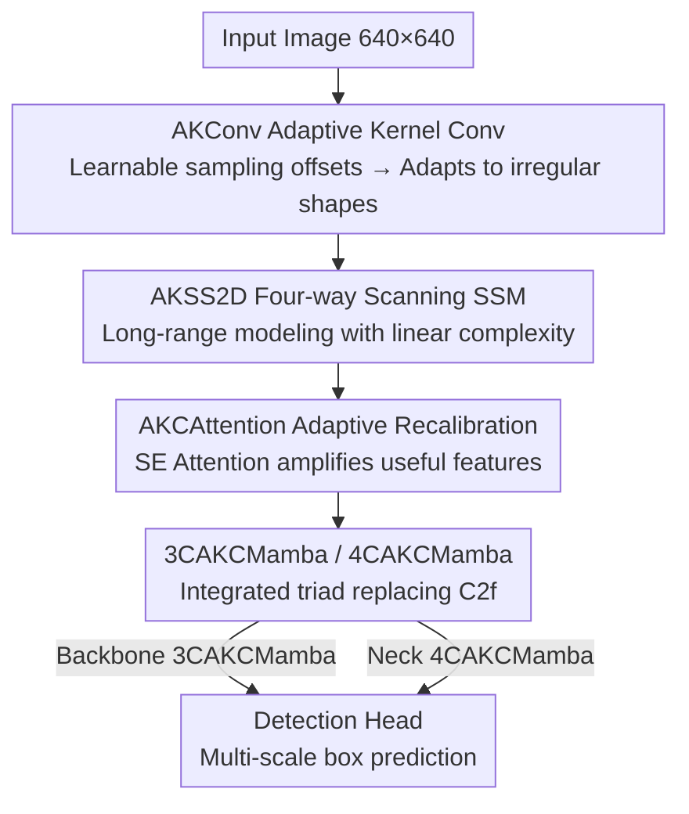

# AKCMamba-YOLO: Selective State Space Models For Real-Time Object Detection

**Conference**: CVPR 2026  
**Paper**: [CVF Open Access](https://openaccess.thecvf.com/content/CVPR2026/html/Chen_AKCMamba-YOLO_Selective_State_Space_Models_For_Real-Time_Object_Detection_CVPR_2026_paper.html)  
**Code**: https://github.com/xlllchen/AKCMamba_YOLO (Available)  
**Area**: Real-Time Object Detection  
**Keywords**: YOLO, State Space Models, Mamba, Adaptive Kernel Convolution, Multi-scale Feature Fusion

## TL;DR
This paper integrates Selective State Space Models (Mamba/SSM) and adaptive kernel convolutions into YOLOv8. By replacing the C2f blocks in the backbone and neck with 3CAKCMamba and 4CAKCMamba modules, it compensates for the "short-range" limitation of standard convolutions while maintaining linear complexity and real-time speed. On COCO2017, the model achieves 46.3% mAP with 14.9G FLOPs (a 1.4% mAP improvement with 47.9% fewer FLOPs compared to YOLOv8-S).

## Background & Motivation

**Background**: The YOLO series has evolved from v4 to v11, pushing the precision-speed trade-off of real-time detection to its limit through pure convolutional designs, becoming the de facto standard for industrial deployment. However, convolutions possess an inherent physical limitation—their receptive fields are local.

**Limitations of Prior Work**: Local receptive fields disadvantage YOLO in complex scenarios requiring global reasoning: multi-scale objects, severe occlusion, and long-range dependencies (e.g., associating spatially separated but semantically related objects). In these cases, pure convolutional networks can only expand the receptive field indirectly by stacking depth, which is inefficient and prone to losing small objects.

**Key Challenge**: The most direct way to achieve global modeling is via Transformer self-attention. However, self-attention exhibits **quadratic complexity** relative to input size, making its computational overhead and latency prohibitive for real-time detection. The challenge lies here: **achieving both the high speed/low complexity of CNNs and the global representation power of Transformers**, which previously appeared mutually exclusive.

**Key Insight**: Selective State Space Models (SSM) like Mamba offer a third path. They utilize input-dependent selection mechanisms combined with a linear-time recursive form to achieve long-sequence modeling with **linear** complexity. Their global modeling capabilities have been proven in language and image classification. The core question is: can selective SSMs be embedded into YOLO to address the lack of global context without sacrificing real-time performance?

**Core Idea**: Two "content-aware" modules, 3CAKCMamba (for the backbone) and 4CAKCMamba (for the neck), are designed to replace the C2f blocks of YOLOv8. Each module integrates **Adaptive Kernel Convolution** (local, dynamic sampling), **AKSS2D** (four-way scanning + selective SSM long-range modeling), and **AKCAttention** (adaptive feature recalibration) into a unified pipeline. This shifts the paradigm from "static local convolution" to "dynamic sequence modeling."

## Method

### Overall Architecture
AKCMamba-YOLO is built upon the YOLOv8 framework, taking 640×640 images as input and outputting multi-scale detection boxes. The modification is "surgical": the overall topology (backbone-neck-head) of YOLOv8 remains unchanged; instead, C2f blocks in the backbone are replaced by **3CAKCMamba** modules, and C2f blocks in the neck are replaced by **4CAKCMamba** modules. Both modules are constructed from the same underlying components: the AKCBlock as the basic unit, 3CAKC/4CAKC for multi-scale local feature extraction, AKSS2D for long-range dependency modeling, and AKCAttention for feature recalibration. Intuitively: 3CAKC/4CAKC handles "detailing and adapting to irregular shapes," AKSS2D focuses on "long-range sensing and global context retrieval," and AKCAttention "amplifies useful features while suppressing redundancy." These three components are stacked sequentially to form a detection block capable of both local and global perception.

### Key Designs

**1. AKConv Adaptive Kernel Convolution: Shape-adaptive Kernels**

Standard convolutions use a fixed grid for sampling, which is inherently unfriendly to targets with diverse shapes (e.g., slender kite strings, irregular nests). Furthermore, enlarging the kernel size incurs a quadratic increase in parameters. AKConv (the core operator of the AKCBlock) adopts a **learnable sampling shape**: it adds learned offsets $\Delta P_n$ to the initial coordinates $P_n$ to obtain adaptive sampling points $\hat P_n = P_n + \Delta P_n$. The convolution at position $p_0$ becomes $\text{AKConv}(p_0)=\sum_{n=1}^{N} w_n \cdot X(p_0+\hat P_n)$. This allows sampling points to fit irregular structures actively, with parameters growing **linearly** rather than quadratically with kernel size. The AKCBlock further incorporates a dynamic shortcut mechanism that adaptively switches between the residual connection $\omega(\omega(\text{AKConv}(z_{l-1})))\oplus z_{l-1}$ and direct output based on conditions ($\omega$ denotes 1×1 convolution for channel alignment), balancing flexibility and stability. 3CAKC and 4CAKC stack these AKCBlocks into three-layer or four-layer multi-scale extraction pipelines.

**2. AKSS2D Four-way Scanning SSM: Global Vision via Linear Complexity**

This is the core component for addressing the long-range sensing gap. SSMs map a 1D sequence $x(t)$ through a hidden state $h(t)$ to an output $y(t)$. The continuous form is $h'(t)=Ah(t)+Bx(t),\ y(t)=Ch(t)$; after discretization (Zero-Order Hold), it is written as $h_k=\bar A h_{k-1}+\bar B x_k,\ y_k=Ch_k$, where $\bar A=\exp(\Delta A)$ and $\bar B=(\Delta A)^{-1}(\exp(\Delta A)-I)\cdot\Delta B$, with $\Delta$ as the time-scale parameter. Mamba’s key is the **Selection Mechanism**—making $B,C,\Delta$ input-dependent to achieve context-aware filtering. The output can also be expressed as a global convolution $y=x*K$, where $K=(C\bar B, C\bar A\bar B,\dots,C\bar A^{N-1}\bar B)$ is a structured kernel. To adapt the 1D SSM to 2D images, AKSS2D utilizes **S6 blocks (Selective SSM)** with **four-way scanning**: the feature map is flattened into sequences along four diagonal directions, processed via S6 blocks, summed, and reshaped back to the spatial dimension. This ensures complete spatial coverage and avoids directional bias. Before scanning, feature adaptation is performed: $z_l=\text{LN}(\text{AKConv}(z_{l-1}))$.

**3. AKCAttention Adaptive Feature Recalibration: Refining Global Features**

While long-range modeling retrieves global context, it also introduces redundancy. AKCAttention follows the AKConv-extracted features with a squeeze-and-excitation style spatial-channel attention $\text{SeA}$: $z_l=\text{SeA}(\omega(\omega(\text{AKConv}(z_{l-1})))\oplus z_{l-1})$ (also with switchable residuals). It recalibrates channel importance based on inter-channel dependencies, magnifying critical features. In ablation studies on the Railway dataset, it outperformed SE, CBAM, and MHA, while maintaining a higher FPS (29.2) than multi-head attention (26.9).

**4. 3CAKCMamba / 4CAKCMamba Integrated Modules: Direct C2f Replacement**

The previous designs are consolidated into executable units. The 3CAKCMamba processing flow is $z_l=\psi(\text{LN}(\phi(\text{LN}(\text{3CAKC}(\omega(z_{l-1}))))\oplus\omega(z_{l-1})))$, where $\phi$ is AKSS2D and $\psi$ is AKCAttention. The sequence is "Local extraction (3CAKC) → Long-range modeling (AKSS2D) → Adaptive selection (AKCAttention)" wrapped in a residual connection. The 4CAKCMamba follows the same logic but uses the deeper 4CAKC for stronger multi-scale fusion in the neck.

### Loss & Training
The model strictly follows YOLOv8's detection loss: box loss weight 7.5, cls loss 0.5, and DFL loss 1.5. It is trained for 500 epochs with a batch size of 32 using the SGD optimizer. After 3 warm-up epochs, a constant learning rate of 0.01 is used (bias lr 0.1, momentum 0.8, weight decay 0.0005). Data augmentation involves Mosaic (p=1.0) and HSV transformations with 640×640 input resolution.

## Key Experimental Results

### Main Results
Comparison with the YOLO series on COCO2017 val (wins in both accuracy and efficiency):

| Model | mAP | AP50 | AP75 | Params | FLOPs |
|------|-----|------|------|--------|-------|
| YOLOv8-N | 37.3 | 52.6 | 40.6 | 3.2M | 8.7G |
| YOLOv8-S | 44.9 | 61.8 | 48.6 | 11.2M | 28.6G |
| DAMO YOLO-S | 46.0 | 61.9 | 49.5 | 12.3M | 37.8G |
| Mamba YOLO-T | 45.4 | 62.3 | 49.1 | 6.1M | 14.3G |
| **Ours** | **46.3** | **63.1** | **51.4** | 9.1M | 14.9G |

Key comparison: +1.4% mAP higher than YOLOv8-S with 47.9% fewer FLOPs; +0.9% mAP / +0.8% AP50 / +2.3% AP75 higher than Mamba YOLO-T (which also uses SSM), validating the efficacy of the deeper integration of adaptive kernels and multi-scale fusion.

Specific datasets for industrial/safety scenarios (Accuracy % / FLOPs):

| Dataset | Metric | YOLOv8-S | YOLOv11 | Mamba YOLO-T | Ours |
|--------|------|----------|---------|--------------|------|
| Foreign objects on Power Tower | Precision / AP50 / AP50:95 | 90.3 / 83.9 / 70.1 | 92.3 / 86.1 / 71.8 | 92.1 / 86.3 / 71.3 | **92.8 / 86.9 / 72.5** |
| Railway Pedestrians | Precision / AP50 / AP50:95 | 94.6 / 97.2 / 74.2 | 94.8 / 97.1 / 75.1 | 94.8 / 97.1 / 75.1 | **95.1 / 97.4 / 75.5** |

### Ablation Study
Stepwise component stacking on the backbone (Power Tower dataset):

| 3CAKC | AKSS2D | AKCAttention | Precision | AP50 | AP50:95 | FLOPs |
|:---:|:---:|:---:|------|------|---------|-------|
| × | × | × | 89.7 | 83.3 | 67.4 | 8.7G |
| ✓ | × | × | 87.2 | 88.1 | 70.5 | 9.5G |
| ✓ | ✓ | × | 91.4 | 87.5 | 73.0 | 11.1G |
| ✓ | ✓ | ✓ | 92.1 | 87.6 | 75.0 | 11.8G |

Comparison of attention mechanisms (Railway, replacing YOLOv8 baseline):

| Attention | mAP | AP50 | AP75 | FPS |
|--------|-----|------|------|-----|
| Baseline | 93.2 | 95.1 | 73.7 | 28.6 |
| + SE | 93.9 | 95.8 | 74.2 | 27.5 |
| + MHA | 94.1 | 95.7 | 74.1 | 26.9 |
| **+ AKCAttention** | **94.3** | **95.9** | **74.3** | **29.2** |

### Key Findings
- **AKSS2D is the primary performance driver**: In the backbone ablation, adding AKSS2D boosted AP50:95 from 70.5 to 73.0 (+2.5%), verifying the value of selective SSMs.
- **AKCAttention offers the best cost-performance ratio**: FPS increased (29.2 > baseline 28.6) due to the fusion of recalibration and adaptive kernels, avoiding the heavy computation of MHA.
- Grad-CAM visualizations show the model can infer full contours in occluded scenes, focus on small objects, and activate spatially separated entities in long-range scenarios—qualitatively confirming that SSM global modeling is effective.

## Highlights & Insights
- **"Surgical" Integration**: Replacing C2f blocks with context-aware modules maintains the engineering maturity and deployment advantages of YOLOv8.
- **Clear Division of Labor**: Local (AKConv shape-adaptation) → Global (AKSS2D linear long-range) → Selection (AKCAttention recalibration).
- **Four-way Diagonal Scanning** provides a general solution for adapting 1D SSMs to 2D images, applicable to segmentation and dense prediction.

## Limitations & Future Work
- **Small Absolute Gains**: On specialized datasets, the lead over Mamba YOLO-T or YOLOv11 is within 0.3~0.5%.
- **Unexplained Precision Drop**: In the ablation, using 3CAKC alone caused precision to drop (89.7 → 87.2), which was not analyzed in depth.
- **Incomplete FPS Data**: Main tables report Params/FLOPs, but end-to-end FPS is only partially provided in ablation tables. 
- **Parameter Count**: At 9.1M, the model has more parameters than Mamba YOLO-T (6.1M), though FLOPs are similar.

## Related Work & Insights
- **vs Mamba YOLO**: Mamba YOLO integrates SSMs only into the backbone; ours replaces both the backbone and neck and introduces AKConv for adaptive extraction.
- **vs DETR Series**: Unlike DETR models which can be slow to converge and heavy, this work retains YOLO's lightweight nature while gaining global vision via linear SSMs.
- **vs Gold-YOLO**: While Gold-YOLO uses dense attention for context, this work uses linear-complexity SSMs, achieving higher accuracy with comparable or lower FLOPs.

## Rating
- Novelty: ⭐⭐⭐☆☆ Deep integration of SSM and AKConv, but conceptually similar to Mamba YOLO.
- Experimental Thoroughness: ⭐⭐⭐⭐☆ Comprehensive across multiple datasets and components, though main FPS data is missing.
- Writing Quality: ⭐⭐⭐⭐☆ Clear structure, complete formulas, and rich visualizations.
- Value: ⭐⭐⭐⭐☆ Practical for real-time detection deployment with open-source code and new datasets.

<!-- RELATED:START -->

## Related Papers

- [\[CVPR 2026\] YOLO-ULM: Ultra-Lightweight Models for Real-Time Object Detection](yolo-ulm_ultra-lightweight_models_for_real-time_object_detection.md)
- [\[CVPR 2026\] YOLO-Master: MOE-Accelerated with Specialized Transformers for Enhanced Real-time Detection](yolo-master_moe-accelerated_with_specialized_transformers_for_enhanced_real-time.md)
- [\[AAAI 2026\] YOLO-IOD: Towards Real Time Incremental Object Detection](../../AAAI2026/object_detection/yolo-iod_towards_real_time_incremental_object_detection.md)
- [\[CVPR 2026\] DA-Mamba: Learning Domain-Aware State Space Model for Global-Local Alignment in Domain Adaptive Object Detection](da-mamba_learning_domain-aware_state_space_model_for_global-local_alignment_in_d.md)
- [\[CVPR 2026\] Does YOLO Really Need to See Every Training Image in Every Epoch?](does_yolo_really_need_to_see_every_training_image_in_every_epoch.md)

<!-- RELATED:END -->
