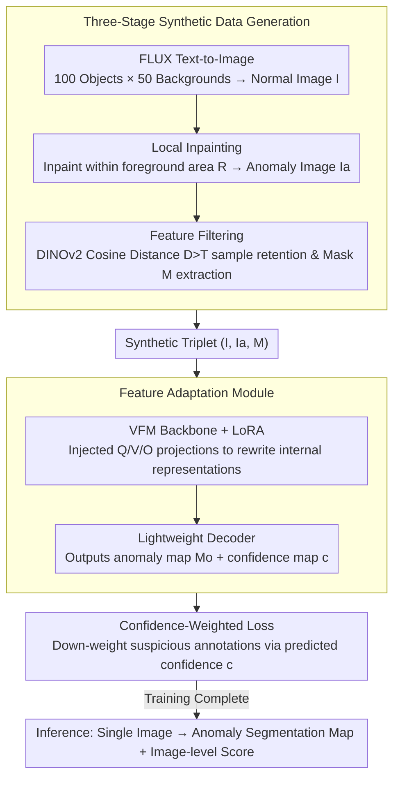

# AnomalyVFM -- Transforming Vision Foundation Models into Zero-Shot Anomaly Detectors

**Conference**: CVPR 2026  
**arXiv**: [2601.20524](https://arxiv.org/abs/2601.20524)  
**Code**: [Project Page](https://AnomalyVFM.github.io/)  
**Area**: Object Detection  
**Keywords**: Zero-shot Anomaly Detection, Vision Foundation Models, Synthetic Data, Parameter-Efficient Fine-Tuning, LoRA

## TL;DR
AnomalyVFM proposes a general framework that transforms any Vision Foundation Model (VFM) into a robust zero-shot anomaly detector through a three-stage synthetic data generation scheme and a parameter-efficient LoRA adaptation mechanism. Using RADIO as the backbone, it achieves 94.1% image-level AUROC on 9 industrial datasets, outperforming the SOTA by 3.3 percentage points.

## Background & Motivation
**Background**: Zero-shot anomaly detection requires detecting anomalies on unseen object categories without any in-domain images. Current SOTA methods (AnomalyCLIP, AdaCLIP, etc.) rely on high-level conceptual knowledge from vision-language models (VLMs) like CLIP.

**Limitations of Prior Work**:
   - Pure Vision Foundation Models (VFMs, such as DINOv2) possess stronger visual representations but lag behind VLM methods in zero-shot anomaly detection—this is counter-intuitive since anomaly detection is essentially a visual task;
   - **Reason 1**: Existing auxiliary anomaly datasets lack diversity. VLMs compensate for data insufficiency with reliable high-level conceptual knowledge, which VFMs cannot rely on;
   - **Reason 2**: Existing VFM adaptation strategies are too shallow (training only the output head) and do not modify the internal visual representations.

**Key Challenge**: VFMs have superior visual representation capabilities but lack diverse training data and effective deep adaptation methods to unlock their potential.

**Key Insight**: Addressing both data and methodological bottlenecks simultaneously—synthetic large-scale diverse data + LoRA deep adaptation.

**Core Idea**: Generative data + parameter-efficient backbone adaptation + confidence-weighted loss = unlocking the zero-shot anomaly detection potential of VFMs.

## Method

### Overall Architecture
AnomalyVFM aims to explain a counter-intuitive phenomenon: why do VFMs (e.g., DINOv2) based on pure visual representations underperform against CLIP based on linguistic concepts, despite anomaly detection being a pure visual task? The authors argue that VFMs do not lack capability but rather **diverse training data** and **adaptation methods that can modify the backbone internal**. Thus, the entire pipeline is built around addressing these two shortcomings. First, a large volume of synthetic images with anomaly annotations is generated using generative models. Then, LoRA is injected into every Transformer block of the VFM for deep adaptation, followed by a lightweight decoder that outputs pixel-level anomaly maps and a confidence map. Finally, a confidence-weighted loss is used to "soften" the noise in synthetic annotations. After training, during inference, an image is directly fed to produce anomaly segmentation maps and image-level scores, requiring no real anomaly samples or in-domain data of target categories.

### Key Designs

**1. Three-stage synthetic data generation: Creating a diverse anomaly training set from scratch without a single real sample**

The first reason VFMs lag is that existing auxiliary datasets (MVTec, VisA) have very narrow object categories and anomaly types. While CLIP can compensate for this scarcity with high-level conceptual knowledge, VFMs lack this support and must rely on the data itself. The authors synthesize the data in three steps. Step one: generating defect-free images. FLUX is used to generate clean object images $I = G(p)$ following text prompts, which are expanded by an LLM into 100 object types × 50 backgrounds to ensure coverage. Step two: "drawing" anomalies. Foreground masks are extracted, an anomaly region $R$ is randomly sampled within the foreground, and local inpainting is performed using anomaly prompts (e.g., cracked, damaged) customized by the LLM for each object to ensure semantic relevance. Step three: quality control. Features of normal and anomalous images are extracted using DINOv2 to calculate cosine distance $D$. If the distance is too small ($D < T$), it indicates the inpainting failed to create a distinct anomaly, and the sample is discarded. Simultaneously, thresholding this difference map yields an anomaly mask $M$ as a supervisory label. This zero-real-sample pipeline allows for infinite expansion of object and defect types while filtering out failed generation noise.

**2. Feature Adaptation Module (FAM): Rewriting VFM internal representations with LoRA, rather than just adding an output head**

The second reason VFMs lag is that previous adaptations were too "shallow"—training only an output head while leaving the backbone's universal visual representation untouched, making it difficult to learn the distinction between normal and anomalous patterns. The authors' approach is to go deep into the backbone: injecting LoRA (rank=64) into the Attention Query, Value, and Output projection layers of every Transformer block. This allows internal representations to be fine-tuned for the anomaly detection task at the cost of less than 1% trainable parameters, which is more efficient than full fine-tuning and deeper than just tuning the output head. Above the backbone, a lightweight decoder consists of two upsampling blocks (Conv + GroupNorm + ReLU + Bilinear Upsampling) and a final convolutional layer, outputting a pixel-level anomaly segmentation map $M_o$ and a confidence map $c$ of the same resolution. The image-level anomaly score is obtained separately via a linear layer from the [CLS] token. Crucially, LoRA makes "modifying internal representations" lightweight and applicable to any Transformer backbone, which is the prerequisite for its generalizability across DINOv2, DINOv3, and RADIO.

**3. Confidence-weighted loss: Letting the model identify untrustworthy synthetic annotations and down-weight them**

While synthetic data is abundant, anomaly masks obtained via thresholding in the third step are inevitably noisy—blurry boundaries or mis-segmented regions are common. Hard supervision using such masks would lead to noise fitting. The authors have the decoder predict an additional confidence map $c$ alongside the anomaly map, incorporating it into the segmentation loss:

$$\mathcal{L}_{seg} = \mathcal{L}_{base}(M_o, M_{GT}) \cdot C - \alpha \log(C), \quad C = 1 + \exp(c)$$

where the base loss is $\mathcal{L}_{base} = \ell_1 + 5 \cdot \ell_{focal}$. The ingenuity of this formula lies in the tension between the two terms: the first term $\mathcal{L}_{base} \cdot C$ encourages the model to fit strictly where it deems the annotation reliable (large $C$), while the second term $-\alpha \log(C)$ acts as a regularization penalty to prevent the model from lazily reporting low confidence everywhere to avoid supervision. Consequently, the model actively reduces $C$ in regions with suspicious annotations, cutting the loss weight for those areas to avoid being misled by noisy labels without collapsing the confidence to zero.

### Loss & Training
- Total loss $\mathcal{L} = \mathcal{L}_{seg} + \mathcal{L}_{img}$, where the image-level branch $\mathcal{L}_{img}$ uses Focal Loss.
- Backbone-agnostic: The aforementioned LoRA adaptation + Decoder + Loss can be applied to any VFM with a Transformer backbone.

## Key Experimental Results

### Main Results (Zero-shot on 9 industrial datasets, Image-level AUROC)

| Method | MVTec AD | VisA | BTAD | RealIAD | DTD | Average |
|------|---------|------|------|---------|-----|------|
| WinCLIP | 91.8 | 78.1 | 68.2 | 74.7 | 95.1 | 83.2 |
| AnomalyCLIP | 91.6 | 82.0 | 88.2 | 78.7 | 93.9 | 87.6 |
| Bayes-PFL | 92.3 | 87.0 | 93.2 | 85.2 | 95.1 | 90.8 |
| **Ours** | **94.9** | **93.6** | **96.0** | **88.0** | **99.4** | **94.1** |

### Ablation Study (VFM Generalization Validation)

| Backbone | Synthetic Data | LoRA Adaptation | Image AUROC | Pixel AUROC | Gain |
|------|---------|----------|-----------|-----------|------|
| DINOv2 | ✗ | ✗ | 83.0 | 80.4 | Baseline |
| DINOv2 | ✓ | ✓ | 90.2 (+7.2) | 93.4 (+13.0) | Significant Gain |
| RADIO | ✗ | ✗ | 89.1 | 84.9 | Baseline |
| RADIO | ✓ | ✓ | **94.1 (+5.0)** | **96.9 (+12.0)** | Best Overall |

### Key Findings
- Synthetic data and LoRA adaptation both contribute significantly, with their combination yielding the best performance.
- Effectiveness demonstrated across three VFMs (DINOv2, DINOv3, RADIO), proving framework generalizability.
- Pixel-level AUROC improvements are particularly notable: RADIO increases from 84.9 to 96.9 (+12.0).
- Outstanding performance on medical anomaly detection datasets (without additional fine-tuning).

## Highlights & Insights
- **Insightful Core Findings**: The lagging performance of VFMs in zero-shot anomaly detection is not a capability issue but a result of data and adaptation methodology.
- Highly scalable synthetic data pipeline that does not rely on real anomaly samples.
- Confidence-weighted loss elegantly handles noisy synthetic annotations.
- Strong generalizability: Effective across different VFM backbones.

## Limitations & Future Work
- Data generation depends on the quality and prompt coverage of the FLUX model.
- LoRA rank=64 is relatively high; whether smaller ranks are feasible has not been fully explored.
- Pixel-level performance in certain specific domains (e.g., KSDD steel surfaces) remains insufficient.

## Related Work & Insights
- Similar to DRÆM's synthetic anomaly concept but without needing real normal samples.
- Confidence-weighted loss resembles uncertainty modeling methods in NeRF.

## Rating
- Novelty: ⭐⭐⭐⭐ Addressed the key question of "why VFMs are inferior to VLMs."
- Experimental Thoroughness: ⭐⭐⭐⭐⭐ 9 industrial + medical datasets, 3 VFM backbones.
- Writing Quality: ⭐⭐⭐⭐ Proper problem analysis and clear methodological motivation.
- Value: ⭐⭐⭐⭐⭐ Opens new pathways for VFM applications in anomaly detection.

<!-- RELATED:START -->

## Related Papers

- [\[CVPR 2026\] VisualAD: Language-Free Zero-Shot Anomaly Detection via Vision Transformer](visualad_language-free_zero-shot_anomaly_detection_via_vision_transformer.md)
- [\[CVPR 2026\] MoECLIP: Patch-Specialized Experts for Zero-shot Anomaly Detection](moeclip_patch-specialized_experts_for_zero-shot_anomaly_detection.md)
- [\[ICLR 2026\] FSOD-VFM: Few-Shot Object Detection with Vision Foundation Models and Graph Diffusion](../../ICLR2026/object_detection/fsod-vfm_few-shot_object_detection_with_vision_foundation_models_and_graph_diffu.md)
- [\[CVPR 2026\] Back to Point: Exploring Point-Language Models for Zero-Shot 3D Anomaly Detection](back_to_point_exploring_point-language_models_for_zero-shot_3d_anomaly_detection.md)
- [\[CVPR 2026\] FB-CLIP: Fine-Grained Zero-Shot Anomaly Detection with Foreground-Background Disentanglement](fb-clip_fine-grained_zero-shot_anomaly_detection_with_foreground-background_dise.md)

<!-- RELATED:END -->
