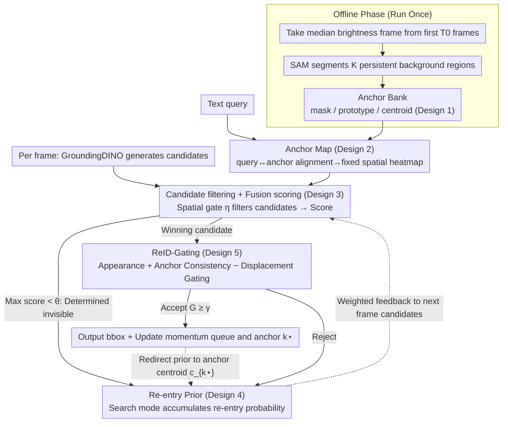

# AR²-4FV: Anchored Referring and Re-identification for Long-Term Grounding in Fixed-View Videos

**Conference**: CVPR 2026  
**arXiv**: [2603.07758](https://arxiv.org/abs/2603.07758)  
**Code**: To be confirmed  
**Area**: Object Detection / Video Understanding / Language-guided Target Localization  
**Keywords**: Long-term referring, fixed-view video, background anchors, re-entry detection, identity re-identification

## TL;DR

Ours leverages the time-invariance of background structures in fixed-view videos to construct an offline Anchor Bank and an online Anchor Map as persistent language-scene memory. Combined with anchor-guided re-entry priors and a ReID-Gating identity verification mechanism, it achieves robust target re-capture after occlusion or departure, improving RCR by 10.3% and reducing RCL by 24.2%.

## Background & Motivation

**Background**: Language-guided video object grounding (referring) has become a core technology for scenarios such as surveillance and behavioral analysis. Existing methods (MTTR, ReferFormer, OnlineRefer, etc.) primarily focus on short-term scenarios, assuming targets remain visible in most frames and maintaining identity consistency through frame-to-frame appearance propagation.

**Limitations of Prior Work**: In long-duration fixed-view videos (e.g., surveillance cameras, average duration $>120s$), targets are frequently occluded or leave and re-enter the field of view. Existing methods face three major issues:
   - **Loss of Semantic Memory**: When a target becomes invisible, the semantic memory of framewise pipelines is interrupted, preventing re-association upon re-entry.
   - **Appearance Drift**: Over long time spans, lighting changes and pose variations make appearance features unreliable, causing pure appearance-based ReID matching to drift.
   - **Semantic Distractors**: Distractors with similar appearances (e.g., pedestrians in similar clothing) are often misidentified during the target's absence.

**Key Challenge**: Semantic alignment in existing methods depends entirely on the target's own appearance features. Once the target is invisible, the "text-target" semantic chain breaks. However, the background structure of fixed-view videos remains stable—information that is currently completely ignored.

**Key Insight**: Fixed camera $\rightarrow$ constant background layout $\rightarrow$ a set of spatial anchors can be distilled from the background $\rightarrow$ align the text query with these anchors $\rightarrow$ even if the target disappears, the "text-scene" spatial memory remains valid $\rightarrow$ utilizes spatial priors for rapid re-capture upon target re-entry.

**Core Idea**: **Compensating for the time-variance of target appearance with the time-invariance of background structures**—upgrading referring from "finding the target" to "localizing the spatial region corresponding to the query within the scene coordinate system."

## Method

### Overall Architecture

This paper addresses long-term referring in fixed-view videos where targets may be occluded or leave and return while the text query remains valid. The input consists of a frame sequence $\{I_t\}_{t=1}^{T}$ and a natural language query $q$, with the output being a bounding box $\{y_t\}$ for each frame. The critical shift in this system is **not anchoring memory to the target's appearance, but to the static background**, splitting the process into offline and online phases. The offline phase runs once to distill stable background regions into an Anchor Bank from the initial video frames. The online phase aligns the query with these anchors to generate a fixed spatial Anchor Map, which is used to filter and score detection candidates. When a target disappears, the system switches to search mode and maintains a Re-entry Prior ("where the target will return from"). Upon reappearance, ReID-Gating verifies identity and redirects the prior back to the confirmed anchor, forming a "disappearance $\rightarrow$ search $\rightarrow$ re-capture" loop. Notably, the system does not assume the target is visible in the first frame—it starts searching for the target described by the query within the scene coordinate system from the beginning.

### Key Designs

**1. Anchor Bank: Distilling static background into a "Scene Coordinate System"**

Framewise methods lose memory once a target disappears because their memory is anchored to the target. Ours does the opposite: since the background layout under a fixed camera is permanent, it is extracted from the first $T_0$ frames (default $T_0 \in [30, 120]$) to serve as anchors. Specifically, a median brightness frame $t^\star$ is selected to avoid over/under-exposure, and SAM is used to segment masks $M_k$ for $K$ persistent regions (default $K=64$). Then, mask-aware average pooling is performed on the visual encoder feature map $F_{t^\star}$ for each mask to obtain normalized region prototype vectors:

$$p_k = \text{Norm}\left(\frac{1}{|M_k|}\sum_x M_k(x) F_{t^\star}(x)\right),\qquad c_k = \frac{1}{|M_k|}\sum_x M_k(x)\cdot x$$

Each anchor $(M_k, p_k, c_k)$ carries both a semantic prototype and a spatial centroid. This step runs only once and is reused indefinitely. The key is not just saving computation, but providing a **fixed scene coordinate system** where identity, position, and re-entry are all measured, naturally making the system immune to target movement.

**2. Anchor Map: Translating queries into spatial memory that persists after target disappearance**

Next, the text query must be mapped to specific regions of the scene. Lightweight alignment heads $\phi_l, \phi_v$ project text embeddings $e_q$ and anchor prototypes $p_k$ into the same subspace to calculate cosine similarity, which is converted into weights for each anchor using softmax (temperature $\tau=10$). Finally, anchor masks are superimposed by weight to form a heatmap:

$$s_k = \cos(\phi_l(e_q), \phi_v(p_k)),\quad \omega_k = \frac{\exp(\tau s_k)}{\sum_j \exp(\tau s_j)},\quad A(x) = \sum_{k=1}^{K}\omega_k M_k(x)\in[0,1]$$

This Anchor Map is the core innovation: for a given query, $\{M_k\}$ and $\{\omega_k\}$ remain constant throughout inference, making it **persistent**. Even if the target disappears for hundreds of frames, the system "remembers" which part of the image the query refers to—replacing short-lived "target appearance memory" with durable "scene spatial memory."

**3. Anchor-guided Candidate Filtering and Fusion Scoring: Spatial evidence for detector oversight**

The open-vocabulary detector GroundingDINO outputs a set of candidates $\mathcal{R}_t$ per frame, but many fall in regions where the query target should not exist. The Anchor Map acts as a spatial gate: only candidates with a response exceeding threshold $\eta$ are retained: $\tilde{\mathcal{R}}_t = \{r\mid \bar{A}_{bb}(r)\geq\eta\}$. The remaining candidates undergo mask-aware pooling $g_v(r)$, and text-visual similarity is weighted with anchor evidence ($\lambda=0.6$) for the final score:

$$\text{Score}(r) = \lambda\cos(g_v(r), g_l(q)) + (1-\lambda)\bar{A}_m(r)$$

This score also acts as a switch: if the highest score in a frame is below threshold $\theta=0.4$, the target is deemed invisible, and the system enters search mode; otherwise, the winning candidate is passed to ReID-Gating for final identity verification.

**4. Anchor-based Re-entry Prior: Maintaining "where it will return" during target absence**

Target re-entry is not random—in fixed-view scenarios, pedestrians often return via fixed entrances like doors or paths. The re-entry prior $P_t^{re}$ is a distribution explicitly modeling this spatial habit. It is initialized by Anchor Map $A$ and updated per frame using EMA with Gaussian smoothing and $\ell_1$ normalization:

$$\tilde{P}_t^{re} = \beta\,(G_\sigma * \tilde{P}_{t-1}^{re}) + (1-\beta)\,A$$

Candidates receive a multiplicative weight $W(r)\propto A(x)\cdot P_t^{re}(x)$, biasing scores toward high-probability re-entry zones. Once a target is confirmed at anchor $k^\star$, the prior is immediately redirected to focus on that anchor's centroid:

$$\tilde{P}_{t+1}^{re} = \rho\,G_\sigma(\cdot - c_{k^\star}) + (1-\rho)\,A$$

This divides labor: the Anchor Map is a static query-level prior, while the Re-entry Prior is a dynamic prior that rolls with the tracking state to minimize latency between disappearance and re-capture.

**5. ReID-Gating: Verifying identity in scene coordinates, not just faces**

To prevent pure appearance ReID from drifting over long spans due to lighting or pose, identity determination is gated by three signals: appearance similarity, anchor consistency, and displacement relative to the last confirmed position in the anchor coordinate system:

$$G(r) = \sigma\big(\alpha_1\,\text{sim}_{\text{ReID}}(r) + \alpha_2\,\bar{A}_m(r) - \alpha_3\,\hat{\Delta}(r) + b\big),\qquad G(r)\geq\gamma \Rightarrow \text{Accept}$$

Here, $\text{sim}_{\text{ReID}}(r)$ uses a momentum queue $\mathcal{Q}$ to stabilize appearance embeddings; $\hat{\Delta}(r)$ is the normalized displacement of the candidate relative to the last confirmed anchor, where the negative sign penalizes large jumps. Adding spatial and displacement constraints ensures identity verification happens within the scene coordinate system—a person in similar clothes far away will be suppressed by the displacement term even if their appearance score is high, blocking identity drift at the source.

## Key Experimental Results

### AR²-4FV-Bench (New Benchmark)

The first dedicated benchmark for long-term referring + ReID in fixed-view videos:

| Dimension | Scale |
|------|------|
| Number of Videos | 1,684 |
| Average Duration | >120 seconds |
| Scene Types | School gates, lobbies, intersections, corridors, etc. |
| Annotations | Per-frame visibility + bbox + re-entry timestamps |
| Difficulty Levels | Disappearance duration (Short/Med/Long) × Re-entry count (Single/Multiple) |
| Query Types | Anchor-referring + Attribute-disambiguation + Paraphrased |

### Main Results (Re-entry Performance)

| Method | Conference | IDF1↑ | RCR↑ | RCL↓ |
|------|------|-------|------|------|
| MTTR | CVPR'22 | 56.3 | 0.60 | 33.8 |
| ReferFormer | CVPR'22 | 57.9 | 0.63 | 31.2 |
| OnlineRefer | ICCV'23 | 58.6 | 0.64 | 29.9 |
| SOC | NeurIPS'23 | 58.7 | 0.64 | 30.3 |
| DsHmp | CVPR'24 | 60.4 | 0.66 | 28.6 |
| SSA | CVPR'25 | 61.5 | 0.68 | 26.5 |
| DUTrack | CVPR'25 | 62.3 | 0.69 | 25.8 |
| **Ours** | **-** | **64.8** | **0.75** | **20.1** |

Ours vs. best baseline (DUTrack): RCR +8.7% (0.69 $\rightarrow$ 0.75), RCL -22.1% (25.8 $\rightarrow$ 20.1 frames).

### Main Results (Localization Performance)

| Method | mAP↑ | mIoU↑ |
|------|------|-------|
| OnlineRefer | 46.1 | 64.2 |
| DUTrack | 46.5 | 63.7 |
| SSA | 45.2 | 64.0 |
| **Ours** | **49.2** | **66.9** |

mAP increases by 6.7%, mIoU by 4.2%, with more significant advantages at high IoU thresholds (P@0.8, P@0.9).

### Ablation Study

| Anchor Bank | Anchor Map | Re-entry Prior | ReID-Gating | mIoU | mAP | IDF1 | RCR | RCL |
|:-:|:-:|:-:|:-:|------|------|------|-----|-----|
| ✓ | — | — | — | 63.2 | 45.2 | 61.2 | 0.67 | 27.1 |
| ✓ | ✓ | ✓ | — | 64.7 | 46.3 | 62.2 | 0.70 | 26.9 |
| ✓ | ✓ | — | ✓ | 63.8 | 45.5 | 61.3 | 0.68 | 21.3 |
| ✓ | ✓ | ✓ | ✓ | **66.9** | **49.2** | **64.8** | **0.75** | **20.1** |

## Key Findings

- **Anchor Map is foundational**: It provides the spatial memory required by subsequent modules.
- **Re-entry Prior targets RCR**: Its addition increases RCR from 0.67 to 0.70, helping re-localize targets faster.
- **ReID-Gating targets RCL**: Its addition significantly drops RCL from 27.1 to 21.3, reducing latency caused by false positives.
- **Strong complementarity**: The full configuration mIoU (66.9) is much higher than the single Anchor Bank (63.2), showing that each module addresses different dimensions of the problem.

## Highlights & Insights

- The idea of using the **background as a "spatial ID card"** is ingenious: in a fixed view, "the person at the gate" is more reliable than "the person in red"—the former is time-invariant, while the latter changes with lighting/pose. This shifts referring from appearance space to scene space.
- **Zero-shot operation**: All encoders are frozen, the Anchor Bank is extracted once, and inference requires no training. This significantly lowers the barrier for deployment in real surveillance scenarios.
- The **dynamic update mechanism of the re-entry prior $P^{re}$** is transferable to other tasks requiring "re-appearance location" prediction (e.g., obstacle re-appearance in robot navigation).
- **ReID-Gating's three-way fusion** (appearance + space + displacement) is more robust than pure appearance ReID, an approach applicable to general pedestrian re-identification.

## Limitations & Future Work

1. **Heavy reliance on fixed-view assumption**: If the camera shakes slightly or uses PTZ, the Anchor Bank fails. Background registration could be introduced to adapt to quasi-fixed views.
2. **Fixed anchor count $K=64$**: Complexity varies across scenes; adaptive anchor selection might be superior.
3. **Linear time complexity with high constants**: Requires multiple forward passes of GroundingDINO, SAM, and CLIP per frame, making real-time performance questionable.
4. **No cross-scene appearance handling**: The authors explicitly exclude scenarios like clothing changes, limiting the scope.
5. **Re-entry prior assumes spatial regularity**: For highly stochastic scenarios (e.g., animal behavior analysis), the background-structure-based re-entry hypothesis might not hold.

## Related Work & Insights

- **vs. ReferFormer/MTTR**: These assume continuous visibility and propagate semantics via frame-to-frame Transformers; ours uses scene structure instead.
- **vs. OVTrack**: OVTrack uses text retrieval for open-vocabulary tracking but still relies on appearance continuity; ours uses spatial priors when appearance is unreliable.
- **vs. ByteTrack/BoT-SORT**: These MOT methods are for short-term scenarios and lack language guidance or long-term re-entry handling.
- **vs. Background modeling (MOG/ViBe)**: Ours elevates the traditional "foreground-background" separation to a semantic-level "anchor-query alignment."

## Rating

- Novelty: ⭐⭐⭐⭐ Using background structure for language-guided referring is novel, though sub-modules utilize existing techniques.
- Experimental Thoroughness: ⭐⭐⭐⭐ New benchmark + complete ablation, though lacks cross-dataset generalization and inference speed analysis.
- Writing Quality: ⭐⭐⭐⭐ Clear structure with complete pseudocode and formulas, though some table layouts are cluttered.
- Value: ⭐⭐⭐⭐ Clear practical value for fixed-view surveillance; zero-shot design lowers deployment barriers.

<!-- RELATED:START -->

## Related Papers

- [\[CVPR 2026\] Object-Generalized Re-Identification: A Step Towards Universal Instance Perception](object-generalized_re-identification_a_step_towards_universal_instance_perceptio.md)
- [\[CVPR 2026\] FSLoRA: Harmonizing Detection and Re-Identification via Freq-Spatial Low-Rank Adapter for One-Stage Person Search](fslora_harmonizing_detection_and_re-identification_via_freq-spatial_low-rank_ada.md)
- [\[CVPR 2026\] Multi-view Crowd Tracking Transformer with View-Ground Interactions Under Large Real-World Scenes](multi-view_crowd_tracking_transformer_with_view-ground_interactions_under_large_.md)
- [\[CVPR 2026\] Show, Don't Tell: Detecting Novel Objects by Watching Human Videos](show_dont_tell_detecting_novel_objects_by_watching.md)
- [\[CVPR 2026\] Heuristic-inspired Reasoning Priors Facilitate Data-Efficient Referring Object Detection](heuristic-inspired_reasoning_priors_facilitate_data-efficient_referring_object_d.md)

<!-- RELATED:END -->
