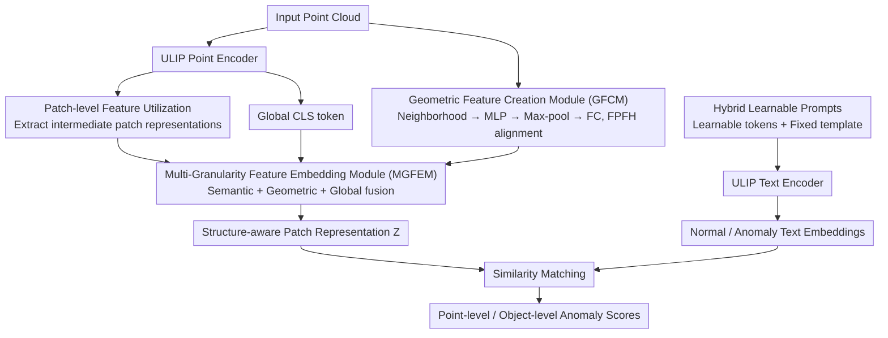

# Back to Point: Exploring Point-Language Models for Zero-Shot 3D Anomaly Detection

**Conference**: CVPR 2026  
**arXiv**: [2603.21511](https://arxiv.org/abs/2603.21511)  
**Code**: [https://github.com/wistful-8029/BTP-3DAD](https://github.com/wistful-8029/BTP-3DAD)  
**Area**: Object Detection
**Keywords**: Zero-Shot 3D Anomaly Detection, Point-Language Model, ULIP, Multi-Granularity, Geometric Feature

## TL;DR
BTP applies pre-trained Point-Language Models (PLM, e.g., ULIP) to zero-shot 3D anomaly detection for the first time. It proposes a Multi-Granularity Feature Embedding Module (MGFEM) to fuse patch-level semantics, geometric descriptors, and global CLS tokens. Combined with a joint representation learning strategy, it achieves 84.5% point-level AUROC on Real3D-AD, significantly surpassing the VLM-based rendering approach of PointAD (73.5%).

## Background & Motivation

**Background**: 3D anomaly detection is crucial for industrial quality inspection. Zero-shot (ZS) methods are highly attractive as they do not require training data from target classes, yet the field remains in its infancy.

**Limitations of Prior Work**:
   - Mainstream methods (PointAD, MVP) render 3D point clouds into multi-view 2D images and then use VLMs like CLIP for detection.
   - **Key Challenge**: The rendering process **loses geometric details** and is insensitive to local structural anomalies.
   - Performance heavily depends on the number and angles of rendering views, leading to view selection bias.
   - Repetitive projection-back-projection processes introduce computational overhead.

**Opportunity for PLM**: Point-Language Models like ULIP directly encode 3D point clouds, preserving intrinsic geometric and structural properties. The question arises: Can we **perform anomaly detection directly in 3D space** instead of taking a detour through 2D?

**Key Challenge**: The original design of ULIP is for point cloud classification (global embeddings), which is unsuitable for fine-grained anomaly **localization**—this requires patch-level features and geometric awareness.

**Core Idea**: "Back to Point" — performing anomaly detection directly on point clouds by enhancing PLM perception of local anomalies through multi-granularity features and geometric descriptors.

## Method

### Overall Architecture

BTP addresses whether 3D anomaly detection should bypass 2D. Mainstream schemes render point clouds into multi-view images for CLIP, which loses geometric details and is affected by view selection. BTP works directly on point clouds: the input point cloud first passes through a ULIP encoder to extract semantic features (including extracted multi-layer patch features and the global CLS token) and through a GFCM to extract geometric descriptions. MGFEM then fuses these multi-granularity features into structure-aware patch representations. On the text side, hybrid learnable prompts are used with the ULIP text encoder to produce "normal/anomaly" embeddings. Finally, similarity matching between the two paths yields anomaly scores. The difficulty lies in adapting the global embeddings of ULIP for fine-grained localization; thus, the designs focus on making the global PLM aware of local anomalies.

### Key Designs

**1. Patch-level Feature Utilization: Extracting ULIP intermediate layers for local perception**

ULIP by default only outputs the final layer's global embedding, which is too coarse for localizing anomalies. BTP extracts additional patch-level representations from multiple intermediate layers. Since different layers capture geometric and semantic information at different abstraction levels, combining these patch representations significantly improves the model's sensitivity to local structural changes. This is the first step in adapting a classification PLM for localization tasks.

**2. Geometric Feature Creation Module (GFCM): Replacing FPFH with a learnable network aligned to it**

Classic geometric descriptors like FPFH characterize local geometric relationships well but cannot be optimized end-to-end as handcrafted features. GFCM uses a PointNet-style learnable network to replace it: for the neighborhood points of each patch, a shared MLP is applied, followed by max-pooling to aggregate into a patch-level geometric descriptor, and an FC layer projects it to the dimension aligned with text embeddings: $\mathbf{f}_i = \phi\left(\max_{j=1,\ldots,M}\text{MLP}(\mathbf{p}_{ij})\right)$. Simultaneously, a contrastive loss with FPFH explicitly injects geometric priors, retaining the physical intuition of handcrafted features while gaining learnable flexibility.

**3. Multi-Granularity Feature Embedding Module (MGFEM): Fusing semantics, geometry, and global information**

Relying on a single path is insufficient, so MGFEM combines three types of information: multi-layer intermediate semantic features $\{\mathbf{H}^{(l)}\}_{l=1}^L$ (weighted sum by learnable weights), geometric features $\mathbf{F}_{geo}$ from GFCM, and the global CLS token $\mathbf{h}_{CLS}$. After projecting each to a unified space, they are concatenated: $\mathbf{Z} = \phi_f\left([\sum_l \alpha_l \mathbf{S}^{(l)} \,\|\, \mathbf{G} \,\|\, \mathbf{C}]\right)$. This yields the structure-aware patch representation $\mathbf{Z}\in\mathbb{R}^{N\times D}$, ensuring complementarity between semantic, geometric, and global cues.

**4. Hybrid Learnable Prompts: Small number of learnable tokens with a fixed template**

The text side combines a few learnable context tokens with a fixed template ("normal object" / "defective object") to encode normal/anomaly text embeddings via ULIP. These are then compared with point cloud features to calculate anomaly scores, preserving semantic anchors while allowing for learnable adaptation.

### Loss & Training

A joint representation learning strategy is used with triple-level supervision:
$$\mathcal{L} = \mathcal{L}_{local} + \lambda_1 \mathcal{L}_{global} + \lambda_2 \mathcal{L}_{geo}$$

- $\mathcal{L}_{local}$ = Focal Loss + Dice Loss: Point-level supervision to mitigate sample imbalance.
- $\mathcal{L}_{global}$ = BCE: Global object-level discrimination (fusing point-level and patch-level predictions).
- $\mathcal{L}_{geo}$ = Contrastive Loss (InfoNCE): Aligning geometric features with FPFH.
- $\lambda_1 = 0.5,\ \lambda_2 = 0.1$. GFCM and MGFEM are trained using auxiliary point cloud data, requiring no target class data during zero-shot inference.

## Key Experimental Results

### Main Results (Real3D-AD, Zero-Shot)

| Method | Type | Object AUROC↑ | Point AUROC↑ |
|------|------|---------------|--------------|
| CPMF | Non-ZS | 58.6 | 75.9 |
| PatchCore-FPFH | Non-ZS | 53.1 | 62.5 |
| PointCLIPV2 | ZS-VLM | 53.1 | 52.9 |
| AnomalyCLIP | ZS-VLM | 55.2 | 50.3 |
| PointAD | ZS-VLM | 74.8 | 73.5 |
| **BTP (Ours)** | **ZS-PLM** | 61.4 | **84.5** |

### Ablation Study (Inferred from component contributions)

| Configuration | Key Metric | Description |
|------|---------|------|
| Global ULIP embedding only | Lower point-level AUROC | Original ULIP is unsuitable for fine-grained localization |
| + Patch-level features | Gain in Point AUROC | Intermediate features increase local perception |
| + GFCM | Further Gain | Learnable geometric descriptors enhance structural awareness |
| + Joint Learning (Full BTP) | **84.5% Point AUROC** | Complementary triple supervision is optimal |

### Key Findings
- **Point-level Anomaly Localization**: BTP’s 84.5% significantly outperforms PointAD’s 73.5% (+11.0% gain), confirming the advantage of direct detection in 3D space.
- **Object-level Detection**: BTP’s 61.4% is lower than PointAD’s 74.8%, suggesting room for improvement in global discrimination.
- Extremely high point-level AUROC achieved on categories like diamond (97.9%), car (91.6%), and duck (90.9%).
- Working directly in 3D avoids the view selection bias inherent in VLM-based rendering schemes.

## Highlights & Insights
- The call to go **"Back to Point"** is significant—when 3D data is available, taking a detour through 2D is not strictly necessary.
- The multi-granularity fusion strategy (semantic + geometric + global) shows strong complementarity; joint learning outperforms using any single component.
- The design of GFCM—replacing FPFH with a learnable network while aligning to it—retains physical intuition while enabling end-to-end optimization.
- Strong performance in the zero-shot setting indicates that PLMs capture transferable 3D structural priors.

## Limitations & Future Work
- Object-level AUROC (61.4%) is notably weaker than PointAD (74.8%), indicating insufficient global discrimination.
- The ULIP encoder is fixed; unfreezing and fine-tuning it might yield further improvements.
- Training still requires auxiliary point cloud data (though not from target classes), which is a step away from "true zero-shot" scenarios.
- Generalization to more industrial defect types (e.g., micro-cracks, chromatic aberration) remains to be verified.

## Related Work & Insights
- PointAD is the most direct competitor (VLM rendering scheme); BTP leads significantly in localization.
- Unlike PLANE, which uses PLM but requires class-specific adaptation, BTP is a cleaner zero-shot approach.
- Future versions of ULIP (ULIP2) may further enhance the 3D understanding capabilities of BTP.
- Multi-granularity fusion strategies could be extended to 3D semantic segmentation and point cloud registration.

## Rating
- Novelty: ⭐⭐⭐⭐ First application of PLM to ZS 3D anomaly detection, opening a new path.
- Experimental Thoroughness: ⭐⭐⭐⭐ Two datasets + comprehensive metrics, though some ablation details could be more quantified.
- Writing Quality: ⭐⭐⭐⭐ Solid motivation; the "VLM vs PLM" comparison framework is clear.
- Value: ⭐⭐⭐⭐ Highly practical for industrial 3D inspection; the PLM route shows great potential.

<!-- RELATED:START -->

## Related Papers

- [\[CVPR 2026\] Hierarchical Point-Patch Fusion with Adaptive Patch Codebook for 3D Shape Anomaly Detection](hierarchical_point-patch_fusion_with_adaptive_patch_codebook_for_3d_shape_anomal.md)
- [\[CVPR 2026\] VisualAD: Language-Free Zero-Shot Anomaly Detection via Vision Transformer](visualad_language-free_zero-shot_anomaly_detection_via_vision_transformer.md)
- [\[CVPR 2026\] AnomalyVFM -- Transforming Vision Foundation Models into Zero-Shot Anomaly Detectors](anomalyvfm_--_transforming_vision_foundation_models_into_zero-shot_anomaly_detec.md)
- [\[CVPR 2026\] Detect Anything via Next Point Prediction](detect_anything_via_next_point_prediction.md)
- [\[CVPR 2025\] PO3AD: Predicting Point Offsets toward Better 3D Point Cloud Anomaly Detection](../../CVPR2025/object_detection/po3ad_predicting_point_offsets_toward_better_3d_point_cloud_anomaly_detection.md)

<!-- RELATED:END -->
