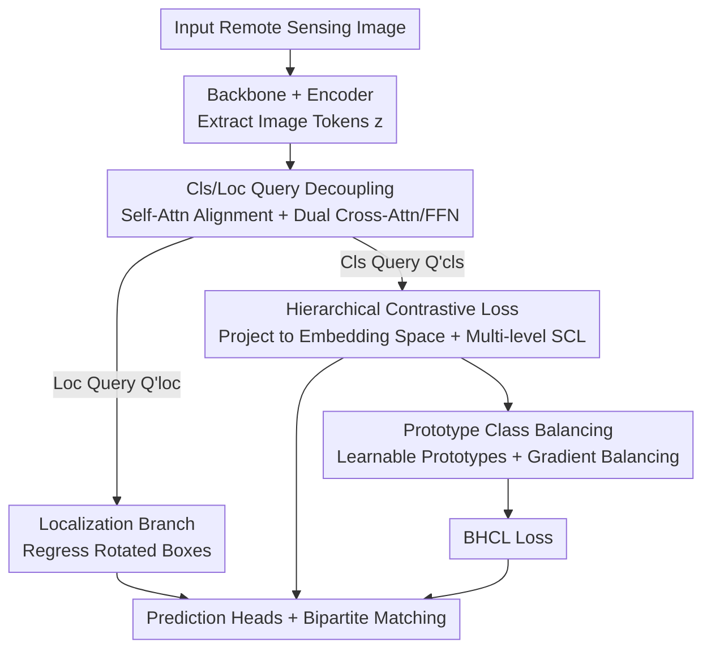

# Balanced Hierarchical Contrastive Learning with Decoupled Queries for Fine-grained Object Detection in Remote Sensing Images

**Conference**: CVPR 2026  
**Paper**: [CVF Open Access](https://openaccess.thecvf.com/content/CVPR2026/html/Chen_Balanced_Hierarchical_Contrastive_Learning_with_Decoupled_Queries_for_Fine_grained_Object_CVPR_2026_paper.html)  
**Code**: https://github.com/chncdx/BHCL  
**Area**: Object Detection / Fine-grained Detection  
**Keywords**: Fine-grained object detection, Hierarchical contrastive learning, DETR, Remote sensing, Class imbalance

## TL;DR
Ours embeds the hierarchical label tree from remote sensing fine-grained detection into the representation space of DETR. A "Balanced Hierarchical Contrastive Loss" (BHCL) is proposed to achieve gradient balancing via learnable class prototypes, combined with a strategy that decouples classification and localization queries. This allows contrastive learning to act solely on the classification branch without interfering with localization, reaching new SOTA on three hierarchically labeled remote sensing datasets.

## Background & Motivation
**Background**: Fine-grained remote sensing detection datasets (e.g., ShipRSImageNet, FAIR1M) typically organize hundreds of sub-classes using a "coarse-to-fine" hierarchical label tree—where root nodes represent broad categories (e.g., Warship / Merchant) and leaf nodes represent fine-grained classes (specific ship models). Each object is labeled along the path from root to leaf. Recent mainstream approaches utilize **Supervised Contrastive Learning (SCL)** to inject hierarchical semantics into the representation space: objects of the same parent class are pulled together in the embedding space, while sibling sub-classes are pushed apart.

**Limitations of Prior Work**: The authors identify two critical issues ignored by this trajectory. First, **hierarchical label trees are naturally imbalanced**—higher-level nodes accumulate far more samples than their descendants, and sibling branches are often asymmetric, leading to severe sample volume skews between sibling classes at the same level. Direct hierarchical contrastive learning allows head classes to dominate the representation learning process, preventing rare (tail) classes from learning discriminative features. Second, **hierarchical semantic modeling interferes with category-agnostic localization**. Standard detectors feed shared representations into both classification and localization heads. Hierarchical semantics require "objects of the same parent class to cluster in the embedding space"; if this clustering acts on shared queries, it forces bounding boxes that should be distinct to group together, damaging localization accuracy.

**Key Challenge**: Objects of the same parent class should be **semantically similar** (beneficial for classification) but **spatially independent** (beneficial for localization)—these two objectives conflict directly on shared representations.

**Core Idea**: Utilize "balancing" and "decoupling." Balancing—assign a learnable prototype to each class in the label tree as an additional instance and rewrite the SCL denominator so that each class contributes equally to the loss gradient in every mini-batch. Decoupling—split DETR object queries into classification and localization queries, applying contrastive loss only to the classification queries so that localization queries remain unaffected by hierarchical semantics.

## Method

### Overall Architecture
The method is built upon DETR-like detectors (the authors use OrientedFormer and RHINO as baselines). The architecture consists of four stages: "backbone → encoder → decoupled decoder → prediction heads." The backbone extracts features, and the encoder refines image tokens $z\in\mathbb{R}^{M\times d}$ via self-attention. These features initialize a set of object queries, which are split into classification queries $Q_{cls}$ and localization queries $Q_{loc}$. Within each decoder layer, both query types pass through a shared self-attention to align classification/localization information for the same object, then proceed through dedicated cross-attention + FFN paths to extract task-specific features. Finally, the classification branch outputs categories from refined classification queries, while the localization branch regresses rotated boxes from localization queries. During training, bipartite matching assigns Ground Truth (GT) to queries. In addition to standard Focal/IoU/L1 losses, an extra BHCL term is added, which embeds the hierarchy into the classification query space and ensures balanced class contributions using learnable prototypes.

### Key Designs

**1. Classification/Localization Query Decoupling: Protecting Localization from Hierarchical Semantics**

This resolves the conflict between "clustering by parent class" and "independent bounding boxes." Standard DETR uses shared queries for both tasks; imposing hierarchical grouping affects localization. Ours splits queries into $Q_{cls}\in\mathbb{R}^{N\times d}$ and $Q_{loc}\in\mathbb{R}^{N\times d}$. In each decoder layer, they are concatenated along the hidden dimension, processed by shared self-attention to align info, and then split: $Q_{cls}, Q_{loc} = \text{Split}(\text{Self-Attn}(\text{Concat}(Q_{cls}, Q_{loc})))$. Subsequently, task-specific features are extracted via: $Q'_{cls} = \text{FFN}_1(\text{Cross-Attn}_1(Q_{cls}, z))$ and $Q'_{loc} = \text{FFN}_2(\text{Cross-Attn}_2(Q_{loc}, z))$. Critically, **BHCL is only applied to $Q'_{cls}$**—classification queries absorb hierarchical semantics while localization queries remain category-agnostic. Shared self-attention ensures both paths still refer to the same object. This step alone (without contrastive loss) yields a +1.21 / +0.43 AP50:95 improvement.

**2. Hierarchical Contrastive Loss (HCL): Multi-level Tree Contrast**

Standard SCL performs positive/negative pairing at a single label level. Ours reorganizes pairs according to each level of the label tree and sums the weighted losses. Single-level SCL is defined as $L_{SCL} = \frac{1}{|I|}\sum_{i\in I}\frac{1}{|P(i)|}\sum_{p\in P(i)}L_{pair}(i,p)$, where $L_{pair}(i,p) = -\log\frac{\exp(f_i\cdot f_p/\tau)}{\sum_{a\in I\setminus\{i\}}\exp(f_i\cdot f_a/\tau)}$, and $f$ is the $\ell_2$ normalized projected classification query. The hierarchical version extends this across $L$ levels:

$$L_{HCL} = \frac{1}{|I|}\sum_{i\in I}\sum_{l=1}^{L}\frac{\lambda_l}{|P_l(i)|}\sum_{p\in P_l(i)}L_{pair}(i,p)$$

Here, $P_l(i)$ is the set of queries sharing the same ancestor as $i$ at level $l$. Level weights $\lambda_l = \exp(\frac{1}{L+1-l})/\sum_{l'}\exp(\frac{1}{L+1-l'})$ assign higher weights to levels closer to leaves, forcing the model to distinguish fine-grained classes. The top level (root) is excluded.

**3. Prototype Class Balancing: Learnable Prototypes + Gradient Balancing for Long-tail**

HCL can be biased by high-frequency classes (experimentally, HCL performed worse than the baseline on the long-tailed FAIR1M-v1.0). The goal is to **make every class contribute equally to the loss in each mini-batch**. Two strategies are used: ① Maintain a learnable prototype bank $M\in\mathbb{R}^{C\times d'}$ (where $C$ is the number of classes), inserting prototypes as extra instances in the loss to **ensure rare classes participate even if absent from the current batch**. ② Average the instances of each negative class in the SCL denominator before summing to balance gradient contributions. The balanced pair loss is:

$$L^b_{pair}(l,i,p) = -\log\frac{\exp(f_i\cdot f_p/\tau)}{\sum_{c\in C_l}\frac{1}{|I'_c|}\sum_{a\in I'_c\setminus\{i\}}\exp(f_i\cdot f_a/\tau)}$$

Where $C_l$ are all classes at level $l$, and $I'_c = I_c\cup\{M(c)\}$. Final BHCL incorporates prototypes into the positive set $P'_l(i)=P_l(i)\cup\{M(l,i)\}$, resulting in $L_{BHCL} = \frac{1}{|I|}\sum_{i\in I}\sum_{l=1}^{L}\frac{\lambda_l}{|P'_l(i)|}\sum_{p\in P'_l(i)}L^b_{pair}(l,i,p)$, applied at **every decoder layer**. Prototypes are updated via EMA: $M_c \leftarrow (1-\epsilon^{L-l})M_c + \epsilon^{L-l}\bar{f}_c$.

**4. "Other" Class Reallocation: Reverting Ambiguity to Parents**

Remote sensing datasets often group ambiguous objects into "Other" classes (e.g., "Other Aircraft Carrier"). Traditional methods treat "Other" as a mutually exclusive fine-grained class, losing its semantic link to the parent. Ours **reallocates these instances to their corresponding parent class** (Other Aircraft Carrier → Aircraft Carrier). This allows HCL to utilize instances at intermediate nodes, mitigating fine-grained uncertainty while preserving coarse-level semantics.

### Loss & Training
Total loss: $L_{total} = \lambda_{BHCL}L_{BHCL} + \lambda_{cls}L_{cls} + \lambda_{iou}L_{iou} + \lambda_{L1}L_1$. Parameters: $\lambda_{BHCL}=0.6$, temperature $\tau=0.1$, momentum $\epsilon=0.1$. Optimizer: AdamW, learning rate $5\times10^{-5}$, batch size 8. Two augmented views (random flip/translation) are generated per image, trained on 4 RTX 4090s.

## Key Experimental Results

### Main Results
Evaluated on three datasets (ShipRSImageNet with 4 levels, FAIR1M-v1.0/v2.0 with 2 levels) using ResNet-50 at 1024×1024 resolution. Results are reported in COCO-style AP for rotated boxes.

| Dataset | Metric | Ours | Prev. SOTA | Gain |
|--------|------|------|------|------|
| ShipRSImageNet | AP50:95 | 64.3 | 63.2 (OrientedFormer) | +1.1 |
| FAIR1M-v1.0 | AP50 | 41.66 | 41.31 (OrientedFormer) | +0.35 |
| FAIR1M-v2.0 | AP50 | 47.53 | 47.04 (DRNet) | +0.49 |

Ours achieves new SOTA across all three datasets compared to CNN detectors (ReDet/ORCNN) and DETR baselines.

### Ablation Study
Component breakdown on ShipRSImageNet (AP50:95):

| Configuration | RHINO | OrientedFormer | Notes |
|------|-------|----------------|------|
| baseline | 59.78 | 63.17 | Original DETR detector |
| + Decoupling | 60.99 | 63.60 | Decoupled cls/loc queries (+1.21 / +0.43) |
| + Decoupling + HCL | 61.24 | 64.12 | Added hierarchical contrast (+0.25 / +0.52) |
| + Decoupling + BHCL | 61.41 | 64.32 | Added prototype balancing (Full model) |

Prototype implementation comparison:

| Setting | AP50:95 | Notes |
|------|---------|------|
| None | 63.34 | No prototypes, -0.98 compared to EMA |
| EMA | 64.32 | EMA update (Adopted) |
| Cls-Weight | 64.26 | Using classifier weights as prototypes |

### Key Findings
- **Balancing is critical for long-tail scenarios**: On FAIR1M-v1.0, HCL without balancing performed worse than the baseline. Adding prototype balancing stabilized gains to +0.28 AP50.
- **Decoupling is the primary driver**: Query decoupling contributed +1.21 (RHINO) / +0.43 (OF) AP50:95, representing the largest single-step improvement.
- **Prototype Selection**: Removing prototypes dropped performance by ~0.95 AP50:95, proving that ensuring the "presence" of tail classes in every batch is essential.
- **t-SNE Visualization**: BHCL sharpens boundaries between Warship/Merchant at level 2 and separates sibling sub-classes more distinctly at level 3.

## Highlights & Insights
- **Dual Balancing Strategy**: Inserting prototypes into the denominator handles "hard absence" (class not in batch), while intra-class averaging handles "soft bias" (class overshadowed by head classes).
- **Task Isolation via Decoupling**: Shared self-attention for alignment followed by dual cross-attention for task divergence is a clean "task isolation" implementation applicable to any DETR-based multi-task head.
- **Handling "Other"**: Treating ambiguous samples as intermediate node instances rather than separate classes leverages hierarchical structure to utilize all available data.

## Limitations & Future Work
- Small absolute gains: BHCL only adds +0.17~0.20 AP50:95 over HCL on ShipRSImageNet; its primary value is in heavily long-tailed datasets.
- Domain Specificity: Experiments are limited to remote sensing; generalization to natural image hierarchical detection (e.g., iNaturalist) is unverified.
- Complexity: Prototype banks and dual-path queries introduce extra memory and computational overhead.

## Related Work & Insights
- **vs. Standard Hierarchical SCL**: Prior works ignore imbalance; ours uses prototypes and gradient balancing to level the contributions.
- **vs. Two-stage Hierarchical Detectors**: These separate localization and hierarchical classification; ours is end-to-end within a single DETR, reducing error propagation.
- **vs. PCLDet**: While both use prototypes, ours embeds them into a "hierarchical + balanced" framework specifically for class imbalance.

## Rating
- Novelty: ⭐⭐⭐⭐ Combination of balanced hierarchical contrast and query decoupling is a fresh approach for remote sensing.
- Experimental Thoroughness: ⭐⭐⭐⭐ Broad testing across datasets and baselines, though gains are modest.
- Writing Quality: ⭐⭐⭐⭐ Clear motivation and complete mathematical derivation.
- Value: ⭐⭐⭐⭐ Plug-and-play loss/structure with cross-architecture validation.

<!-- RELATED:START -->

## Related Papers

- [\[CVPR 2026\] Fourier Angle Alignment for Oriented Object Detection in Remote Sensing](fourier_angle_alignment_for_oriented_object_detection_in_remote_sensing.md)
- [\[CVPR 2026\] PaQ-DETR: Learning Pattern and Quality-Aware Dynamic Queries for Object Detection](paq-detr_learning_pattern_and_quality-aware_dynamic_queries_for_object_detection.md)
- [\[ICCV 2025\] OpenRSD: Towards Open-prompts for Object Detection in Remote Sensing Images](../../ICCV2025/object_detection/openrsd_towards_open-prompts_for_object_detection_in_remote_sensing_images.md)
- [\[ECCV 2024\] MutDet: Mutually Optimizing Pre-training for Remote Sensing Object Detection](../../ECCV2024/object_detection/mutdet_mutually_optimizing_pre-training_for_remote_sensing_object_detection.md)
- [\[CVPR 2026\] FB-CLIP: Fine-Grained Zero-Shot Anomaly Detection with Foreground-Background Disentanglement](fb-clip_fine-grained_zero-shot_anomaly_detection_with_foreground-background_dise.md)

<!-- RELATED:END -->
