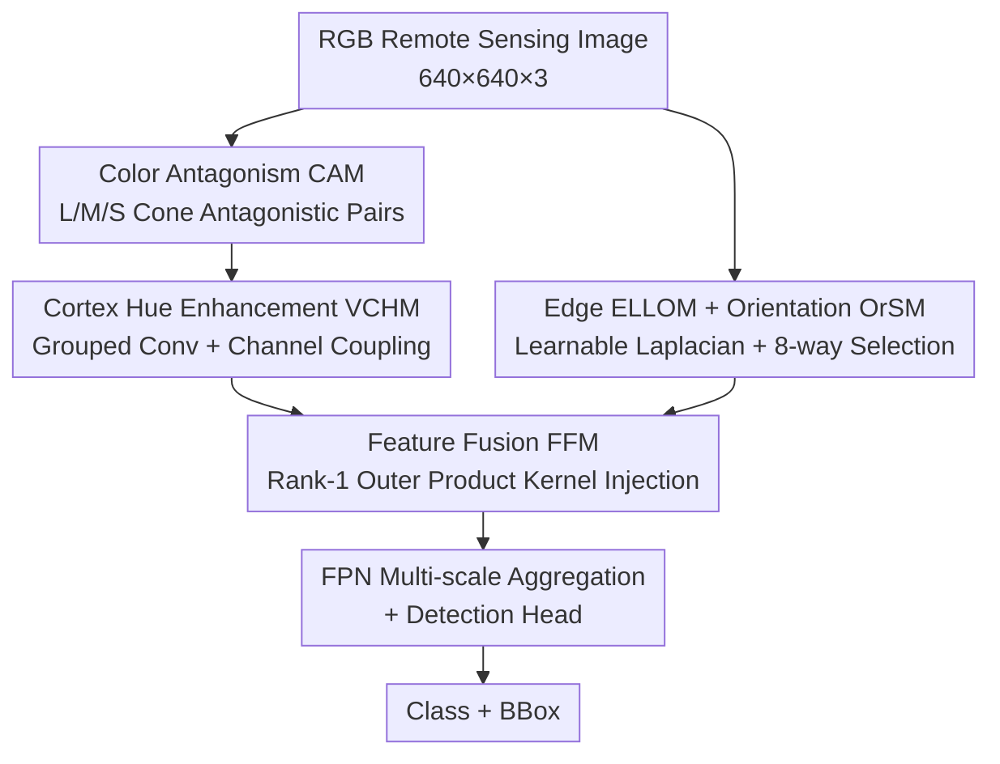

# BDNet: Bio-Inspired Dual-Backbone Small Object Detection Network

**Conference**: CVPR 2026  
**Paper**: [CVF Open Access](https://openaccess.thecvf.com/content/CVPR2026/html/Guan_BDNetBio-Inspired_Dual-Backbone_Small_Object_Detection_Network_CVPR_2026_paper.html)  
**Code**: Not available  
**Area**: Object Detection / Small Object Detection / Remote Sensing  
**Keywords**: Small Object Detection, Remote Sensing, Dual-Backbone Network, Bio-inspired Vision, Color Antagonism

## TL;DR
BDNet mimics the LGN/V1–V2–V4 color pathway and the V1–V4 edge pathway of the human visual system to construct a dual-backbone detection network featuring "color enhancement + edge strengthening + hierarchical fusion." Designed to remedy the insufficient feature extraction caused by low color contrast and blurred edges of small objects in remote sensing, it achieves SOTA results on VisDrone2019, NWPU VHR-10, and AI-TODv2 datasets with only 2.59M parameters.

## Background & Motivation
**Background**: The core difficulty of Remote Sensing Small Object Detection (RSOD) lies in the extremely small pixel ratio of targets. Repeated downsampling in deep networks causes already weak visual cues to further decay or vanish. Recent works have shifted from "adapting general detection frameworks" to "designing architectures specific to small object characteristics," yet most optimize features holistically without explicitly isolating and enhancing the most critical low-level cues for small objects.

**Limitations of Prior Work**: Existing feature enhancement methods focus on a single type of cue—COSE improves color consistency in low-contrast regions via color shift correction, DCFL strengthens edge textures through super-resolution and detail compensation, and SET enhances high-frequency details using spectral enhancement. Although multi-backbone networks (e.g., TransFuse merging CNN/Transformer, DSOD++ merging different receptive fields) introduce multiple branches, they complement each other within the same feature space. **Almost no work explicitly builds separate branches for multi-dimensional low-level cues like "color + edge."**

**Key Challenge**: The discernibility of small objects is hindered by two factors—low color contrast (targets and backgrounds having similar hues, e.g., tennis/basketball courts) and blurred edges (broken contours, motion blur). These issues have different origins and require different treatments; handling them uniformly with a single pathway inevitably leads to trade-offs.

**Key Insight**: The authors turned to biological vision for answers. Physiological research shows that the visual system naturally employs **split-stream processing**: the LGN (Lateral Geniculate Nucleus)/V1/V2 areas handle color and luminance (color antagonism + hierarchical hue enhancement), while orientation-selective neurons in V1 extract edges. These two streams eventually converge and integrate in the V4 visual cortex. This exactly corresponds to the dual-cue problem of "color + edge."

**Core Idea**: BDNet adopts a bio-inspired **dual-backbone** architecture. It processes the Color Information Pathway (CIP, mimicking LGN/V1→V2→V4) and the Edge Information Pathway (EIP, mimicking V1→V4) as two independent branches for enhancement. Finally, a Feature Fusion Module (FFM), simulating the V4 integration mechanism, performs hierarchical fusion of the two types of features to mitigate feature degradation of small objects at the source.

## Method

### Overall Architecture
BDNet receives an RGB remote sensing image and passes it through two parallel backbones: the **Color Information Pathway (CIP)** (CAM → VCHM), which amplifies color differences and enhances hue representation; and the **Edge Information Pathway (EIP)** (ELLOM → OrSM), which first extracts an edge map and then performs orientation selection to strengthen contours. Both pathways produce complementary color and edge features across multiple scales (P2/P3/P4). These are then handed over to the **Feature Fusion Module (FFM)** (mimicking V4 cross-domain integration) for hierarchical injection-based fusion. The fused multi-scale features are aggregated into an FPN and finally predicted by the detection head. The entire backbone is built on an optimized YOLO12 and **does not load any pre-trained weights** to verify the generalization capability of the architecture itself.

Notably, the model uses only **two FFMs**—one merging P2 from both pathways, and another merging P3 with the concatenated result of P4 after upsampling—rather than fusing at every layer.

### Key Designs

**1. CAM Color Antagonism Module: Amplifying low-contrast color differences using "excitation-inhibition" pairs**

Addressing the "low color contrast" pain point, CAM replicates the antagonism mechanism of L (long-wave), M (medium-wave), and S (short-wave) cones in the LGN/V1. It maps input RGB channels to simulated L/M/S cone channels and constructs six "excitation-inhibition" antagonistic pairs according to opponent color theory (complementary pairs like red-green, blue-yellow). The key innovation is an **Adaptive Selection Enhancement (ASE)** mechanism: a **learnable weight vector** weights the RGB channels, modulating their contribution to various antagonistic combinations. Six types of "excitation-inhibition" features are generated, and identical excitation channels are aggregated and fused via convolution. The advantage is that color differences are not simply subtracted; the network learns which antagonistic combination is most discriminative for the current scene—significantly pulling apart the contrast for targets sharing background hues (e.g., Tennis Court TC, Basketball Court BC).

**2. VCHM Cortex Hue Enhancement Module: Channel coupling using Jordan matrices to align hues with human perception**

While CAM enhances color differences, the resulting hues may still deviate from human perception. Physiology shows that the alignment between cortical hue maps and perceptual color space increases significantly with higher cortical hierarchy. VCHM simulates V2 hierarchical hue processing via three steps: "Grouped Convolution → Channel Coupling → Feature Embedding." First, grouped convolutions are applied to input $X=(x_0,\dots,x_{c-1})$ to obtain intermediate features $X'$. Then, a **canonical Jordan matrix** couples adjacent channels in pairs to generate new hue features:

$$Y = \mathrm{Conv}\big(J \cdot X'\big),\quad J=\begin{bmatrix}1&1&0&\cdots&0\\0&1&1&\cdots&0\\ \vdots& & &\ddots&\vdots\\0&0&0&\cdots&1\end{bmatrix}$$

Here, $J$ is multiplied by the original $1\times1$ convolution weights $W$ to form a new kernel (adding adjacent channels = coupling adjacent hues). Finally, the new hue features are embedded back into the original sequence: $E(X,Y)=(x_0,\,w_0 x'_0+w_1 x'_1,\,x_1,\dots)$, interleaving original and coupled channels. This essence "simulates continuous hue gradients in the channel dimension," making the enhanced hue distribution more natural and improves discriminability.

**3. EIP Edge Pathway (ELLOM + OrSM): Learning Laplacian edges and adaptively selecting the most salient orientation via 8-way ESCK**

Addressing "blurred edges," EIP consists of two steps. Step one is **ELLOM (Enhanced Learnable Laplacian Operator Module)**: traditional Laplacian operators use fixed second-order difference kernels. ELLOM replaces the weights with learnable parameters $(w_1,\dots,w_9)$, with the center being $-\Sigma$ (sum of surrounding weights), allowing edge extraction to adapt to data. Step two is **OrSM (Orientation Selection Module)**: mimicking V1/V2 neurons that respond strongly only to specific orientations. It uses **Enhanced-Suppression Convolutional Kernels (ESCK)** (transforming difference convolution from "pixel difference" to "weight difference") to generate salient features $X_1,\dots,X_8$ for eight directions. Its brilliance lies in **adaptive directional kernel selection**: a sub-network encodes the input into a direction index map (values 0–7), converted into eight binary masks $\{M_k\}_{k=0}^7$. Masks filter out non-salient features, keeping only those from the corresponding direction for fusion. This prevents the traditional issue of "interference from directly overlaying eight directional kernels"—each spatial position retains only its most salient orientation, resulting in more coherent contours.

**4. FFM Feature Fusion Module: Injecting color into edges via Rank-1 outer product kernels for noise-resistant regularization**

Color and edges are naturally complementary (color defines surface attributes, edges define spatial boundaries). V4 contains both color-sensitive and shape-sensitive neurons for cross-domain interaction. FFM simulates this "injection-styled" integration. For color features $Z_1$ and edge features $Z_2\in\mathbb{R}^{C\times H\times W}$, global average pooling and $1\times1$ convolutions first learn channel importance scores $\{p_i\}$ and $\{q_j\}$. An **outer product** produces matrix $R[1,C,C]$, where $R_{ij}=p_i q_j$ quantifies the semantic correlation between channel $i$ of $Z_1$ and channel $j$ of $Z_2$. $R$ is then treated as a $1\times1$ convolution kernel $K[C,C,1,1]$ to convolve $Z_2$. The $k$-th output channel is:

$$\mathrm{Output}_k = \sum_{i=1}^{c} p_k q_i \cdot Q_i$$

Each reconstructed channel is thus injected with information from all channels of $Z_1$. The key insight is that $R$, being the outer product of two 1D vectors, is mathematically a **Rank-1 matrix**, which inherently exerts a strong regularization effect—highly beneficial for noisy small objects. To avoid being limited by the Rank-1 structure, residuals and concatenation preserve channel diversity: $\mathrm{Output}=Z_1 \,\|\, (\mathrm{Output}_1\|\cdots\|\mathrm{Output}_c + Z_2)$.

### Loss & Training
The baseline is an optimized YOLO12, utilizing standard YOLO detection losses (classification + box regression, with box regression in `4*reg_max` distribution format). No pre-trained weights are used throughout. Ablations were primarily conducted on VisDrone2019.

## Key Experimental Results

### Main Results
SOTA performance was achieved on three remote sensing small object datasets with minimal parameters (only 2.59M). Comparison with representative detectors on the VisDrone2019 validation set:

| Method | mAP50 | mAP50-95 | Params(M) | GFLOPs |
|------|-------|----------|-----------|--------|
| UAV-DETR | 50.0 | 30.9 | 21.26 | 72.5 |
| LUFE-Net | 50.2 | 30.9 | 9.7 | 33.1 |
| YOLO12-I | 47.3 | 29.3 | 29.2 | 89.4 |
| **BDNet (Ours)** | **50.5** | **31.2** | **2.59** | 52.44 |

On the AI-TODv2 test set (COCO standard, focusing on ultra-small objects APvt/APs), **all metrics were optimal**:

| Method | AP | AP50 | AP75 | APvt | APs | APm |
|------|----|----|----|----|----|----|
| DCENet | 23.5 | 53.9 | 16.8 | 8.5 | 28.1 | 37.1 |
| LTDNet* | 23.0 | 54.6 | 15.5 | 8.9 | 27.2 | 33.1 |
| **Ours** | **24.7** | **54.9** | **18.2** | **10.2** | **31.7** | **41.8** |

On NWPU VHR-10, mAP50 reached **94.1%**. While it ranked best in only 4 individual categories (BD/TC/BC/HA), its performance across all categories was the most balanced with the smallest variance—confirming the color backbone's strength in low-contrast classes (TC/BC) and the edge backbone's strength in structured targets (BD/HA).

### Ablation Study
Incremental module addition on the VisDrone2019 validation set (baseline = 47.8% mAP50):

| Config | mAP50 | Params(M) | GFLOPs | Description |
|------|-------|-----------|--------|------|
| Baseline | 47.8 | 1.98 | 45.98 | Pure YOLO12 |
| + CIP | 48.8 | 2.04 | 47.56 | Color Pathway |
| + EIP | 48.8 | 2.04 | 47.52 | Edge Pathway |
| + FFM Alone | 49.4 | 2.48 | 49.20 | Fusion Module Only |
| CIP+EIP | 49.8 | 2.52 | 52.31 | Dual Stream No Fusion |
| EIP+FFM | 50.3 | 2.53 | 50.78 | — |
| **CIP+EIP+FFM** | **50.5** | **2.59** | **52.44** | Full Model |

Inside CIP: CAM alone gave 47.8→48.0, VCHM alone →48.3, together →48.8 (complementary). Inside EIP: ELLOM alone →48.1, OrSM alone →48.3, together →48.8 (synergistic).

### Key Findings
- **FFM is the main driver of performance**: Adding FFM alone increased mAP50 from 47.8 to 49.4, outperforming either CIP or EIP added individually (both reached 48.8). This suggests "hierarchical injection-based fusion" is more critical than merely stacking dual branches, and Rank-1 regularization is effective for small objects.
- **Dual-pathway + Fusion are all indispensable**: CIP+EIP without fusion reached only 49.8. Adding FFM achieved 50.5, validating the cumulative effect of color solving low contrast, edges solving blur, and V4-style fusion performing cross-dimensional integration.
- **Extreme Lightweighting**: The full model has only 2.59M parameters, an order of magnitude smaller than UAV-DETR (21M) or YOLO12-I (29M), yet achieves higher accuracy. The bio-inspired structure brings high efficiency.
- Heatmap visualization shows the baseline has weak activation for low-contrast (People/Bicycle) and blurred contours (Pedestrian). Adding CIP enhances response but leaves edges blurred; EIP suppresses background noise and sharpens edges, while FFM fusion yields a strong and accurate response.

## Highlights & Insights
- **Direct translation of bio-visual "Split-stream and Merge" structure to network topology**: The color pathway corresponds to LGN/V1–V2–V4, the edge pathway to V1–V4, and FFM to V4 convergence. This is not a vague "bio-inspired" claim; every module finds its counterpart in physiological pathways.
- **Rank-1 outer product kernel for feature fusion is a transferable insight**: Using the outer product of two channel weight vectors as a $1\times1$ convolution kernel explicitly models cross-branch channel correlation. Because it is Rank-1, it possesses intrinsic regularization beneficial to high-noise small objects, while residuals restore diversity.
- **Index-map kernel selection in OrSM avoids interference**: Using direction indices and binary masks for hard selection, rather than a weighted sum of eight directional kernels, eliminates kernel crosstalk—a practical trick for handling multi-directional edges.
- **SOTA with 2.59M parameters**: Proves that the bottleneck in RSOD is often not model capacity, but whether the architecture correctly addresses low-level cues.

## Limitations & Future Work
- **Validated only in Remote Sensing/Aerial scenes**: Tests were limited to remote sensing drone imagery; whether the benefits of color antagonism and edge split-streaming generalize to natural or medical images remains unknown.
- **Abstract module details (ESCK construction, VCHM channel coupling)**: Formulae in the main text are somewhat abstract, raising the replication threshold. Specific weight designs for Jordan coupling and ESCK require referral to Supplementary Material Sec. A.
- **Code is not public**, and specific modifications to the "optimized YOLO12" baseline are not detailed, introducing a caveat in fair comparisons with other methods.
- **Future directions**: The dual backbone introduces some computational redundancy (GFLOPs increased from 45.98 to 52.44). Shared shallow features between pathways could be explored. FFM is currently used only at P2 and P3/P4; investigating gains from fusion at more scales is warranted.

## Related Work & Insights
- **vs COSE / DCFL / SET (Single-cue enhancement)**: While prior methods enhance color consistency, edge texture, or high-frequency details individually, BDNet uses a dual-backbone to **simultaneously** decouple and enhance both color and edge low-level cues followed by hierarchical fusion.
- **vs TransFuse / DSOD++ / DCAL (Multi-backbone complementarity)**: These networks complement different receptive fields or global-local information within the same feature space. BDNet branches are dedicated to cues with **distinct physical meanings** (color vs. edge), ensuring clearer division of labor.
- **vs Brstd / Magno-VTOD / VSTDet (Bio-inspired small object models)**: Previous models often focus on single mechanisms (antagonistic receptive fields, magnocellular pathways, ventral streams). BDNet systematically simulates the full LGN/V1–V2–V4 pathway, allowing color and edge processing to act **synergistically**.

## Rating
- Novelty: ⭐⭐⭐⭐ Systematically implements the full bio-visual pathway (color antagonism + orientation selection + V4 fusion) as a dual-backbone network; the bio-inspired mapping is specific and self-consistent.
- Experimental Thoroughness: ⭐⭐⭐⭐ Three datasets + multi-scale metrics + modular ablation + heatmap visualization; however, lacks cross-domain validation on natural images.
- Writing Quality: ⭐⭐⭐⭐ Physiological motivations clearly map to module designs; however, key ESCK/VCHM details are moved to supplementary materials.
- Value: ⭐⭐⭐⭐ Achieves SOTA on RSOD with only 2.59M parameters; the lightweight efficiency and bio-inspired fusion approach are transferable to other dual-branch tasks.

<!-- RELATED:START -->

<!-- RELATED:END -->

## Related Papers

- [\[CVPR 2026\] D2FANet: Enhancing Video Object Detection with Dual-Domain Feature Aggregation Network](d2fanet_enhancing_video_object_detection_with_dual-domain_feature_aggregation_ne.md)
- [\[CVPR 2026\] Towards Persistence: Learning Topological Constraints for Event-based Small Object Detection](towards_persistence_learning_topological_constraints_for_event-based_small_objec.md)
- [\[CVPR 2026\] Heuristic-inspired Reasoning Priors Facilitate Data-Efficient Referring Object Detection](heuristic-inspired_reasoning_priors_facilitate_data-efficient_referring_object_d.md)
- [\[CVPR 2026\] HeROD: Heuristic-inspired Reasoning Priors Facilitate Data-Efficient Referring Object Detection](herod_heuristic_inspired_reasoning_data_efficient_rod.md)
- [\[CVPR 2026\] Beyond Prompt Degradation: Prototype-Guided Dual-Pool Prompting for Incremental Object Detection](beyond_prompt_degradation_prototype-guided_dual-pool_prompting_for_incremental_o.md)

<!-- RELATED:END -->
