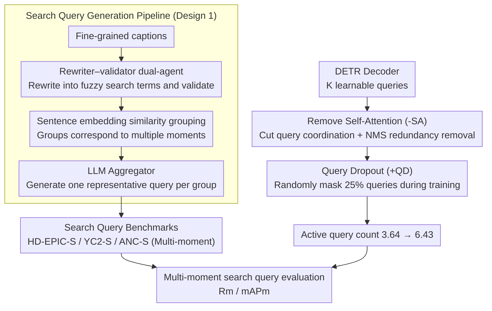

# Beyond Caption-Based Queries for Video Moment Retrieval

**Conference**: CVPR 2026  
**arXiv**: [2603.02363](https://arxiv.org/abs/2603.02363)  
**Code**: Yes (Project page provides code, models, and data)  
**Area**: Object Detection  
**Keywords**: Video Moment Retrieval, Search Query Generalization, DETR Decoder Query Collapse, Multi-moment Retrieval, Query Under-specification

## TL;DR

This work reveals a significant gap between caption-based queries and real user search queries in VMR. It proposes three search query benchmarks and alleviates the decoder query collapse in DETR by removing self-attention and introducing Query Dropout, achieving up to a 21.83% mAPm improvement on multi-moment search queries.

## Background & Motivation

### 1. Background
Video Moment Retrieval (VMR) aims to localize temporal segments in videos based on text queries. Current mainstream methods rely on the DETR architecture using $K$ learnable decoder queries, each mapped to a candidate moment and a corresponding confidence score. Existing benchmarks (HD-EPIC, YouCook2, ActivityNet-Captions, etc.) all utilize descriptive texts written by annotators **after watching the video** as queries.

### 2. Limitations of Prior Work
Existing dataset text queries are **caption-based**—annotators write fine-grained descriptions after viewing the video. This results in "visual bias": queries are overly detailed and highly aligned with the visual content. For instance, an annotator might write "a man in a yellow jersey intercepts a loose pass...", whereas a real user might only search "when are goals being scored?". Fundamental differences exist between these two query types in terms of linguistic granularity and semantic coverage.

### 3. Key Challenge
- **At training**: Each caption-based query corresponds to only a **single GT moment**, and the language is highly specific.
- **At inference**: Real search queries are often more abstract and under-specified, potentially corresponding to **multiple moments** in the video.
- This mismatch leads to a drastic performance drop in real search scenarios (up to 77.4% Rm@0.3 degradation).

### 4. Goal
(1) Quantify the performance gap between caption-based and search queries; (2) Identify the root causes of degradation: **language gap** and **multi-moment gap**; (3) Alleviate decoder query collapse caused by the multi-moment gap.

### 5. Key Insight
From a **model architecture** perspective, without altering training data or the training paradigm, structural modifications are employed to enable the model to generalize from single-moment training data to multi-moment search scenarios.

### 6. Core Idea
An **active decoder-query collapse** exists in DETR models—only a few queries participate in prediction, while others remain silent. This is caused by two structural reasons: (i) **coordination collapse** induced by self-attention, where queries "coordinate" to let only a few activate; (ii) **index collapse**, where a few fixed query indices monopolize activations. Removing self-attention (-SA) and introducing Query Dropout (+QD) simultaneously addresses these issues.

## Method

### Overall Architecture

This paper addresses why VMR models trained on captions degrade significantly when switched to real search queries, and how to recover performance without re-labeling data. The approach is two-fold. First, **benchmark construction**: since real search queries are hard to collect, existing fine-grained captions are "blurred" into search-like queries using LLMs, and queries pointing to similar content are grouped to create multi-moment test scenarios. Second, **model modification**: the degradation is traced to "active query collapse" in the DETR decoder. Two minimal structural changes—removing self-attention (-SA) and adding Query Dropout (+QD)—force the model to distribute its predictions across more queries. These paths converge in the "multi-moment search query evaluation," using $R_m$ / $mAP_m$ to measure the mitigation of degradation.

### Key Designs

**1. Search Query Generation Pipeline: Blurring fine-grained captions into search terms and automated multi-moment mapping**

Real search queries are difficult to obtain because "writing text" and "watching video" cannot be decoupled in the labeling process—if a person watches a video before writing, the result is a caption. Ours circumvents this by reusing existing dense annotations and synthesizing distribution shifts via controlled "under-specification." The pipeline has two stages. The first stage performs per-query under-specification using a Gemma-12B rewriter-validator: the rewriter transforms detailed captions into fuzzy versions (e.g., "a man tying his running shoes..." to "a person getting ready to exercise"), while the validator detects semantic shifts for manual correction. The second stage performs query-grouping, where sentence embedding similarities are calculated between all under-specified queries to group shared content—naturally corresponding to multiple moments. An LLM aggregator then generates a representative search query for each group, resulting in single queries linked to multiple GT moments.

**2. Removing Self-Attention (-SA): Dismantling coordination channels that let queries "collectively stay silent"**

The standard DETR decoder layer is $\hat{Q}^{l+1} = \text{FFN}(\text{CA}(\text{SA}(\hat{Q}^l), M))$, where SA allows $K$ queries to communicate and push each other away to reduce redundant predictions. While beneficial for multi-object detection, this coordination becomes a shortcut in single-moment VMR training: since each caption only maps to one GT moment, queries "agree" to let only a few handle the GT while others stay silent—termed **coordination collapse**. -SA removes the SA layer entirely, making the decoder layer $Q^{l+1} = \text{FFN}(\text{CA}(Q^l, M))$, so queries operate independently. Redundant predictions previously suppressed by SA are handled via NMS in post-processing.

**3. Query Dropout (+QD): Randomly masking queries to break index monopoly**

Simply removing SA is insufficient, as **index collapse** emerges: a fixed set of query indices (e.g., indices 1–4) consistently capture high confidence while others remain permanently silent. This is a position/index-level overfitting. QD applies a Bernoulli mask during training: $\hat{Q} = Q \odot M,\ M \sim \mathbb{B}(1-k)$, randomly zeroing out a proportion $k$ of queries. This forces supervision signals to distribute across more indices. Ours uses $k=0.25$; QD is only active during training. -SA targets "coordination" and QD targets "index" collapse; their combination increases the active query count from 3.64 to 6.43.

### Loss & Training

- The loss function remains identical to the baselines (CG-DETR, LD-DETR), employing standard **one-to-one Hungarian matching**.
- Key Finding: Maintaining 1-to-1 matching is crucial—it introduces competition and ensures queries activated by -SA+QD remain diverse rather than redundant.
- Query Dropout is used only during training; all queries are active during inference.
- NMS is added to post-processing to replace the redundancy removal function of the omitted SA.

## Key Experimental Results

### Main Results

**Table 1: HD-EPIC-S{1,2,3} Benchmark Results (CG-DETR & LD-DETR)**

| Model | Input | Method | Rm@0.1 | Rm@0.3 | Rm@0.5 | mAPm@0.1 | mAPm@0.3 | mAPm@0.5 |
|------|------|------|--------|--------|--------|----------|----------|----------|
| CG-DETR | S1 | base | 28.61 | 17.95 | 8.99 | 36.21 | 22.84 | 11.59 |
| CG-DETR | S1 | -SA+QD | 29.87 | 19.69 | 10.86 | 39.74 | 26.49 | 14.87 |
| CG-DETR | S2 | base | 24.71 | 15.52 | 7.89 | 32.15 | 20.10 | 10.29 |
| CG-DETR | S2 | -SA+QD | 26.17 | 17.00 | 9.40 | 35.38 | 23.39 | 13.04 |
| CG-DETR | S3 | base | 9.50 | 4.61 | 2.08 | 16.20 | 8.01 | 3.58 |
| CG-DETR | S3 | -SA+QD | 10.57 | 6.52 | 3.45 | 17.27 | 10.65 | 5.54 |
| LD-DETR | S2 | base | 25.23 | 16.38 | 8.46 | 32.42 | 21.11 | 10.93 |
| LD-DETR | S2 | -SA+QD | 26.36 | 16.98 | 8.87 | 36.37 | 23.75 | 12.54 |

**Table 2: YC2-S and ANC-S Benchmark Results**

| Model | Dataset | Method | Rm@0.3 | mAPm@0.1 | mAPm@0.3 | mAPm@0.5 |
|------|--------|------|--------|----------|----------|----------|
| CG-DETR | YC2-S | base | 19.87 | 38.83 | 26.96 | 15.21 |
| CG-DETR | YC2-S | -SA+QD | 20.32 | 41.00 | 29.40 | 17.21 |
| LD-DETR | YC2-S | base | 23.48 | 41.69 | 30.04 | 15.58 |
| LD-DETR | YC2-S | -SA+QD | 24.76 | 45.66 | 33.09 | 18.74 |
| CG-DETR | ANC-S | base | 40.89 | 72.12 | 54.92 | 36.42 |
| CG-DETR | ANC-S | -SA+QD | 43.12 | 74.00 | 56.42 | 38.20 |

### Ablation Study

**Component Ablation (HD-EPIC-S2, CG-DETR)**

| -SA | +QD | Rm (avg) | mAPm (avg) | #active queries |
|-----|-----|----------|------------|-----------------|
| ✗ | ✗ | 16.04 | 20.84 | 3.64±1.18 |
| ✓ | ✗ | 15.31 | 21.02 | 3.72±1.16 |
| ✗ | ✓ | 16.50 | 21.43 | 3.77±1.28 |
| ✓ | ✓ | **17.52** | **23.93** | **6.43±2.16** |

**Comparison of Alternative Query Activation Methods**

| Method | Rm | mAPm | #active | %match GT |
|------|-----|------|---------|-----------|
| base | 16.04 | 20.84 | 3.64 | 0.36 |
| +1-to-5 matching | 14.66 | 16.30 | 9.56 | 0.21 |
| +1-to-k matching | 10.78 | 11.01 | 20.00 | 0.07 |
| +group matching | 15.34 | 17.97 | 8.69 | 0.27 |
| -SA+QD (Ours) | **17.52** | **23.93** | 6.43 | **0.42** |

### Key Findings

1. **Both modifications are essential**: Using -SA or +QD in isolation yields only marginal gains; combining them doubles active queries and improves mAPm by 3.09.
2. **Simply increasing active queries is ineffective**: 1-to-k matching increases active queries to 20, but mAPm drops to 11.01 because activated queries generate redundant predictions (%match GT drops from 0.36 to 0.07).
3. **Crucial role of 1-to-1 matching**: Maintaining Hungarian 1-to-1 matching ensures that newly activated queries compete rather than duplicate.
4. **Sensitivity to QD rate**: $k=0.25$ is optimal, while $k=0.50$ causes performance collapse.
5. **Multi-moment queries benefit most**: -SA+QD improves mAPm@0.3 by up to 34.3% on multi-moment instances.
6. **Ours recovers approximately 70% of the oracle gap** (where oracle refers to models trained directly on search queries).

## Highlights & Insights

- **Insightful problem definition**: Highlights a fundamental, long-overlooked issue in VMR—the distribution shift between training captions and real search queries, critical for actual deployment.
- **New multi-moment evaluation metrics**: $R_m$ and $mAP_m$ address fairness issues in traditional R1/mAP for multi-moment evaluation.
- **Precise diagnosis of query collapse**: Analyzing the problem through coordination and index collapse dimensions lead to a simple yet effective solution.
- **Architectural efficiency**: Improves performance purely through structural changes without requiring expensive re-labeling of data.

## Limitations & Future Work

1. **Language gap remains**: This work primarily addresses the multi-moment gap. The language gap is left for future work, suggesting stronger vision-language models for cross-granularity semantic reasoning.
2. **Synthetic nature of search queries**: While validated, LLM-generated queries may still differ from actual user search behavior.
3. **High sensitivity to QD rate**: The performance drop from $k=0.25$ to $k=0.50$ suggests a need for improved robustness.
4. **Scenario limitations**: Benchmarks primarily cover domains like cooking and sports; generalization to open-domain or long-narrative videos is unexplored.
5. **NMS dependency**: Replacing SA with NMS introduces additional hyperparameters and computational overhead in post-processing.

## Related Work & Insights

- **Relation to DETR query collapse**: Collapse is reported in object detection ([53,28,21]), temporal action detection ([17]), and 3D detection ([44,52]), but causes differ—those are driven by sparse one-to-one matching, while VMR's collapse is driven by single-moment priors.
- **Implications for search/retrieval**: Complements work on under-specified queries in ranked retrieval by focusing on multi-moment recovery within a single video.
- **Generalizability**: The -SA+QD design logic is potentially applicable to any DETR-variant task exhibiting decoder-query collapse.

## Rating

⭐⭐⭐⭐ The problem definition is novel, the analysis is deep, and the solution is elegant. It is a significant step toward making VMR practical, though the unresolved language gap and QD sensitivity are notable limitations.

<!-- RELATED:START -->

## Related Papers

- [\[CVPR 2026\] Beyond Semantic Search: Towards Referential Anchoring in Composed Image Retrieval](beyond_semantic_search_towards_referential_anchoring_in_composed_image_retrieval.md)
- [\[ICCV 2025\] Large-scale Pre-training for Grounded Video Caption Generation](../../ICCV2025/object_detection/large-scale_pre-training_for_grounded_video_caption_generation.md)
- [\[NeurIPS 2025\] Video-RAG: Visually-aligned Retrieval-Augmented Long Video Comprehension](../../NeurIPS2025/object_detection/video-rag_visually-aligned_retrieval-augmented_long_video_comprehension.md)
- [\[ICCV 2025\] Augmenting Moment Retrieval: Zero-Dependency Two-Stage Learning](../../ICCV2025/object_detection/augmenting_moment_retrieval_zero-dependency_two-stage_learning.md)
- [\[ICCV 2025\] The Devil is in the Spurious Correlations: Boosting Moment Retrieval with Dynamic Learning](../../ICCV2025/object_detection/the_devil_is_in_the_spurious_correlations_boosting_moment_retrieval_with_dynamic.md)

<!-- RELATED:END -->
