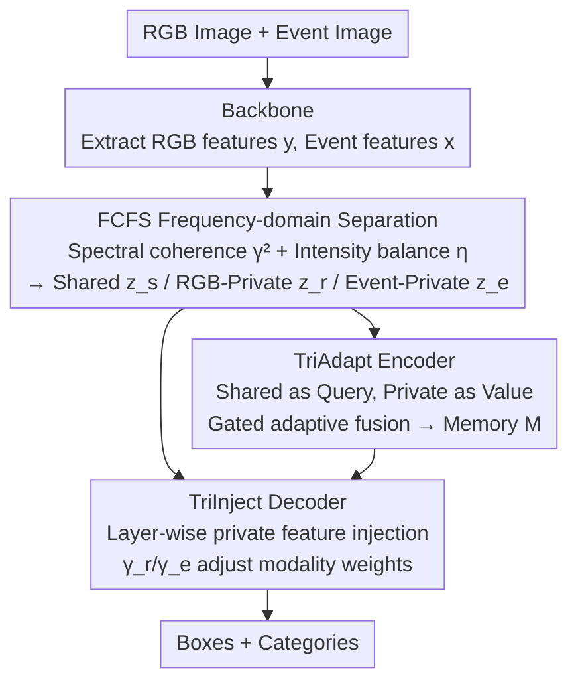

# Beyond Duality: A Hybrid Framework of Leveraging Shared and Private Features for RGB-Event Object Detection

**Conference**: CVPR 2026  
**Paper**: [CVF Open Access](https://openaccess.thecvf.com/content/CVPR2026/html/Wang_Beyond_Duality_A_Hybrid_Framework_of_Leveraging_Shared_and_Private_CVPR_2026_paper.html)  
**Code**: https://github.com/git-KeYw/SPFD  
**Area**: Object Detection / Multimodal Fusion  
**Keywords**: RGB-Event Detection, Shared-Private Feature Decoupling, Frequency Domain Coherence, DETR, Multimodal Fusion

## TL;DR
SPFD explicitly decouples RGB and event features into three streams—"Shared," "RGB-Private," and "Event-Private"—in the **frequency domain** using "spectral coherence." These features are then injected into a DETR-based encoder (via adaptive gated fusion of private features) and decoder (through layer-wise asymmetric injection), improving mAP on DSEC-Det from the SOTA of 30.4 to 34.6.

## Background & Motivation
**Background**: RGB-Event object detection combines frame-based cameras (capturing texture and static objects) with event cameras (sensitive to high speed, low light, and motion). This is particularly suitable for high-dynamic and poor-lighting scenarios like autonomous driving. The prevailing approach is "feature-level fusion," evolving from simple concatenation/interaction to Transformer-based models (e.g., SODFormer, CAFR) that model spatiotemporal dynamics for direct interaction.

**Limitations of Prior Work**: Existing methods aim to maximize the utilization of information **after fusion**. However, none explicitly treat "features shared by both modalities" and "features private to a specific modality" separately. Consequently, low-information regions in both modalities are processed uniformly, leading to redundant computation and the suppression of modality-specific cues due to over-emphasized shared features.

**Key Challenge**: In critical scenarios, "private" information unique to a single modality is often the life-saving factor. For instance, in low-light conditions, RGB cameras fail while only event cameras respond to motion (Event-private); conversely, when an object is static relative to the camera, the event stream has no response, and only RGB can perceive it (RGB-private). Indiscriminate fusion tends to drown these "modality-exclusive" signals in averaged representations.

**Goal**: This work aims to explicitly model and preserve modality-private features while retaining stable shared semantics, allowing the network to dynamically determine which modality to trust across different scenarios and semantic depths.

**Key Insight**: The authors observe that RGB and events naturally differ in their **spectral responses**—RGB energy is concentrated in low frequencies, while events are more sensitive to high frequencies. By utilizing "spectral coherence" in the frequency domain, they measure whether signals at each frequency synchronize: synchronization indicates shared semantics, while asynchrony indicates private details. This provides a physical basis for decoupling "shared vs. private" rather than relying on black-box learning.

**Core Idea**: Decouple dual-modal features into Shared / RGB-Private / Event-Private streams using spectral coherence, and integrate them appropriately into the DETR encoder and decoder to replace indiscriminate fusion.

## Method

### Overall Architecture
Given an RGB image $I \in \mathbb{R}^{W\times H\times 3}$ and a corresponding event image $E \in \mathbb{R}^{W\times H\times 3}$ (accumulated into three channels: positive, negative, and sum), SPFD adopts a DETR-style architecture. It outputs bounding boxes $B_i(x_i,y_i,w_i,h_i)$ and categories $C_i$ for $K$ objects. The network consists of three components:

1.  **FCFS Module** (Frequency-domain Coherence Feature Separation): A shared ResNet-50 backbone extracts event features $x$ and RGB features $y$. After transforming to the frequency domain via FFT, spectral coherence decouples them into shared feature $z_s$, RGB-private $z_r$, and Event-private $z_e$.
2.  **TriAdapt Encoder**: Uses shared features as queries and the two private streams as values for deformable attention. A learnable gate adaptively fuses the two private streams based on regional texture/motion characteristics to produce multi-layer memory.
3.  **TriInject Decoder**: Each decoding layer receives memory and re-injects private features. Layer-wise learnable scaling coefficients $\gamma_r, \gamma_e$ control the reliance on RGB vs. Event, achieving a hierarchical transition from spatial texture to temporal contours.

### Key Designs

**1. FCFS: A Physical Criterion for Shared vs. Private via Spectral Coherence**

To address the inability to distinguish shared and private features, FCFS eschews spatial domain learning for frequency-domain statistical criteria. First, a 2D FFT is applied: $X=\mathcal{F}(x),\ Y=\mathcal{F}(y)$. Then, power spectra and cross-spectra are calculated: $S_{xx}=|X|^2+\varepsilon,\ S_{yy}=|Y|^2+\varepsilon,\ S_{xy}=X\cdot\overline{Y}$. The core criterion is **spectral coherence** $\gamma^2$, measuring the linear correlation and synchronization of the signals at a specific frequency:

$$\gamma^2 = \frac{|S_{xy}|^2}{S_{xx}S_{yy}}$$

$\gamma^2 \to 1$ indicates high synchronization (similar structure/contours), categorized as shared semantics; $\gamma^2 \to 0$ indicates irrelevant responses (dynamic edges in events, lighting textures in RGB), categorized as private. Since RGB is low-frequency biased and events are high-frequency biased, an **intensity balance term** $\eta=\frac{\sqrt{S_{xx}S_{yy}}}{S_{xx}+S_{yy}+\varepsilon}$ is introduced to inhibit the dominant modality when energy is disproportionate, stabilizing the coherence estimation.

The shared mask is defined as $M_s=\sigma\left(\frac{\gamma^2\cdot\eta-\tau}{T}\right)$ ($\tau$ is a threshold, $T$ is temperature). Private masks $M_r$ and $M_e$ are allocated based on $(1-M_s)$ and the power distribution:

$$M_r=(1-M_s)\cdot\frac{|S_{xx}-S_{yy}|}{S_{xx}+S_{yy}+\varepsilon}\cdot\frac{S_{xx}}{S_{xx}+S_{yy}},\quad M_e=(1-M_s)\cdot\frac{|S_{xx}-S_{yy}|}{S_{xx}+S_{yy}+\varepsilon}\cdot\frac{S_{yy}}{S_{xx}+S_{yy}}$$

Finally, IFFT returns the features to the spatial domain: $z_s, z_r, z_e$. This ensures the shared branch retains consistent low-frequency semantics, while private branches preserve RGB textures or high-frequency instantaneous edges.

**2. TriAdapt Encoder: Region-based Gating for Modality Trust**

TriAdapt employs two-way multi-scale deformable attention (MSDA). It uses flattened shared features $z_s$ as queries and RGB-private $z_r$ or Event-private $z_e$ as values, yielding interactive results $U_r^{(l)}$ and $U_e^{(l)}$.

A **gated adaptive fusion** mechanism calculates a gating map $G^{(l)}=\sigma(W_g\bar U^{(l)})$ from the mean feature. This map controls the fusion ratio of private features across spatial and channel dimensions:

$$\tilde O^{(l)}=G^{(l)}\odot W_r U_r^{(l)}+(1-G^{(l)})\odot W_e U_e^{(l)}$$

Intuitively, the gate favors RGB in texture-rich static regions and event features in high-dynamic regions.

**3. TriInject Decoder: Layer-wise Asymmetric Injection for Box Refinement**

The authors observed that different decoder layers exhibit varying sensitivities—shallow layers require spatial texture, while deeper layers require temporal contours. TriInject re-injects private features into **every decoding layer**. In layer $l$, private features are projected and combined with **learnable scaling coefficients** $\gamma_r^{(l)}, \gamma_e^{(l)}$ to modulate their contribution:

$$V_f^{(l)}=M^{(l)}+\gamma_r^{(l)}V_r^{(l)}+\gamma_e^{(l)}V_e^{(l)}$$

This layer-specific linear modulation allows different depths to emphasize spatial vs. temporal cues, primarily benefiting localization precision (mAP75).

### Loss & Training
The model uses standard DETR prediction and bipartite matching loss. Utilizing a ResNet-50 backbone, it is trained on two RTX 4090s (batch 4 per GPU) for 100k iterations. The initial learning rate is $1\times10^{-4}$, decaying by a factor of 10 at 80k steps. Hyperparameters: $\varepsilon=10^{-6},\ \tau=0.25,\ T=0.2$. Data augmentation includes multi-scale training and random horizontal flips.

## Key Experimental Results

### Main Results
Performance was evaluated on DSEC-Det (8 object classes) and PKU-DAVIS-SOD (car/pedestrian/cyclist) against event-only, RGB-only, and multimodal baselines:

| Dataset | Metric | SPFD (Ours) | Prev. SOTA | Gain |
|--------|------|------|----------|------|
| DSEC-Det | mAP | 34.6 | 30.4 (SFNet) | +4.2 |
| DSEC-Det | mAP50 | 56.7 | 51.4 (SFNet) | +5.3 |
| PKU-DAVIS-SOD | mAP | 32.0 | 31.9 (SFNet) | +0.1 |
| PKU-DAVIS-SOD | mAP50 | 62.4 | 59.6 (SFNet) | +2.8 |

With 78.6M parameters, SPFD is comparable in size to other heavy fusion methods like CAFR (82.4M) and SODFormer (82.0M). Significant gains were observed on the DSEC-Det dataset.

### Ablation Study
Tested on the DSEC-Det test set (Baseline: multimodal extension of MI-DETR):

| ID | FCFS | TriAdapt | TriInject | mAP | mAP50 | mAP75 |
|----|------|------|------|------|-------|-------|
| #1 | – | – | – | 47.3 | 71.0 | 54.1 |
| #2 | ✓ | – | – | 47.9 | 71.8 | 55.0 |
| #3 | ✓ | ✓ | – | 49.0 | 74.3 | 56.0 |
| #4 | ✓ | ✓ | ✓ | 49.2 | 74.1 | 56.8 |

(Note: These absolute mAP values refer to the original DSEC-Det labels and are not directly comparable to the main results table.)

### Key Findings
- **TriAdapt Encoder provides the largest contribution**: Adding FCFS alone yields +0.6 mAP, but integrating private features via TriAdapt adds +1.1 mAP and significantly boosts mAP50, proving that adaptive gating is the primary driver of performance.
- **TriInject Decoder specializes in localization**: Moving from #3 to #4 increases mAP75 by +0.75 while mAP50 slightly decreases. This confirms that layer-wise injection acts as a box refinement mechanism.
- **Visualizing the gate validates design motivation**: Static near-field foregrounds lean toward RGB, while small or fast-moving targets lean toward Events. In low light, the gate shifts to Events, matching the "private feature rescue" hypothesis.

## Highlights & Insights
- **Transformation from black-box learning to physical criteria**: Using spectral coherence $\gamma^2$ as a decoupling criterion is more interpretable and prevents the model from being biased by a single dominant modality. This approach is transferable to other multimodal fusion tasks (e.g., RGB-IR).
- **Dual utilization of private features**: The encoder utilizes them **horizontally** (selection between modalities), while the decoder utilizes them **vertically** (allocation across layers), refining the fusion strategy across both spatial and depth dimensions.

## Limitations & Future Work
- **Marginal gains on PKU-DAVIS**: The benefits of private feature decoupling depend on the degree of modal complementarity in the dataset.
- **TriInject efficiency**: The overall mAP gain of +0.2 suggests diminishing returns for layer-wise injection; the trade-off between complexity and performance requires further analysis.
- **Computational overhead**: At 78.6M parameters, it is larger than SFNet (57.5M), and the overhead of FFT/IFFT operations remains unquantified concerning real-time performance.

## Related Work & Insights
- **vs. Indiscriminate Fusion (SODFormer, CAFR)**: While prior works focus on "fused features," SPFD preserves modality-exclusive details, making it more robust in corner cases like low light or relative stillness.
- **vs. DeCUR (Frequency Decoupling)**: Unlike self-supervised decoupling that doesn't explicitly use features for downstream tasks, SPFD directly integrates decoupled features into the detection pipeline.
- **vs. MI-DETR**: SPFD uses MI-DETR as a baseline and provides the FCFS+TriAdapt+TriInject suite as a dedicated multimodal extension for shared-private modeling.

## Rating
- Novelty: ⭐⭐⭐⭐ 
- Experimental Thoroughness: ⭐⭐⭐⭐
- Writing Quality: ⭐⭐⭐⭐
- Value: ⭐⭐⭐⭐

<!-- RELATED:START -->

## Related Papers

- [\[AAAI 2026\] Beyond Boundaries: Leveraging Vision Foundation Models for Source-Free Object Detection](../../AAAI2026/object_detection/beyond_boundaries_leveraging_vision_foundation_models_for_so.md)
- [\[CVPR 2026\] Spike-driven Discrete Aggregation for Event-based Object Detection](spike-driven_discrete_aggregation_for_event-based_object_detection.md)
- [\[CVPR 2026\] Towards Persistence: Learning Topological Constraints for Event-based Small Object Detection](towards_persistence_learning_topological_constraints_for_event-based_small_objec.md)
- [\[CVPR 2026\] When Transformers Meet Mamba: A Hybrid Transformer-Mamba Network for Video Object Detection](when_transformers_meet_mamba_a_hybrid_transformer-mamba_network_for_video_object.md)
- [\[CVPR 2025\] Efficient Event-Based Object Detection: A Hybrid Neural Network with Spatial and Temporal Attention](../../CVPR2025/object_detection/efficient_event-based_object_detection_a_hybrid_neural_network_with_spatial_and_.md)

<!-- RELATED:END -->
