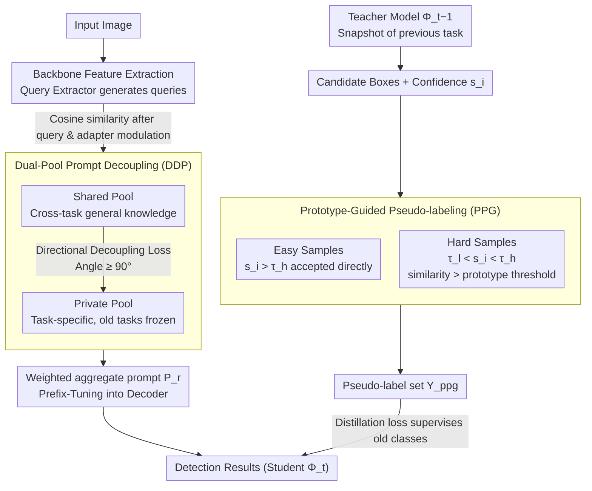

# Beyond Prompt Degradation: Prototype-Guided Dual-Pool Prompting for Incremental Object Detection

**Conference**: CVPR 2026  
**arXiv**: [2603.02286](https://arxiv.org/abs/2603.02286)  
**Code**: [Available](https://github.com/zyt95579/PDP_IOD/tree/main)  
**Area**: Object Detection  
**Keywords**: Incremental Object Detection, Prompt Learning, Dual-pool Paradigm, Prototype Pseudo-labeling, Catastrophic Forgetting

## TL;DR

The PDP framework is proposed to address prompt degradation caused by prompt coupling and prompt drift in incremental object detection. By utilizing dual-pool prompt decoupling (shared pool + private pool) and Prototype-Guided Pseudo-labeling (PPG), the method achieves SOTA performance on MS-COCO and PASCAL VOC.

## Background & Motivation

Incremental Object Detection (IOD) requires models to continuously learn new categories without accessing old data while maintaining detection performance on previous classes. Prompt-based methods have gained attention for being parameter-efficient and replay-free, yet they face two core problems:

**Prompt Coupling**: Existing methods adopt a single-prompt pool paradigm where task-generic and task-specific prompts are mixed in the same pool, leading to competition and interference within a limited parameter space.

**Prompt Drift**: In the IOD setting, old foreground objects are often labeled as "background" in subsequent tasks. This supervisory inconsistency forces optimized prompts to drift toward incorrect semantic directions.

**Limitations of Prior Work**: Existing pseudo-labeling methods rely on fixed confidence thresholds, which fail to adapt to distribution variances across different categories, further exacerbating drift.

## Method

### Overall Architecture

PDP aims to solve "prompt degradation" in IOD: when learning new classes, old class prompts are both crowded out by new tasks (coupling) and misled by incorrect background supervision (drift). Built upon Deformable-DETR, it employs a teacher-student distillation architecture. The student model learns the current task, while the teacher model (a snapshot of the previous task) generates pseudo-labels for old objects to feed back knowledge and prevent forgetting. The pipeline is as follows: images are processed by a backbone to extract features $\rightarrow$ a query extractor generates queries $\rightarrow$ queries retrieve and aggregate a set of prompts $P_r$ from two prompt pools, which are injected into the decoder via Prefix-Tuning $\rightarrow$ the decoder outputs detection results. Two core modules address the specific issues: Dual-Pool Prompt Decoupling (DDP) separates generic and task-specific knowledge to treat "coupling," while Prototype-Guided Pseudo-labeling (PPG) retrieves old object pseudo-labels in the embedding space using class prototypes to treat "drift."

### Key Designs

**1. Dual-Pool Prompt Decoupling (DDP): Separating "Shared" and "Private" knowledge to prevent parameter competition**

Prior methods mixed task-generic and task-specific prompts, causing competition within finite parameter spaces—the root of prompt coupling. DDP splits the pool. The shared pool holds learnable prompts $P_s \in \mathbb{R}^{N_s \times L_p \times D}$, corresponding key vectors $K_s$, and a query adapter $A_s$. It is shared and updated across all tasks to consolidate general visual knowledge (e.g., "what is an object" and "how to localize"), facilitating forward transfer. The private pool provides separate parameters $(P_p^t, K_p^t, A_p^t)$ for each task. During training, only the current task's parameters are updated while old ones are frozen, ensuring that task-specific knowledge does not overwrite old prompts. The private pool size $N_p$ is dynamically adjusted based on the number of new classes.

During retrieval, queries are modulated by the query adapter via Hadamard product, and cosine similarity is calculated with key vectors from both pools to aggregate prompt $P_r$ via weighted summation. To ensure the pools learn complementary information, a Directional Decoupling Loss is applied:

$$\mathcal{L}_{DDL} = \lambda_{ddl} \cdot \frac{2}{|N_s||N_p|} \sum_{i,j} \max(0, \theta_{ddl} - \theta_{i,j})$$

With $\theta_{ddl} = 90°$, a penalty is applied if the angle between any pair of vectors from the different pools is less than 90°, forcing the shared and private pools to learn orthogonal representations.

**2. Prototype-Guided Pseudo-labeling (PPG): Using class prototypes in embedding space to recover old objects**

Prompt drift is caused by supervisory inconsistency: old foreground objects are treated as "background" in new task annotations. Standard teacher-based pseudo-labeling relies on fixed confidence thresholds, which miss low-confidence targets or include noise due to varying category distributions. PPG instead performs verification in the feature space. It creates a prototype for each old class by averaging instance query embeddings $f_i$ from the last decoder layer for correctly classified instances:

$$p_c = \frac{1}{|F_c|}\sum_{f_i \in F_c} f_i$$

Prototypes are updated only at the final epoch of each task to ensure they are calculated from stable, converged features.

Pseudo-labels undergo two-level verification: detections with confidence $s_i > \tau_h$ (0.5) are "Easy Samples" and are accepted immediately. Detections with $\tau_l < s_i < \tau_h$ (0.2 to 0.5) are "Hard Samples"; these are retained only if the similarity between their feature and the corresponding class prototype exceeds a threshold. This retains targets that are semantically close to old classes even with low confidence, effectively suppressing drift.

### Loss & Training

The total loss consists of DETR detection loss, query regularization, directional decoupling loss, and distillation loss:

$$\mathcal{L} = \mathcal{L}_{DETR} + \mathcal{L}_Q + \mathcal{L}_{DDL} + \mathcal{L}_{DKD}(Y_{ppg})$$

- $\lambda_{ddl} = 0.15$, $\lambda_Q = 0.1$
- Shared pool: 100 prompts; Private pool size equals the total number of dataset categories.
- Confidence thresholds: $\tau_h = 0.5$, $\tau_l = 0.2$. Prototype similarity threshold: $\theta_s = 0.5$.

## Key Experimental Results

### Main Results

**Table 1: MS-COCO Multi-step Incremental Setting (4 tasks)**

| Method | Task4 mAP@P | Task4 mAP@C | Task4 mAP@A |
|------|------------|------------|------------|
| MD-DETR | 51.5 | 52.7 | 50.2 |
| OWOBJ | 49.4 | 38.8 | 43.9 |
| **PDP (Ours)** | **61.3 (+9.8)** | **55.8 (+3.1)** | **59.4 (+9.2)** |

**Table 3: PASCAL VOC Incemental Settings**

| Method | 10+10 mAP@A | 15+5 mAP@A | 19+1 mAP@A |
|------|-------------|-------------|-------------|
| MD-DETR | 73.2 | 76.7 | 76.1 |
| RGR | 75.8 | 73.4 | 75.4 |
| **PDP (Ours)** | **78.7 (+2.9)** | **78.0 (+1.3)** | **79.4 (+3.3)** |

### Ablation Study

**Module Contribution (Table 4, COCO Task4 mAP@A)**:

| Configuration | mAP@P | mAP@A |
|------|-------|-------|
| Private Pool (PP) only | 46.0 | 46.0 |
| PP + SP + DDL | 56.9 | 55.1 |
| PP + PPG | 59.9 | 58.3 |
| PP + SP + PPG + DDL (Full) | **61.3** | **59.4** |

PPG improves old knowledge retention (mAP@P) by +13.9% and new class adaptation (mAP@C) by +2.7%.

### Key Findings

1. PPG performance is stable across various similarity thresholds (0.5/0.6/0.7), suggesting hard samples naturally align with prototypes.
2. The optimal configuration is $N_s=100$ and $N_p=80$; an oversized shared pool (160) introduces redundancy and degrades performance.
3. In the VOC 19+1 setting, PDP achieves 70.1% mAP@P, demonstrating accurate detection of old category objects.

## Highlights & Insights

1. **Precise Problem Modeling**: Decouples prompt degradation into "coupling" and "drift" as independent, addressable issues.
2. **Prototype Space vs. Confidence Threshold**: Matching prototypes in the embedding space avoids the failure of fixed thresholds when category distributions differ.
3. **End-to-End Framework**: Unlike PseDet, which requires additional inference and clustering steps, PDP is fully end-to-end.

## Limitations & Future Work

1. Slightly lower performance than PseDet in the 70+10 two-step setting (42.9 vs 44.7 AP), indicating room for improvement in large-step increments.
2. Prototypes are updated only at the end of each task; early-stage training may use inaccurate prototypes.
3. Private pool parameters grow linearly with the number of tasks; parameter management for long sequences requires attention.
4. Validated only on DETR-based architectures; applicability to one-stage detectors like YOLO remains unknown.

## Related Work & Insights

- **MD-DETR**: Baseline for PDP, using a single memory bank and Task ID for prompt isolation.
- **DualPrompt**: Distinguishes between General/Expert prompts but still manages them within a single pool paradigm.
- **PseDet**: Uses k-means for adaptive thresholds in pseudo-labeling; non-end-to-end.
- The dual-pool design can be generalized to other continuous learning tasks like incremental segmentation.

## Rating

- **Novelty**: ★★★★☆
- **Technical Depth**: ★★★★☆
- **Experimental Thoroughness**: ★★★★★
- **Writing Quality**: ★★★★☆

<!-- RELATED:START -->

## Related Papers

- [\[CVPR 2026\] Parameterized Prompt for Incremental Object Detection](parameterized_prompt_for_incremental_object_detection.md)
- [\[CVPR 2026\] Incremental Object Detection via Future-Aware Decoupled Cross-Head Distillation](incremental_object_detection_via_future-aware_decoupled_cross-head_distillation.md)
- [\[AAAI 2026\] YOLO-IOD: Towards Real Time Incremental Object Detection](../../AAAI2026/object_detection/yolo-iod_towards_real_time_incremental_object_detection.md)
- [\[CVPR 2026\] BDNet: Bio-Inspired Dual-Backbone Small Object Detection Network](bdnetbio-inspired_dual-backbone_small_object_detection_network.md)
- [\[CVPR 2026\] Visual Prototype Conditioned Focal Region Generation for UAV-Based Object Detection](visual_prototype_conditioned_focal_region_generation_for_uav-based_object_detect.md)

<!-- RELATED:END -->
