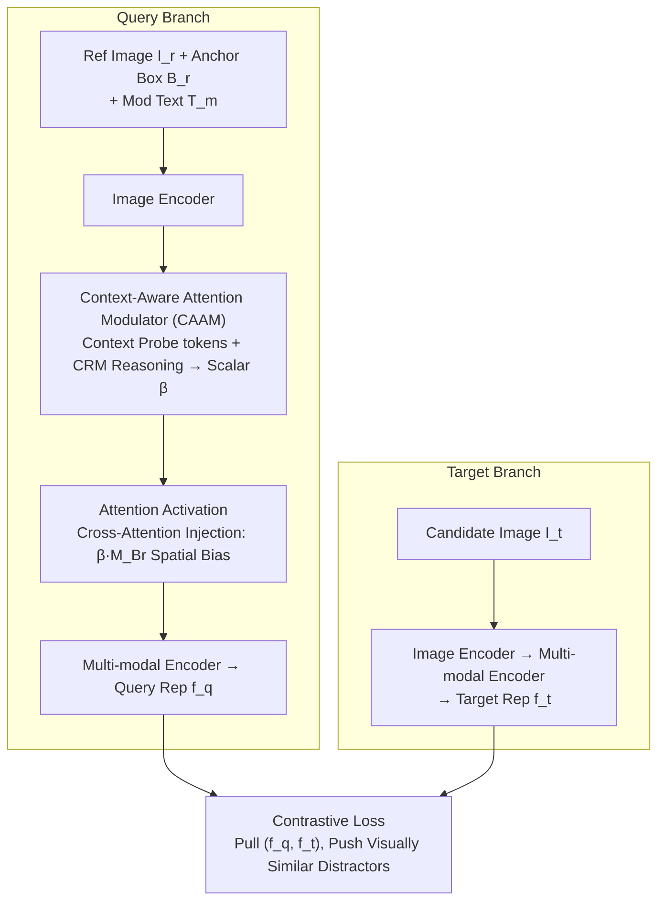

# Beyond Semantic Search: Towards Referential Anchoring in Composed Image Retrieval

**Conference**: CVPR 2026  
**arXiv**: [2604.05393](https://arxiv.org/abs/2604.05393)  
**Code**: [Project Page](https://hahajun1101.github.io/OACIR/)  
**Area**: Object Detection / Image Retrieval  
**Keywords**: Composed Image Retrieval, Instance-level Consistency, Attention Modulation, Fine-grained Retrieval, Visual Anchoring

## TL;DR
This paper proposes the Object-Anchored Composed Image Retrieval (OACIR) task, the OACIRR large-scale benchmark (160K+ quadruplets), and the AdaFocal framework. AdaFocal adaptively enhances focus on anchored instance regions through a Context-Aware Attention Modulator, significantly outperforming existing methods in instance-level retrieval fidelity.

## Background & Motivation
**Background**: Composed Image Retrieval (CIR) enables flexible retrieval through multi-modal queries (reference image + modification text) and is widely used in e-commerce and interactive search.

**Limitations of Prior Work**: CIR inherently prioritizes semantic matching, using the reference image only as a coarse-grained visual anchor. When visually similar distractors exist, it **fails to reliably retrieve the specific instance** designated by the user.

**Goal**: In scenarios such as digital memory retrieval and long-term identity tracking, ensuring **fidelity to a specific instance** is more critical than broad semantic alignment.

**Key Challenge**: The model must simultaneously perform (1) compositional reasoning across three information sources (anchored instance + global scene + text modification) and (2) precise differentiation of target instances from a gallery filled with visually similar distractors.

**Core Idea**: Elevate CIR from the semantic level to the instance level through explicit bounding box visual anchoring and an adaptive attention enhancement mechanism.

## Method

### Overall Architecture
AdaFocal ensures that composed image retrieval matches not just "look-alike" semantics but also the **specific instance** designated by a bounding box. It utilizes a dual-branch contrastive retrieval architecture. The query branch processes three sources: reference image $I_r$, bounding box $B_r$ anchoring the instance, and modification text $T_m$. The image passes through an encoder, after which the CAAM module predicts a modulation scalar $\beta$ based on the current query context. This $\beta$ is injected as a bias during cross-attention to amplify or converge focus on the instance region. Finally, a multi-modal encoder produces the query representation $f_q$. The target branch is simpler: the candidate image $I_t$ passes through image and multi-modal encoders to obtain $f_t$. During training, a contrastive loss minimizes the distance between corresponding $(f_q, f_t)$ pairs while pushing away distractors. The key design is that "the intensity of instance focus is not fixed but dynamically determined by $\beta$." (Training data is derived from the OACIRR benchmark; the diagram illustrates the AdaFocal model forward pass).

### Key Designs

**1. Context-Aware Attention Modulator (CAAM): Adaptive Instance Focus Based on Query Context**

A naive approach would be to apply fixed weighting to the instance region, but this conflicts with compositional reasoning. If the text requires a significant scene change ("Put this dress on a beach"), strictly focusing on the instance limits semantic flexibility. Conversely, if only the background changes while the instance remains identical, attention should be locked onto the instance. CAAM delegates this judgment to the model: it injects $K$ learnable **context probe tokens** alongside the reference image and text into the multi-modal encoder. These probes absorb contextual cues and are aggregated by a Transformer-based Context Reasoning Module (CRM) to linearly map to a scalar $\beta$. This $\beta$ represents the dynamic trade-off between "instance vs. scene" for each specific query.

**2. Attention Activation: Injecting $\beta$ as a Spatial Bias in Cross-Attention**

To apply $\beta$ to the retrieval representation, AdaFocal adds a bias term scaled by $\beta$ to the binary mask $M_{B_r}$ (spatially aligned with the bounding box) within the query branch's cross-attention:

$$\{\hat{q}_m\} = \text{Softmax}\!\left(\frac{QK^T + \beta \cdot M_{B_r}}{\sqrt{d_k}}\right)V$$

When $\beta > 0$, logits of tokens within the box are increased before the softmax, naturally concentrating attention on the instance region. Larger $\beta$ values produce stronger focus, while $\beta \to 0$ reverts to standard semantic attention. This "additive bias + binary mask" approach avoids extra learnable attention heads, achieving spatial adaptive focus using only a single scalar.

**3. OACIRR Benchmark Construction: Testing Instance Discrimination**

Since standard CIR data lacks instance labels, a four-stage pipeline was designed to produce quadruplets $(I_r, B_r, T_m, I_t)$. **Stage 1 (Image Pair Collection)**: Select "same instance, different context" pairs across Fashion, Cars, Products, and Landmarks. **Stage 2 (Filtering)**: Remove near-identical pairs and category-centric images. **Stage 3 (Quadruplet Annotation)**: Generate modification text using MLLMs and provide instance bounding boxes via grounding models. **Stage 4 (Gallery Construction)**: Mine hard-negatives (category-related but different instances) to transform the task from "finding the right category" to "finding the right individual."

### Loss & Training
- **Contrastive Alignment Loss**: In-batch contrastive learning to maximize cosine similarity of correct query-target pairs.
- **Differentiated Learning Rates**: 1e-4 for CAAM, 1e-5 for multi-modal encoders.
- **Temperature Parameter**: $\tau = 0.07$.

## Key Experimental Results

### Main Results (OACIRR Benchmark, ViT-G Backbone)

| Method | Fashion $R_{ID}@1$ | Car $R_{ID}@1$ | Product $R_{ID}@1$ | Landmark $R_{ID}@1$ | Avg |
|------|-----------|----------|------------|-------------|-----|
| GME (7B) | 44.98 | 63.11 | 83.44 | 77.11 | 62.53 |
| SPRC (CIRR Trained) | 28.62 | 25.13 | 54.39 | 40.41 | 37.30 |
| SPRC (OACIRR Trained) | 65.25 | 72.87 | 86.05 | 76.32 | 74.05 |
| **AdaFocal** | **77.15** | **78.42** | **91.86** | **82.92** | **79.00** |

### Ablation Study

| Configuration | $R_{ID}@1$ | R@1 | Avg | Note |
|------|-----------|-----|-----|------|
| w/o CAAM ($\beta=0$) | 77.74 | 58.39 | 74.91 | Baseline |
| Avg Pooling + Frozen Probes | 79.70 | 59.84 | 76.39 | Simple aggregation is insufficient |
| Transformer CRM + Learnable Probes | **82.59** | **62.88** | **79.00** | Reasoning capability + Task adaptation |

### Key Findings
- Training on the OACIRR dataset causes SPRC's performance to jump from 37.30% to 74.05%, showing that **instance consistency data** is crucial.
- AdaFocal provides a further +4.95% boost, proving the effectiveness of **adaptive attention modulation**.
- The gap between $R@1$ and $R_{ID}@1$ reveals that the primary failure mode of existing methods is **instance misidentification**.

## Highlights & Insights
- Advancing CIR from semantic-level to instance-level marks a significant paradigm shift in retrieval.
- OACIRR is the first large-scale instance-level composed retrieval benchmark spanning four domains, offering high value to the community.
- The context-aware modulation of CAAM elegantly balances instance fidelity with compositional reasoning.

## Limitations & Future Work
- Bounding box annotation increases user interaction costs; future work could explore automatic instance anchoring.
- Currently supports only single-instance anchoring; multi-instance scenarios remain to be explored.
- Video-level instance tracking and retrieval have not yet been investigated.

## Related Work & Insights
- Shares the instance-consistency goal with ReID (Person Re-identification) but is more generalized.
- The attention bias injection is inspired by generative models (e.g., Prompt-to-Prompt) and successfully migrated to retrieval.
- Directly applicable to product search and digital asset management.

## Rating
- Novelty: ⭐⭐⭐⭐⭐ New task + new benchmark + new method.
- Experimental Thoroughness: ⭐⭐⭐⭐⭐ Cross-paradigm comparisons, detailed ablation, and complete qualitative analysis.
- Writing Quality: ⭐⭐⭐⭐ Clear structure and detailed dataset construction process.
- Value: ⭐⭐⭐⭐⭐ The problem definition and benchmark contributions will drive the field forward.

<!-- RELATED:START -->

## Related Papers

- [\[CVPR 2026\] Beyond Caption-Based Queries for Video Moment Retrieval](beyond_caption-based_queries_for_video_moment_retrieval.md)
- [\[CVPR 2025\] Search and Detect: Training-Free Long Tail Object Detection via Web-Image Retrieval](../../CVPR2025/object_detection/search_and_detect_training-free_long_tail_object_detection_via_web-image_retriev.md)
- [\[CVPR 2026\] MRD: Multi-resolution Retrieval-Detection Fusion for High-Resolution Image Understanding](mrd_multi-resolution_retrieval-detection_fusion_for_high-resolution_image_unders.md)
- [\[CVPR 2026\] Parameter-Efficient Semantic Augmentation for Enhancing Open-Vocabulary Object Detection](parameter-efficient_semantic_augmentation_for_enhancing_open-vocabulary_object_d.md)
- [\[ICLR 2026\] Unbiased Object Detection Beyond Frequency with Visually Prompted Image Synthesis](../../ICLR2026/object_detection/unbiased_object_detection_beyond_frequency_with_visually_prompted_image_synthesi.md)

<!-- RELATED:END -->
