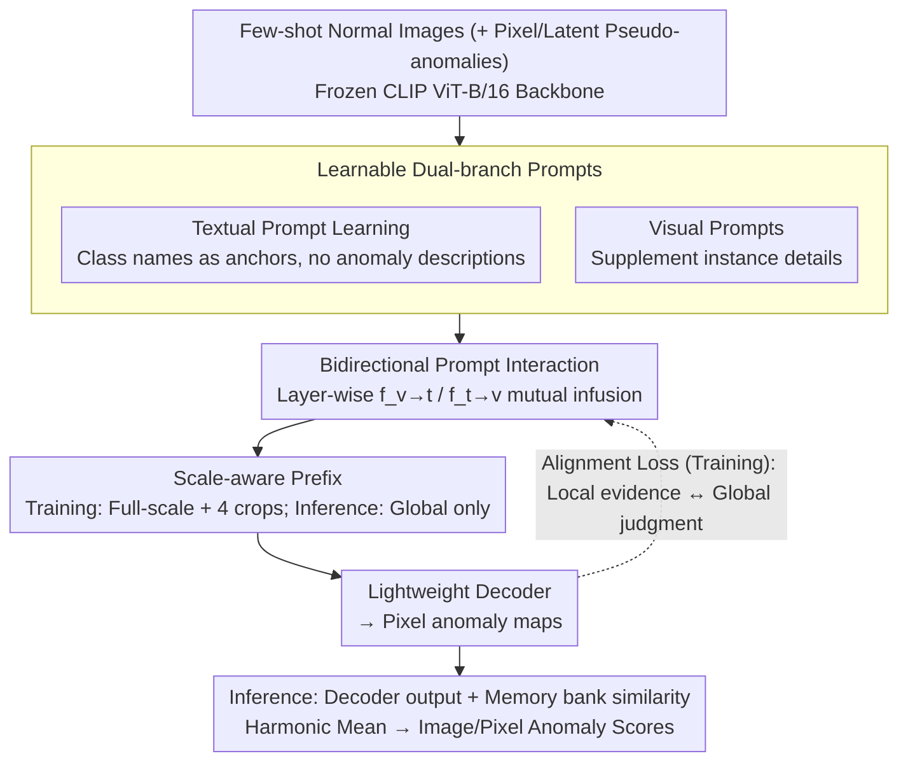

# Bidirectional Multimodal Prompt Learning with Scale-Aware Training for Few-Shot Multi-Class Anomaly Detection

**Conference**: CVPR 2026  
**arXiv**: [2408.13516](https://arxiv.org/abs/2408.13516)  
**Code**: None  
**Area**: Object Detection  
**Keywords**: Few-shot Anomaly Detection, Multi-class Unified Model, Bidirectional Prompt Learning, Scale-aware, CLIP

## TL;DR
AnoPLe is proposed as a lightweight multimodal bidirectional prompt learning framework. Without requiring manual anomaly descriptions or external auxiliary modules, it achieves few-shot multi-class anomaly detection through bidirectional text-visual prompt interaction and scale-aware prefixes, maintaining competitive performance on MVTec-AD/VisA/Real-IAD while ensuring efficient inference (~28 FPS).

## Background & Motivation
**Background**: Industrial anomaly detection is shifting from "one-model-per-category" to more practical **few-shot + multi-class** unified models. Few-shot MCAD requires: (a) only a few normal samples per category; (b) a single model covering multiple product categories.

**Limitations of Prior Work**:
   - WinCLIP relies on manual prompt templates, lacking flexibility.
   - PromptAD depends on category-specific anomaly descriptions (e.g., "broken fabric," "missing wire"). In multi-class scenarios, descriptions cause semantic conflicts, with t-SNE showing collapse and overlap of anomaly features.
   - IIPAD utilizes a large Q-Former to generate instance prompts, resulting in high computational overhead.

**Key Insight**: (a) **Normality is shared across categories** (intact, uncontaminated, geometrically regular); (b) abnormality is highly **category-dependent**; (c) the category name itself serves as a strong semantic prior (as validated by the CCL paper).

**Core Idea**: Only category names are used as text anchors (without describing anomaly types). Category-aware and anomaly-type-agnostic representations are automatically learned through **bidirectional interaction** between text and visual prompts.

## Method

### Overall Architecture
AnoPLe addresses few-shot multi-class anomaly detection: given only a few normal images per product category, a unified model must cover all categories. The approach involves attaching two sets of learnable prompts—textual and visual—to a frozen CLIP backbone, allowing bidirectional interaction at each layer. The text side uses category names as semantic anchors without explicit anomaly descriptions, while the visual side supplements instance-level details. Beyond prompt interaction, a scale-aware prefix layer is added; the model processes both full images and cropped sub-images during training but only uses the global branch during inference, capturing multi-scale information without increasing deployment costs. Finally, a lightweight decoder resolves interacted features into pixel-level anomaly maps. During training, an alignment loss ensures consistency between local evidence and global judgment. During inference, the decoder output and memory bank similarity are fused into final image/pixel anomaly scores.

### Key Designs

**1. Textual Prompt Learning: Class names as anchors, no anomaly descriptions**

Methods like PromptAD rely on category-specific descriptions ("broken fabric"), which cause semantic conflicts in multi-class settings. AnoPLe constructs prompts using only category names: the normal end $\mathbf{e}_0^+ = [\texttt{class}]$ and the abnormal end $\mathbf{e}_0^- = [\texttt{abnormal}][\texttt{class}]$. Both share a set of learnable context vectors $\mathbf{P}_0^t$ injected as deep prompts layer by layer. This preserves complete category prototypes on the normal side while initializing the abnormal side with the "non-normal" prior implicitly encoded in CLIP, subsequently refined through visual interaction. This avoids manual anomaly words and description pool conflicts.

**2. Bidirectional Prompt Interaction: Infusing category structure and instance details**

Learning only text prompts lacks instance details, while learning only visual prompts lacks category structure. AnoPLe uses two learnable linear projections $f_{v\rightarrow t}$ and $f_{t\rightarrow v}$ at each layer $j$ to fuse prompts from both modalities:

$$\tilde{\mathbf{P}}_j^t = [\mathbf{P}_j^t, f_{v\rightarrow t}(\mathbf{P}_j^v)], \quad \tilde{\mathbf{P}}_j^v = [\mathbf{P}_j^v, f_{t\rightarrow v}(\mathbf{P}_j^t)]$$

The text side feeds category priors to the visual side, and the visual side feeds instance clues back to the text, forming a complementary loop. Ablation shows that T→I (84.2% VisA I-AUC) and I→T (82.0%) are significantly outperformed by bidirectional T↔I (86.0%).

**3. Scale-aware Prefix: Multi-scale training, zero extra cost at inference**

Industrial defects range from large contaminations to tiny scratches. AnoPLe places the multi-scale burden entirely on the training side. In addition to the full-resolution image $I_0$ (240×240), four non-overlapping sub-images $I_1,\dots,I_4$ (480×480 crops) are used. Each scale is assigned a learnable prefix $c \in \mathbb{R}^{(N+1)\times d_v}$. During inference, only the global prefix is retained, internalizing multi-scale benefits into network weights without requiring multiple forward passes. Ablation confirms this: single-scale without prefix (89.9%) → multi-scale without prefix (91.8%) → multi-scale with prefix (94.5%).

**4. Alignment Loss: Enforcing consistency between local evidence and global judgment**

The pixel-level decoder and global [CLS] representation may yield contradictory judgments. The alignment loss binds them: the predicted anomaly map $\hat{\mathbf{M}}$ is used to perform weighted aggregation of pixel-level distances to obtain an evidence vector $\mathbf{s}$, which is then aligned with the global representation $\mathbf{z}_0$:

$$\mathbf{s} = \sum_{(i,j)} \hat{\mathbf{M}}_{ij} \circ D_{ij}(\mathbf{z}), \quad \mathcal{L}_{align} = 1 - \langle \mathbf{z}_0, \mathbf{s} \rangle$$

This is crucial for large-scale datasets; on Real-IAD (30 categories), removing this term drops VisA-setting I-AUC from 86.0% to 73.3%, indicating that more categories lead to higher global-local conflict.

### Loss & Training
- $\mathcal{L} = \mathcal{L}_{pixel} + \mathcal{L}_{img} + \mathcal{L}_{align}$
- Pixel-level: Dice loss + Focal loss.
- Image-level: Contrastive cross-entropy (using pseudo-anomalies from pixel-space and latent-space perturbations).
- Inference: Merges memory bank similarity and decoder output via harmonic mean.

## Key Experimental Results

### Main Results (1-shot Multi-class AD)

| Method | MVTec I-AUC | MVTec P-PRO | VisA I-AUC | VisA P-PRO | Real-IAD I-AUC |
|------|------------|------------|-----------|-----------|---------------|
| PatchCore | 66.5 | 66.9 | 69.8 | 70.0 | 59.3 |
| WinCLIP | 77.5 | 70.8 | 70.0 | 61.2 | 69.4 |
| PromptAD | 91.2 | 86.1 | 82.4 | 77.8 | 52.2 |
| INP-Former | 94.7 | 90.7 | 84.0 | 84.0 | **84.4** |
| **AnoPLe** | 94.5 | **90.8** | **86.0** | **87.5** | 81.2 |

### Ablation Study

| Setting | MVTec I-AUC | VisA I-AUC | Explanation |
|------|-----------|-----------|------|
| Text-only Prompt | 93.0 | 81.7 | Lacks instance details |
| Visual-only Prompt | 90.3 | 82.0 | Lacks category structure |
| T→I Unidirectional | 93.5 | 84.2 | Text guides vision |
| **T↔I Bidirectional** | **94.5** | **86.0** | Bidirectional complement is optimal |
| W/O Alignment Loss | 93.7 | 86.0→73.3(Real-IAD) | Massive impact on Real-IAD |
| W/O Multi-scale/Prefix | 89.9 | 82.3 | Indispensable |

### Key Findings
- AnoPLe leads on VisA (the most challenging cross-category benchmark) with 86.0% I-AUC and 87.5% P-PRO, significantly exceeding PromptAD.
- Unseen Category Generalization (leave-one-class-out): AnoPLe drops only 6.3% on held-out MVTec classes, compared to a 26.2% drop for INP-Former.
- Unseen Anomaly Type Generalization: PromptAD drops significantly (-10.0 on screw) without descriptions, while AnoPLe remains unaffected.
- Inference speed is ~28 FPS, much faster than IIPAD (which requires extra Q-Former passes).

## Highlights & Insights
- **Simplicity**: No anomaly descriptions or external heavy modules are needed; SOTA performance is achieved via category names and bidirectional interaction.
- The "multi-scale training + global-only inference" design of the scale-aware prefix effectively resolves the efficiency-accuracy trade-off.
- The paper emphasizes the often-overlooked asymmetry: "Shared Normality vs. Category-Dependent Abnormality."
- Alignment loss contributes most significantly to large-scale multi-class data (Real-IAD with 30 categories).

## Limitations & Future Work
- Behind INP-Former by ~3% on Real-IAD; pure vision methods might be better suited for certain scenarios.
- The performance floor is limited by the CLIP ViT-B/16+ backbone; larger backbones might offer further improvements.
- Pseudo-anomaly generation strategies (pixel/latent perturbations) may not perfectly mimic real defects.
- Zero-shot settings (completely no normal samples) were not explored.

## Related Work & Insights
- Consistent with CCL (Category-aware Contrastive Learning): category semantics are strong priors for organizing multi-class representations.
- Bidirectional prompt interaction can be generalized to other VLM adaptation tasks, such as medical image analysis.
- The scale-aware training strategy is valuable for any task requiring multi-scale reasoning under efficiency constraints.
- Successful generalization to the medical domain (e.g., fundus/X-ray images) validates the framework's versatility.

## Rating
- Novelty: ⭐⭐⭐⭐ Bidirectional interaction and scale-aware prefixes are novel, though the framework follows the VLM prompt tuning paradigm.
- Experimental Thoroughness: ⭐⭐⭐⭐⭐ Comprehensive coverage across three benchmarks, multi-shot settings, generalization experiments, t-SNE, and attention analysis.
- Writing Quality: ⭐⭐⭐⭐ Motivations are clear with thorough comparisons to existing methods.
- Value: ⭐⭐⭐⭐⭐ Highly practical—lightweight, efficient, and independent of expert knowledge, making it suitable for industrial deployment.

<!-- RELATED:START -->

## Related Papers

- [\[CVPR 2026\] SubspaceAD: Training-Free Few-Shot Anomaly Detection via Subspace Modeling](subspacead_training-free_few-shot_anomaly_detection_via_subspace_modeling.md)
- [\[CVPR 2026\] GS-CLIP: Zero-shot 3D Anomaly Detection by Geometry-Aware Prompt and Synergistic View Representation Learning](gs-clip_zero-shot_3d_anomaly_detection_by_geometry-aware_prompt_and_synergistic_.md)
- [\[CVPR 2026\] Defect Cue-Preserved Structural Feature Refinement for Few-Shot Anomaly Detection](defect_cue-preserved_structural_feature_refinement_for_few-shot_anomaly_detectio.md)
- [\[CVPR 2026\] Learning Multi-Modal Prototypes for Cross-Domain Few-Shot Object Detection](learning_multi-modal_prototypes_for_cross-domain_few-shot_object_detection.md)
- [\[CVPR 2026\] MMR-AD: A Large-Scale Multimodal Dataset for Benchmarking General Anomaly Detection with MLLMs](mmrad_multimodal_anomaly_detection.md)

<!-- RELATED:END -->
