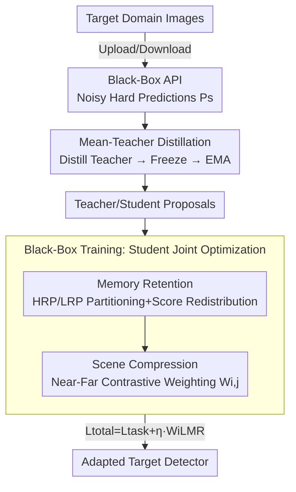

# Black-Box Domain Adaptation for Object Detection with Retention-Driven Knowledge Compression

**Conference**: CVPR 2026  
**Paper**: [CVF Open Access](https://openaccess.thecvf.com/content/CVPR2026/html/Lu_Black-Box_Domain_Adaptation_for_Object_Detection_with_Retention-Driven_Knowledge_Compression_CVPR_2026_paper.html)  
**Code**: None (Not provided in the paper)  
**Area**: Object Detection / Domain Adaptation  
**Keywords**: Black-Box Domain Adaptation, Object Detection, Lifelong Learning, Mean-Teacher, Contrastive Learning  

## TL;DR
Under the strictest privacy constraints where only a cloud-based black-box API is accessible (no source data or source model weights), this paper proposes RDKC for cross-domain object detection. Inspired by the "active forgetting + selective consolidation" mechanisms in lifelong learning, RDKC utilizes Memory Retention (MR) to partition candidate boxes by reliability and redistribute prediction scores for noise resistance, and Scene Compression (SC) to guide fine-grained localization through near-far contrastive weighting. RDKC consistently outperforms previous BBDA SOTA methods across four cross-domain benchmarks (e.g., +4.2 mAP gain over DINE on Cityscapes→Foggy).

## Background & Motivation
**Background**: Mainstream cross-domain object detection relies on Unsupervised Domain Adaptation (UDA), which requires simultaneous access to labeled source data and unlabeled target data. To protect privacy, Source-Free Domain Adaptation (SFDA) emerged, requiring only the source model and target data. Most recently, Black-Box Domain Adaptation (BBDA) further restricts access—even source model weights are unavailable. Users can only upload target images to a cloud API and download **noisy hard predictions** (bounding boxes + categories, with no probability distributions or gradients), providing the highest privacy and deployment flexibility.

**Limitations of Prior Work**: Existing BBDA studies targeting image classification treat it as a "global image-to-category" mapping, whereas detection requires simultaneous local localization (bounding boxes) and local classification. Existing BBDA strategies lack optimization for localization. More critically, these classification methods rely on means like adaptive label smoothing to store "global features of the entire image" for cumulative prediction, which is fundamentally incompatible with the **region-wise and dynamic** prediction mechanism in detection. BiMem, the only previous BBDA work in detection, was adapted from the classification method DINE and lacks a complete detection-specific solution.

**Key Challenge**: Noisy labels downloaded from the black-box remain **static** throughout the adaptation process. Direct application of SFDA self-training leads the model to repeatedly overfit these fixed noises, resulting in limited performance gains (Figure 2 shows this as the root cause of SFDA degradation under black-box settings). The core contradiction lies in simultaneously **extracting reliable information** from noisy predictions, **suppressing noise**, and preventing **catastrophic forgetting** of learned knowledge during iterative training.

**Goal**: ① Tailor a BBDA mechanism specifically for detection (rather than classification); ② Achieve both noise resistance and knowledge retention under static noisy labels; ③ Enhance fine-grained localization and perception of bounding boxes.

**Key Insight**: The authors draw inspiration from "lifelong learning" in behavioral science—viewing human memory as a dynamic adaptive system sustained by three processes: active forgetting (discarding low-value information), selective consolidation (strengthening high-value neural pathways), and cross-modal synergistic integration (coordinating outputs of robust and non-robust subsystems). This perspective is promising because it naturally models "forgetting noise vs. retaining knowledge" as a dynamic balance, addressing the core challenge of BBDA.

**Core Idea**: Use an "active forgetting" mechanism (MR) to selectively redistribute prediction scores based on regional reliability to resist noise and preserve knowledge, a "selective consolidation" mechanism (SC) using near-far contrastive weighting to reinforce localization, and a Mean-Teacher framework for "cross-modal integration" to prevent forgetting—forming the Retention-Driven Knowledge Compression (RDKC) framework.

## Method

### Overall Architecture
RDKC aims to adapt a detector to the target domain using only a black-box API and its static noisy hard predictions. The process involves three serial steps: **(a) Black-box Initialization**—upload target images to the API and download noisy hard predictions $P_s$; **(b) Knowledge Distillation**—use the noisy predictions as supervision to distill target domain knowledge into a teacher detector; **(c) Black-box Training**—freeze or EMA-update the teacher, use its generated pseudo-labels to supervise the student, where student optimization is driven by Memory Retention (MR) and Scene Compression (SC).

The training is based on the Mean-Teacher self-training framework: the teacher generates pseudo-labels for weakly augmented images, while the student learns on strongly augmented images. The student is updated via gradients ($\Theta_{stu}=\Theta_{stu}+\alpha\frac{\partial L_{task}}{\partial \Theta_{stu}}$), and the teacher is updated via Exponential Moving Average (EMA) of the student ($\Theta_{tea}=\beta\Theta_{tea}+(1-\beta)\Theta_{stu}$). MR and SC operate within this loop: MR modifies the teacher's prediction scores, and SC multiplies MR loss terms by scene compression weights.

### Key Designs

**1. Mean-Teacher Distillation Framework: Converting API Noise to a Trainable Teacher**

A major BBDA difficulty is that the black-box provides only hard predictions without gradients or source weights. Directly using these as labels introduces excessive noise. RDKC first performs a simple knowledge distillation step: using the downloaded noisy hard predictions $P_s$ as supervision, it aligns teacher parameters via standard detection loss $\Theta_{tea}=\Theta_{tea}+\alpha\frac{\partial L_{task}}{\partial \Theta_{tea}}$, allowing the teacher to ingest target domain knowledge. The task loss is the sum of four Faster R-CNN components—classification and regression losses for RPN and ROI heads: $L_{task}=L^{rpn}_{cls}+L^{rpn}_{reg}+L^{roi}_{cls}+L^{roi}_{reg}$. After distillation, the teacher is frozen and used to initialize the student. During black-box training, the teacher follows the student via EMA.

This corresponds to "cross-modal integration" in lifelong learning: the robust teacher and the learning student act as two subsystems, with the teacher serving as a stable anchor to prevent the student from collapsing on static noise. While it adopts Mean-Teacher, the key is adapting it to BBDA-OD—a two-stage design (distill then freeze) providing stable teacher predictions for subsequent MR/SC partitioning, which classification-based BBDA methods fail to achieve.

**2. Memory Retention (MR): Partitioning Proposals and Redistributing Scores by Reliability**

Addressing the "extracting reliable information vs. noise resistance" challenge, MR simulates "active forgetting" via coarse-grained partitioning and score redistribution. The partitioning rule (Eq. 5) classifies each proposal into High Reliability Proposals (HRP) and Low Reliability Proposals (LRP): a box is HRP if the teacher's Top-1 softmax score $\text{Top1}(Sco^{tea}_{i,j})<\lambda$ **and** its teacher-student IoU is lower than the image average; otherwise, it is LRP ($\lambda$ is a threshold hyperparameter). The intuition is that boxes where the teacher is less confident and teacher-student divergence is high are exactly the areas where "reliable signals are masked by noise" and require focused processing. Partitioning results are stored in a memory bank for later retrieval.

Score redistribution (Eq. 6/7) treats the two categories differently. For HRP boxes, only the score of the maximum class is retained, while others are suppressed by the ratio $\frac{\sum_{l=1}^{K}(1-Sco^{tea}_{i,j,l})\cdot Sco^{tea}_{i,j,k}}{K-1}$, using the reliable class to dampen noise logits. LRP boxes **retain all scores as-is** to prevent catastrophic forgetting. Both are fused with previous scores $Sco^{tea*}_{i,j}$ using a static coefficient $\alpha{=}0.6$ ($Sco^{tea}_{i,j}=\alpha\widetilde{Sco}^{tea}_{i,j}+(1-\alpha)Sco^{tea*}_{i,j}$) for stable updates. Finally, KL divergence pulls the student scores toward the redistributed teacher scores:

$$L_{MR}=\frac{1}{n_{HRP}}\sum_{j=1}^{n_{HRP}}D_{KL}(Sco^{stu}_{i,j}\|\widetilde{Sco}^{tea}_{i,j})+\frac{1}{n_{LRP}}\sum_{j=1}^{n_{LRP}}D_{KL}(Sco^{stu}_{i,j}\|Sco^{tea}_{i,j})$$

Unlike uniform label smoothing in classification, MR redistributes non-maximal noise logits on a region-wise and data-type basis, suppressing redundancy while preventing forgetting via LRP preservation—tailoring the mechanism to local detection predictions.

**3. Scene Compression (SC): Near-Far Contrast for Fine-grained Localization**

While MR handles "which category scores to learn," it doesn't address "fine-grained localization perception," where small, distant targets naturally suffer from low confidence. SC simulates "selective consolidation." Based on the observation that teacher-student feature distance correlates positively with IoU (high-confidence pseudo-labels often have higher IoU), SC uses teacher-student cosine similarity to generate scene compression weights $W_{i,j}$ (Eq. 9). For HRP, it takes $\exp(-\log[\cos(Sco^{stu}_{i,j},\widetilde{Sco}^{tea}_{i,j})])$; for LRP, it takes $\exp(-\log[1-\cos(Sco^{stu}_{i,j},Sco^{tea}_{i,j})])$. This forces the student to align and compress features at high-reliability anchors while suppressing high-divergence noise in low-reliability areas.

Since near-range objects are more reliable and far-range objects show decreased confidence, SC uses these weights to prioritize learning from high-confidence near-range boxes, thus **guiding the learning of far-range representations using reliable near-range cues**. SC is not a separate loss but a multiplier applied to the MR loss: $W_iL_{MR}$ (Eq. 10).

### Loss & Training
The student's total optimization objective is the task loss plus the scene-compressed MR loss: $L_{total}=L_{task}+\eta\cdot W_iL_{MR}$ (Eq. 11), where $\eta$ controls RDKC intensity. Training includes 5 distillation epochs and 10 black-box training epochs. The detector used is Faster R-CNN with ResNet-50 (ImageNet pre-trained). SGD optimizer is used with learning rate $\alpha{=}0.001$, momentum 0.9, and weight decay 0.0001. Teacher EMA decay $\beta{=}0.8$ and fusion coefficient $\alpha{=}0.6$.

## Key Experimental Results

### Main Results
Evaluations cover 4 domain shift types across 6 benchmarks: weather (Cityscapes→Foggy-Cityscapes), synthetic-to-real (Sim10K→Cityscapes), cross-camera (KITTI→Cityscapes), and real-to-art (Pascal-VOC→Watercolor). RDKC consistently leads previous BBDA SOTA methods.

| Scenario | Metric | Source-only | DINE (BB) | BiMem (BB) | SEAL (BB) | RDKC (BB) | vs DINE |
|------|------|------|------|------|------|------|------|
| Cityscapes→Foggy | mAP | 25.2 | 36.5 | 38.4 | 34.3 | **40.7** | +4.2 |
| Pascal-VOC→Watercolor | mAP | 44.6 | 45.6 | 45.2 | 46.1 | **53.7** | +8.1 |
| Sim10K→Cityscapes | AP(Car) | 32.0 | 37.9 | 37.2 | 38.1 | **49.1** | +11.2 |
| KITTI→Cityscapes | AP(Car) | 33.9 | 39.8 | 40.1 | 40.0 | **50.4** | +10.6 |

In Sim10K/KITTI→Cityscapes, RDKC's Car AP approaches or exceeds some UDA methods (e.g., MeGA-CDA at 44.8/43.0), despite using significantly less information, proving its efficacy under weak supervision.

### Ablation Study
"w/o SC" is implemented by fixing $W_{i,j}$ to 1. MR was also integrated into SFDA methods (IRG/LPLD) to verify versatility.

| Configuration | Foggy mAP | Sim10K AP(Car) | Watercolor mAP | Description |
|------|------|------|------|------|
| RDKC (Full) | **40.7** | **49.1** | **53.7** | MR + SC Complete |
| w/o SC (MR only) | 37.6 | 43.9 | 50.1 | Removing SC, Foggy drops 3.1 |
| IRG† (BB) | 33.1 | 38.6 | 48.8 | SFDA method adapted to BB |
| IRG† + MR | 38.3 | 44.7 | 51.0 | Foggy +5.2 with MR |
| LPLD† (BB) | 32.6 | 38.9 | 50.7 | SFDA method adapted to BB |
| LPLD† + MR | 39.9 | 46.8 | 53.1 | Foggy +7.3 with MR |

### Key Findings
- **MR is the core contribution of BBDA and is plug-and-play**: Adding MR to IRG/LPLD improves results across all scenes (IRG +5.2, LPLD +7.3 on Foggy), confirming that SFDA methods degrade in BBDA due to static noise, which MR specifically fixes.
- **SC primarily improves qualitative localization**: Removing SC leads to mAP drops of 1.6~5.2. Qualitative evidence (Figure 4) shows that without SC, near-range objects have overlapping labels and far-range objects are often missed; with SC, fine-grained distant targets are accurately perceived.
- **Hyperparameter Sensitivity (Figure 5)**: When $\lambda{=}0$, all boxes are LRP, making MR/SC ineffective. When $\lambda{=}1$, all boxes are HRP, and the student learns without differentiation. Optimal performance is at $\lambda{=}0.6, \eta{=}1.5$ (40.7 on Foggy), indicating that properly separating reliable/unreliable boxes is crucial.

## Highlights & Insights
- **Systematic mapping of lifelong learning**: Active forgetting → MR, Selective consolidation → SC, Cross-modal integration → Mean-Teacher. This mapping explains the necessity of "preserving LRP scores as-is" and holds strong transfer value.
- **Dual-Criterion Partitioning (HRP/LRP)**: Considering both teacher Top-1 confidence and teacher-student IoU variance avoids the trap of relying solely on confidence scores (which are unreliable in noisy labels). Reliability is upgraded from a single score to "score + consistency."
- **Generality of MR as a Pluggable Loss**: The ability to boost existing SFDA methods proves MR is a universal regularizer against static noisy labels, applicable to other black-box or weak-supervision detection tasks.
- **Near-to-Far Guidance**: Converting the scale-confidence law (near is reliable, far is not) into explicit contrastive weighting is a reusable trick for small/distant object detection.

## Limitations & Future Work
- **Dependence on API baseline**: If the black-box API yields almost entirely incorrect predictions, the HRP/LRP partitioning will fail, as the framework assumes at least partial teacher reliability.
- **Detector and Framework Rigidity**: Experiments are based on Faster R-CNN. Applicability to one-stage or proposal-free detectors (like DETR) needs verification, as SC box-level contrast and MR proposal partitioning assume RPN proposals.
- **Hyperparameter Sensitivity**: $\lambda, \eta$ significantly impact results (fluctuations from 25 to 40+ mAP), requiring potential retuning for new datasets without an adaptive threshold mechanism.
- **Static Coefficient $\alpha{=}0.6$**: The weight for preventing forgetting is fixed rather than dynamically adjusted during training, which may not be globally optimal.

## Related Work & Insights
- **vs. DINE / BiMem (Classification-based BBDA)**: These methods focus on "global-to-category" optimization. RDKC designs MR (proposal-level) and SC (box-level) specifically for the local prediction mechanism of detection, gaining +4.2 mAP on Foggy and +8.1 on Watercolor over DINE.
- **vs. SFDA Methods (IRG / LPLD)**: SFDA methods assume access to source models. Under black-box settings, they overfit static noise. RDKC's MR acts as a "rescue" loss, proving the issue lies in static noise handling rather than the original SFDA logic.
- **vs. UDA Methods (MeGA-CDA / PT)**: Despite the disparity in supervision strength (RDKC uses only a black-box API), RDKC's performance on Sim10K/KITTI→Cityscapes approaches or exceeds some UDA methods, showing that proper mechanisms can outweigh sheer data volume.

## Rating
- Novelty: ⭐⭐⭐⭐⭐ First BBDA method tailored for object detection, with a systematic mapping of lifelong learning mechanisms.
- Experimental Thoroughness: ⭐⭐⭐⭐ Solid coverage of 6 benchmarks and cross-method integration; however, lacks one-stage detector validation in the main text.
- Writing Quality: ⭐⭐⭐⭐ Clear motivation and comparisons; formulas are complete, though redistribution logic (Eq. 6/7) requires careful reading.
- Value: ⭐⭐⭐⭐⭐ MR is highly versatile as a pluggable anti-noise loss, with high practical value for privacy-sensitive black-box detection deployment.

<!-- RELATED:START -->

## Related Papers

- [\[CVPR 2026\] Bridge: Basis-Driven Causal Inference Marries VFMs for Domain Generalization](bridge_basis-driven_causal_inference_marries_vfms_for_domain_generalization.md)
- [\[CVPR 2026\] Remedying Target-Domain Astigmatism for Cross-Domain Few-Shot Object Detection](remedying_target-domain_astigmatism_for_cross-domain_few-shot_object_detection.md)
- [\[CVPR 2026\] Spike-driven Discrete Aggregation for Event-based Object Detection](spike-driven_discrete_aggregation_for_event-based_object_detection.md)
- [\[CVPR 2026\] Expert-Teacher-Student Collaborative Learning for Domain Adaptive Object Detection](expert-teacher-student_collaborative_learning_for_domain_adaptive_object_detecti.md)
- [\[CVPR 2026\] CD-Buffer: Complementary Dual-Buffer Framework for Test-Time Adaptation in Adverse Weather Object Detection](cd-buffer_complementary_dual-buffer_framework_for_test-time_adaptation_in_advers.md)

<!-- RELATED:END -->
