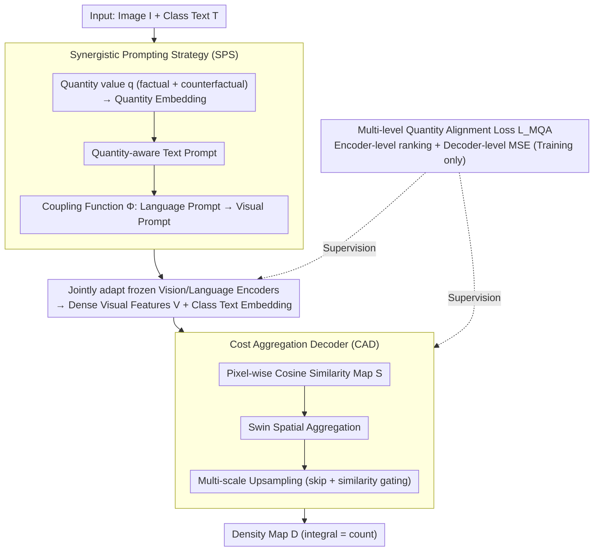

# Boosting Quantitive and Spatial Awareness for Zero-Shot Object Counting

**Conference**: CVPR 2026  
**arXiv**: [2603.16129](https://arxiv.org/abs/2603.16129)  
**Code**: Coming soon  
**Area**: Object Detection  
**Keywords**: zero-shot counting, vision-language model, prompt tuning, cost aggregation, quantity awareness

## TL;DR
The QICA framework is proposed to address the lack of quantity awareness and spatial insensitivity in zero-shot object counting. By utilizing a Synergistic Prompting Strategy (SPS) to jointly adapt vision-language encoders with quantity-conditioned prompts, combined with a Cost Aggregation Decoder (CAD) operating directly on similarity maps to maintain zero-shot transferability, it achieves zero-shot SOTA (12.41 MAE) on FSC-147 and demonstrates strong cross-domain generalization.

## Background & Motivation

**Background**: Zero-shot object counting (ZSOC) aims to enumerate objects of arbitrary classes based only on text descriptions. Mainstream methods leverage VLMs like CLIP to compute vision-text similarity maps, followed by CNN/Transformer decoders to predict density maps.

**Limitations of Prior Work**: (1) **Lack of quantity awareness**—text prompts only specify the class and contain no quantity information; models excel at identifying "what" is present but do not understand "how many," leading to limited accuracy in dense scenes. (2) **Spatial insensitivity and feature space distortion**—directly fine-tuning VLM encoders leads to severe overfitting to training classes, destroying the pre-trained feature space and harming zero-shot generalization.

**Key Challenge**: To achieve precise counting, the encoder must be adapted to learn quantity-sensitive features, yet fine-tuning risks destroying zero-shot generalization—creating a dilemma between adaptation and generalization.

**Goal**: (1) Enable fine-grained quantity discrimination in the model. (2) Achieve effective adaptation without corrupting the pre-trained feature space.

**Key Insight**: Introduce quantity-conditioned prompts to allow the encoder to implicitly learn quantity information, while operating on similarity maps (rather than feature space) to avoid feature distortion.

**Core Idea**: During training, use factual and counterfactual quantity prompts to teach the model to distinguish between different counts; during inference, use only class prompts for zero-shot counting.

## Method

### Overall Architecture
QICA resolves the "adaptation vs. generalization" dilemma: counting zero-shot objects requires the CLIP encoder to learn quantity-sensitive features, but direct fine-tuning distorts the pre-trained feature manifold. The breakthrough is to embed "quantity information" into the training phase prompts for implicit absorption by the encoder, while shifting density regression to the scalar field of similarity maps to bypass feature space destruction.

The workflow proceeds as follows: Image $I$ and text $T$ are input; the **Synergistic Prompting Strategy (SPS)** uses quantity-conditioned learnable prompts to simultaneously adapt frozen vision and language encoders, encoding dense visual features and text embeddings. These are used to calculate pixel-wise cosine similarity, generating a similarity map for the **Cost Aggregation Decoder (CAD)** to perform spatial aggregation and multi-scale upsampling to output the density map $D$. During training, the **Multi-level Quantity Alignment Loss $\mathcal{L}_{MQA}$** enforces quantity consistency across both encoder and decoder levels. Crucially, the path carrying quantity information exists only during training; during inference, it is disabled, leaving only the class semantic path. Thus, the "counting" capability is distilled into the encoder without requiring quantity prompts at test time.

### Key Designs

**1. Synergistic Prompting Strategy (SPS): Enabling Joint Quantity Perception**

Simply adding a quantity label to the text prompt only modifies the language side; the vision encoder remains unaware of the need for "quantity sensitivity." SPS maps the quantity value $q$ to a continuous embedding $\epsilon_q$, added to learnable prompts $\Pi^j$ at each layer to obtain quantity-aware text prompts $\hat{\Pi}^j_k = \Pi^j + \epsilon_{q_k}\mathbf{1}^T$. A coupling function $\Phi^j$ then projects these into visual prompts $\Psi^j_k = \Phi^j(\hat{\Pi}^j_k)$. This projection establishes a direct gradient path from language to vision, allowing both encoders to adapt jointly toward quantity awareness. During training, factual (true count) and counterfactual (divergent counts) prompts are generated for each image, teaching the model to distinguish between correct and incorrect counts.

**2. Cost Aggregation Decoder (CAD): Density Regression on Similarity Maps**

A major issue in fine-tuning VLMs is that if the decoder consumes encoder features directly, backpropagating gradients will distort the pre-trained manifold. CAD shifts the regression target to a scalar field: it first computes pixel-wise cosine similarity between dense visual features $\mathbf{V}$ and class text embeddings $\mathbf{T}^{\text{cat}}_k$ to obtain a similarity map $\mathbf{S}_k$. This map is then processed through an embedding layer, Swin Transformer spatial aggregation, and multi-scale upsampling with skip connections and similarity gating. Because aggregation occurs on the similarity map rather than high-dimensional embeddings, the pre-trained feature space remains intact.

**3. Multi-level Quantity Alignment Loss $\mathcal{L}_{MQA}$: Anchoring Quantity Constraints**

Supervising only the density map at the decoder level does not force the encoder to encode quantity into features. $\mathcal{L}_{MQA}$ applies pressure at both stages. The encoder level uses a ranking loss to ensure the factual quantity hypothesis has the highest global similarity ($\alpha_0 > \alpha_i$) and that similarities decrease as hypothesized counts move further from the truth. The decoder level uses an auxiliary MSE to ensure each hypothesis's density map integral matches its corresponding quantity value. The total loss is:

$$\mathcal{L}_{MQA} = \|D^0 - D^{GT}\|_2^2 + \lambda_1 \mathcal{L}^{qty}_{enc} + \lambda_2 \mathcal{L}^{qty}_{dec}$$

The encoder-level ranking constraint is vital: it forces the feature space to implicitly encode quantity information during training, allowing the encoder to "know how many" objects exist even when only a class prompt is provided during inference.

### Key Experimental Results

### Main Results

**Zero-Shot Counting on FSC-147**

| Method | Backbone | Val MAE↓ | Val RMSE↓ | Test MAE↓ | Test RMSE↓ |
|------|----------|----------|-----------|-----------|------------|
| CounTX | ViT-B/16 | 17.76 | 65.21 | 16.70 | 105.21 |
| VLCounter | ViT-B/16 | 18.06 | 65.13 | 17.05 | 106.16 |
| T2ICount | SD-v1.5 | 13.78 | 58.78 | 11.76 | 97.86 |
| CountGD | GDINO-Swin-B | 12.14 | 47.51 | 14.76 | 120.42 |
| **Ours** | ViT-B/16 | **13.82** | **60.24** | **13.05** | 104.17 |
| **Ours†** | ViT-L/14 | **12.98** | **56.35** | **12.41** | - |

### Ablation Study

| Config | Val MAE | Test MAE | Function |
|------|---------|----------|------|
| Baseline (CLIP + Conv decoder) | ~18 | ~17 | No quantity awareness |
| + SPS (Text prompt only) | ~16 | ~15 | Limited improvement from unimodal prompt |
| + SPS (Synergistic prompting) | ~15 | ~14 | Significant gain from cross-modal coupling |
| + CAD | ~14 | ~13.5 | Further optimization via spatial aggregation |
| + $\mathcal{L}_{MQA}$ (Full model) | 13.82 | 13.05 | Final results from multi-level constraints |

### Key Findings
- QICA significantly outperforms other zero-shot methods using the same backbone (ViT-B/16) (CounTX MAE 16.70 → QICA 13.05).
- Superior performance on cross-domain generalization tests (CARPK, ShanghaiTech-A) proves no overfitting occurred.
- The coupling function in SPS improves performance by ~1.5 MAE over independent prompting, highlighting the importance of cross-modal synergy.
- CAD achieves ~1-2 points lower MAE than direct feature-space decoding while preserving zero-shot capabilities.
- The contribution of the quantity ranking loss is most significant in dense scenes.

## Highlights & Insights
- **Ingenious Training-Inference Consistency**: During training, full quantity-aware embeddings produce the category embedding via projection; during inference, an equivalent category embedding is naturally generated. Quantity knowledge is "distilled" into the implicit representation of the vision encoder.
- **Operating on Similarity Maps**: This design choice is critical—CAD acts on a scalar field (similarity map), causing zero damage to the pre-trained feature space and solving a long-standing issue in fine-tuning VLMs.
- **Factual/Counterfactual Quantity Prompts**: Teaching quantity awareness through contrastive learning with "correct" vs. "incorrect" counts is more discriminative than simple quantity labeling.

## Limitations & Future Work
- Still relies on the category recognition capability of the pre-trained VLM; may fail for extremely rare objects unseen by the VLM.
- Multiple forward passes for $K$ quantity hypotheses increase training overhead.
- Density map MSE loss might be imbalanced in extremely sparse or dense scenes.
- Potential to extend the quantity awareness mechanism to open-set detection or segmentation tasks.

## Related Work & Insights
- **vs. CLIP-Count/CounTX**: These methods freeze the encoder to avoid overfitting but sacrifice adaptation; QICA resolves this via CAD on similarity maps.
- **vs. CountGD**: CountGD uses a larger GDINO backbone + visual exemplars; QICA approaches its performance using only text + ViT-B.
- **vs. T2ICount**: Stable Diffusion-based methods have stronger generative priors but higher inference costs and different backbones, making direct comparisons difficult.

## Rating
- Novelty: ⭐⭐⭐⭐ Combination of quantity-aware prompts and cost aggregation is creative; design for training-inference consistency is elegant.
- Experimental Thoroughness: ⭐⭐⭐⭐ FSC-147 + cross-domain validation + extensive ablations.
- Writing Quality: ⭐⭐⭐⭐ Clear motivation, detailed methodological description.
- Value: ⭐⭐⭐⭐ Practical contribution to the zero-shot counting field.

<!-- RELATED:START -->

## Related Papers

- [\[CVPR 2026\] MoECLIP: Patch-Specialized Experts for Zero-shot Anomaly Detection](moeclip_patch-specialized_experts_for_zero-shot_anomaly_detection.md)
- [\[CVPR 2025\] T2ICount: Enhancing Cross-modal Understanding for Zero-Shot Counting](../../CVPR2025/object_detection/t2icount_enhancing_cross-modal_understanding_for_zero-shot_counting.md)
- [\[CVPR 2026\] AnomalyVFM -- Transforming Vision Foundation Models into Zero-Shot Anomaly Detectors](anomalyvfm_--_transforming_vision_foundation_models_into_zero-shot_anomaly_detec.md)
- [\[CVPR 2026\] VisualAD: Language-Free Zero-Shot Anomaly Detection via Vision Transformer](visualad_language-free_zero-shot_anomaly_detection_via_vision_transformer.md)
- [\[CVPR 2026\] Back to Point: Exploring Point-Language Models for Zero-Shot 3D Anomaly Detection](back_to_point_exploring_point-language_models_for_zero-shot_3d_anomaly_detection.md)

<!-- RELATED:END -->
