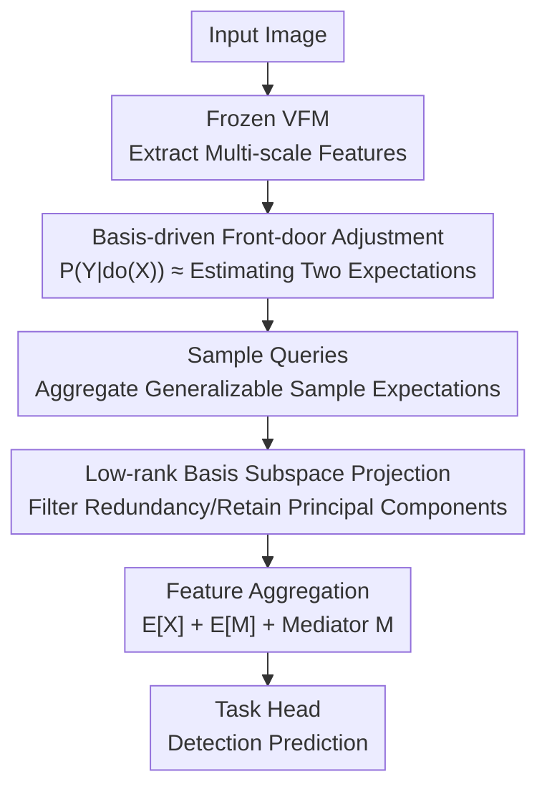

# Bridge: Basis-Driven Causal Inference Marries VFMs for Domain Generalization

**Conference**: CVPR 2026  
**arXiv**: [2604.26820](https://arxiv.org/abs/2604.26820)  
**Code**: https://mingbohong.github.io/Bridge/ (Project Page)  
**Area**: Object Detection / Domain Generalization / Causal Inference  
**Keywords**: Domain Generalized Object Detection (DGOD), Front-door Adjustment, Causal Inference, Basis Learning, Vision Foundation Models (VFMs)

## TL;DR
Addressing the issue where detectors easily learn spurious correlations from confounders like "lighting/co-occurrence/style" under data scarcity in single-source domains, this paper proposes the plug-and-play Causal Basis Block (CBB). By implementing causal front-door adjustment via **learnable low-rank bases** to "estimate two expectations," CBB allows for end-to-end calibration on frozen VFMs (DINOv2/3, SAM, Stable Diffusion). It consistently sets new SOTAs across five DGOD benchmarks (up to +5.4 mAP).

## Background & Motivation
**Background**: Domain Generalized Object Detection (DGOD) aim to train on one or few source domains and generalize to unseen target domains. Mainstream approaches include learning domain-invariant representations, expanding source distributions via augmentation, or leveraging strong priors from Vision Foundation Models (VFMs). Recently, using frozen DINOv2/SAM/Stable Diffusion as backbones with detection heads has become popular.

**Limitations of Prior Work**: Most methods **ignore confounding effects occurring during single-source, small-data training**. Confounders $\mathcal{Z}$ (lighting, object co-occurrence patterns, style differences) affect both input features $\mathcal{X}$ and labels $\mathcal{Y}$, creating spurious correlations. A provided example shows that a detector using a frozen DINOv2 (pre-trained on 142M images) but fine-tuned on only 3,000 Cityscapes images misclassifies bicycles next to pedestrians as "rider" (57%) or "person" (20%)—it learns the shortcut "bicycles often co-occur with people" rather than the causal features of the bicycle. The representation power of strong backbones is wasted on such shortcuts.

**Key Challenge**: To eliminate confounding, **back-door adjustment** is a classic approach, but it requires explicit modeling and enumeration of confounders $\mathcal{Z}$ ($\mathcal{P}(\mathcal{Y}\mid\mathrm{do}(\mathcal{X}))=\sum_{\mathcal{Z}}\mathcal{P}(\mathcal{Y}\mid\mathcal{X},\mathcal{Z})\mathcal{P}(\mathcal{Z})$). In reality, many confounders are unobservable or difficult to measure, making back-door adjustment infeasible. Existing causal detection works (e.g., for adverse weather) rely on external confounder dictionaries and cumbersome post-processing like clustering/momentum updates, lacking flexibility and scalability.

**Goal**: Block spurious correlations **without explicitly specifying confounders or using external dictionaries**, while creating a plug-and-play module that seamlessly integrates with any frozen VFM.

**Key Insight**: Use **front-door adjustment** to bypass "confounder enumeration"—by finding a mediator variable $\mathcal{M}$ on the causal path $\mathcal{X}\to\mathcal{Y}$, the causal effect of $\mathcal{X}$ on $\mathcal{Y}$ can be identified. Drawing from dictionary learning, the two difficult-to-calculate expectations in front-door adjustment are approximated using **learnable low-rank bases**.

**Core Idea**: Rewrite front-door adjustment as "estimating two expectations $\mathbb{E}[\mathcal{X}']$ and $\mathbb{E}[\mathcal{M}]$," and calculate these end-to-end using a set of low-rank learnable bases and Sample Queries. This blocks confounding while concurrently filtering out redundant, task-irrelevant features.

## Method

### Overall Architecture
Bridge is a DGOD framework built upon frozen VFMs. An input image is first processed by the VFM to extract multi-scale feature maps; these features enter the core **Causal Basis Block (CBB)** for causal calibration. The calibrated features are then passed to the task head (Faster R-CNN) for prediction. The VFM backbone remains frozen; only the CBB and task head are trained, avoiding the high cost of full network fine-tuning.

CBB performs two tasks: ① **Expectation Estimation**—using Sample Queries to aggregate global/generalizable information from the training set to obtain spatial weight maps, then projecting weighted features onto a subspace spanned by **learnable low-rank bases** to obtain expectations $\mathbb{E}[\mathcal{X}]$ and $\mathbb{E}[\mathcal{M}]$; ② **Feature Aggregation**—summing the two expectations and the mediator feature $\mathcal{M}$ to form the final output $\mathcal{F}_{\text{out}}=\hat{\mathbb{E}}[\mathcal{X}]+\hat{\mathbb{E}}[\mathcal{M}]+\mathcal{M}$. The first two terms implement front-door adjustment to block confounding, while $\mathcal{M}$ retains task-specific information. CBB is fully differentiable and trained with the downstream detection loss.

### Key Designs

**1. Basis-driven Front-door Adjustment: Converting Confounding Removal to "Estimating Two Expectations"**

Since back-door adjustment cannot handle unobservable confounders $\mathcal{Z}$, this work adopts front-door adjustment: by finding a mediator $\mathcal{M}$, then $\mathcal{P}(\mathcal{Y}\mid\mathrm{do}(\mathcal{X}))=\mathbb{E}_{\mathcal{M}\sim\mathcal{P}(\mathcal{M}\mid\mathcal{X})}\big[\mathbb{E}_{\mathcal{X}'\sim\mathcal{P}(\mathcal{X})}[\mathcal{P}(\mathcal{Y}\mid\mathcal{X}',\mathcal{M})]\big]$. Calculating this nested expectation is computationally expensive, so NWGM (Normalized Weighted Geometric Mean) is used to move the expectation inside the probability. Following prior literature that extends front-door adjustment from prediction layers to intermediate feature layers, this is simplified as $\mathcal{P}(\mathcal{Y}\mid do(\mathcal{X}))\approx\mathcal{P}\big(\mathcal{Y}\mid\mathbb{E}_{\mathcal{X}'}[\mathcal{X}']+\mathbb{E}_{\mathcal{M}\mid\mathcal{X}}[\mathcal{M}]\big)$.

The value of this step is that implementing front-door adjustment **is reduced to estimating just two expectations**: $\mathbb{E}_{\mathcal{M}\mid\mathcal{X}}[\mathcal{M}]$ and $\mathbb{E}_{\mathcal{X}'}[\mathcal{X}']$. Since expectations lack closed-form solutions in complex representation spaces, the authors approximate them as linear combinations of learnable basis vectors $\mathbb{E}[\mathcal{V}]\approx\frac{1}{S}\sum_{i=1}^{S}\sum_{k=1}^{K}c_{ik}b_k$ ($b_k$ is a basis, $c_{ik}$ is a coefficient). Unlike old causal methods relying on external dictionaries, this approach **requires no external confounder definitions** and the bases naturally induce low-rank structures, making it plug-and-play and scalable.

**2. Sample Queries: Aggregating Generalizable Information Across Samples to Estimate $\mathbb{E}[\mathcal{X}]$**

The expectation $\mathbb{E}_{\mathcal{X}'\sim\mathcal{P}(\mathcal{X})}[\mathcal{X}']$ is over the input marginal distribution and cannot be computed from a single image. CBB introduces learnable **Sample Queries** $\mathcal{Q}_s\in\mathbb{R}^{S\times C}$, similar to object queries in DETR. During training, they **implicitly aggregate global representations of the entire training set**, thereby guiding expectation estimation. Given input features $\mathcal{X}_{in}\in\mathbb{R}^{B\times N\times C}$, query responses $\mathcal{X}'_q=\mathcal{X}_{in}\mathcal{Q}_s^{\top}$ are calculated. Softmax over the sample dimension $S$ yields $p$, and a weighted sum produces a spatial weight map $\mathcal{A}=\sum_{i=1}^{S}p_i\mathcal{X}'_{q,i}\in\mathbb{R}^{B\times N\times 1}$. This $\mathcal{A}$ re-weights the input to obtain query-guided features $\mathcal{X}_q=\mathcal{A}\odot\mathcal{X}_{in}$.

Essentially, $\mathcal{A}$ acts as an attention map identifying which spatial locations carry generalizable information, highlighting parts of $\mathcal{X}_{in}$ shared across source domains that do not depend on specific confounders.

**3. Low-rank Basis Subspace Projection: Filtering Redundancy and Estimating Expectations**

To filter remaining redundancy, CBB introduces learnable bases $\mathcal{B}=[b_1,\dots,b_K]\in\mathbb{R}^{K\times C}$ where $K<C$, forming a **low-rank subspace**. Query-guided features $\mathcal{X}_q$ are projected onto this subspace with coefficients $\mathcal{C}=\mathcal{X}_q\mathcal{B}^{\top}(\mathcal{B}\mathcal{B}^{\top})^{-1}\in\mathbb{R}^{B\times N\times K}$ (where $(\mathcal{B}\mathcal{B}^{\top})^{-1}$ is a normalization term). Reconstructing back to the original space provides the expectation estimate $\mathbb{E}[\mathcal{X}_{in}]\approx\mathcal{C}\mathcal{B}\in\mathbb{R}^{B\times N\times C}$.

This path $\mathbb{R}^{N\times C}\to\mathbb{R}^{N\times K}\to\mathbb{R}^{N\times C}$ compresses the features to $K$ dimensions to discard redundancy. Since $K<C$, reconstruction uses only the most representative principal components, aligning features with the core directions of the sample distribution. The smaller $K$ is, the more generic the representation remains—experiments show DINOv3 performs best with 12.5% dimensions, while SAM/SD require 50%–70%. At inference, $\mathcal{B}^{\top}(\mathcal{B}\mathcal{B}^{\top})^{-1}\mathcal{B}$ can be **pre-calculated as a fixed $C\times C$ matrix**.

**4. Feature Aggregation: Mediator Features for Task Information**

The expectations are "de-confounded and generalized," which might lose details necessary for detection. CBB first creates mediator features $\mathcal{M}=\mathrm{Conv}(\mathcal{X}_{in})$ using a simple convolution block, then estimates $\hat{\mathbb{E}}[\mathcal{X}]$ and $\hat{\mathbb{E}}[\mathcal{M}]$ to produce the final output $\mathcal{F}_{\text{out}}=\hat{\mathbb{E}}[\mathcal{X}]+\hat{\mathbb{E}}[\mathcal{M}]+\mathcal{M}$.

This summation has a clear division of labor: the first two terms $\hat{\mathbb{E}}[\mathcal{X}]+\hat{\mathbb{E}}[\mathcal{M}]$ correspond to the requirements of front-door adjustment for blocking spurious correlations; the final addition of $\mathcal{M}$ ensures that **task-specific information**, which might be filtered by low-rank compression, is preserved.

## Key Experimental Results

### Main Results
On five DGOD benchmarks using AP50: Bridge can be applied to discriminative VFMs (DINOv2-L / DINOv3-L / SAM-Huge) and generative VFMs (Stable Diffusion v2.1 with CrossKD distillation to R101). Representative comparisons (mAP / %):

| Benchmark (Train $\to$ Test) | Configuration | Baseline | Bridge | Gain |
|------|------|------|------|------|
| Cross-Camera (Cityscapes $\to$ BDD100K) | Diff. Detector(SD) vs Boost | 49.3 | **53.1** | +3.8 |
| Cross-Camera | DINOv2 backbone | 51.8 | **56.9** | +5.1 |
| Adverse Weather (City $\to$ FoggyCity) | DINOv2 backbone | 52.8 | **58.2** | +5.4 |
| Adverse Weather | DINOv3 backbone | 57.7 | **61.6** | +3.9 |
| Real-to-Artistic (VOC $\to$ 3 styles, avg) | DINOv2 backbone | 65.4 | **69.4** | +4.0 |
| Diverse Weather Datasets (avg) | DINOv2 backbone | 40.8 | **44.8** | +4.0 |
| DroneVehicle Extreme-Dark | DINOv3 backbone | 33.7 | **34.0** | +0.3 |

Compared to respective runners-up, Bridge improves by +3.8 / +2.9 / +2.4 / +0.4 / +1.5 mAP. Notable gains are seen in the Extreme-Dark scenario of Diverse Weather DroneVehicle: Faster R-CNN alone yields **8.1** mAP, while Bridge with Diff. Detector / DINOv2 / DINOv3 reaches **24.2 / 29.8 / 34.0**, proving that low-rank bases can focus on causal representations in high-noise/low-light environments.

### Ablation Study
Component ablation (Table 6, City $\to$ FoggyCity, mAP):

| Configuration | DINOv3 | SAM | SD | Description |
|------|------|------|------|------|
| baseline | 57.7 | 45.8 | 51.8 | Frozen VFM with Head |
| + Low-rank Basis (LRB) | 60.9 | 49.2 | 53.1 | Gain of +3.2/+3.4/+1.3 |
| + LRB + Sample Queries | **61.6** | **49.9** | **53.6** | Gain of +0.7/+0.7/+0.5 |

Comparison of Causal Modeling (Table 7, DINOv3): Re-implementing GOAT's front-door adjustment as FACL with cross-attention between multi-scale layers showed minimal gain or even drops (BDD 57.8 $\to$ 58.5, DWD 48.6 $\to$ 48.2, R2A 72.7 $\to$ 71.6). Replacing it with CBB led to consistent improvements (58.9 / 61.6 / 50.8 / 48.4 / 73.3).

### Key Findings
- **Low-rank Basis is the primary driver**: LRB alone accounts for most gains, while Sample Queries provide complementary benefits.
- **Basis ratio correlates with backbone strength**: DINOv3 performs best at a 12.5% ratio, suggesting strong representations require very compact basis spaces; SAM/SD require 50%–70% to maintain feature diversity.
- **Harder scenarios see larger gains**: Most significant improvements occur in categories with high co-occurrence (rider/bike) and extreme environments (darkness), validating that CBB effectively blocks "co-occurrence/lighting" confounders.
- **Cross-detector universality**: Beyond Faster R-CNN, CBB consistently improves Sparse R-CNN and TOOD (e.g., TOOD on DWD 47.3 $\to$ 50.1).

## Highlights & Insights
- **Converting abstract causal formulas into computable expectations via low-rank bases**: CBB approximates difficult front-door expectations via sample queries and low-rank projection, achieving both de-confounding and feature purification.
- **Backbone-agnostic and plug-and-play**: Works across DINOv2/3, SAM, and Stable Diffusion while keeping backbones frozen. The projection matrix can be pre-computed for efficient inference.
- **The "Low-rank ratio $\propto$ Backbone weakness" observation**: This links "required subspace size" to "representation quality," providing a heuristic for other tasks using low-rank/bottleneck structures for feature purification.
- **Benchmark contribution**: Annotated weather conditions for DroneVehicle (Clear/Dark/Foggy/Extreme-Dark) address the lack of diverse weather evaluations in UAV remote sensing DGOD.

## Limitations & Future Work
- **Approximation bounds**: CBB uses low-rank bases to **approximate** expectations in front-door adjustment; there is no theoretical guarantee on the quality of this approximation in complex representation spaces.
- **Mediator $\mathcal{M}$ validity**: The assumption that $\mathcal{M}=\mathrm{Conv}(\mathcal{X}_{in})$ lies on the causal path and satisfies front-door criteria is not rigorously verified, acting more as an empirical mediator.
- **Marginal gains on strong baselines**: Improvements are smaller when the backbone is already exceptionally strong (e.g., DINOv3 on Extreme-Dark).
- **Future directions**: Enhancing mediator selection with causal guarantees (e.g., independence constraints) or extending basis learning to non-linear manifolds.

## Related Work & Insights
- **Vs. Back-door methods**: Prior methods require explicit confounder enumeration and external dictionaries. Bridge uses front-door adjustment with **no explicit confounders**, offering better scalability.
- **Vs. GOAT/FACL**: Ablations show that CBB's low-rank projection outperforms cross-attention mapping, suggesting that *how* expectations are estimated is more critical than the use of front-door adjustment itself.
- **Vs. Frozen VFM-based DGOD (Boost, GDD)**: These methods rely on VFM priors but ignore spurious correlations. Bridge adds a causal calibration layer to recover representation power lost to confounding.

## Rating
- Novelty: ⭐⭐⭐⭐ Translates front-door adjustment into "two expectations" via low-rank bases, elegantly combining causal theory with engineering.
- Experimental Thoroughness: ⭐⭐⭐⭐⭐ Comprehensive evaluation across 5 benchmarks, 4 VFMs, 3 detectors, and a self-built weather benchmark.
- Writing Quality: ⭐⭐⭐⭐ Clear link between causal derivation and module implementation.
- Value: ⭐⭐⭐⭐ Highly practical plug-and-play causal calibration for VFM-based DGOD.

<!-- RELATED:START -->

## Related Papers

- [\[CVPR 2026\] Black-Box Domain Adaptation for Object Detection with Retention-Driven Knowledge Compression](black-box_domain_adaptation_for_object_detection_with_retention-driven_knowledge.md)
- [\[CVPR 2026\] Remedying Target-Domain Astigmatism for Cross-Domain Few-Shot Object Detection](remedying_target-domain_astigmatism_for_cross-domain_few-shot_object_detection.md)
- [\[CVPR 2026\] CHAL: Causal-guided Hierarchical Anomaly-aware Learning for Moving Infrared Small Target Detection](chal_causal-guided_hierarchical_anomaly-aware_learning_for_moving_infrared_small.md)
- [\[CVPR 2026\] Spike-driven Discrete Aggregation for Event-based Object Detection](spike-driven_discrete_aggregation_for_event-based_object_detection.md)
- [\[CVPR 2025\] Large Self-Supervised Models Bridge the Gap in Domain Adaptive Object Detection](../../CVPR2025/object_detection/large_self-supervised_models_bridge_the_gap_in_domain_adaptive_object_detection.md)

<!-- RELATED:END -->
## Related Papers

- [\[CVPR 2026\] Black-Box Domain Adaptation for Object Detection with Retention-Driven Knowledge Compression](black-box_domain_adaptation_for_object_detection_with_retention-driven_knowledge.md)
- [\[CVPR 2025\] Large Self-Supervised Models Bridge the Gap in Domain Adaptive Object Detection](../../CVPR2025/object_detection/large_self-supervised_models_bridge_the_gap_in_domain_adaptive_object_detection.md)
- [\[CVPR 2026\] CHAL: Causal-guided Hierarchical Anomaly-aware Learning for Moving Infrared Small Target Detection](chal_causal-guided_hierarchical_anomaly-aware_learning_for_moving_infrared_small.md)
- [\[CVPR 2026\] Expert-Teacher-Student Collaborative Learning for Domain Adaptive Object Detection](expert-teacher-student_collaborative_learning_for_domain_adaptive_object_detecti.md)
- [\[CVPR 2026\] Remedying Target-Domain Astigmatism for Cross-Domain Few-Shot Object Detection](remedying_target-domain_astigmatism_for_cross-domain_few-shot_object_detection.md)

<!-- RELATED:END -->
