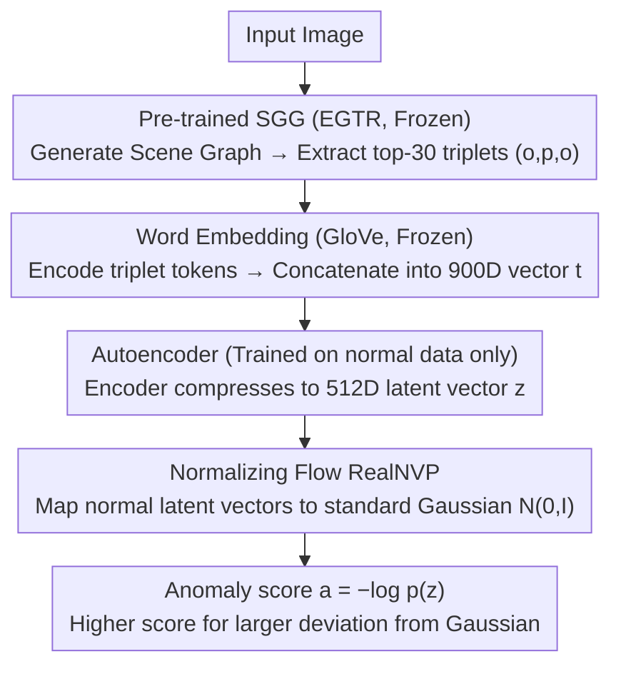

<!-- Generated automatically by src/gen_stubs.py -->
# BUSSARD: Normalizing Flows for Bijective Universal Scene-Specific Anomalous Relationship Detection

**Conference**: CVPR2026  
**arXiv**: [2603.16645](https://arxiv.org/abs/2603.16645)  
**Code**: [github.com/mschween/BUSSARD](https://github.com/mschween/BUSSARD)  
**Area**: Object Detection
**Keywords**: Scene Graph Anomaly Detection, Normalizing Flows, Semantic Embedding, Relationship Anomaly, Multi-modal

## TL;DR
The authors propose BUSSARD, the first learning-based method for scene-specific anomalous relationship detection. It utilizes pre-trained language model embeddings for scene graph triplets, dimensionality reduction via an autoencoder, and likelihood estimation through normalizing flows. It achieves an AUROC improvement of approximately 10% on the SARD dataset and exhibits robustness to synonym variations.

## Background & Motivation
1. Image anomaly detection encompasses not only industrial defects but also scene contextual understanding—such as objects appearing in inappropriate locations or anomalous human-object relationships.
2. Existing methods predominantly focus on single components like human pose, neglecting broader contextual information and object relationships.
3. The SARD task and dataset focus on detecting relationship anomalies in scene graphs (e.g., "plate on chair"), but current methods are count-based and lack learning capabilities.
4. Count-based methods are severely impacted by long-tail distributions—a few high-frequency triplets dominate, while many low-frequency normal triplets are misclassified as anomalies.
5. Count-based methods are not robust to lexical variations (synonyms)—"person" vs. "human" are treated as entirely different entities.
6. A learning-based approach is required to leverage semantic knowledge and generalize to rare or unseen vocabulary.

## Method

### Overall Architecture

BUSSARD addresses "scene-specific anomalous relationship detection"—given an image, determine whether the relationships between objects (e.g., "plate on chair") are anomalous within the current scene. It decomposes this into an unsupervised likelihood estimation pipeline: first, a pre-trained SGG converts the image into a scene graph and extracts triplets; then, GloVe encodes the triplet tokens into semantic vectors, which an autoencoder compresses to a low-dimensional space; finally, normalizing flows learn the distribution of latent vectors on normal data. During inference, relationships deviating from this distribution receive higher anomaly scores. The entire pipeline is trained only on normal samples without anomaly labels. Both SGG and GloVe weights are frozen; only the autoencoder and normalizing flow modules are learnable.

### Key Designs

**1. Word Embedding: Absorbing Synonym Differences via Semantic Space**

Legacy count-based methods treat "person" and "human" as distinct entities, causing performance fluctuations when vocabulary changes. BUSSARD utilizes GloVe ($d=300$) to encode each token of the triplet $(o_i, p_{i,j}, o_j)$ into vectors, concatenated as $\mathbf{t} \in \mathbb{R}^{900}$. Since semantically similar words are naturally close in the embedding space, synonym replacement barely affects the input representation. This allows low-frequency but normal triplets in the long tail to be correctly identified via semantic generalization.

**2. Autoencoder: Establishing a Stable Low-Dimensional Space for Normalizing Flows**

Normalizing flows require the input and output dimensions to match strictly (bijectivity), and training flows directly on 900 dimensions is unstable. A 4-layer fully connected + ReLU autoencoder is inserted, trained only on normal data, to compress the 900 dimensions into a $d_z=512$ latent vector. This reduction satisfies the bijective prerequisite while filtering high-dimensional noise, ensuring density estimation occurs on a compact, well-modelled manifold.

**3. Normalizing Flow (RealNVP): Quantifying "Normality" into Comparable Likelihoods**

By mapping the latent vector distribution of normal triplets to a standard Gaussian $\mathcal{N}(0, I)$, the degree of anomaly can be directly read as the negative log-likelihood:

$$a = -\log p(\mathbf{z}) = -\log p(\mathbf{u}) - \log\left|\det\frac{\partial f_{flow}}{\partial \mathbf{z}}\right|$$

Latent vectors near the Gaussian center yield high likelihoods and low anomaly scores, while deviating triplets see sharp likelihood drops and high scores. Compared to the "seen/unseen" binary judgment of count-based methods, likelihood provides a continuous, rankable anomaly degree that is more tolerant of rare but normal relationships.

### Loss & Training

- Autoencoder: $\mathcal{L}_{AE} = \frac{1}{|\mathcal{T}|}\sum\|\mathbf{t} - \hat{\mathbf{t}}\|^2$
- Normalizing Flow: $\mathcal{L}_{flow} = -\frac{1}{2}\|\mathbf{u}\|_2^2 + \log|\det\frac{\partial f_{flow}}{\partial \mathbf{z}}|$ (Maximizing likelihood of normal data)

## Key Experimental Results

### Main Results: Comparison on SARD Dataset

| Method | Office AUROC↑ | Dining AUROC↑ | Training Requirement | Speed |
|------|-------------|------------|---------|------|
| SARD-o (Count Baseline) | ~75% | ~70% | None | Slower |
| SARD-c (Corrected Data) | ~77% | ~72% | None | Slower |
| **BUSSARD** | **~87%** | **~80%** | Learning | **5x Faster** |

### Ablation Study: Robustness and Generality

| Test Condition | SARD Baseline Deviation | BUSSARD Deviation |
|---------|-------------|-------------|
| Original Vocabulary | Baseline | Baseline |
| Synonym Replacement | 17.5% Performance Fluctu. | Stable (Near 0%) |

### Ablation on Latent Space Dimension

| $d_z$ | Performance |
|-------|------|
| 256 | Sub-optimal |
| **512** | **Optimal** |
| 768 | Slight Drop |

### Key Findings
- BUSSARD outperforms the baseline by approximately 10% in AUROC while being 5x faster during inference.
- Semantic embeddings make the model highly robust to synonyms (17.5% deviation for baseline vs. near 0% for BUSSARD).
- Dimensionality reduction via the autoencoder is critical for the stability of normalizing flow training.

## Highlights & Insights
- It is the first learning-based SARD method, demonstrating the significant advantage of learning approaches in relationship anomaly detection.
- Multi-modal design philosophy: Scene graphs (structured visual information) + Language model embeddings (semantic knowledge) complement each other.
- Leveraging pre-trained word embeddings naturally solves long-tail and synonym issues in a simple yet effective manner.

## Limitations & Future Work
- The SARD dataset scale is small (~120 images); performance on larger datasets remains to be verified.
- Reliance on the EGTR scene graph generator—the quality of SGG directly limits downstream detection performance.
- Validated only in indoor scenes (office/dining); generalization to open-world scenarios is unknown.

## Related Work & Insights
- Difference from ComplexVAD: The latter uses scene graphs for video anomaly detection, whereas BUSSARD focuses on image-level relationship anomalies.
- The combination of Normalizing Flows and Autoencoders is common in industrial anomaly detection (e.g., FastFlow), but its application to scene graph triplets is novel.
- Insight: The paradigm of Pre-trained Embeddings + Normalizing Flows can be extended to anomaly detection in other types of structured data.

## Rating
- Novelty: ⭐⭐⭐⭐ (First learning method for SARD, novel use of normalizing flows for scene graphs)
- Experimental Thoroughness: ⭐⭐⭐ (Small dataset, only 2 scenarios, though ablations are thorough)
- Writing Quality: ⭐⭐⭐⭐ (Clear method description, intuitive pipeline diagrams)
- Value: ⭐⭐⭐ (Niche task domain, but the framework has potential for broader application)

<!-- RELATED:START -->

## Related Papers

- [\[CVPR 2026\] RC-NF: Robot-Conditioned Normalizing Flow for Real-Time Anomaly Detection in Robotic Manipulation](rc-nf_robot-conditioned_normalizing_flow_for_real-time_anomaly_detection_in_robo.md)
- [\[CVPR 2026\] Prompt-Free Universal Region Proposal Network](prompt-free_universal_region_proposal_network.md)
- [\[CVPR 2026\] Object-Generalized Re-Identification: A Step Towards Universal Instance Perception](object-generalized_re-identification_a_step_towards_universal_instance_perceptio.md)
- [\[NeurIPS 2025\] Multimodal Generative Flows for LHC Jets](../../NeurIPS2025/object_detection/multimodal_generative_flows_for_lhc_jets.md)
- [\[CVPR 2026\] UniSpector: Towards Universal Open-set Defect Recognition via Spectral-Contrastive Visual Prompting](unispector_towards_universal_open-set_defect_recognition_via_spectral-contrastiv.md)

<!-- RELATED:END -->
