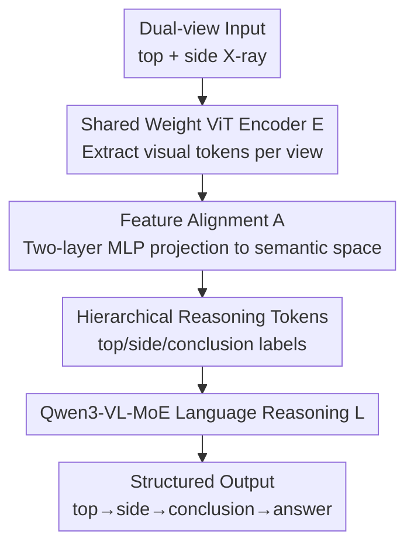

# Can a Second-View Image Be a Language? Geometric and Semantic Cross-Modal Reasoning for X-ray Prohibited Item Detection

**Conference**: CVPR 2026  
**Paper**: [CVF Open Access](https://openaccess.thecvf.com/content/CVPR2026/html/Peng_Can_a_Second_View_Image_Be_a_Language_Geometric_and_Semantic_CVPR_2026_paper.html)  
**Code**: https://github.com/pengc-bjtu/GSR  
**Area**: Multi-modal VLM / Cross-modal Reasoning / X-ray Security Inspection  
**Keywords**: Dual-view X-ray, Cross-view Reasoning, Language-like Modality, Chain-of-Thought Supervision, Prohibited Item Detection  

## TL;DR
This paper proposes a paradigm that treats the "second-view image (side-view) as a language modality." It introduces the first dual-view multi-modal security benchmark, DualXrayBench, and the GSXray dataset featuring `<top>/<side>/<conclusion>` Chain-of-Thought (CoT) supervision. The resulting GSR model improves overall accuracy from 53.5 to 65.4 across eight cross-view reasoning tasks, nearly doubling the mIoU.

## Background & Motivation
**Background**: Prohibited item detection in X-ray security has primarily relied on pure vision approaches, using detectors to extract low-level features like edges and contours for closed-set detection. Recently, inspired by VLMs, researchers have introduced language modalities—using image-caption pairs and text descriptions to provide semantic constraints for single-view images (e.g., OVXD, STCray, PIXray-Caption), which mitigates closed-set limitations and enhances open-vocabulary capabilities.

**Limitations of Prior Work**: Existing "image+language" works are exclusively **single-view**. However, in real-world security scenarios, human inspectors always examine **both top and side views simultaneously**, relying on both perspectives to reconstruct 3D structures and resolve occlusion or pose ambiguity in their minds (e.g., a tablet and a laptop may look identical in a single view but are easily distinguished from another angle). Existing dual-view datasets (DvXray, LDXray, etc.), while providing paired scans, are **purely visual**. They focus on feature fusion, treating the second view as "extra pixels" without language alignment or explicit modeling of cross-view visibility and geometric consistency.

**Key Challenge**: Semantic constraints (language) and geometric complementarity (second view) have evolved along separate tracks. No existing resource aligns vision, geometry, and language modalities simultaneously. Consequently, VLMs can neither utilize the geometric consistency of dual-views nor generalize effectively in security contexts.

**Goal**: (1) Construct a data resource covering semantic, geometric, and visual correspondences; (2) Enable models to perform true cross-view reasoning using the second view rather than treating it as noise.

**Key Insight**: The authors start with an intriguing observation: "An image is also a language." Since the second view provides **additional constraints** similar to language for human inspectors (e.g., "this object is vertical/flat in the side view"), the side view can be treated as a **"language-like modality"**, allowing its geometric correspondences to be jointly learned with linguistic semantics.

**Core Idea**: Replace "second view as extra pixels" with "second view as language." This approach jointly supervises cross-view geometric correspondence and cross-modal semantics within a unified Chain-of-Thought structure, transforming the auxiliary view into a structured constraint.

## Method

### Overall Architecture
The work consists of an **offline data engine** and an **online GSR model**. On the data side: Starting from the dual-view LDXray (146,997 top/side pairs), a five-stage semi-automatic pipeline generates 45,613 pairs with hierarchical captions (DualXrayBench corpus). These captions are rewritten into a CoT structure of `<top>, <side>, <conclusion>` to create the GSXray training set with 44,019 QA pairs. Additionally, a set of 1,594 expert-verified VQA pairs serves as the evaluation benchmark (eight diagnostic sub-tasks). On the model side: GSR uses Qwen3-VL-MoE-8B as the backbone, encoding and aligning both views into the language space. Hierarchical reasoning tokens explicitly label the source of evidence and the timing for synthesis, followed by the MoE language model generating structured reasoning.

The inference backbone of GSR is shown below (the data engine is an offline step):

### Key Designs

**1. Second View as "Language-like Modality": Joint Learning of Cross-view Geometry and Cross-modal Semantics**

This is a paradigm-level innovation. Existing methods either use language to constrain a single view or treat dual views as extra pixels for fusion. The authors no longer treat the side view as an image to be fused; instead, it serves as a **"language" that constrains the top view**. For instance, the side view can describe that "an object appearing as a large rectangle in the top view is actually lying flat." This descriptive constraint is isomorphic to text captions. The model learns two types of correspondences: **geometric correspondence** (position/pose/occlusion across views) and **semantic correspondence** (visual evidence ↔ linguistic conclusion). This mimics human inspection, where two views resolve ambiguities. Ablation studies confirm that feeding dual views without text guidance yields minimal gains or even reduces mIoU (Table 5).

**2. Hierarchical Reasoning Tokens `<top>/<side>/<conclusion>`: Explicitly Encoding Evidence Source and Synthesis**

Traditional multi-modal architectures feed all visual embeddings as **untyped tokens** to the LLM, making it difficult to distinguish evidence sources or synthesize geometric clues. GSR introduces three special tokens: `<top>` and `<side>` label visual evidence from orthogonal views, forcing the model to maintain spatial awareness; `<conclusion>` serves as an aggregation signal. The language model generation is defined as:

$$y = L\big(\,[\,\langle\text{top}\rangle\, f'_{\text{top}},\ \langle\text{side}\rangle\, f'_{\text{side}},\ \langle\text{conclusion}\rangle\, t\,]\,\big)$$

where $t$ is the text query, and $f'_{\text{top}}/f'_{\text{side}}$ are projected features. These tokens allow the model to **dynamically switch reasoning granularity** based on the query.

**3. GSXray CoT Supervision + Five-stage Semantic Automation Pipeline**

The authors address the lack of semantic/geometric/visual aligned resources in the X-ray domain with a five-stage pipeline: ① **Preprocessing**: Filtering and normalizing bbox coordinates; ② **Structured Prompting**: Using hierarchical prompts to describe views and analyze objects under strict JSON constraints; ③ **LLM Generation**: Using Qwen3-VL-235B-A22B-Thinking to generate captions that encode complementary clues; ④ **Automated Screening**: Filtering samples based on fact coverage, entity-bbox alignment, and cross-view consistency; ⑤ **Manual Verification**: Expert review to resolve ambiguities. Finally, GPT-4o rewrites captions into `<top>, <side>, <conclusion>` CoT, explicitly separating view-specific observations from unified conclusions.

**4. GSR Architecture and End-to-End SFT**

GSR is built on Qwen3-VL-MoE-8B. The visual encoder $E$ (ViT-L/14) uses **shared weights** to process $x_{\text{top}}$ and $x_{\text{side}}$, outputting dense visual tokens $f_i = E(x_i) \in \mathbb{R}^{m\times n}$ to preserve geometric structure. A light-weight alignment module $A$ (two-layer MLP) projects these into the semantic space. The language reasoning module $L$ (Qwen3-VL-MoE) processes projected tokens and text queries via multi-head attention and MoE routing. The visual encoder and alignment module are **fully unfrozen** for end-to-end optimization using bf16 on 8×H200.

### Loss & Training
The training objective is standard Supervised Fine-Tuning (SFT)—performing autoregressive supervision on the 44,019 CoT QA pairs in GSXray to teach the model to organize evidence by view and synthesize conclusions.

## Key Experimental Results

### Main Results
Evaluation is conducted on eight sub-tasks of DualXrayBench (CT: Counting / OR: Recognition / SR: Spatial Relation / SD: Spatial Distance / OA: Occlusion Area / CO: Contact Occlusion / PA: Placement Attribute / SA: Spatial Attribute).

| Model | Overall Acc | F1 | mIoU | Note |
|------|------|------|------|------|
| GPT-4o | 47.0 | 49.2 | 16.5 | Closed-source General VLM |
| Gemini-2.5-Pro | 58.6 | 60.5 | 28.7 | Strongest Closed-source Baseline |
| Qwen3-VL-235B | 58.8 | 65.5 | 26.0 | Strongest Open-source Baseline |
| Qwen3-VL-8B (Base) | 53.5 | 56.6 | 25.4 | Starting point for GSR |
| STING-BEE (Single-view X-ray VLM) | 23.8 | 29.8 | 13.2 | Specialized but worst |
| **GSR-8B (Ours)** | **65.4** ↑11.9 | **70.6** ↑14 | **52.3** ↑26.9 | Comprehensive SOTA at 8B |

A counter-intuitive finding: STING-BEE, an X-ray specialized VLM, performs **worse than general VLMs** due to its inability to handle dual-view reasoning. GSR-8B outperforms the 235B model and Gemini-2.5-Pro by over 6 points while nearly doubling the mIoU.

### Ablation Study
Table 5 shows the incremental effect of dual-view and structured reasoning components on Qwen3-VL-8B:

| Configuration | Acc | F1 | mIoU | Description |
|------|------|------|------|------|
| Baseline | 53.5 | 56.6 | 25.4 | Single-view perception |
| Top + `<top>` grounding | 59.2 | 63.7 | **41.1** | View labeling + grounding is key |
| Top + Side (No text) | 57.3 | 60.5 | 24.6 | Raw dual-view reduces mIoU |
| Top + `<top>` + Side | 62.1 | 65.8 | 45.2 | Adds structured side-view evidence |
| Full (GSR-8B) | **65.4** | **70.6** | **52.3** | Best performance |

### Key Findings
- **`<top>` + Grounding drives mIoU**: This single addition increases mIoU from 25.4 to 41.1, indicating that explicit view labeling and localization supervision contribute more to spatial alignment than merely adding an image.
- **Raw Dual-View can be Noise**: Without alignment training, the second view often degrades mIoU. Only after GSXray fine-tuning does the model learn to treat side-view features as complementary evidence.
- **Robust Generalization**: GSR-8B outscores STING-BEE on its own VQA benchmarks and achieves superior AP50 (26.3 vs. 21.0) in open-vocabulary detection on PID.

## Highlights & Insights
- **The "Second-View as Language" Analogy**: Reframing a multi-view geometry problem as a cross-modal alignment problem allows the model to leverage LLM reasoning capabilities without complex geometry-specific fusion modules.
- **Hierarchical Tokens Organize Evidence**: Labels like `<top>/<side>/<conclusion>` transform untyped visual tokens into structured evidence streams, a paradigm applicable to other multi-source reasoning tasks.
- **Explicit Geometry-to-Semantic Transition**: CoT forces the model to observe per-view before synthesizing, enhancing interpretability and structural supervision.

## Limitations & Future Work
- **Dependency on LLM-Synthetic Data**: The corpus and GSXray rely on high-parameter models for generation, making the quality of descriptions subject to the base model's limitations.
- **Limited to Dual-views**: While the paradigm could extend to $N$ views, the paper only validates top/side pairs.
- **Class Imbalance**: Large discrepancies in instance counts between categories (e.g., Mobile Phone vs. Liquid) may affect long-tail performance.
- **Supervision Cost**: The method relies heavily on an expensive CoT annotation pipeline, which may hinder migration to new domains.

## Related Work & Insights
- **vs. Pure Visual Dual-view Fusion**: These treat the second view as pixels without modeling explicit consistency. GSR treats it as a "language constraint," turning "extra views as noise" into "extra views as a boost."
- **vs. Single-view X-ray VLMs**: These lack geometric complementarity. GSR integrates both geometric (dual-view) and semantic (language) tracks.
- **vs. General VLMs**: While massive models like Gemini-2.5-Pro struggle with domain-specific dual-view geometry, GSR-8B demonstrates that structured data and explicit tokens are more effective than raw parameter scaling for specialized tasks.

## Rating
- Novelty: ⭐⭐⭐⭐⭐ The reframing is elegant and powerful.
- Experimental Thoroughness: ⭐⭐⭐⭐ Extensive baselines and ablation, though $N$-view and long-tail analysis are missing.
- Writing Quality: ⭐⭐⭐⭐ Clear motivation and task definitions.
- Value: ⭐⭐⭐⭐⭐ Establishes a foundational dual-view multi-modal benchmark for security.

<!-- RELATED:START -->

<!-- RELATED:END -->

## Related Papers

- [\[CVPR 2026\] CrossVL: Complexity-Aware Feature Routing and Paired Curriculum for Cross-View Vision-Language Detection](crossvl_complexity-aware_feature_routing_and_paired_curriculum_for_cross-view_vi.md)
- [\[CVPR 2026\] Thermal-Det: Language-Guided Cross-Modal Distillation for Open-Vocabulary Thermal Object Detection](thermal-det_language-guided_cross-modal_distillation_for_open-vocabulary_thermal.md)
- [\[CVPR 2026\] Beyond Semantic Search: Towards Referential Anchoring in Composed Image Retrieval](beyond_semantic_search_towards_referential_anchoring_in_composed_image_retrieval.md)
- [\[CVPR 2026\] Reasoning-Driven Anomaly Detection and Localization with Image-Level Supervision](reasoning-driven_anomaly_detection_and_localization_with_image-level_supervision.md)
- [\[CVPR 2026\] DyFCLT: Dynamic Frequency-Decoupled Cross-Modal Learning Transformer for Multimodal Tiny Object Detection](dyfclt_dynamic_frequency-decoupled_cross-modal_learning_transformer_for_multimod.md)

<!-- RELATED:END -->
