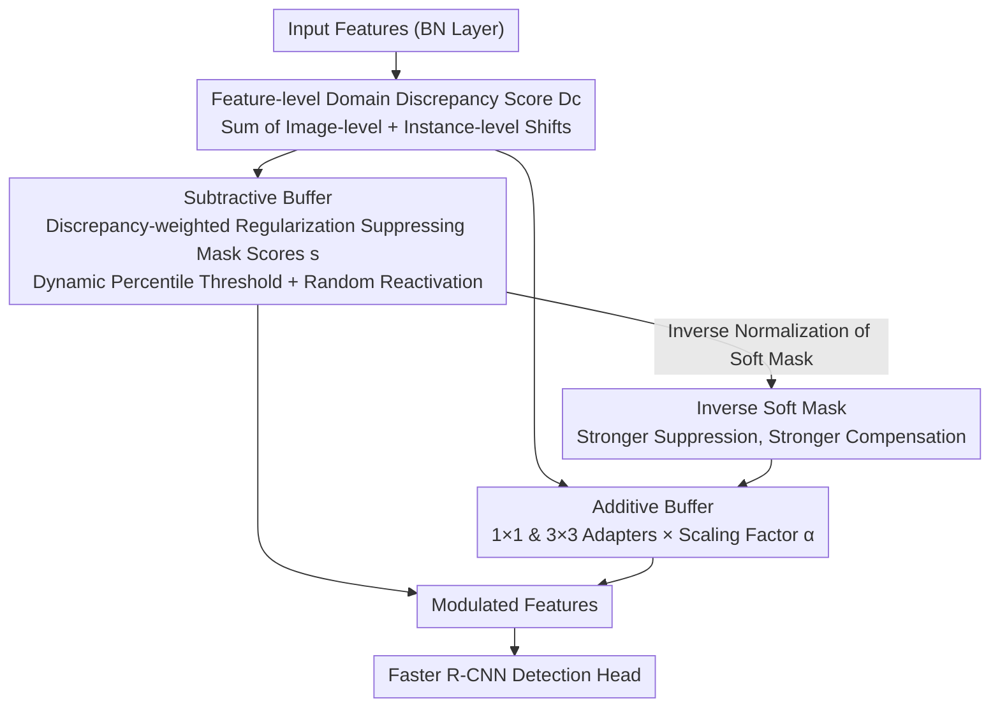

# CD-Buffer: Complementary Dual-Buffer Framework for Test-Time Adaptation in Adverse Weather Object Detection

**Conference**: CVPR 2026  
**arXiv**: [2603.26092](https://arxiv.org/abs/2603.26092)  
**Code**: [Website](https://wkfsksdl99.github.io/cd_buffer/)  
**Area**: Object Detection  
**Keywords**: Test-Time Adaptation, Adverse Weather, Object Detection, Channel Adaptation, Additive-Subtractive Complementarity

## TL;DR

The CD-Buffer framework is proposed, which achieves robust test-time object detection adaptation across varying adverse weather severities by driving the complementary collaboration of a subtractive buffer (channel suppression) and an additive buffer (lightweight adapter compensation) through a unified domain discrepancy metric.

## Background & Motivation

**Background**: Test-time adaptation (TTA) addresses domain shifts by updating source-pre-trained models online without offline retraining or target labels. Existing TTA methods are categorized into additive methods (introducing lightweight modules to learn target-specific adjustments) and subtractive methods (removing domain-sensitive channels).

**Limitations of Prior Work**: Additive methods (e.g., BufferTTA) perform well under moderate domain shifts but struggle with severe degradation; subtractive methods (e.g., PruningTTA) excel under severe shifts but over-prune repairable useful information during moderate shifts. Each paradigm is effective only within a limited range.

**Key Challenge**: In real-world scenarios, different feature channels within the same image may face varying degrees of domain shift—some channels are severely degraded and require suppression, while others only need fine-tuning. Existing methods treat all channels uniformly, failing to adapt to this heterogeneity.

**Goal**: To design an adaptive mechanism that automatically balances "removal" and "compensation" strategies based on the degree of domain shift in each channel.

**Key Insight**: Measuring channel-level domain discrepancy and using a unified metric to simultaneously drive two complementary operations.

**Core Idea**: Discrepancy-driven dual-buffer coupling—severely shifted channels are suppressed and receive strong compensation, moderately shifted channels are finely adjusted, and stable channels remain largely unaffected.

## Method

### Overall Architecture

CD-Buffer addresses a practical contradiction: under adverse weather, the degradation levels of different feature channels in the same image vary significantly—some channels are completely contaminated by fog and must be removed, while others shifted slightly and remain usable. It integrates "removal" and "compensation" mechanisms into the same detector (Faster R-CNN + ResNet-50) and links them via a channel-level domain discrepancy metric $D_c$. Channels with large discrepancies are suppressed by the subtractive buffer and specifically compensated by the additive buffer; stable channels are minimally intervened. Specifically, a **subtractive buffer** (a set of learnable mask scores for suppressing bad channels) is attached to each BN layer, and an **additive buffer** (lightweight $1\times1 + 3\times3$ convolutional adapters for information compensation) is placed on the residual path. Both are updated online during testing without target domain labels. The data flow is as follows: after the discrepancy score is calculated, it simultaneously drives both buffers; the soft mask generated by the subtractive buffer is then fed to the additive buffer via inverse normalization to determine compensation intensity, and finally, the two modulated paths merge into new features for the detection head.

### Key Designs

**1. Feature-level Domain Discrepancy Score: Quantifying individual channel deviation to determine processing strategy.**

The "decision basis" for the entire framework is this score, which identifies the degree of channel degradation. Since detection tasks require both global scenes and local instances, the discrepancy is calculated at two levels: the image-level $D^I$ measures the deviation of the entire feature map relative to the source domain mean; the instance-level $D^O$ measures the shift of instance features extracted by RoI Align.

$$D^I = \frac{\sum_{n=1}^{N}\|X_t^c - \bar{X}_s^c\|_1}{NHW}, \quad D^O = \frac{\sum_{m=1}^{M}\|x_t^c - \bar{x}_s^c\|_1}{Mhw}, \quad D = D^I + D^O$$

Here, $\bar{X}_s^c$ and $\bar{x}_s^c$ are pre-computed source domain mean features. A high $D$ indicates severe channel shift and a need for heavy intervention, while a low $D$ suggests fine-tuning. Combining both levels ensures that cases where "global statistics appear normal but instance regions have collapsed" are not missed.

**2. Subtractive Buffer: Enabling high-discrepancy channels to self-suppress.**

The subtractive buffer assigns a learnable mask score $s \in \mathbb{R}^C$ to each channel, initialized from BN weights ($s_c = |\gamma_c|$), and uses a **discrepancy-weighted** regularization term for suppression:

$$\mathcal{L}_{mask} = \frac{1}{C}\sum_c \|D_c \cdot s_c\|_1$$

The core innovation is using $D_c$ as a weight—channels with larger discrepancies face stronger gradients, pushing $s_c$ lower and making them more likely to be filtered by the threshold. Stable channels are barely affected. The threshold is a dynamic percentile $\tau = \text{Percentile}(\{|s_c^{(l)}|\}, \rho_{target})$, controlling the overall suppression rate at approximately 5%. Straight-through estimators allow mask binarization gradients to flow, while random reactivation prevents permanent erroneous deletion of temporarily suppressed channels.

**3. Additive Buffer and Inverse Soft Mask: Compensating exactly what was removed.**

To prevent information loss, the additive buffer handles compensation, using a lightweight adapter to extract features and a learnable channel scaling factor $\boldsymbol{\alpha}$ (initialized to $10^{-2}$) for magnitude control:

$$F_{add} = \frac{\text{Conv}_{1\times1}(F) + \text{Conv}_{3\times3}(F)}{2} \odot \boldsymbol{\alpha}$$

The buffers are coupled via the **inverse soft mask**, derived by normalizing the negation of the subtractive soft mask:

$$\hat{m}_{soft}^{-1} = k \cdot \text{Norm}(\mathbf{1} - \hat{m}_{soft})$$

Channels nearly closed by the subtractive buffer ($\hat{m}_{soft}\to 0$) result in a normalized inverse mask $\hat{m}_{soft}^{-1}$ that reaches its maximum, thus receiving the strongest compensation. This "compensation proportional to removal" occurs automatically. One $D_c$ drives the two opposing operations: high-discrepancy channels are simultaneously suppressed and prioritized for repair, while low-discrepancy channels remain largely unchanged.

### Mechanism: The Fates of Three Channels

Consider three channels in a BN layer, differentiated by their discrepancy scores:

- **Channel A (Very high $D_c$, heavily polluted by fog)**: $\mathcal{L}_{mask}$ suppresses $s_A$ below threshold $\tau \to \hat{m}_{soft}\approx 0$, effectively closing it; however, $\hat{m}_{soft}^{-1}$ is maximized $\to$ the additive buffer provides peak compensation. The net effect is "metabolic replacement": the corrupted original response is discarded and reconstructed via the clean adapter.
- **Channel B (Moderate $D_c$, slight shift)**: $s_B$ decreases but stays above $\tau \to$ channel is preserved; the inverse mask provides moderate compensation $\to$ adapter performs fine-tuning.
- **Channel C (Very low $D_c$, stable)**: Gradients barely affect it $\to$ mask is preserved and compensation is near zero $\to$ original features pass through.

This explains why CD-Buffer does not lag behind in either "moderate" or "severe" shifts: purely subtractive methods would prune repairable information like Channel B, while purely additive methods cannot recover heavily polluted info like Channel A.

### Loss & Training

$$\mathcal{L} = \mathcal{L}_{align} + \lambda_{reg} \cdot \mathcal{L}_{mask}$$

$\mathcal{L}_{align}$ is the L1 alignment term for source and target feature means/variances. $\mathcal{L}_{mask}$ is the discrepancy-weighted mask regularization. During training, hierarchical gradient scaling is applied—amplifying additive buffer gradients based on layer-wise discrepancy $D^l$ to intensify repairs in more degraded layers. The additive buffer parameters, BN affine parameters, and mask scores are jointly optimized.

## Key Experimental Results

### Main Results

| Method | KITTI Fog 50m | Fog 75m | Fog 150m | Rain 200mm | Rain 100mm |
|------|-------------|---------|----------|-----------|------------|
| Direct Test | 21.27 | 30.84 | 50.45 | 47.11 | 65.32 |
| BufferTTA (Additive) | 23.21 | 33.12 | 52.50 | 50.96 | 69.28 |
| PruningTTA (Subtractive) | 33.97 | 42.83 | 58.58 | 50.94 | 65.42 |
| ActMAD | 39.65 | 49.95 | 60.18 | 56.37 | 62.94 |
| **Ours (CD-Buffer)** | **44.80** | **56.06** | **68.42** | **63.22** | 71.40 |

| Method | ACDC Fog | ACDC Snow | ACDC Rain | ACDC Night |
|------|---------|-----------|-----------|------------|
| Direct Test | 16.50 | 11.04 | 7.82 | 4.83 |
| BufferTTA | 24.16 | 17.18 | 11.70 | 6.98 |
| **Ours (CD-Buffer)** | **24.45** | 15.41 | **13.71** | **8.92** |

### Ablation Study

| Configuration | KITTI Fog 50m | Description |
|------|-------------|------|
| Additive Buffer Only | ~23.2 | Limited effect under severe domain shift |
| Subtractive Buffer Only | ~34.0 | Removes degraded features but suffers info loss |
| Dual-Buffer w/o Coupling | Significantly weaker | Independent operations lack coordination |
| **Full CD-Buffer** | 44.80 | Optimal discrepancy-driven coupling |

### Key Findings

1. **Verification of Complementary Mode**: BufferTTA performs well in moderate shifts (Rain 75mm) but poorly in severe shifts (Fog 50m); PruningTTA shows the opposite. CD-Buffer is consistently superior across all severity levels.
2. **Stability in Continual TTA**: In sequential adaptation (KITTI Fog 50m $\to$ 75m $\to$ 150m), CD-Buffer adapts the fastest and shows the most stable performance. ActMAD shows quick initial gains but unstable convergence.
3. The coupling mechanism via the inverse soft mask is the key to performance gains—unifying the two paradigms from independent strategies into a coordinated system.

## Highlights & Insights

- Systematically reveals the complementary characteristics of additive and subtractive TTA paradigms and provides an intuitive explanatory framework.
- The discrepancy-driven coupling design is elegant and simple: a single metric $D_c$ simultaneously drives two opposite operations, automatically achieving channel-level differentiated processing.
- The inverse soft mask is a standout design: it derives compensation intensity directly from the subtractive mask score without requiring an additional decision network.
- Batch size independence: Unlike BN-based methods affected by small batch sizes, CD-Buffer adapts through structural modifications.

## Limitations & Future Work

- Experiments were limited to Faster R-CNN + ResNet-50; validation on end-to-end detectors like DETR is missing.
- The channel suppression rate is fixed at 5% and could potentially be determined adaptively.
- Pre-calculation and storage of source domain statistics increase deployment complexity.
- Integration with self-supervised objectives (e.g., contrastive learning) remains unexplored.

## Related Work & Insights

- Unlike the multi-layer feature alignment in ActMAD, CD-Buffer provides finer adaptation through channel-level differentiation.
- The inverse mask concept could be generalized to other scenarios requiring a balance between retention and modification (e.g., knowledge distillation in model compression).
- Provides a "Additive vs. Subtractive" classification framework for the TTA field, aiding the understanding of future work.

## Rating

- Novelty: ⭐⭐⭐⭐⭐ The insight into additive/subtractive complementarity is novel, and the discrepancy-driven coupling is elegantly designed.
- Experimental Thoroughness: ⭐⭐⭐⭐ Extensive evaluation across multiple datasets and severities; continual TTA experiments are meaningful.
- Writing Quality: ⭐⭐⭐⭐ Clear motivation and complete description of the methodology.
- Value: ⭐⭐⭐⭐ Provides a new paradigm integration approach for TTA.

<!-- RELATED:START -->

## Related Papers

- [\[CVPR 2026\] InsCal: Calibrated Multi-Source Fully Test-Time Prompt Tuning for Object Detection](inscal_calibrated_multi-source_fully_test-time_prompt_tuning_for_object_detectio.md)
- [\[NeurIPS 2025\] Test-Time Adaptive Object Detection with Foundation Model](../../NeurIPS2025/object_detection/test-time_adaptive_object_detection_with_foundation_model.md)
- [\[CVPR 2026\] Complementary Prototype Mapping for Efficient Multimodal Anomaly Detection](complementary_prototype_mapping_for_efficient_multimodal_anomaly_detection.md)
- [\[CVPR 2026\] BDNet: Bio-Inspired Dual-Backbone Small Object Detection Network](bdnetbio-inspired_dual-backbone_small_object_detection_network.md)
- [\[CVPR 2026\] Black-Box Domain Adaptation for Object Detection with Retention-Driven Knowledge Compression](black-box_domain_adaptation_for_object_detection_with_retention-driven_knowledge.md)

<!-- RELATED:END -->
