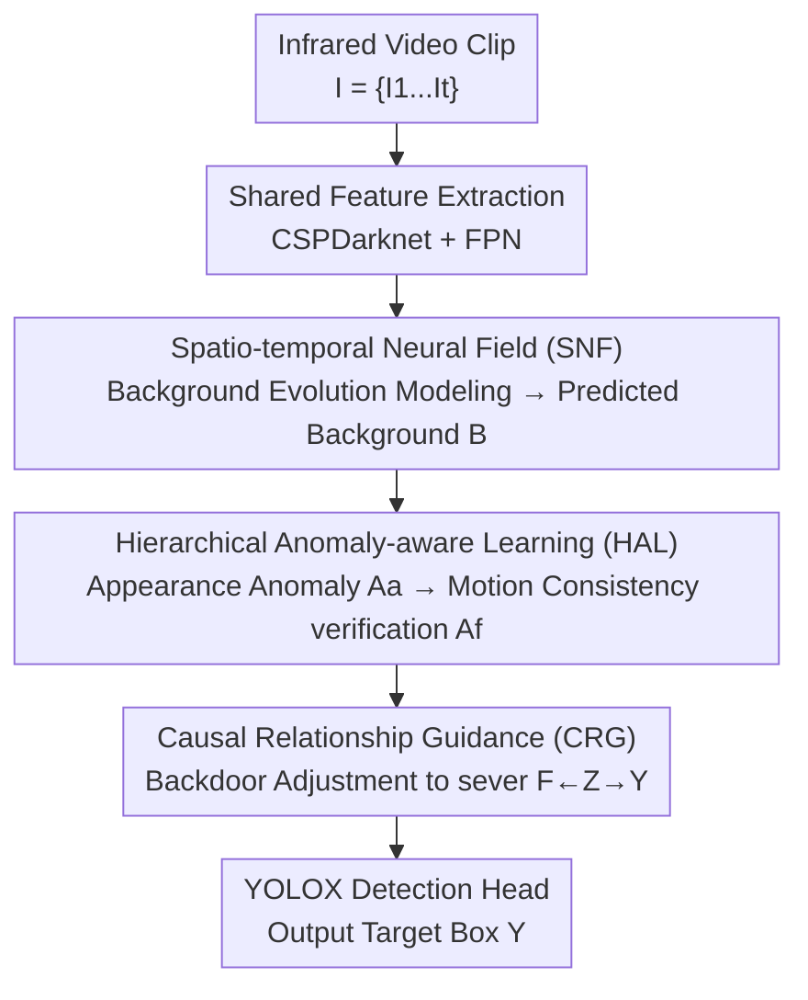

# CHAL: Causal-guided Hierarchical Anomaly-aware Learning for Moving Infrared Small Target Detection

**Conference**: CVPR 2026  
**Paper**: [CVF Open Access](https://openaccess.thecvf.com/content/CVPR2026/html/Duan_CHAL_Causal-guided_Hierarchical_Anomaly-aware_Learning_for_Moving_Infrared_Small_Target_CVPR_2026_paper.html)  
**Code**: https://github.com/UESTC-nnLab/CHAL  
**Area**: Infrared Small Target Detection / Video Object Detection  
**Keywords**: Infrared small targets, anomaly detection, causal learning, background modeling, spatio-temporal neural fields

## TL;DR
This work inverts "moving infrared small target detection" from "direct learning of weak target features" to "learning normal background patterns and treating targets as anomalies within the background." By utilizing spatio-temporal neural fields for background evolution modeling, hierarchical anomaly awareness (appearance anomaly → motion consistency verification), and causal backdoor adjustment to sever background confusion paths, the method achieves new SOTA performance on three infrared datasets.

## Background & Motivation

**Background**: Almost all data-driven methods for Infrared Small Target Detection (ISTD) are "target-centered," directly learning target features from the background. Single-frame methods (ISNet, MSHNet, PConv) focus on appearance, while multi-frame methods (SSTNet, Tridos, DTUM) additionally extract motion patterns from consecutive frames, with the latter becoming the mainstream.

**Limitations of Prior Work**: Infrared small targets are inherently **Small (minimal imaging size) + Dim (low contrast with background)**, lacking clear shapes and textures. The target-centered paradigm faces a fundamental contradiction: it relies on rich target features, which are precisely what infrared small targets lack. Consequently, detectors are easily confused—when a weak target is adjacent to a bright cloud edge, the model learns the stronger background confounder rather than the dim target, degrading into a "confounder detector" and generating numerous false alarms.

**Key Challenge**: The issue lies in the causal structure. The authors present a Structural Causal Model (SCM): while target features $T \to F \to Y$ represent the true causal chain, a confounding path $F \leftarrow Z \to Y$ exists—where $Z$ represents complex background clutter, bright cloud edges, or sensor noise. This $Z$ both contaminates feature learning ($F \leftarrow Z$) and directly creates false alarms ($Z \to Y$). Direct supervision on weak targets cannot sever this confounding path.

**Goal**: Reformulate Moving Infrared Small Target Detection (MISTD) as an **anomaly discovery** task—rather than directly classifying pixels as target or background, the goal is to identify regions deviating from the spatio-temporal evolution patterns of the background. The sub-problems are decomposed into: (1) how to model the "normal state" of continuously evolving infrared backgrounds; (2) how to distinguish true anomalies (targets) from false anomalies (background confounders); (3) how to sever the confounding path in the feature space.

**Key Insight**: Paradigm inversion—shifting from "staring at the weak target" to being "**background-centered**." Although backgrounds are complex, they are relatively stable and information-rich, making them easier to model; targets are simply the few "outliers" deviating from normal background patterns. This inversion transforms a "mission impossible" (weak target features) into an "evidence-based" task (learnable background patterns).

**Core Idea**: First, a spatio-temporal neural field is used to learn the normal state of the background. Then, hierarchical perception is applied—finding appearance anomalies first, followed by motion consistency verification. Finally, causal backdoor adjustment suppresses pseudo-correlations of background confounders and amplifies true target causality. This forms the "background-centered + hierarchical anomaly awareness + causal guidance" triad.

## Method

### Overall Architecture

The input to CHAL is an infrared video clip $I=\{I_1,\dots,I_t\}$ (default $t=5$ frames), aiming to locate anomalies (small targets) $Y$ in the keyframe $I_t$. The pipeline consists of three core components: **SNF (Spatio-temporal Neural Field) → HAL (Hierarchical Anomaly-aware Learning) → CRG (Causal Relationship Guidance)**, followed by a YOLOX detection head for bounding box output.

Specifically, shared CSPDarknet + FPN extract multi-scale features $F_C \in \mathbb{R}^{b\times t\times c\times h\times w}$ frame-by-frame. SNF projects these features into a semantic subspace to obtain scene encoding $Z$, constructs a 3D spatio-temporal grid for positional encoding $Q$, and uses a background neural field $F_\theta$ to counterfactually "predict the clean background $B$." HAL compares the predicted background with real frame features to identify appearance anomaly candidates $A_a$, then verifies true anomalies $A_f$ using motion consistency. CRG uses $A_f$ as a proxy for the confounder $Z$, performing backdoor adjustment to obtain de-confounded features $F_f$ for the detection head. The framework lacks explicit background/anomaly labels, relying on the final detection loss $L_{total}$ for **implicit supervision** of all upstream components.

### Key Designs

**1. Spatio-temporal Neural Field (SNF): Implicitly learning continuous spatio-temporal background evolution via a generative perspective**

The challenge is that infrared backgrounds are complex and evolving, while traditional background modeling (PSTNN, FGLR-MCP) relies on rigid priors. SNF treats the background as a signal that can be continuously represented and "generated" by a neural field. It performs early fusion of multi-frame features into a spatio-temporal volume $V=f_{sta}(F_C)=f_{att}(f_{up}(\sum_{i=1}^t F_C^i))$, and uses a scene encoder with **dual-decoupled branches**: a scene branch $Z_s=\psi_s(F_a)$ for static appearance features and a motion branch $Z_d=\psi_d(V)$ to explicitly model motion patterns, concatenated into a scene encoding $Z$ with background priors.

The "neural field" aspect is realized through positional encoding: a 3D spatio-temporal coordinate grid $G(i,j,t)=(\frac{2j}{w-1}-1,\ \frac{2i}{h-1}-1,\ \alpha\cdot t)$ is constructed for each point $(i,j)$ in the keyframe, followed by Fourier feature mapping $Q=\{P(\mu)\}=\{[\sin(2^l\pi\mu),\cos(2^l\pi\mu)]\}_{l=1}^L$ to capture high-frequency details. Finally, the background field $F_\theta$ performs **counterfactual prediction** to obtain the clean background:

$$B = F_\theta(Z, Q) = R\big(f_\theta(f_{cat}(T(Z), Q))\big)$$

where $f_\theta$ is a two-layer MLP with residual connections. This is effective because neural fields naturally represent continuous coordinate-to-value mappings, fitting background evolution into a smooth "normal state canvas." Targets, as outliers on this canvas, are naturally highlighted.

**2. Hierarchical Anomaly-aware Learning (HAL): Decomposing anomaly judgment into "appearance discovery" then "motion verification"**

Single-step anomaly detection often mistakes "background confounders deviating from the background" as true anomalies. HAL decomposes discovery into two stages. Stage one, "Appearance Anomaly": directly calculates point-wise cosine similarity between each frame feature $F_k$ and the predicted counterfactual background $B_k$. Lower similarity indicates higher anomaly, further processed by a residual anomaly amplifier $\Delta_\theta$:

$$A_a^k = \Delta_\theta\big(1 - f_{cos}(F_k, B_k)\big),\quad f_{cos}(F_k,B_k)(i,j)=\frac{F_k(i,j)\cdot B_k(i,j)}{\|F_k(i,j)\|_2\,\|B_k(i,j)\|_2}$$

Stage two, "Motion Verification": projects appearance anomaly sequences into a high-dimensional subspace, using $N$ layers of Spatio-temporal Swin Transformers for shifted self-attention in local 3D windows. This enhances **motion consistency**—true targets move coherently across frames, while false anomalies (cloud edges, noise) lack consistent motion. The final causal anomaly $A_f$ is a weighted fusion $A_f=\sum_{k=1}^t\omega_k\cdot A_r^k$ using **temporal-weight learning**.

**3. Causal Relationship Guidance (CRG): Using backdoor adjustment to sever background confounding paths**

CRG addresses the $F\leftarrow Z\to Y$ confounding path. Theoretically, backdoor adjustment requires weighted average predictions over strata of the confounder $Z$: $P(Y|do(F))=\sum_z P(Y|F,Z=z)P(Z=z)$. Since $Z$ (background clutter) is continuous and dynamic in MISTD, CRG proposes a **differentiable causal guidance gate** as a proxy: normalizing $A_f$ to $(0,1)$ and using a non-linear filter to divide it into two "strata" based on a threshold $\tau$:

$$H = \begin{cases} \eta_e\cdot f_{nor}(A_f), & f_{nor}(A_f) > \tau \\ \eta_s\cdot f_{nor}(A_f), & \text{otherwise}\end{cases}$$

where $\eta_e>1$ and $\eta_s<1$ are learnable scaling factors. Observed features $\hat F_t=F_t\odot M$ are then adjusted by the anomaly score $H$ to obtain de-confounded features:

$$F_f = f_{ref}(\hat F_t\odot(1+H))$$

This re-weights feature flow based on whether it is a "true anomaly," isolating the confounding path and forcing features to approximate the true causal chain $T\to F\to Y$.

### Loss & Training

Total loss: $L_{total}=L_{obj}+\lambda_1 L_{reg}+\lambda_2 L_{cls}$. sigmoid focal loss is used for classification $L_{cls}$ and probability $L_{obj}$, while NWD loss is used for localization $L_{reg}$. Crucially, there is **no explicit supervision for background or anomalies**; $L_{total}$ is calculated only on the final features $F_f$, implicitly driving the optimization of SNF, HAL, and CRG. Settings: $t=5$, $L=6$, $N=2$, $\tau=0.3$, $\lambda_1=4.0$, $\lambda_2=1.2$; AdamW optimizer, initial lr $8\times10^{-5}$, input size $512\times512$.

## Key Experimental Results

Tests were performed on three public infrared datasets: DAUB-H, NUDT-MIRSDT, and IRDST-R, using metrics Pr, Re, F1, and mAP50.

### Main Results

| Dataset | Metric | CHAL (Ours) | Prev. SOTA | Note |
|--------|------|-----------|---------|------|
| NUDT-MIRSDT | mAP50 | **75.25** | 73.01 (Tridos) | New SOTA |
| NUDT-MIRSDT | F1 | **87.41** | 85.87 (Tridos) | More balanced |
| NUDT-MIRSDT | Pr | 86.35 | 92.50 (ADSUNet) | ADSUNet sacrifices Re for Pr |
| DAUB-H | mAP50 | **54.28** | 52.25 (SSTNet) | New SOTA |
| DAUB-H | F1 | **74.15** | 71.98 (SSTNet) | — |
| IRDST-R | mAP50 | **71.37** | 68.21 (SSTNet) | New SOTA |
| IRDST-R | F1 | **84.76** | 82.79 (SSTNet) | — |

General anomaly detection methods largely fail in infrared scenarios: DiffusionAD achieves only 19.50 mAP50 on DAUB-H. CHAL contains 15.69M parameters, 137.04 GFLOPs, and runs at 12.96 FPS (RTX 4090).

### Ablation Study (DAUB-H)

| Configuration | mAP50 | F1 | Description |
|------|-------|-----|------|
| w/o All (baseline) | 23.48 | 46.36 | No specialized components |
| + SNF | 43.76 | 60.90 | Background neural field, +20.3 mAP50 |
| + HAL | 48.63 | 66.68 | Hierarchical anomaly awareness, +4.9 |
| + CRG (Full) | **54.28** | **74.15** | Causal guidance, +5.7 |

### Key Findings
- **SNF provides the largest contribution**: Adding SNF to the baseline increases mAP50 by 20.3, indicating that the "background-centered" paradigm shift is the primary driver of performance.
- **Synergy between components**: HAL and CRG build upon the "clean background" from SNF. Removing any component leads to a performance drop.
- **Balanced Pr/Re**: Unlike ADSUNet which sacrifices Recall for Precision, CHAL achieves a better F1 score, balancing false alarms and missed detections.

## Highlights & Insights
- **Paradigm Inversion**: Shifting from learning weak target features to learning the stable, information-rich background makes the problem well-posed.
- **Differentiable Causal Gating**: Approximating discrete backdoor adjustment for continuous dynamic confounders via normalized anomaly scores and learnable scaling is a significant engineering adaptation of causal theory.
- **Neural Fields for Background**: Using neural fields to represent the "normal state canvas" rather than the target is a novel application for infrared scenarios.
- **Zero Explicit Background Labels**: All internal discovery is driven by the final detection loss, saving annotation costs for background reconstruction.

## Limitations & Future Work
- **Inference Cost**: The pipeline (5 frames + Swin Transformer + Neural Field) results in 12.96 FPS, which may be insufficient for high-frame-rate real-time systems.
- **Dependence on Background Stability**: SNF assumes continuous background evolution; rapid camera movements or sudden background changes might destabilize the "normal state" representation.
- **Proxy Validity**: CRG relies on $A_f$ as a proxy for $Z$. If HAL misidentifies anomalies, errors may propagate through the causal gate.

## Related Work & Insights
- **vs. Target-centered ISTD**: Methods like ISNet or Tridos are easily misled by background confounders; CHAL avoids this by focusing on what the background *should* look like.
- **vs. General Anomaly Detection**: These methods are designed for visible light and often fail to converge or perform poorly on infrared data; CHAL is the first framework to successfully adapt anomaly discovery for MISTD.
- **vs. Causal Learning**: Unlike methods for high-level semantic decoupling, CHAL adapts backdoor adjustment for low-level vision tasks involving non-semantic, dynamic clutter.

## Rating
- Novelty: ⭐⭐⭐⭐⭐ (Paradigm shift to background-centered anomaly detection)
- Experimental Thoroughness: ⭐⭐⭐⭐ (Extensive comparisons and component-wise ablation)
- Writing Quality: ⭐⭐⭐⭐ (Clear pipeline and causal diagrams)
- Value: ⭐⭐⭐⭐ (Strong potential for replication and transfer to other weak signal tasks)

<!-- RELATED:START -->

## Related Papers

- [\[CVPR 2026\] Target-Aware Invertible Encoder with Reconstruction Guidance for Infrared Small Target Detection](target-aware_invertible_encoder_with_reconstruction_guidance_for_infrared_small_.md)
- [\[CVPR 2026\] Seeing Through the Noise: Improving Infrared Small Target Detection and Segmentation from Noise Suppression Perspective](seeing_through_the_noise_improving_infrared_small_target_detection_and_segmentat.md)
- [\[CVPR 2026\] RHCNet: Residual-Guided Hierarchical Calibration Network for Robust Underwater Object Detection](rhcnet_residual-guided_hierarchical_calibration_network_for_robust_underwater_ob.md)
- [\[NeurIPS 2025\] Rethinking Evaluation of Infrared Small Target Detection](../../NeurIPS2025/object_detection/rethinking_evaluation_of_infrared_small_target_detection.md)
- [\[CVPR 2026\] Towards Persistence: Learning Topological Constraints for Event-based Small Object Detection](towards_persistence_learning_topological_constraints_for_event-based_small_objec.md)

<!-- RELATED:END -->
