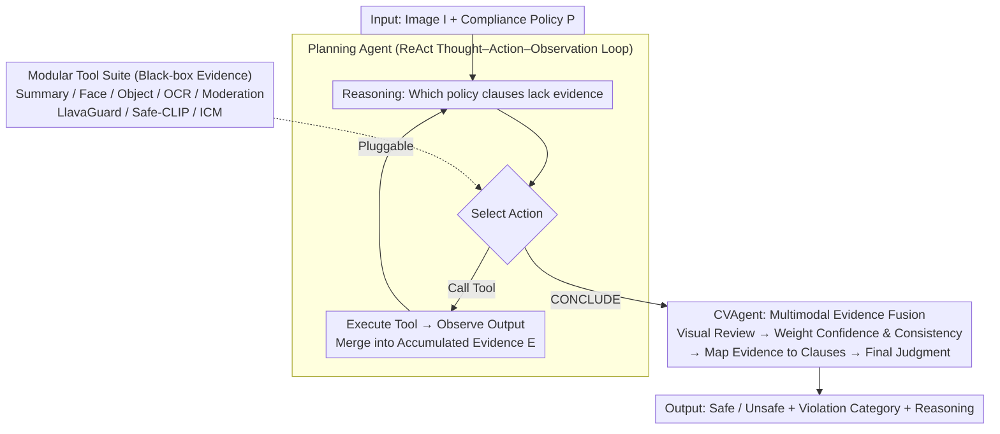

# CompAgent: An Agentic Framework for Visual Compliance Verification

**Conference**: CVPR 2026  
**arXiv**: [2511.00171](https://arxiv.org/abs/2511.00171)  
**Code**: None  
**Area**: Object Detection / Content Safety  
**Keywords**: Visual Compliance Verification, Agentic Framework, Tool-Augmented Reasoning, Content Moderation, MLLM

## TL;DR

Proposes CompAgent, the first agentic framework for visual compliance verification. A Planning Agent dynamically selects visual tools (object detection, face analysis, NSFW detection, etc.) based on compliance policies. A Compliance Verification Agent integrates images, tool outputs, and policy contexts for multimodal reasoning, outperforming SOTA on UnsafeBench by 10% (achieving 76% F1) without training.

## Background & Motivation

Visual content compliance verification is highly significant in the vision field but remains under-researched:

**Background**: Regulations ranging from GDPR to Ofcom necessitate ensuring visual content compliance. Streaming platforms face fines up to $23 million for violations. Content compliance involves detecting harmful objects, inappropriate gestures, explicit content, etc., and continuously evolves across regions, cultures, and industries.

**Limitations of Prior Work**:
   - **Specialized Classifiers**: Require expensive annotated data and must be retrained when policies change, exhibiting poor generalization. LlavaGuard achieves F1=0.91 on its own dataset but drops to 0.66 on UnsafeBench.
   - **Direct MLLM Prompting**: While possessing broad knowledge, MLLMs lack the ability for fine-grained visual detail reasoning and structured application of compliance rules. The best zero-shot MLLM (Llama 4 Maverick) achieves only 0.55 F1 on LlavaGuard.

**Key Challenge**: Although agentic methods are flourishing in other domains, no specialized agentic framework exists for visual compliance verification.

**Goal**: CompAgent aims to decompose compliance verification into modular steps—dynamic planning for tool selection and multimodal evidence fusion reasoning—via a **tool-augmented agentic architecture** without training specialized models or relying solely on prompt engineering.

## Method

### Overall Architecture

CompAgent treats "determining whether an image violates a compliance policy" as a training-free and interpretable agentic process. Instead of training specialized classifiers or relying on a single prompt for an MLLM's intuitive judgment, a Planning Agent interprets the policy and dynamically selects evidence from a set of off-the-shelf visual tools. Once sufficient evidence is gathered, it is passed to the Compliance Verification Agent (CVAgent), which consolidates the image, various tool outputs, and policy clauses for a final determination. The three components—Planning Agent (deciding what evidence to gather), Tool Suite (black-box evidence sources), and CVAgent (interpreting evidence to conclude)—have clear task divisions, and the entire pipeline requires no annotation or fine-tuning.

### Key Designs

**1. Planning Agent: Dynamic Tool Orchestration via ReAct Loops Based on Policy Gaps**

Compliance policies are highly variable; fixed routing tables or learned policies fail when encountering new clauses. The Planning Agent employs a ReAct "Thought-Action-Observation" loop: at each step $t$, it maintains a state $s_t = \{I, P, E_t\}$ (image, policy, accumulated evidence), reasons which clauses still lack evidence, and selects a tool $a_t \in T \cup \{\text{CONCLUDE}\}$. After execution, it merges the observation into the evidence $E_{t+1} = E_t \cup (\text{thought}_t, a_t, o_t)$. Tool selection is purely reasoned by an LLM in-context based on three factors: which clauses in $P$ lack evidence, what each tool can do, and what evidence $E_t$ has been accumulated. Consequently, age-limit clauses trigger face detection, and text violation clauses prioritize OCR, rather than executing all tools indiscriminately. It is implemented using LangGraph + Claude Sonnet 3.5 v2 with a maximum of 10 reasoning steps.

**2. Modular Tool Suite: Pluggable Black-box Evidence Sources**

Policies require diverse evidence types, which CompAgent covers with a set of off-the-shelf tools: Summary tools generate scene descriptions; detection tools provide faces (age/expression/emotion), object boxes + confidence, OCR text, and content moderation (unsafe categories + severity); specialized compliance tools include LlavaGuard (safety rating + category + reasoning), Safe-CLIP (zero-shot detection of seven toxic categories), and ICM Assistant (templated safety assessment). Each tool is treated as a black box that can be added, removed, or replaced without retraining—providing the flexibility to adapt to new policies by simply modifying the toolset and policy text.

**3. CVAgent: Multimodal Evidence Fusion and Clause Mapping**

While the evidence collection agent can be an inexpensive text-only LLM, the final judgment must involve actual visual inspection, which is handled by an MLLM. After CONCLUDE, the CVAgent receives the full state $s_T = \{I, P, E_T\}$. It directly inspects the image, reviews tool outputs (weighing confidence against cross-tool consistency), maps combined evidence to specific policy clauses, and performs a comprehensive evaluation. The final output includes a Safe/Unsafe binary rating, violation categories, and reasoning linking the evidence chain to the clauses. The decoupling of "what evidence to collect" (Planning Agent) and "how to interpret evidence" (CVAgent) ensures that evidence collection is cost-effective and judgment is reliable.

### Mechanism Example

Consider a policy with two clauses: "no minors" and "no explicit text." The Planning Agent reads the policy and identifies a lack of evidence for the age clause, triggering face detection which observes a face estimated as a minor. It then identifies a lack of evidence for the text clause and triggers OCR to retrieve text strings. Once both have evidence, it outputs CONCLUDE. The CVAgent receives the image and both evidence streams, visually reviews the face, checks if the OCR text violates rules, maps the "detected minor face" to the age clause, and determines the status as Unsafe, providing the reasoning "violates minor clause, evidence is face age estimation." The entire process avoids unnecessary NSFW or object detection tools—an observation supported by decision trajectory analysis: the framework generated 95 and 147 different tool usage patterns on LlavaGuard and UnsafeBench respectively, demonstrating dynamic adaptation.

### Loss & Training

CompAgent is entirely **training-free**, requiring no annotated data or fine-tuning. Compared to methods like LlavaGuard that rely on training with specific policy-annotated data (and suffer performance drops on new datasets), its training-free nature allows for immediate adaptation to policy changes, which is its core advantage.

## Key Experimental Results

### Main Results

| Method | Type | LlavaGuard F1 | UnsafeBench F1 | Description |
|------|------|--------------|----------------|------|
| Claude Sonnet 3.5 v2 | Zero-shot | 0.61 | 0.54 | Best zero-shot single model |
| Llama 4 Maverick | Zero-shot | 0.55 | 0.71 | Zero-shot |
| LlavaGuard (Specialized) | Fine-tuned | 0.91 | 0.66 | Strong on internal data, drops on cross-dataset |
| Safe-CLIP | Fine-tuned | 0.36 | 0.59 | Zero-shot toxic detection |
| Category-based Routing | Routing | 0.61 | 0.63 | Fixed routing baseline |
| **CompAgent** | **Agentic** | **0.93** | **0.76** | **Superior on both datasets** |

CompAgent achieves F1=0.93 on the LlavaGuard dataset (surpassing the fine-tuned LlavaGuard at 0.91) and F1=0.76 on UnsafeBench (outperforming SOTA by 10%), all **without any training data**.

### Ablation Study

| Configuration | UnsafeBench F1 | Description |
|------|----------------|------|
| No Tools (Direct MLLM) | 0.54 | Lacks fine-grained visual evidence |
| Fixed Tool Routing | 0.63 | Static allocation lacks flexibility |
| W/o Planning Agent | Lower | Tool selection lacks specificity |
| W/o CVAgent (Direct Planning) | Lower | Lacks multimodal evidence fusion |
| **Full CompAgent** | **0.76** | Optimal dynamic orchestration + fusion |

Decision trajectory analysis shows 95 distinct tool usage patterns on the LlavaGuard dataset and 147 on UnsafeBench—indicating that the framework effectively adapts to different compliance requirements.

### Key Findings

- **Zero-shot MLLMs are Insufficient**: Even the strongest MLLMs cannot meet compliance verification needs directly, highlighting the necessity of structured tool augmentation.
- **Fine-tuned Models Generalize Poorly**: LlavaGuard's F1 drops from 0.91 on its own data to 0.66 on other datasets, exposing the vulnerability of training on specific data.
- **Core Advantages of Agentic Methods**: Dynamic tool selection, cross-validation of multi-source evidence, and flexible adaptation without training.

## Highlights & Insights

- **First agentic framework for visual compliance verification**, opening a new research direction.
- **Zero-training surpassing fine-tuned models**: Proves that in policy-heavy scenarios like compliance, agentic methods are more practical than fine-tuning.
- **Decoupled Design of Planning Agent and CVAgent**: Successfully separates information gathering (cost-effective LLM) from information judgment (vision-capable MLLM).
- Modular design of the Tool Suite makes the system easily extensible and adaptable to new compliance requirements.

## Limitations & Future Work

- Currently handles only single images; video compliance verification (temporal scenes, context dependency) needs extension.
- Dependency on Claude Sonnet 3.5 v2 as a backbone leads to high inference costs and reliance on closed-source models.
- Tool Suite selection and descriptions require manual design; integration of new tools still involves manual intervention.
- While SOTA, F1=0.76 on UnsafeBench still leaves significant room for improvement toward perfection.
- Lacks detailed analysis of latency and cost (multiple tool calls + LLM inference).

## Related Work & Insights

- First application of the ReAct framework in the visual compliance domain, proving the unique value of agentic methods for tasks requiring flexible adaptation.
- Relationship with specialized tools like NudeNet and Safe-CLIP: CompAgent treats them as evidence sources rather than replacements.
- Insight: Other policy-driven visual judgment tasks (e.g., advertisement compliance, medical imaging review) can adapt this framework.

## Rating

- **Novelty**: ⭐⭐⭐⭐ First agentic framework for compliance, though ReAct + tool calling is an established pattern.
- **Experimental Thoroughness**: ⭐⭐⭐⭐ Thorough comparison across two datasets with strong ablation and interpretability analysis.
- **Writing Quality**: ⭐⭐⭐⭐ Clear problem definition and detailed framework description, though the main text is somewhat long.
- **Value**: ⭐⭐⭐⭐⭐ High practical value; the ability to adapt to new policies without training is directly beneficial to the industry.

<!-- RELATED:START -->

## Related Papers

- [\[AAAI 2026\] Connecting the Dots: Training-Free Visual Grounding via Agentic Reasoning](../../AAAI2026/object_detection/connecting_the_dots_training-free_visual_grounding_via_agent.md)
- [\[CVPR 2026\] ADSeeker: A Knowledge-Grounded Reasoning Framework for Industry Anomaly Detection and Reasoning](adseeker_a_knowledge-grounded_reasoning_framework_for_industry_anomaly_detection.md)
- [\[CVPR 2026\] GMT: Effective Global Framework for Multi-Camera Multi-Target Tracking](gmt_effective_global_framework_for_multi-camera_multi-target_tracking.md)
- [\[CVPR 2026\] CD-Buffer: Complementary Dual-Buffer Framework for Test-Time Adaptation in Adverse Weather Object Detection](cd-buffer_complementary_dual-buffer_framework_for_test-time_adaptation_in_advers.md)
- [\[CVPR 2026\] Evaluating Few-Shot Pill Recognition Under Visual Domain Shift](evaluating_few-shot_pill_recognition_under_visual_domain_shift.md)

<!-- RELATED:END -->
