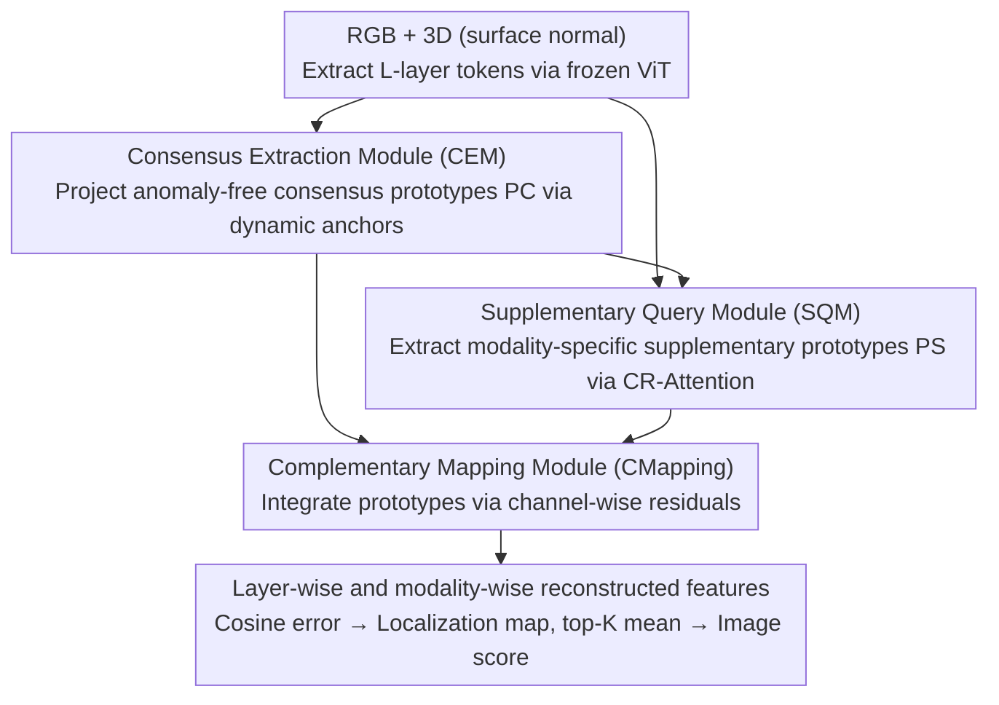

# Complementary Prototype Mapping for Efficient Multimodal Anomaly Detection

**Conference**: CVPR 2026  
**Paper**: [CVF Open Access](https://openaccess.thecvf.com/content/CVPR2026/html/Zhao_Complementary_Prototype_Mapping_for_Efficient_Multimodal_Anomaly_Detection_CVPR_2026_paper.html)  
**Code**: https://github.com/yuanzhao-CVLAB/CPMAD  
**Area**: Multimodal Anomaly Detection / Industrial Defect Detection  
**Keywords**: Multimodal Anomaly Detection, Cross-modal mapping, Prototype learning, Residual attention, Efficient inference

## TL;DR
Addressing the issue where "unconditional cross-modal mapping" in RGB-3D multimodal anomaly detection misidentifies diverse normal variations (e.g., different colors for the same geometry) as anomalies, CPMAD dynamically extracts "consensus prototypes" (cross-modal consistent, anomaly-free subspaces) and "supplementary prototypes" (capturing modality-specific cues ignored by consensus). These complementary prototypes guide cross-modal reconstruction, achieving 97.8% I-AUROC on MVTec-3D while the lightweight version offers 5× faster inference and 2.6× lower memory consumption.

## Background & Motivation

**Background**: Unsupervised Multimodal Anomaly Detection (MAD) is trained only on normal samples, leveraging the complementarity between RGB textures and 3D geometry to detect both appearance and shape defects. To overcome the significant memory overhead of memory-bank methods (e.g., M3DM), recent mainstream research has shifted toward the "feature mapping" route—represented by CFM, which learns a cross-modal matching relationship on normal samples (e.g., mapping 3D features to corresponding RGB features) and uses mapping discrepancies to localize defects during inference.

**Limitations of Prior Work**: Cross-modal relationships are inherently complex **many-to-many** mappings. However, methods like CFM learn an **unconditional mapping**—given a 3D geometry, it tends to output a deterministic RGB representation. In reality, the same 3D shape may have multiple normal variations in the RGB modality (e.g., Figure 1 in the paper: the same geometric structure could be pink or orange). Unconditional mapping fails to adaptively distinguish whether to "map to pink or orange," resulting in these **diverse but normal** variations being reported as anomalies, causing mapping ambiguity. Furthermore, these methods either rely on inefficient memory banks or time-consuming decoding processes, making them difficult to deploy on real production lines.

**Key Challenge**: Cross-modal mapping must simultaneously satisfy two conflicting goals: maintaining **cross-modal consistency** (suppressing true anomalies) while preserving **normally diverse, modality-specific details** (not misidentifying normal variations). Unconditional mapping lacks a reconciliation mechanism between these two and can only choose one.

**Goal**: To make cross-modal mapping "conditional and adaptive" without introducing heavy decoders or exceeding linear complexity—enabling it to filter anomalies while recovering diverse normal details.

**Key Insight**: The prior knowledge required for mapping is split into two complementary "prototypes." Consensus prototypes characterize cross-modal shared, anomaly-free semantics (providing a reference for "which common center to approach"); supplementary prototypes characterize modality-specific key cues not covered by the consensus (providing disambiguation information like "pink or orange"). Together, they transform unconditional mapping into conditional, adaptive mapping.

**Core Idea**: Replace a single unconditional mapping with two sets of dynamic priors, "consensus prototypes + supplementary prototypes," allowing reconstruction at each token to adaptively aggregate complementary cues from two subspaces, fundamentally eliminating mapping ambiguity.

## Method

### Overall Architecture

The input to CPMAD is a pair of registered 3D (represented by surface normals) and RGB images. The output consists of layer-wise and modality-wise reconstructed features, where the reconstruction error serves as the anomaly localization map. The pipeline is: a pair of frozen ViT encoders (DINO ViT-B/8) extracts $L$ layers of patch-token features $\{F^{3D}_l, F^{RGB}_l\}$ (the implementation uses $L=2$, corresponding to low-level and high-level representations); these features are first fed into the **Consensus Extraction Module (CEM)** to obtain global consensus prototypes $P^{\mathcal{C}}$; each layer then uses the **Supplementary Query Module (SQM)** to extract modality-specific supplementary prototypes $P^{\mathcal{S}}_l$; finally, the **Complementary Mapping Module (CMapping)** integrates both types of prototypes to reconstruct the mapped 3D and RGB features $\hat{F}^{3D}_l, \hat{F}^{RGB}_l$. During training, reconstructed features are forced to approach the ground truth features. During inference, the reconstruction error (cosine distance) of each layer and modality is averaged into a pixel-level localization map, with the top-K mean used as the image-level anomaly score.

The elegance of the design lies in: CEM is calculated only once to produce a global reference; both SQM and CMapping use lightweight attention where the number of queries is much smaller than the number of tokens, ensuring the overall complexity grows linearly with the number of tokens without needing a heavy decoder.

### Key Designs

**1. Consensus Extraction Module (CEM): Projecting an "Anomaly-free Cross-modal Common Subspace" via Dynamic Anchors**

This step addresses how to obtain a clean, cross-modal consistent reference center. A naive approach would be to concatenate and average RGB and 3D tokens to get a consensus token $F$—averaging smooths out inter-modal inconsistencies and suppresses anomaly signals that appear only in a single modality. However, anomalies appearing **simultaneously** in both modalities would still contaminate the consensus token. CEM's solution introduces **dynamic anchors** to project tokens into an anomaly-free prototype space: it first initializes a set of learnable embeddings $\mathcal{H} \in \mathbb{R}^{I\times D}$ as initial anchors ($I=12$), calculates the average cosine similarity between anchors and RGB/3D features to get affinity:

$$\mathbf{W}_{i,n}=\frac{1}{2}\Big(\frac{(\mathbf{Z}^{3D}_n)^\top \mathcal{H}^{3D}_i}{\|\mathbf{Z}^{3D}_n\|\,\|\mathcal{H}^{3D}_i\|}+\frac{(\mathbf{Z}^{RGB}_n)^\top \mathcal{H}^{RGB}_i}{\|\mathbf{Z}^{RGB}_n\|\,\|\mathcal{H}^{RGB}_i\|}\Big)$$

The cross-modal concatenated features $\mathbf{F}^{cat}$ are then aggregated into dynamic anchors $\mathcal{H}^{Dyn}_i=\sum_{n}\mathbf{W}_{i,n}\mathbf{F}^{cat}_n$ using these affinities. Finally, cross-attention makes the consensus tokens approach the dynamic anchors, which are then layer-averaged to produce consensus prototypes $P^{\mathcal{C}}=\mathrm{LAvg}(\mathrm{CA}(\overline{F}, \mathcal{H}^{Dyn}))$. Critically, anchors are **dynamically aggregated from data** rather than being static learnable vectors—ablations show that using static anchors degrades performance because they cannot adaptively capture the cross-modal semantics of each sample and might even introduce anomaly patterns into the prototype space. CEM is computed only once with complexity $O(NLID)$, which is much smaller than the feature map scale.

**2. Supplementary Query Module (SQM): Using Residual Attention to "Subtract Consensus and Keep Modality-specific Cues"**

Consensus prototypes capture shared semantics but lose modality-specific variations needed for disambiguation (e.g., "pink vs. orange"). SQM is designed to retrieve these parts. It initializes a small set of learnable queries $\mathcal{G}\in\mathbb{R}^{G\times D}$ ($G=8$, much smaller than $N=784$), allowing queries to attend to **both** the consensus prototype and modality-specific tokens, resulting in two attention scores: $A^{\mathcal{S}2\mathcal{C}}=Q^{\mathcal{C}}(K^{\mathcal{C}})^\top$ for consensus and $A^{\mathcal{S}2F}=Q^{F}(K^{F})^\top$ for modality features. The core is **Complementary Residual Attention (CR-Attention)**, which subtracts the two:

$$\mathbf{P}^{\mathcal{S}}_l=\mathrm{ReLU}\Big(\frac{\varphi(\alpha)A^{\mathcal{S}2F}-\varphi(\beta)A^{\mathcal{S}2\mathcal{C}}}{\sqrt{D}}\Big)V$$

where $\alpha, \beta$ are learnable scalars, $\varphi$ is a Sigmoid function to balance weights, and $V$ is the projection of modality features. The intuition is clear: subtracting the "response to consensus" suppresses scores for regions already well-explained by the consensus prototypes, and ReLU truncates negative regions to zero—leaving only areas with a **significant positive residual** (modality-unique cues) to generate supplementary prototypes. The query count is kept small ($G\ll N$) to ensure low-rank supplementary prototypes, as supplementary cues are sparse; too many queries would increase complexity and reintroduce modality-related noise.

**3. Complementary Mapping (CMapping): Integrating Prototypes via Channel-wise Residuals to Avoid "Identity Shortcuts"**

With consensus (shared) and supplementary (modality-specific) prototypes, CMapping integrates them to reconstruct modality-wise features. It performs a lightweight cross-attention between prototype representations, allowing each token to adaptively aggregate the most relevant components from both subspaces, followed by a feed-forward network. A key modification here is using **channel-wise residuals** instead of standard token-wise residuals in the cross-attention: traditional token-wise residuals often trigger an "identity shortcut" where the network simply copies the input token to the output, thereby reconstructing anomaly regions and losing detection capability. CMapping employs a channel-wise residual based on MLP refinement and spatial averaging, preserving shared contextual information from consensus prototypes while suppressing potential anomalies.

### Loss & Training

Training uses a mapping loss to align reconstructed features with ground truth features:

$$\mathcal{L}_{map}=\frac{1}{LHW}\sum_{l=1}^{L}\sum_{h=1}^{H}\sum_{w=1}^{W}\mathcal{M}^{3D}_l(h,w)+\mathcal{M}^{RGB}_l(h,w)$$

where $\mathcal{M}^{3D}_l(h,w)=1-\cos(\hat{F}^{3D}_l(h,w), F^{3D}_l(h,w))$ is the cosine distance at layer $l$ and coordinate $(h,w)$. During inference, the pixel-level localization score $S_{AL}$ is the average of all modality-wise and layer-wise anomaly maps. The image-level score $S_{AD}$ is the top-K mean of the localization scores ($K$ is 0.1% of total pixels). Training runs for 300 epochs with a batch size of 10 on an RTX 4090, with input size $224\times224$ (784 tokens).

## Key Experimental Results

### Main Results

CPMAD leads on industrial benchmarks MVTec-3D and Eyecandies, and the medical benchmark BraTS-AD (metrics: I-AUROC / AUPRO):

| Dataset | Metric | CPMAD | CPMAD-S | Prev. SOTA | Note |
| :--- | :--- | :--- | :--- | :--- | :--- |
| MVTec-3D | mean I-AUROC | **97.8** | 96.6 | 97.1 (G2SF) | AUPRO 97.9, also best |
| Eyecandies | mean AUPRO | **93.4** | 92.8 | 89.8 (3D-ADNAS) | +4.0% over best |
| Eyecandies | mean I-AUROC | **95.0** | 93.3 | 94.6 (3D-ADNAS) | Best gain in color-diverse scenes |
| BraTS-AD | I-AUROC | **96.4** | — | 91.8 (PatchCore+MMRD) | 4-modal MRI, +4.2% |
| BraTS-AD | AUPRO | **86.3** | — | 82.6 (PatchCore+MMRD) | +5.6% |

Significant gains are observed in categories with diverse colors but similar geometries (e.g., Licorice Sandwich, Gummy Bear), validating the role of complementary prototypes in mitigating mapping ambiguity. On BraTS-AD, CPMAD naturally extends to 4 modalities by adding SQM/CMapping without needing parameter-free fusion.

### Few-shot and Efficiency

CPMAD demonstrates strong few-shot (5/10/50 samples) capability. The lightweight CPMAD-S significantly increases speed and reduces memory with minimal accuracy drop:

| Setting | MVTec-3D I-AUROC | Eyecandies I-AUROC | Comparison |
| :--- | :--- | :--- | :--- |
| 5-shot | **89.9** | **88.0** | +8.8% / +10.6% over prev. SOTA |
| 10-shot | 91.3 | 90.5 | Consistent lead |
| 50-shot | 96.1 | 93.4 | Steady improvement with samples |

| Method | I-AUROC (M3D/Eye) | FPS (2080Ti) | FLOPs (G) | Memory (MB) |
| :--- | :--- | :--- | :--- | :--- |
| M3DM | 94.5/88.2 | 1.10 | — | 8402 |
| CFM | 95.4/88.1 | 5.71 | 431.1 | 3757 |
| EasyNet | 92.6/86.9 | 11.97 | 465.7 | 2746 |
| **CPMAD** | 97.8/95.0 | 25.73 | 145.0 | 1663 |
| **CPMAD-S** | 96.6/93.3 | **60.49** | **36.3** | **1058** |

Compared to the most efficient previous method, CPMAD-S achieves 5.05× speedup, 2.59× memory reduction, and 11.86× fewer FLOPs, maintaining real-time performance at 64.66 FPS on a 2080Ti.

### Ablation Study

| Configuration | I-AUROC | P-AUROC | AUPRO | Note |
| :--- | :--- | :--- | :--- | :--- |
| Baseline (ViT+3-layer MLP unconditional) | 89.5 | 99.2 | 96.4 | Starting point |
| +Consensus | 95.9 | 99.4 | 96.9 | +6.5% with consensus prototype |
| +All (Consensus+Supplementary) | **97.8** | **99.6** | **97.9** | Full model synergy |

| Module Replacement | I-AUROC | Drop Explanation |
| :--- | :--- | :--- |
| W/o CR-Attention (Standard Attn in SQM) | 96.8 | Consensus invisible → queries capture redundant shared semantics |
| W/o Average (Learnable weighted avg in CEM) | 97.3 | Learnable aggregation might take shortcuts to reconstruct anomalies |
| W/o Dynamic Anchor (Static anchors in CEM) | 97.2 | Static anchors cannot adapt to cross-modal semantics |
| W/o Channel-wise Residual (Token residual in CMapping) | 97.6 | Token residual introduces noise from anomaly regions |
| CPMAD (Full) | **97.8** | — |

### Key Findings

- **Consensus prototype provides the largest contribution**: Adding only the consensus prototype increases performance from 89.5% to 95.9% (+6.5%), indicating the "anomaly-free common subspace" is the backbone of disambiguation.
- **CR-Attention's "subtraction" is the core of supplementary prototype effectiveness**: Removing it (standard attention) causes the largest drop, verifying that "subtracting consensus" allows queries to focus on modality-specific cues.
- **Dynamic > Static**: CEM's dynamic anchors and non-learnable averaging perform better than their learnable counterparts—counter-intuitive but logical, as learnable aggregation offers the model a shortcut to reconstruct anomalies.
- **Channel-wise residuals cure "identity shortcuts"**: Reconstruction-based MAD suffers if the network simply copies input to output. Changing the residual from token-wise to channel-wise is a lightweight and effective countermeasure.

## Highlights & Insights

- **Diagnosing "unconditional mapping" as the root cause**: Splitting the prior into consensus (for consistency) and supplementary (for diversity) provides a clean, interpretable solution. Visualization confirms that supplementary prototypes focus on color transitions and geometric blur.
- **CR-Attention's "double-path subtraction + ReLU truncation" is a reusable trick**: This mechanism allows queries to focus only on "parts not explained by A," which is transferable to any master-auxiliary feature decoupling scenario.
- **Efficiency is built-in, not added**: With linear complexity and a small number of queries, CPMAD-S achieves a 5x speedup without relying on pruning or distillation.

## Limitations & Future Work

- The method assumes RGB and 3D modalities are **already registered** (sharing the same spatial coordinates); its applicability to unregistered or noisy registration scenarios is uncertain ⚠️.
- The separation of consensus/supplementary assumes that shared semantics dominate normal samples; if certain categories have extreme modal differences, whether low-rank supplementary prototypes ($G=8$) are sufficient remains to be verified.
- The improvement on BraTS-AD is less pronounced than in industrial scenarios, and comparisons with certain baselines lack extensive detail ⚠️.

## Related Work & Insights

- **vs CFM / Cycle-CFM (Feature mapping)**: These learn unconditional mappings, leading to misidentification of normal variations. CPMAD uses complementary prototypes for conditional, adaptive mapping, yielding significant gains in color-diverse categories while being faster.
- **vs M3DM / PatchCore (Memory-bank)**: These require massive memory (M3DM at 8402MB). CPMAD eliminates the memory bank, reducing memory usage to 1058MB via dynamic prototypes and linear attention.
- **vs Single-modal prototype methods (HVQ-Trans / DSR)**: These learn isolated modality-specific prototypes, failing to capture cross-modal consistency. CPMAD's joint learning of consensus and supplementary prototypes enhances multimodal robustness.

## Rating
- Novelty: ⭐⭐⭐⭐ Solving unconditional mapping ambiguity with consensus/supplementary prototypes and CR-Attention is elegant and effective.
- Experimental Thoroughness: ⭐⭐⭐⭐⭐ Comprehensive evaluation across three benchmarks, few-shot settings, efficiency, and ablation.
- Writing Quality: ⭐⭐⭐⭐ Logical flow from motivation to experiments; clear illustrations, though some dynamic anchor formulas are dense.
- Value: ⭐⭐⭐⭐⭐ Simultaneous gains in precision and efficiency; CPMAD-S is real-time and ready for deployment.

<!-- RELATED:START -->

## Related Papers

- [\[CVPR 2026\] Towards an Incremental Unified Multimodal Anomaly Detection: Augmenting Multimodal Denoising From an Information Bottleneck Perspective](towards_an_incremental_unified_multimodal_anomaly_detection_augmenting_multimoda.md)
- [\[CVPR 2026\] FastRef: Fast Prototype Refinement for Few-shot Industrial Anomaly Detection](fastref_fast_prototype_refinement_for_few-shot_industrial_anomaly_detection.md)
- [\[CVPR 2026\] GPFlow: Gaussian Prototype Probability Flow for Unsupervised Multi-Modal Anomaly Detection](gpflow_gaussian_prototype_probability_flow_for_unsupervised_multi-modal_anomaly_.md)
- [\[CVPR 2026\] MMR-AD: A Large-Scale Multimodal Dataset for Benchmarking General Anomaly Detection with MLLMs](mmrad_multimodal_anomaly_detection.md)
- [\[CVPR 2026\] CD-Buffer: Complementary Dual-Buffer Framework for Test-Time Adaptation in Adverse Weather Object Detection](cd-buffer_complementary_dual-buffer_framework_for_test-time_adaptation_in_advers.md)

<!-- RELATED:END -->
