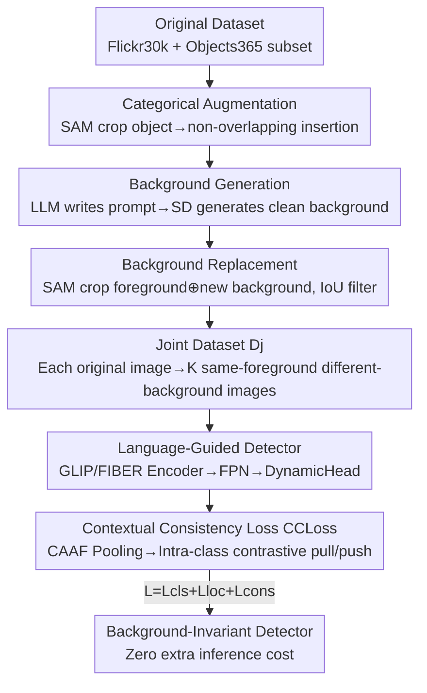

# Consistency Beyond Contrast: Enhancing Open-Vocabulary Object Detection Robustness via Contextual Consistency Learning

**Conference**: CVPR 2026  
**Paper**: [CVF Open Access](https://openaccess.thecvf.com/content/CVPR2026/html/Li_Consistency_Beyond_Contrast_Enhancing_Open-Vocabulary_Object_Detection_Robustness_via_Contextual_CVPR_2026_paper.html)  
**Code**: https://github.com/bozhao-li/CCL  
**Area**: Open-Vocabulary Object Detection  
**Keywords**: Open-vocabulary detection, contextual consistency, data generation, background robustness, cross-modal alignment  

## TL;DR
This paper discovers that open-vocabulary detectors output features that drift significantly when the same object appears in different backgrounds (background overfitting). It proposes the CCL framework, which utilizes diffusion models to generate paired "same-object-different-background" samples (CBDG) and enforces background invariance through an intra-class contrastive consistency loss (CCLoss). This approach achieves gains of +16.3 AP on OmniLabel and +14.9 AP on D3 with zero additional inference overhead and model-agnostic properties.

## Background & Motivation
**Background**: Recent progress in Open-Vocabulary Object Detection (OVOD) and the further Descriptive Object Detection (DOD / referring expression) has primarily relied on two paths: scaling up training data and using contrastive learning to align linguistic and visual modalities (represented by language-guided detectors like GLIP and FIBER). This "cross-modal contrast + massive data" paradigm has significantly advanced zero-shot recognition capabilities.

**Limitations of Prior Work**: The authors point out that these methods focus almost exclusively on alignment **between modalities** while ignoring consistency **within a single modality**. Specifically, the features extracted by the model shift significantly once the same object is placed in a different background or environment. The authors conducted a diagnostic experiment by replacing the background of each image in the D3 dataset to construct the D3-BC test set. Results showed that baselines like GLIP and FIBER experienced substantial AP drops, indicating that they overfit to training backgrounds and fail to learn the representation of the "object itself."

**Key Challenge**: Cross-modal contrastive loss only constrains the "image-text" pairing relationship but imposes no constraints on the principle that "the same object should look the same across different scenes." Consequently, models take shortcuts by relying on spurious cues like backgrounds, which fail when the background changes—a robustness gap hidden by existing evaluations.

**Goal**: To enable detectors to learn object features that are invariant to environmental changes. This requires solving two sub-problems: (1) existing datasets lack paired samples of "the same object in multiple backgrounds," providing no signal for consistency supervision; (2) the lack of a loss function that can transform this paired structure into a training objective.

**Core Idea**: Filling this gap through "data generation + consistency constraints"—first using SAM + Stable Diffusion to synthesize paired images with "invariant foregrounds and diverse backgrounds," and then using an intra-class consistency loss to pull features of the same class toward the class center while pushing different classes apart, forcing the model to ignore backgrounds and focus on foreground semantics.

## Method

### Overall Architecture
CCL decomposes "intra-modal consistency" into two complementary components with distinct roles. **CBDG (Contextual Bootstrapped Data Generation)** is responsible for data generation: it is not standard data augmentation but specifically constructs paired samples of "the same foreground object appearing in different backgrounds" to produce a joint dataset $D_j$. These paired samples define the structure of the supervision signal but do not enforce invariance themselves. **CCLoss (Contextual Consistency Loss)** is the training objective that "constrains" these paired views into background-invariant representations. In short: CBDG provides the data structure, and CCLoss converts it into consistency-aware learning.

The pipeline is applied as post-training on a generic language-guided detector (GLIP or FIBER), fine-tuning for only 1 epoch. No additional modules or costs are added during the inference stage—CCLoss is only active during training.

> In the diagram, the three blocks "Categorical Augmentation / Background Generation / Background Replacement" constitute **CBDG** (the three sub-steps of Key Design 1), while the "CCLoss" block corresponds to Key Design 2.

### Key Designs

**1. CBDG: Massively generating "same-object-different-background" paired samples via diffusion models**

The limitation is straightforward—CCL requires supervision for "the same object in different backgrounds," but existing datasets do not have such pairings. CBDG is a three-stage pipeline that deliberately avoids inpainting because inpainting often results in blurry boundaries or background residues of foreground features, making it difficult to achieve clean scene transitions.

- **Categorical Augmentation**: The authors use Flickr30k Entities and a subset of Objects365 as the base, mostly containing images with "few categories, multiple instances." For single-object images, SAM is used to crop the object $O_i$ at its position $(x_o, y_o)$, then a random object $O_{i\notin C}$ is selected from other categories in the subset and inserted into a candidate position set $P=\{(x_1,y_1),\dots,(x_N,y_N)\}$ that does not overlap with existing objects: $(x_{o_k}, y_{o_k}) \in P\backslash(x_o, y_o),\ o_k \in O_{i\notin C}$. If the image has many large objects, the new object is scaled by $1/\alpha$ and retried until a spot is found or $N_R$ attempts are reached. This step transforms single-object images $I$ into multi-category images $I'$, enhancing categorical diversity.
- **Background Generation**: LLM $\mathcal{G}$ generates three types of background text prompts (Seasonal / Sky / Natural Landscape, deliberately choosing "visually clean and semantically neutral" backgrounds to isolate background changes from object consistency), which are fed to Stable Diffusion $\mathcal{D}$ to generate background images: $b = \mathcal{D}(t'),\ t' = \mathcal{G}(t)$, where $t \in \{\text{Seasonal, Sky, Natural Landscape}\}$. All $b$ constitute the background library $D_{bg}$. In total, 13,185 descriptions were used to generate 144,654 background images.
- **Background Replacement**: Given the ground-truth bbox, SAM $\mathcal{S}$ is used to crop the foreground, which is then synthesized with a randomly selected background image: $I^* = \mathcal{S}(I', bbox) \oplus b,\ b \in D_{bg}$, where $\oplus$ denotes foreground-background composition. To ensure synthesis quality, samples where the IoU between the SAM mask and the GT box is below a threshold are filtered out. Each original image generates $K$ images with the same foreground but different backgrounds ($K$ is the training batch size), forming the input for consistency constraints.

Why it works: It fundamentally provides paired data with "constant foreground and controlled background variation," using only 0.25M images (far fewer than the 0.8M of the baseline) to make consistency supervision learnable.

**2. CCLoss: Pulling same-class features to the class center to enforce background invariance**

Paired data alone does not automatically produce invariance; a loss function is needed. CCLoss organizes "same-foreground, different-background" images within each batch and performs **intra-class contrastive learning** on features—pulling same-class features toward the class center and pushing different classes apart, forcing the model to focus on foreground semantics and discard spurious background cues.

The model side uses a language-guided detector to extract features: images and text are encoded separately, image features pass through FPN for multi-scale fusion, and then into DynamicHead to predict candidate regions. For image features, **CAAF (Context-Aware Aggregated Feature)** $f$ is obtained via pooling, and consistency loss is applied to CAAF. For a batch containing $C$ classes with $K$ images per class, the visual modality loss is in a class-center contrastive form:

$$\mathcal{L}_{\mathrm{I}} = -\frac{1}{CK}\sum_{c=1}^{C}\sum_{k=1}^{K}\log\frac{\exp(\mathrm{sim}(\mathbf{f}_{ck}, \mathbf{f}_c)/\tau)}{\sum_{c'=1}^{C}\sum_{k'=1}^{K}\exp(\mathrm{sim}(\mathbf{f}_{ck}, \mathbf{f}_{c'k'})/\tau)}$$

Where $\mathbf{f}_{ck}$ is the feature of the $k$-th image in class $c$, $\mathbf{f}_c$ is the mean (class center) of the $K$ features in that class, $\mathrm{sim}(\cdot,\cdot)$ is cosine similarity, and $\tau$ is the temperature. The numerator pulls the sample toward its own class center, and the denominator pushes it away from all other samples—even if the background changes, foregrounds of the same class should cluster at the same center, thereby enforcing background invariance.

The text modality loss $\mathcal{L}_{\mathrm{T}}$ is symmetrical (replacing $\mathbf{f}$ with text feature $\mathbf{t}$ and class center with the mean text feature $\mathbf{t}_c$). Its use depends on the baseline architecture: FIBER, which has cross-modal interaction, utilizes the text loss; GLIP, which processes image and text independently, sets $\lambda_T$ to 0. The total consistency loss is $\mathcal{L}_{\mathrm{cons}} = \lambda_T \cdot \mathcal{L}_T + \lambda_I \cdot \mathcal{L}_I$, integrated into the total loss $\mathcal{L} = \mathcal{L}_{\mathrm{cls}} + \mathcal{L}_{\mathrm{loc}} + \mathcal{L}_{\mathrm{cons}}$.

Why it works: Unlike cross-modal contrast (image-text pairing), CCLoss is an **intra-modal** intra-class consistency constraint, filling the gap of previously neglected supervision regarding "consistency across different scenes." Since it only acts on existing features during training, it has zero inference cost and is non-intrusive to baseline architectures.

## Loss & Training
The total objective is $\mathcal{L} = \mathcal{L}_{\mathrm{cls}} + \mathcal{L}_{\mathrm{loc}} + \mathcal{L}_{\mathrm{cons}}$, with the consistency term $\mathcal{L}_{\mathrm{cons}} = \lambda_T \mathcal{L}_T + \lambda_I \mathcal{L}_I$. During training, batches are grouped by "same foreground object," containing $K$ images of the object in different backgrounds ($K$ = batch size). Using public pre-trained weights of GLIP-T / FIBER-B as a starting point, the model is fine-tuned on the joint dataset $D_j$ (0.25M images) for only **1 epoch**.

## Key Experimental Results

### Main Results
CCL was integrated as post-training into two baselines, GLIP-T and FIBER-B, on the OmniLabel and D3 benchmarks. CCL achieved SOTA results using only 0.25M images:

| Baseline | OmniLabel AP | D3 FULL | OmniLabel Gain | D3 Gain |
|----------|-------------|---------|---------------|---------|
| GLIP-T | 19.3 | 19.1 | — | — |
| GLIP-T + ours | 32.2 | 30.0 | **+12.9** | **+10.9** |
| FIBER-B | 25.7 | 22.7 | — | — |
| FIBER-B + ours | **42.0** | **37.6** | **+16.3** | **+14.9** |

In detailed metrics, FIBER-B + ours achieved 44.1 AP-c (category-only) and 39.2 AP-d (free-form description) on OmniLabel. The AP-dL for long descriptions increased from 12.4 to 32.3, indicating particularly significant improvements in localizing objects with complex linguistic descriptions.

### Robustness Evaluation (Direct Evidence for the Core Argument)
The authors used CBDG to change backgrounds for each image in D3 to 3 variations, creating D3-BC (42,312 images, no overlap with training data), and added 4 types of perturbations (Gaussian noise/contrast/saturation/illumination) to create D3-C:

| Method | D3-BC FULL | D3-C FULL | D3-C mFULL | rFULL(%) |
|------|-----------|-----------|-----------|----------|
| GLIP-T | 16.8 | 19.1 | 13.6 | 71.2 |
| GLIP-T + ours | 29.6 | 30.0 | 21.7 | 72.3 |
| FIBER-B | 20.1 | 22.7 | 16.7 | 73.6 |
| FIBER-B + ours | 33.1 | 37.6 | 27.5 | 73.1 |

Baselines dropped significantly on D3-BC (exposing background overfitting), while the drop was substantially reduced after adding CCL. Meanwhile, absolute performance on D3-C significantly led while relative robustness rFULL remained comparable to baselines (71→72, 73→73), proving background robustness improved without sacrificing stability toward other domain shifts.

### Ablation Study
Decomposing the contributions of CBDG and CCLoss ("+data" = only CBDG without CCLoss, "+ours" = both):

| Configuration | OmniLabel AP | D3 FULL | Description |
|------|-------------|---------|------|
| GLIP-T | 19.3 | 19.1 | baseline |
| GLIP-T +data | 24.8 | 23.2 | CBDG only, +5.5 AP |
| GLIP-T +ours | 32.2 | 30.0 | +CCLoss adds +7.4 AP |
| FIBER-B | 25.7 | 22.7 | baseline |
| FIBER-B +data | 32.7 | 29.1 | CBDG only, +7.0 AP |
| FIBER-B +ours | 42.0 | 37.6 | +CCLoss adds +9.3 AP |

### Key Findings
- **Both components are indispensable, with CCLoss contributing more**: CBDG alone improves AP by 5.5~7.0, but adding CCLoss adds another 7.4~9.3 AP—indicating that "generating the right data" is only half the battle; the consistency loss is what truly learns the invariance.
- **Background robustness is a real gain**: Baselines drop more on D3-BC while CCL drops less, directly validating the "background overfitting" hypothesis and the effectiveness of CCL.
- **High data efficiency**: Outperforming SOTA with less than 1/3 of the baseline's data confirms that gains come from the new supervision dimension of "consistency" rather than data scaling.
- **Model-agnostic**: Stable improvements were observed across GLIP (independent modalities) and FIBER (interacting modalities), even when text consistency was disabled in GLIP.

## Highlights & Insights
- **Diagnostic-driven method**: The "background overfitting" problem was first quantified and exposed using the D3-BC "background-swap" test set before the solution was designed. The logic is clean—the problem was measured, not guessed.
- **Clear division of labor between CBDG and CCLoss**: Data alone does not create invariance; the loss converts paired structures into invariant representations. This split of "data provides structure, loss provides constraint" is a valuable reference for other consistency/robustness tasks.
- **Zero inference cost + model-agnostic**: Consistency loss works only during training as a "post-training patch" that can be applied to any language-guided detector, making it very engineering-friendly.
- **Transferable logic**: The pipeline of "generate paired samples with fixed foreground/controlled variation via diffusion models + intra-class consistency loss" can be transferred to any visual task aimed at eliminating spurious correlations (e.g., texture, lighting, or viewpoint biases).

## Limitations & Future Work
- **The authors acknowledge**: The method relies on SAM segmentation quality; inaccurate masks introduce artifacts during CBDG synthesis. Although post-processing mitigates this, a "flawless" generation pipeline remains future work.
- **Narrow background types**: The main experiments only used Seasonal / Sky / Natural Landscape—"clean and neutral" backgrounds. Complex scenarios like urban/indoor/architectural are in the supplementary material; coverage of real-world complex backgrounds in the main results is limited.
- **Single epoch fine-tuning**: Whether gains continue to grow or saturate with longer training, and the scaling relationship between CBDG data size and performance, were only briefly mentioned in the supplementary material without main-text curves.
- **Dependency on existing baselines**: The method is a post-training patch. Its performance ceiling is still constrained by the base detector; its effectiveness on training open-vocabulary detectors from scratch remains unverified.

## Related Work & Insights
- **vs. Cross-modal Contrast (GLIP / FIBER)**: They focus on image-text alignment across modalities. Ours focuses on intra-class consistency within visual/textual modalities. The two are orthogonal—CCL is applied on top of these models to provide the missing intra-modal constraints, leading to stable additive gains.
- **vs. Inpainting-based Background Editing (GLIDE / GLIGEN / IAM)**: These methods edit backgrounds on the original image, often leading to blurry boundaries or background residues. Ours uses "crop foreground + independent clean background generation + composition," separating foreground and background more thoroughly to avoid these artifacts.
- **vs. Descriptive Detection Baselines (GN-GLIP / ROD-MLLM / Real-Model, etc.)**: These methods improve description understanding through architecture changes or LLM capabilities. Ours approaches the problem from "data + consistency loss," outperforming them on OmniLabel / D3 with less data, proving that the robustness gap is an undervalued space for improvement.

## Rating
- Novelty: ⭐⭐⭐⭐ High marks for identifying "intra-modal consistency" as a neglected robustness dimension in open-vocabulary detection and supporting it with a solid diagnostic.
- Experimental Thoroughness: ⭐⭐⭐⭐ Complete evidence chain through two baselines, two benchmarks, and custom-built robustness sets. Points slightly deducted for placing complex backgrounds and scaling in supplementary materials.
- Writing Quality: ⭐⭐⭐⭐ Smooth logic from problem to method to verification. Clear division of roles between CBDG/CCLoss.
- Value: ⭐⭐⭐⭐ Engineering-ready post-training patch with zero inference cost. Highly transferable method for de-biasing tasks.

<!-- RELATED:START -->

## Related Papers

- [\[CVPR 2026\] SRA-Det: Learning Omni-Grained Open-Vocabulary Detection Beyond Category Names](sra-det_learning_omni-grained_open-vocabulary_detection_beyond_category_names.md)
- [\[CVPR 2026\] Parameter-Efficient Semantic Augmentation for Enhancing Open-Vocabulary Object Detection](parameter-efficient_semantic_augmentation_for_enhancing_open-vocabulary_object_d.md)
- [\[CVPR 2026\] WeDetect: Fast Open-Vocabulary Object Detection as Retrieval](wedetect_fast_open-vocabulary_object_detection_as_retrieval.md)
- [\[CVPR 2026\] ViTPrompt: Training-Free Prompt Refinement with Visual Tokens for Open-Vocabulary Detection](vitprompt_training-free_prompt_refinement_with_visual_tokens_for_open-vocabulary.md)
- [\[ICCV 2025\] Automated Model Evaluation for Object Detection via Prediction Consistency and Reliability](../../ICCV2025/object_detection/automated_model_evaluation_for_object_detection_via_prediction_consistency_and_r.md)

<!-- RELATED:END -->
