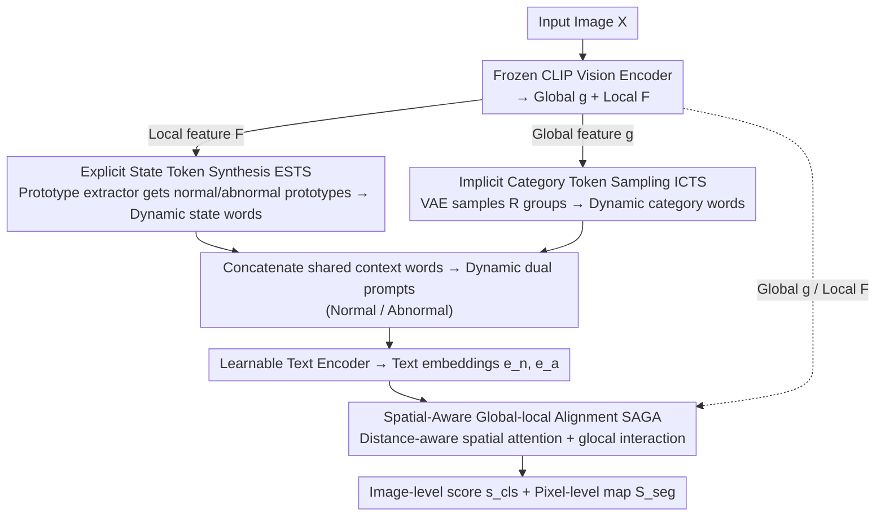

# CoPS: Conditional Prompt Synthesis for Zero-Shot Anomaly Detection

**Conference**: CVPR 2026 Findings  
**arXiv**: [2508.03447](https://arxiv.org/abs/2508.03447)  
**Code**: [https://github.com/cqylunlun/CoPS](https://github.com/cqylunlun/CoPS)  
**Area**: Object Detection  
**Keywords**: Zero-shot anomaly detection, conditional prompt synthesis, CLIP, vision-language models, industrial defects

## TL;DR
This paper proposes the CoPS framework, which dynamically generates prompts through two visual conditioning mechanisms—Explicit State Token Synthesis (ESTS) and Implicit Category Token Sampling (ICTS). Combined with Spatial-Aware Global-local Alignment (SAGA), it achieves SOTA results for zero-shot anomaly detection across 13 industrial and medical datasets.

## Background & Motivation
1. **Background**: Large-scale pretrained vision-language models have demonstrated strong cross-category generalization in zero-shot anomaly detection (ZSAD). Existing methods achieve cross-category detection by fine-tuning on a single auxiliary dataset.
2. **Limitations of Prior Work**: (i) Static learnable tokens find it difficult to capture the continuous and diverse patterns of normal and abnormal states, limiting generalization to unseen categories; (ii) category information provided by fixed text labels is too sparse, making the model prone to overfitting in specific semantic subspaces.
3. **Key Challenge**: Prompt learning eliminates the need for manual prompt engineering, but its static nature and sparsity become bottlenecks for generalization—normal/abnormal states are continuous and variable, while the category label space itself is highly sparse.
4. **Goal**: Design a dynamic prompt synthesis framework based on visual feature conditioning, enabling prompts to adaptively model the state and category information of the input image.
5. **Key Insight**: Decompose prompts into three parts: context words, state words, and category words. The context words are shared, while the latter two are dynamically generated based on visual features.
6. **Core Idea**: Achieve vision-conditioned dynamic prompt synthesis by extracting normal/abnormal prototypes from local features to inject into state words (explicitly) and sampling from global features via a VAE to inject into category words (implicitly).

## Method

### Overall Architecture
The motivation of CoPS is that existing prompt learning methods fix prompts as "context words + static state words + fixed category labels," where state and category words do not vary with the input image. Consequently, they fail to capture continuous normal/abnormal patterns and are restricted by sparse category labels. CoPS decomposes the prompt into three segments—context words are shared across all categories, while **state words** and **category words** are synthesized on-the-fly based on the visual features of the current image. Specifically, the input image passes through a frozen CLIP vision encoder to obtain global features $\mathbf{g}$ and local features $\mathbf{F}$. ESTS extracts normal/abnormal prototypes from local features $\mathbf{F}$ to fill state words (explicit path), and ICTS uses a VAE to sample $R$ groups from global features $\mathbf{g}$ to fill category words (implicit path). The dynamic prompts from both paths are fed into a learnable text encoder. SAGA then aligns text and images at both global and pixel levels, ultimately outputting an image-level anomaly score $s_{\text{cls}}$ and a pixel-level anomaly map $\mathcal{S}_{\text{seg}}$.

### Key Designs

**1. Explicit State Token Synthesis (ESTS): Adaptive state words following real anomaly patterns**

Static state words like "good" or "damaged" only represent discrete poles and cannot characterize the continuous, gradient defect morphologies in industrial/medical images; they often fail on unseen categories. ESTS replaces static learnable tokens by extracting prototypes from the current image's local features. It uses consistent self-attention (V-V attention) from the frozen vision encoder to retrieve fine-grained local features $\mathbf{F}$ (which maintain positional consistency without extra adapter modules). A prototype extractor $\mathcal{P}_\theta$ then generates $M$ normal prototypes $\mathbf{P}_n$ and $M$ abnormal prototypes $\mathbf{P}_a$ under center constraints, assembling them into dynamic state tokens. Because prototypes come directly from the image's own local response, state words adaptively fit the actual state of the current image.

**2. Implicit Category Token Sampling (ICTS): VAE sampling to expand sparse category labels into diverse semantics**

Fixed text category labels are information-poor—one word represents an entire class, leading to overfitting in thin semantic subspaces. ICTS takes an implicit path: a Variational Autoencoder (VAE) $\mathcal{E}_\psi$ parameterizes the latent distribution of global features $\mathbf{g}$, then decodes and samples $R$ samples $\mathbf{S} \in \mathbb{R}^{R \times C}$ to serve as dense category tokens. Thus, each input image generates $R$ sets of complete normal/abnormal prompts. The stochasticity of sampling naturally augments the diversity of category representations, forcing the model to cover a broader semantic area, which is especially beneficial for cross-domain (industrial to medical) scenarios.

**3. Spatial-Aware Global-local Alignment (SAGA): Using "distance to nearest prototype" for pixel-level alignment**

Standard global alignment discards local spatial information, yet anomaly detection requires precise defect localization. SAGA's key observation is that the further a query feature is from its nearest (normal) prototype, the more likely it is to be an anomaly. This distance is used to approximate the anomaly state and construct distance-aware spatial attention for refining pixel-level text-vision alignment. Simultaneously, a global-local (glocal) similarity interaction layer is added to strengthen image-level alignment. These two levels yield the pixel-level anomaly map $\mathcal{S}_{\text{seg}}$ and image-level anomaly score $s_{\text{cls}}$ respectively.

### Loss & Training
Binary Focal Loss is used for image-level classification, while a combination of Dice Loss and Binary Cross Entropy Loss supervises pixel-level segmentation. The entire model is fine-tuned only on a single auxiliary training set (e.g., MVTec AD) and transferred directly to unseen categories during testing without any target domain adaptation.

## Key Experimental Results

### Main Results

| Dataset | Metric | CoPS | Prev. SOTA | Gain |
|--------|------|------|----------|------|
| Avg. of 13 datasets | Cls AUROC | SOTA | - | +1.4% |
| Avg. of 13 datasets | Seg AUROC | SOTA | - | +1.9% |
| MVTec AD | Cls AUROC | Best | AnomalyCLIP, etc. | Significant |
| VisA | Seg AUROC | Best | - | Clear advantage |

### Ablation Study

| Configuration | Key Metric | Description |
|------|---------|------|
| Full CoPS | Best | Complete model |
| w/o ESTS | Decrease | Removing explicit state synthesis has the largest impact |
| w/o ICTS | Decrease | Implicit category sampling also has a significant effect |
| w/o SAGA | Decrease | Spatial-aware alignment is crucial for segmentation |
| Static prompt baseline | Significantly lower | Validates the necessity of dynamic prompts |

### Key Findings
- ESTS contributes the most, indicating that adaptive state modeling is the core challenge in zero-shot anomaly detection.
- VAE sampling in ICTS effectively mitigates the sparsity of category labels, with significant impact in cross-domain scenarios (industrial → medical).
- Distance-aware spatial attention noticeably improves pixel-level segmentation quality but has a smaller impact on image-level classification.

## Highlights & Insights
- The **prompt decomposition philosophy** is clever: shared context words + explicit state injection + implicit category sampling, each serving a distinct purpose.
- **VAE implicit augmentation** is an elegant trick: replacing fixed labels with sampling naturally increases the diversity of category representations.
- The use of **consistent self-attention (V-V)** avoids additional adapter modules and preserves the original semantics of CLIP features.

## Limitations & Future Work
- Dependency on the pretrained feature space of CLIP may limit performance in visual domains not covered by CLIP (e.g., specific industrial scenarios).
- Prototype count $M$ and sampling count $R$ require manual hyperparameter tuning.
- Future work could explore adaptively determining the number of prototypes or replacing CLIP with stronger vision foundation models.

## Related Work & Insights
- **vs AnomalyCLIP**: AnomalyCLIP uses static learnable tokens and lacks visual conditioning; this work overcomes these limitations via explicit/implicit injection.
- **vs AdaCLIP**: AdaCLIP relies on manually designed template sets; this work eliminates the need for manual design through end-to-end learning.
- **vs VCP-CLIP**: VCP-CLIP directly embeds image features into category words; this work provides richer semantic diversity through VAE sampling.

## Rating
- Novelty: ⭐⭐⭐⭐ The explicit + implicit dual-path dynamic prompt synthesis is a novel combination.
- Experimental Thoroughness: ⭐⭐⭐⭐⭐ Comprehensive validation across 13 datasets with complete ablations.
- Writing Quality: ⭐⭐⭐⭐ Clear structure and well-explained methodology.
- Value: ⭐⭐⭐⭐ A practical advancement in the field of zero-shot anomaly detection.

<!-- RELATED:START -->

## Related Papers

- [\[AAAI 2026\] PromptMoE: Generalizable Zero-Shot Anomaly Detection via Visually-Guided Prompt Mixing of Experts](../../AAAI2026/object_detection/promptmoe_generalizable_zero-shot_anomaly_detection_via_visually-guided_prompt_m.md)
- [\[CVPR 2026\] MoECLIP: Patch-Specialized Experts for Zero-shot Anomaly Detection](moeclip_patch-specialized_experts_for_zero-shot_anomaly_detection.md)
- [\[CVPR 2026\] From Attraction to Equilibrium: Physics-Inspired Semantic Gravitons for Zero-Shot Anomaly Detection](from_attraction_to_equilibrium_physics-inspired_semantic_gravitons_for_zero-shot.md)
- [\[CVPR 2026\] GS-CLIP: Zero-shot 3D Anomaly Detection by Geometry-Aware Prompt and Synergistic View Representation Learning](gs-clip_zero-shot_3d_anomaly_detection_by_geometry-aware_prompt_and_synergistic_.md)
- [\[CVPR 2026\] FB-CLIP: Fine-Grained Zero-Shot Anomaly Detection with Foreground-Background Disentanglement](fb-clip_fine-grained_zero-shot_anomaly_detection_with_foreground-background_dise.md)

<!-- RELATED:END -->
