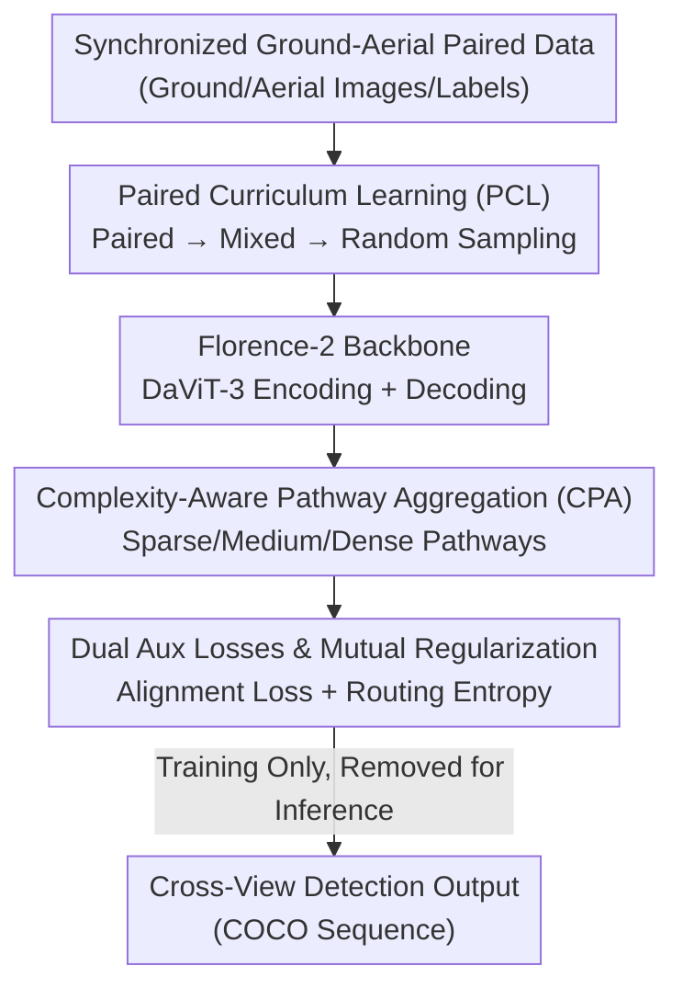

# CrossVL: Complexity-Aware Feature Routing and Paired Curriculum for Cross-View Vision-Language Detection

**Conference**: CVPR 2026  
**arXiv**: [2605.09802](https://arxiv.org/abs/2605.09802)  
**Code**: https://github.com/1nyourlife/Crossvl_cvpr2026 (Available)  
**Area**: Object Detection / Multimodal VLM / Cross-View Detection  
**Keywords**: Cross-View Detection, Vision-Language Models, Complexity-Aware Routing, Curriculum Learning, Ground-Aerial Pairing  

## TL;DR
To address the "cross-view gap" where Vision-Language Models (VLMs) perform strongly in ground views but poorly in aerial views, CrossVL introduces a **Complexity-aware Pathway Aggregation (CPA)** module that routes visual features based on scene density (**active only during training with zero inference overhead**) and a **Paired Curriculum Learning (PCL)** strategy that transitions from paired to random sampling. CrossVL improves Florence-2's mAP on the MAVREC aerial dataset from 58.66% to 61.03%, reduces the ground-aerial gap from 8.63pp to 6.65pp, and decreases variance across random seeds by 3.3×.

## Background & Motivation
**Background**: VLMs (e.g., GLIP, GroundingDINO, Florence-2) leverage large-scale image-text pre-training to excel in open-vocabulary detection, enabling "find objects by instruction." However, these models typically assume consistent imaging geometry.

**Limitations of Prior Work**: When transitioning from ground to aerial views, the aerial accuracy of VLMs drops **systematically and persistently** under the same training protocols. Using synchronized ground-aerial pairs from MAVREC, the paper reveals the root cause: ground images contain **few, large, dense, and highly occluded** objects, while aerial images contain **many, small, sparse, and globally distributed** objects. The two views vary simultaneously in scale, layout, and occlusion, representing a **geometric gap** rather than an appearance gap (unlike synthetic-to-real or day-to-night shifts that preserve geometry).

**Key Challenge**: This geometric difference creates a "complexity imbalance"—dense ground scenes require fine-grained interaction processing, while sparse aerial scenes require global context reasoning. Traditional VLM fusion mechanisms **treat all scenes uniformly**, leading to sub-optimal representations and unstable training (high variance across seeds). Furthermore, the **synchronized ground-aerial paired structure** inherent in datasets like MAVREC is treated as independent samples by existing methods, wasting a valuable supervisory signal.

**Goal**: (1) Enable feature processing to adapt to scene complexity; (2) Utilize the paired structure to stabilize optimization and narrow the cross-view gap; (3) Accomplish this without increasing inference cost.

**Key Insight**: Since the bottleneck originates from geometry/complexity, one should **explicitly estimate scene complexity and route features accordingly**. Since paired images share weather, lighting, time, and scene semantics (even without spatial overlap), one can **use the strong semantic consistency of pairs as training anchors initially, then gradually transition to random sampling**.

**Core Idea**: Synergize cross-view detection adaptation through "complexity-aware multi-pathway routing (Architecture)" and "paired-to-random curriculum scheduling (Training)." These two components act as **mutual regularizers**—CPA prevents curriculum collapse, and the curriculum enhances the representational richness of CPA.

## Method

### Overall Architecture
CrossVL uses Florence-2-base (DaViT-3 encoder + Transformer decoder, prompt `<OD>`) as the backbone, adding two complementary components **during training**. CPA is inserted between the encoder and decoder: it estimates a 3D complexity vector from visual+text statistics, routes visual features through sparse, medium, and dense pathways, and fuses them based on complexity while providing an auxiliary alignment objective. PCL manages data scheduling: feeding only synchronized ground-aerial pairs (high semantic consistency, stable supervision) in the early phase, linearly introducing random samples in the mid-phase, and using pure random sampling in the late phase. During inference, the entire CPA block is removed, following standard Florence-2 decoding and COCO evaluation with **zero additional latency**.

### Key Designs

**1. Complexity-Aware Pathway Aggregation (CPA): Adaptive Processing for Sparse/Dense Scenes**

To address the issue where VLMs treat fine-grained dense ground scenes and global sparse aerial scenes identically, CPA first calculates a soft complexity vector using a two-layer ReLU MLP $g_\phi$ from multimodal statistics: $\mathbf{c}=\mathrm{Softmax}(g_\phi([\mu(\mathbf{V}),\sigma(\mathbf{V}),\max(\mathbf{V}),\mu(\mathbf{T}),\sigma(\mathbf{T})]))\in\mathbb{R}^3$. The three dimensions correspond to sparse, medium, and dense complexity intervals. The intuition is that high visual variance $\sigma(\mathbf{V})$ often signifies dense, occluded ground scenes, while low variance points to isolated aerial layouts. Visual features are sent to three pathways with different inductive biases: a **Sparse Pathway** using attention $A_s(\mathbf{V})=\mathrm{Softmax}(Q_sK_s^T/\sqrt{d})$ for salient token selection; a **Medium Pathway** using fixed-region adaptive pooling + cross-region attention for mid-range dependencies; and a **Dense Pathway** using full self-attention + global average pooling for overall context. The outputs are fused via a gate: $\mathbf{V}_\mathrm{fused}=\sum_{p\in\{s,m,d\}}w_p\mathbf{V}_p$, where weights $\mathbf{w}=\mathrm{Softmax}(h_\psi([\mathbf{V}_s;\mathbf{V}_m;\mathbf{V}_d;\mathbf{c}]))$ are conditioned on **both** pathway features and the complexity vector. This is effective because routing weights differentiate naturally—aerial images favor the sparse pathway, while ground images activate the dense pathway (correlation between dense pathway score and object count $r{=}0.986$). This adds only 2.5% parameters and **only during training**.

**2. Paired Curriculum Learning (PCL): Utilizing Ground-Aerial Pairs as Early Supervision Anchors**

Addressing the loss of paired structure and optimization instability, PCL leverages **scene-level semantic consistency** rather than object-level geometric correspondence (which is impossible without spatial overlap). It schedules the paired sampling probability over training time: $p_\text{pair}(t)=1$ ($t\in[0,T_1)$, all pairs) $\rightarrow$ linear decay ($t\in[T_1,T_2)$, mixed) $\rightarrow$ $0$ ($t\in[T_2,T]$, pure random). Empirically, $T_1$ and $T_2$ are set to ~1/3 and ~2/3 of total duration. Early paired sampling allows the model to establish cross-view relationships via stable, semantically consistent signals, while later random sampling forces generalization.

**3. Dual Auxiliary Losses and Mutual Regularization: Synergistic Backstops**

CPA is trained with two lightweight objectives alongside the VLM decoder: an auxiliary vision-language alignment loss $\mathcal{L}_\text{align}=\|\mathbf{V}_\text{fused}-\mathbf{T}_\text{aligned}\|_2^2$ to pull fused visual features and text embeddings together, and a routing entropy regularization $\mathcal{L}_\text{reg}=-\sum_p w_p\log w_p$ to encourage **confident, non-uniform** pathway selection. Crucially, CPA and PCL provide **mutual regularization**: early paired training provides a stable complexity distribution for CPA, and conversely, the complexity representation learned by CPA prevents optimization collapse during the transition phases of the curriculum.

### Loss & Training
Total Objective = Detection Primary Loss + $\mathcal{L}_\text{align}$ (Alignment) + $\mathcal{L}_\text{reg}$ (Routing Entropy). Backbone: Florence-2-base (230M), batch size 8 + gradient accumulation 2 (equiv. 16), AdamW, learning rate $1\times10^{-6}$, 500-step warmup + cosine schedule, FP16, single RTX 5090, 10 epochs. Each seed (42/123/789) is trained independently, with checkpoints selected **strictly on validation set mAP**.

## Key Experimental Results

### Main Results
Dataset: MAVREC (8,605 training, 538 val, 1,614 test synchronized pairs, 10 classes, aerial height 25–45m). Table shows aerial validation/test mAP (mean of 3 seeds):

| Method | Val mAP | Test mAP | Test mAPM (Medium) | Note |
|------|---------|---------|---------|------|
| YOLOv7 (Strong Vision Baseline) | 31.3 | 31.9 | 63.1 | Vision Only |
| Florence-2 (random) | 63.73 | 58.66 | 79.81 | VLM Baseline |
| + CPA | 64.49 (+0.76) | 60.66 (+2.00) | 85.69 | ±1.09 std, Stable |
| + Curriculum | 64.37 (+0.64) | 56.53 (−2.13) | 81.20 | ±4.97 std, Unstable |
| + Both (Ours) | **65.35 (+1.62)** | **61.03 (+2.37)** | 83.24 | ±1.50 std |

The VLM baseline more than doubles the performance of YOLOv7. In the combined method, the validation gain (+1.62pp) **exceeds the sum of individual components** (+0.76 + +0.64 = +1.40), demonstrating super-additive synergy.

### Ablation Study
Pathway architecture ablation (Aerial set, mean of 3 seeds):

| Config | Val mAP | Test mAP | Test mAPM | Note |
|------|---------|---------|----------|------|
| Baseline | 63.73 | 58.66 | 79.81 | Florence-2 |
| Single-Pathway Variant | 64.68 | 60.09 | 68.65 | 1 linear pathway + aligner |
| Full CPA (Three-Pathway) | 64.49 | 60.66 | **85.69** | Multi-path + routing |

Cross-View Robustness (Gap = Ground − Aerial, lower is better):

| Method | Val Gap↓ | Test Gap↓ |
|------|----------|----------|
| Baseline | 5.71 | 8.63 |
| + CPA | 6.42 | 9.30 |
| + Curriculum | 6.09 | 12.59 |
| + Both (Ours) | **3.73** | **6.65** |

### Key Findings
- **CPA significantly improves medium objects**: Test mAPM reached 85.69%, a +17.04pp jump over the single-pathway variant, indicating multi-granularity routing is critical for scale variations.
- **Curriculum alone can cause catastrophic collapse**: Seed 123 dropped to 49.77% (11.81pp below the best seed). Adding CPA restored it to 62.34%, reducing variance by 3.3×.
- **Routing is complexity-responsive**: Dense pathway scores correlate positively with object count ($r{=}0.986$) and sparse scores negatively ($r{=}-0.988$), proving CPA captures the complexity gradient from sparse aerial to dense ground views.
- ⚠️ Single components do not necessarily improve the Gap: CPA or Curriculum alone actually widened the test gap (9.30 / 12.59); only their synergy simultaneously raised aerial accuracy and narrowed the gap.

## Highlights & Insights
- **Inference-free training enhancement**: CPA adds 2.5% parameters but is removed during inference, making it friendly for real-time deployment—a classic "heavy training, light inference" trick.
- **Turning "paired data" into free supervision**: By using scene-level consistency as an anchor, the model avoids the impossible task of pixel-level geometric alignment while still benefiting from the paired structure.
- **Super-additive synergy**: The "aha" moment is that two components, which might be unstable or harmful individually, produce a unified framework where the architecture stabilizes training and the training enriches the architecture.
- **Generalizability**: The mechanism of complexity vector conditioning (using $\mu/\sigma/\max$ statistics) is portable to any multi-pathway or MoE task with non-uniform scene difficulty.

## Limitations & Future Work
- PCL remains inherently sensitive to initialization when used alone; CrossVL mitigates but does not fully resolve the need for more robust curriculum schedules.
- Complexity estimation relies on simple statistics which might fail if feature variance is driven by non-geometric factors (e.g., extreme noise).
- Experiments were conducted primarily on MAVREC with one backbone; cross-dataset generalization remains to be verified.

## Related Work & Insights
- **vs. Cross-View Sensing**: Prior work focused on geometric consistency or cross-view matching for localization; Ours targets **temporally synchronized but spatially disjoint** detection.
- **vs. VLM Detection**: Existing models assume geometric consistency; CrossVL adds a **lightweight training-only module** without altering inference costs.
- **vs. Dynamic Routing/MoE**: While MoE adapts to content, CPA specifically routes between "dense vs. sparse" geometric intervals typical of cross-view shifts.

## Rating
- Novelty: ⭐⭐⭐⭐
- Experimental Thoroughness: ⭐⭐⭐
- Writing Quality: ⭐⭐⭐⭐
- Value: ⭐⭐⭐⭐

## Related Papers

- [\[CVPR 2026\] LocateAnything3D: Vision-Language 3D Detection with Chain-of-Sight](locateanything3d_vision-language_3d_detection_with_chain-of-sight.md)
- [\[CVPR 2026\] Can a Second-View Image Be a Language? Geometric and Semantic Cross-Modal Reasoning for X-ray Prohibited Item Detection](can_a_second-view_image_be_a_language_geometric_and_semantic_cross-modal_reasoni.md)
- [\[CVPR 2026\] Mining Instance-Centric Vision-Language Contexts for Human-Object Interaction Detection](mining_instance-centric_vision-language_contexts_for_human-object_interaction_de.md)
- [\[CVPR 2026\] Incremental Object Detection via Future-Aware Decoupled Cross-Head Distillation](incremental_object_detection_via_future-aware_decoupled_cross-head_distillation.md)
- [\[CVPR 2026\] Saliency-R1: Enforcing Interpretable and Faithful Vision-language Reasoning via Saliency-map Alignment Reward](saliency-r1_enforcing_interpretable_and_faithful_vision-language_reasoning_via_s.md)

<!-- RELATED:END -->

<!-- RELATED:START -->

## Related Papers

- [\[CVPR 2026\] Saliency-R1: Enforcing Interpretable and Faithful Vision-language Reasoning via Saliency-map Alignment Reward](saliency-r1_enforcing_interpretable_and_faithful_vision-language_reasoning_via_s.md)
- [\[CVPR 2026\] Can a Second-View Image Be a Language? Geometric and Semantic Cross-Modal Reasoning for X-ray Prohibited Item Detection](can_a_second-view_image_be_a_language_geometric_and_semantic_cross-modal_reasoni.md)
- [\[CVPR 2026\] LocateAnything3D: Vision-Language 3D Detection with Chain-of-Sight](locateanything3d_vision-language_3d_detection_with_chain-of-sight.md)
- [\[CVPR 2026\] Mining Instance-Centric Vision-Language Contexts for Human-Object Interaction Detection](mining_instance-centric_vision-language_contexts_for_human-object_interaction_de.md)
- [\[CVPR 2026\] Thermal-Det: Language-Guided Cross-Modal Distillation for Open-Vocabulary Thermal Object Detection](thermal-det_language-guided_cross-modal_distillation_for_open-vocabulary_thermal.md)

<!-- RELATED:END -->
