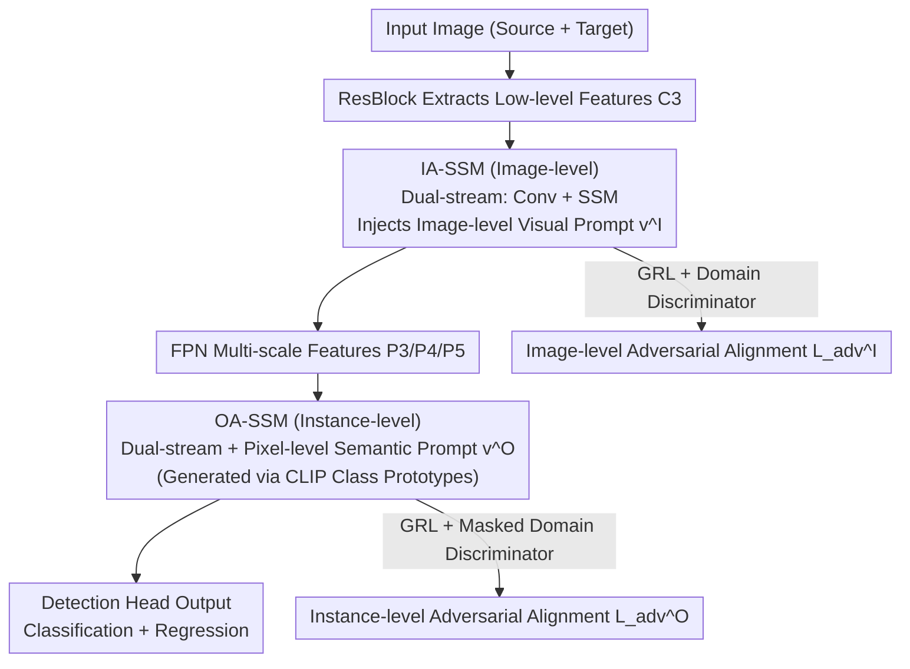

# DA-Mamba: Learning Domain-Aware State Space Model for Global-Local Alignment in Domain Adaptive Object Detection

**Conference**: CVPR2026  
**arXiv**: [2603.18757](https://arxiv.org/abs/2603.18757)  
**Code**: To be confirmed  
**Area**: Object Detection  
**Keywords**: Domain Adaptive Object Detection, State Space Model, Mamba, Global-Local Alignment, Feature Alignment, CNN-SSM Hybrid Architecture

## TL;DR

The authors propose DA-Mamba, a CNN-SSM hybrid architecture that achieves image-level and instance-level global-local domain-invariant feature alignment with linear complexity via two modules: Image-Aware SSM (IA-SSM) and Object-Aware SSM (OA-SSM). It achieves SOTA performance on four domain adaptive detection benchmarks.

## Background & Motivation

**Domain Adaptive Object Detection (DAOD)** aims to transfer a detector from a labeled source domain to an unlabeled target domain, with the core challenge being the learning of domain-invariant feature representations.

**CNN Locality Bottleneck**: The convolutional local connectivity in existing CNN-based DAOD methods limits the alignment range. The backbone only extracts local features within sliding windows, and the detection head fails to model spatial/semantic dependencies between all instances, restricting both region-to-region and object-to-object alignment to local areas.

**High Complexity of Transformers**: Prior works introduced Vision Transformers to capture global dependencies, but the quadratic complexity of self-attention leads to significant computational and memory overhead. Some convolutional attention variants either rely on global parameter sharing (ignoring domain bias) or still imply quadratic complexity.

**Neglected Inter-instance Spatial-Semantic Relationships**: Objects possess stable co-occurrence patterns (e.g., rider and bicycle) and hierarchical semantic associations (e.g., cat and dog both being animals). Ignoring these global dependencies weakens the effect of domain alignment.

**Mamba/SSM Opportunity**: State Space Models (SSMs) offer long-range dependency modeling with linear time complexity, providing an efficient solution for injecting global domain information into CNN detectors.

**Need for Joint Global-Local Alignment**: Neither pure local alignment nor pure global alignment is sufficient. Multi-granularity global-local feature alignment is required simultaneously at both the image and instance levels.

## Method

### Overall Architecture

DA-Mamba is a CNN-SSM hybrid architecture based on the YOLO-World detector. Low-level features (C3) extracted from the input image by ResBlocks enter the FPN downsampling stream. IA-SSM is inserted into the features of each resolution to extract global domain information. After the FPN outputs multi-scale features (P3/P4/P5), OA-SSM is inserted into each layer of the detection head to model instance-level dependencies. The outputs of both modules are connected to domain discriminators with Gradient Reversal Layers (GRL) to perform adversarial alignment at the image and instance levels, respectively, making global-local features domain-indistinguishable.

### Key Designs

**1. Image-Aware SSM (IA-SSM): Complementing Global Domain Awareness Missing in CNNs at the Image Level**

Backbone convolutions only perceive local regions within sliding windows, trapping image-level alignment within small ranges. IA-SSM is inserted into the FPN of the backbone, utilizing a **dual-stream pipeline** to capture two types of information simultaneously: the convolutional stream extracts local domain-invariant features, while the SSM stream captures global visual attributes with linear complexity. To ensure both streams are "aware" of the current domain, a learnable **image-level visual prompt** $\mathbf{v}^I \in \mathbb{R}^C$ is introduced. It is broadcast to all spatial locations and concatenated with input features to inject domain information. A bottleneck structure (reduction ratio $r$) is used to remove redundancy, and finally, the outputs of the two streams are concatenated and upsampled to restore original dimensions. This preserves the local inductive bias of CNNs while using SSM to fulfill global alignment capabilities at a cost significantly lower than the quadratic complexity of Transformers.

**2. Object-Aware SSM (OA-SSM): Modeling Inter-instance Co-occurrence and Semantic Hierarchies in the Detection Head**

Stable co-occurrence (e.g., rider with bicycle) and semantic hierarchies (e.g., both cat and dog being animals) exist between objects. Neglecting these global relationships weakens instance-level alignment. OA-SSM is inserted into the detection head using a similar dual-stream pipeline but adopts a **pixel-level instance-level visual prompt** $\mathbf{v}^O \in \mathbb{R}^{B,C,H,W}$. It first uses convolutions to map input features into a pixel-wise class similarity matrix $\mathbf{W} \in \mathbb{R}^{B,H,W,K}$, which is then multiplied by **class prototypes** $\mathbf{E} \in \mathbb{R}^{K,C}$ generated by the CLIP text encoder. This results in a prompt that segments the feature map into semantically consistent instance regions. Consequently, the SSM can globally model spatial co-occurrence and semantic hierarchies among all instances, efficiently introducing semantic knowledge from VLMs into the alignment process.

### Loss & Training

$$\mathcal{L} = \mathcal{L}_{cls}^S + \mathcal{L}_{cls}^T + \lambda^I \mathcal{L}_{adv}^I + \lambda^O \mathcal{L}_{adv}^O + \mathcal{L}_{reg}$$

- **Image-level Adversarial Loss** $\mathcal{L}_{adv}^I$: The output of IA-SSM is connected to a domain discriminator + GRL to make image-level features domain-indistinguishable.
- **Instance-level Adversarial Loss** $\mathcal{L}_{adv}^O$: The output of OA-SSM is connected to a domain discriminator with an instance mask (foreground regions with classification probability > 0.5), focusing on relationships between foreground instances.
- Source Domain: Classification cross-entropy + regression loss; Target Domain: Classification loss using high-confidence pseudo-labels.
- Hyperparameters: $r=2.0, \lambda^I=1.0, \lambda^O=0.5$.

## Key Experimental Results

### Main Results

**Cross-Weather (Cityscapes → Foggy Cityscapes)**:

| Method | mAP | Comparison |
|------|-----|------|
| DA-Pro (NeurIPS'23) | 55.9 | Prev. SOTA |
| DT (CVPR'25) | 55.4 | — |
| DATR (TIP'24) | 53.4 | Transformer-based |
| Baseline (UDA) | 52.3 | — |
| **DA-Mamba** | **58.1** | **+2.2 vs SOTA, +5.8 vs baseline** |
| Oracle | 61.1 | Upper bound |

**Cross-FoV (Cityscapes → BDD100K)**: DA-Mamba reaches 48.7% mAP, exceeding SOTA DATR by 5.4%.

**Cross-Style (Pascal VOC → Clipart)**: DA-Mamba reaches 52.5% mAP, exceeding SOTA CAT by 3.4%, only 1.3% lower than Oracle.

**Cross-Style (Pascal VOC → Comic)**: DA-Mamba reaches 43.8% mAP, exceeding SOTA D-adapt by 3.3%.

### Ablation Study

| Module Combination | C→F | C→B | P→Clp | P→Cmc |
|----------|-----|-----|-------|-------|
| Baseline | 52.3 | 41.9 | 46.8 | 37.9 |
| +IA-SSM | 56.8(+4.5) | 45.9(+4.0) | 50.6(+3.8) | 40.5(+2.6) |
| +OA-SSM | 55.4(+3.1) | 45.0(+3.1) | 50.5(+3.7) | 40.6(+2.7) |
| +both | **58.1(+5.8)** | **48.7(+6.8)** | **52.5(+5.7)** | **43.8(+5.9)** |

### Key Findings

- **Standard Mamba vs DA-Mamba**: Simply replacing components with vanilla Mamba only provides a 1.0~2.9% gain, whereas DA-Mamba improves by 5.7~6.8%. This is because standard Mamba uses domain-agnostic state update strategies, failing to align distributions effectively when domain gaps are large.
- **Extremely High Computational Efficiency**: DA-Mamba requires only 148G FLOPs (53.1% of Transformer-based DATR), runs at 14.1 FPS, and uses only 1307M inference memory (40.8% of DATR), while achieving a 4.7% higher mAP.
- **Dual-stream Pipeline and Visual Prompts are Both Essential**: The convolutional stream provides local priors, the SSM stream provides global perception, and visual prompts inject domain/class context. The three collaborate to achieve optimal performance.
- **IA-SSM is More Effective for High-level Features**: (C5 +2.0% vs C3 +1.5%), as high-level features contain more semantic information.

## Highlights & Insights

- First work to introduce Mamba/SSM into domain adaptive object detection, replacing the quadratic complexity of Transformers with linear complexity for global modeling.
- Dual-module design (IA-SSM + OA-SSM) handles image-level and instance-level alignment separately, offering orthogonal complementarity and a combined gain of 5.7~6.8%.
- The pixel-level semantic prompt generation using CLIP class prototypes in OA-SSM is clever, integrating VLM knowledge into the detection head in a lightweight manner.
- Minimal computational overhead (nearly identical to pure CNN baseline), yet performance surpasses both Transformer-based and VLM-based methods.
- Comprehensive SOTA results across four benchmarks, with particularly significant improvements in Cross-FoV and Cross-Style scenarios.

## Limitations & Future Work

- Validated only on a single-stage detector (YOLO-World); the universality for two-stage detectors (Faster R-CNN) or the DETR series remains unverified.
- Class prototypes depend on the CLIP text encoder; effectiveness might be limited for fine-grained categories not covered by CLIP.
- The target domain only utilizes pseudo-labels for semi-supervised learning; pseudo-label quality directly impacts the generation of instance masks in OA-SSM.
- Experimental scale is small (batch size=2, single V100); scalability for large-scale datasets and multi-GPU setups is unknown.
- Ablation of insertion positions only covers FPN layers; compatibility with different backbones (e.g., ResNet50/101) was not explored.
- The impact of scanning directions (Mamba's serialization strategy) on 2D image features was not analyzed in depth.
- No comparison against more recent improved SSMs such as Mamba-2.

## Related Work & Insights

- **Feature Alignment Series**: DA-Faster → SWDA → SIGMA++ → CAT → REACT; these works gradually refined alignment granularity from image-level to category-level and then to instance-level.
- **Semi-supervised Learning Series**: AT, TDD, etc., reduce domain bias via pseudo-labels or style transfer, complementing feature alignment methods.
- **Transformer-based DAOD**: DATR and MTM use self-attention for global dependencies, but the quadratic complexity results in high computational costs (e.g., DATR at 279G FLOPs).
- **VLM-based DAOD**: DA-Pro and DA-Ada utilize semantic priors from Vision-Language Models for domain semantic alignment, but with high inference overhead.
- **SSM/Mamba in Vision**: VMamba (classification), U-Mamba (medical segmentation); this paper marks the first expansion into DAOD.

## Rating

- Novelty: ⭐⭐⭐⭐ — First to bring SSM to DAOD, with logical and targeted designs for IA-SSM and OA-SSM.
- Experimental Thoroughness: ⭐⭐⭐⭐ — Detailed across four benchmarks and extensive ablations (modules/pipelines/prompts/positions/costs), though missing two-stage detector verification.
- Writing Quality: ⭐⭐⭐⭐ — Clear motivation, complete methodology description, and standard visualizations.
- Value: ⭐⭐⭐⭐ — Provides a new efficient global modeling paradigm for DAOD with an excellent balance between efficiency and accuracy; high practical utility.

<!-- RELATED:START -->

## Related Papers

- [\[CVPR 2026\] Expert-Teacher-Student Collaborative Learning for Domain Adaptive Object Detection](expert-teacher-student_collaborative_learning_for_domain_adaptive_object_detecti.md)
- [\[CVPR 2026\] AKCMamba-YOLO: Selective State Space Models For Real-Time Object Detection](akcmamba-yolo_selective_state_space_models_for_real-time_object_detection.md)
- [\[CVPR 2025\] Large Self-Supervised Models Bridge the Gap in Domain Adaptive Object Detection](../../CVPR2025/object_detection/large_self-supervised_models_bridge_the_gap_in_domain_adaptive_object_detection.md)
- [\[CVPR 2026\] Remedying Target-Domain Astigmatism for Cross-Domain Few-Shot Object Detection](remedying_target-domain_astigmatism_for_cross-domain_few-shot_object_detection.md)
- [\[CVPR 2026\] FALCON: False-Negative Aware Learning of Contrastive Negatives in Vision-Language Alignment](falcon_false-negative_aware_learning_of_contrastive_negatives_in_vision-language.md)

<!-- RELATED:END -->
