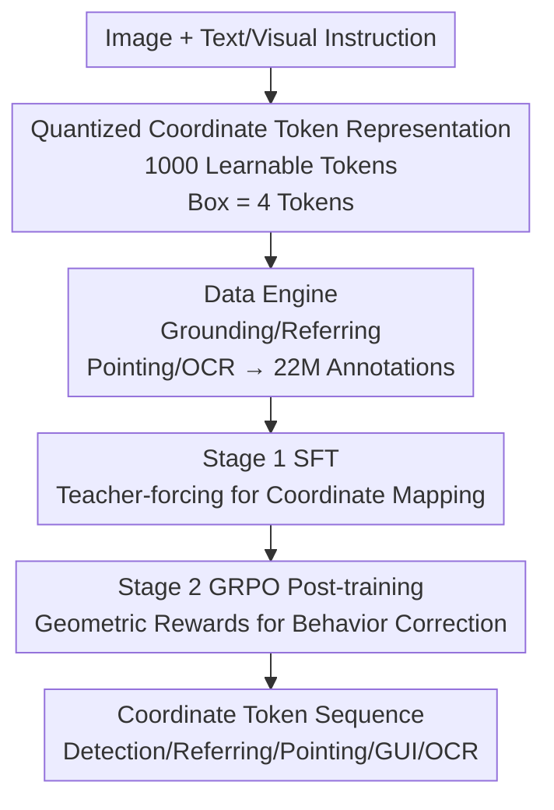

# Detect Anything via Next Point Prediction

**Conference**: CVPR 2026  
**Paper**: [CVF Open Access](https://openaccess.thecvf.com/content/CVPR2026/html/Jiang_Detect_Anything_via_Next_Point_Prediction_CVPR_2026_paper.html)  
**Code**: https://github.com/IDEA-Research/Rex-Omni  
**Area**: Object Detection / Multimodal VLM  
**Keywords**: Open-vocabulary detection, MLLM detection, quantized coordinate tokens, GRPO reinforcement learning, unified visual perception  

## TL;DR
Object detection is reformulated as "generating quantized coordinate token sequences with an MLLM." By combining three components—learnable coordinate tokens, a self-built data engine generating 22 million annotations, and SFT followed by GRPO reinforcement training to rectify behavior—the authors develop Rex-Omni, a 3B model. It surpasses regression-based detectors like DINO and Grounding DINO in zero-shot performance on benchmarks such as COCO, while simultaneously handling eight task categories including referring, pointing, GUI localization, and OCR.

## Background & Motivation
**Background**: Object detection has long been dominated by coordinate regression models, ranging from YOLO and Faster R-CNN to DETR and DINO, and more recently Grounding DINO, which utilizes text encoders (BERT/CLIP) for open-vocabulary tasks. Another trajectory involves MLLMs, treating coordinates as discrete tokens and predicting them directly via next-token prediction, which elegantly unifies detection within the language model framework.

**Limitations of Prior Work**: Existing open-vocabulary detectors possess shallow linguistic understanding; Grounding DINO struggles to distinguish "red apple" from all other apples, failing on complex semantics. Conversely, while MLLMs have strong linguistic capabilities, their localization is generally inaccurate. Even advanced models like Qwen2.5-VL struggle with precise bounding box localization, often exhibiting duplicate predictions, coordinate drift, and missed detections. Neither side effectively combines semantic depth with localization precision.

**Key Challenge**: The authors attribute the poor localization of MLLMs to two root causes. The first is **geometric discretization**: MLLMs treat coordinate prediction as classification supervised by cross-entropy (CE). However, CE is insensitive to geometric offsets—predicting token `<32>` instead of the ground truth `<33>` results in minimal pixel difference but extreme penalty; conversely, predicting `<1000>` instead of `<100>` might only miss one token but results in a complete misalignment. This contrasts sharply with regression models using L1 or GIoU losses. The second is **behavioral misalignment**: SFT uses teacher-forcing with full ground-truth sequences, fixing the number of boxes to the ground truth. Consequently, the model never encounters its own "imperfect predictions" during training, making it unable to learn how many boxes to predict or how to adjust output structures, leading to frequent duplicates or omissions during inference.

**Key Insight**: The authors retain the next-token generation paradigm but intervene in three areas: utilizing 1000 **learnable quantized tokens** to reduce learning complexity, a **data engine** to provide massive semantic annotations for token-to-pixel mapping, and **GRPO reinforcement post-training** with geometric-aware rewards to rectify behavioral issues and coordinate precision.

## Method

### Overall Architecture
Rex-Omni is based on Qwen2.5-VL-3B with almost no architectural changes: the last 1000 tokens of the vocabulary are repurposed as dedicated coordinate tokens. All visual perception tasks are unified into a "text instruction in, structured coordinate token sequence out" format. Given an image and a natural language query ("Please detect pigeon, person, truck in this image"), the model outputs a sequence like `<|object ref start|>PHRASE<|object ref end|><|box start|>COORDS<|box end|>`. Depending on the task, COORDS represent boxes (4 tokens), points (2 tokens), or polygon vertices. The pipeline consists of three parts: task formulation, the data engine, and two-stage training.

### Key Designs

**1. Task Formulation: Compressing Detection into Lightweight Classification via 1000 Learnable Tokens**

Addressing the "geometric discretization" issue, the authors compared three MLLM coordinate paradigms: direct discrete token prediction, index retrieval from predefined candidates, and external decoders. They chose end-to-end direct prediction. Within direct prediction, three encodings were considered: relative coordinates with special tokens (e.g., Pix2Seq, where each quantized value 0–999 is a special token), relative coordinates without special tokens (e.g., SEED1.5-VL, using multiple digit tokens), and absolute coordinates (e.g., Qwen2.5-VL). Rex-Omni adopts the first option because relative coordinates stabilize the task as a fixed 1000-class classification problem with low complexity, and special tokens are highly efficient—one box requires only 4 tokens. This is the implementation of "next point/token prediction"—relying on generation rather than regression heads. ⚠️ While the title says "Next Point Prediction," the text and figures consistently refer to "Next Token Prediction" (per-token generation of quantized coordinates); both refer to the same mechanism.

**2. Data Engine: Generating 22 Million Semantic Annotations for Token-to-Pixel Mapping**

To accurately map 1000 discrete tokens back to continuous pixel space, massive high-quality annotations are required, exceeding publicly available data which often lacks instance-level semantics (e.g., referring expressions). The authors built a data engine: the **Grounding Engine** follows the "Image Caption → Noun Phrase Extraction → Bounding Box Assignment" route but adds critical **phrase filtering**—removing descriptive attributes (e.g., "green lemon") to keep only the base class ("lemon"). This prevents errors where shallow grounding models would box all lemons when asked for "green" ones. Boxes are assigned using DINO-X, yielding 3M images from COYO/SA-1B. The **Referring Engine** uses Qwen2.5-VL-7B for human-like expressions, Molmo for point prediction, and SAM for masks, performing point-box alignment to produce 3M images. Additionally, a **Pointing Engine** (5M samples) and an **OCR Engine** (2M samples) are used. Including 8.9M public samples, the total reaches 22M.

**3. Two-Stage Training: SFT Foundation + GRPO Geometric Rewards**

SFT is performed on 22M samples using teacher-forcing for basic coordinate-to-pixel mapping. To solve the SFT issues—insensitivity to geometry and inability to determine box counts—Stage 2 employs GRPO reinforcement post-training. Given an image and instruction $(I,x)$, the model samples $G$ complete responses $\{o_1,\dots,o_G\}$ from policy $\pi_\theta$, calculating a normalized reward $r_i$ for each:

$$A_i = \frac{r_i - \mathrm{mean}(r_1,\dots,r_G)}{\mathrm{std}(r_1,\dots,r_G)}$$

The rewards are **geometric-aware** and categorized into three types: **Box IoU Reward** for detection (matching ground truth boxes $b^*_j$ with predictions $\hat b_i$ based on IoU and class), using an F1-style score $r^{IoU} = \frac{2\cdot P\cdot R}{P+R}$ based on recall and precision; **Point-in-Mask Reward** for pointing tasks (rewarding points falling inside the correct SAM mask); and **Point-in-Box Reward** for GUI localization. By allowing variable-length outputs, GRPO can directly penalize duplicates or omissions with low rewards. Sampling only 66k SFT samples for GRPO triggers a performance leap, indicating that GRPO **releases latent capabilities** learned during SFT rather than simply acquiring new knowledge.

### Loss & Training
Stage 1 SFT: 22M annotations, teacher-forcing, cross-entropy supervision for coordinate token classification. Stage 2 GRPO: 66k samples from SFT data, reward-guided optimization using normalized advantage $A_i$, switching between three geometric rewards based on the task. Both stages utilize Qwen2.5-VL-3B, repurposing the final 1000 vocabulary tokens.

## Key Experimental Results

### Main Results
Evaluation covers eight task categories. Detection primarily uses **F1@IoU** (0.5 / 0.95 / mIoU) instead of AP, as most MLLMs lack reliable confidence scores, making AP comparisons unfair. Main results for COCO / LVIS (F1, Zero-shot):

| Benchmark | Metric | Rex-Omni | Rex-Omni-SFT | DINO-R50 | Grounding DINO-T | SEED1.5-VL |
|-----------|--------|----------|--------------|----------|------------------|------------|
| COCO      | F1@IoU0.5 | **72.0** | 68.2         | 68.8     | 69.8             | 71.3       |
| COCO      | F1@mIoU   | **52.9** | 50.4         | 55.6     | 56.6             | 51.4       |
| LVIS      | F1@IoU0.5 | 64.3     | 60.3         | —        | 38.8             | 65.6       |
| LVIS      | F1@mIoU   | **46.9** | 44.2         | —        | 38.8             | 46.7       |

Note: At IoU0.5, where pixel-perfect precision is not the primary requirement, Rex-Omni outperforms traditional open/closed-set detectors in zero-shot, validating that MLLM detection can surpass regression models in such scenarios. Rex-Omni also leads on dense/small objects (Dense200, VisDrone) and referring expression detection (HumanRef, RefCOCOg), trailing only the commercial SEED1.5-VL on referring tasks. Results on pointing (F1@Point) show comprehensive leadership:

| Benchmark | Rex-Omni | Rex-Omni-SFT | SEED1.5-VL | Qwen2.5-VL-7B |
|-----------|----------|--------------|------------|---------------|
| COCO      | **80.5** | 76.0         | 78.2       | 61.1          |
| Dense200  | **82.5** | 72.9         | 72.1       | 2.0           |
| VisDrone  | **58.9** | 49.5         | 56.7       | 14.2          |

### Ablation Study
The core ablation investigates what GRPO rectifies. The authors measured gains after manually "removing duplicates" and "removing large boxes"—higher gains indicate more severe existing issues:

| Operation | Model | F1@0.5 (Before → After) | Removed % | Description |
|-----------|-------|--------------------------|-----------|-------------|
| Remove Duplicates (VisDrone) | SFT | 55.6 → 62.3 | 15.3% | SFT has severe duplicates |
| Remove Duplicates (VisDrone) | GRPO | 61.6 → 62.1 | 0.1% | GRPO nearly duplicate-free |
| Remove Large Boxes (Dense200) | SFT | 44.9 → 56.7 (mIoU) | 20.5% | SFT covers multiple objects |
| Remove Large Boxes (Dense200) | GRPO | 58.3 → 60.0 (mIoU) | 3.5% | Large boxes reduced significantly |

### Key Findings
- **GRPO's primary value is behavior correction, not knowledge acquisition**: Using only 66k samples triggered a performance surge after SFT plateaued; GRPO unlocks SFT's latent potential.
- **Duplicate and oversized boxes are SFT's main pitfalls**: Teacher-forcing prevents autonomous output adjustment. Removing duplicates improved SFT by 15.3% on VisDrone, while GRPO reduced such errors to 0.1% / 3.5%.
- **Coordinate precision gains are moderate**: In controlled settings with "perfect matching," GRPO improved F1@mIoU on COCO by only +0.5 over SFT, implying gains mostly come from behavioral correction.

## Highlights & Insights
- **Injecting "geometric labels" into generative detection via rewards**: Traditional detection relies on L1/GIoU, which MLLMs lack. Rex-Omni compensates via Box IoU and Point-in-Mask rewards during RL, bypassing the CE insensitivity issue. This approach is transferable to any coordinate-as-token task.
- **Phrase filtering is a subtle but critical lever**: Removing attributes to focus on base labels prevents massive mislabeling by grounding models, serving as a significant quality control step.
- **Variable-length output + sequence-level rewards directly cure duplicates**: Teacher-forcing's fixed box count is the root cause. GRPO allows the model to decide the number of boxes, solving the issue at the mechanism level rather than through post-processing.

## Limitations & Future Work
- **Weak at high precision (IoU0.95)**: Rex-Omni achieves only 15.9 F1@IoU0.95 on COCO. The precision ceiling of quantized tokens makes it less suitable for ultra-fine localization than regression models.
- **Dependency on F1 over AP**: The reliance on F1 due to a lack of confidence scores complicates direct numerical comparisons with the AP of traditional detectors.
- **Gaps with closed-set experts**: Rex-Omni stays behind DocLayout-YOLO in layout analysis (89.5 vs 91.2 F1@0.5) and PaddleOCRv5 in OCR. Its strength lies in generalization and multi-task unification rather than absolute single-task dominance.
- **Future Directions**: Finer coordinate quantization (>1000 bins or hierarchical tokens), extending geometric rewards to polygons/keypoints, and further exploration of GRPO data scaling and sampling numbers $G$.

## Related Work & Insights
- **vs Grounding DINO**: It aligns text and visual regions using encoders; it is precise in localization but shallow in language (e.g., cannot distinguish "red apple"). Rex-Omni leverages LLM reasoning for complex semantics at the cost of some high-IoU precision.
- **vs Qwen2.5-VL / SEED1.5-VL**: These also treat coordinates as tokens but suffer from discretization and behavioral issues due to absolute coordinates or lack of RL. Rex-Omni uses 4-token quantized relative coordinates and GRPO to systematically suppress duplicate/large boxes.
- **vs T-Rex2**: T-Rex2 treats visual prompts as feature matching. Rex-Omni unifies visual prompts into the quantized token framework, achieving performance comparable to specialized models.

## Rating
- Novelty: ⭐⭐⭐⭐⭐ Systematically addresses discretization and behavioral misalignment in MLLM detection via GRPO with geometric rewards.
- Experimental Thoroughness: ⭐⭐⭐⭐⭐ Covers eight task categories across dozens of benchmarks, precisely isolating the mechanism of GRPO.
- Writing Quality: ⭐⭐⭐⭐ Clear motivation and mechanism, though the "Next Point" vs "Next Token" phrasing discrepancy is slightly distracting.
- Value: ⭐⭐⭐⭐⭐ A 3B model that approaches or exceeds traditional detectors in zero-shot tasks while unifying visual perception; provides an open-source path for language-aware unified vision systems.

<!-- RELATED:START -->

## Related Papers

- [\[CVPR 2026\] Back to Point: Exploring Point-Language Models for Zero-Shot 3D Anomaly Detection](back_to_point_exploring_point-language_models_for_zero-shot_3d_anomaly_detection.md)
- [\[ICCV 2025\] YOLOE: Real-Time Seeing Anything](../../ICCV2025/object_detection/yoloe_realtime_seeing_anything.md)
- [\[CVPR 2025\] Multiple Object Tracking as ID Prediction](../../CVPR2025/object_detection/multiple_object_tracking_as_id_prediction.md)
- [\[CVPR 2025\] Search and Detect: Training-Free Long Tail Object Detection via Web-Image Retrieval](../../CVPR2025/object_detection/search_and_detect_training-free_long_tail_object_detection_via_web-image_retriev.md)
- [\[CVPR 2025\] PO3AD: Predicting Point Offsets toward Better 3D Point Cloud Anomaly Detection](../../CVPR2025/object_detection/po3ad_predicting_point_offsets_toward_better_3d_point_cloud_anomaly_detection.md)

<!-- RELATED:END -->
