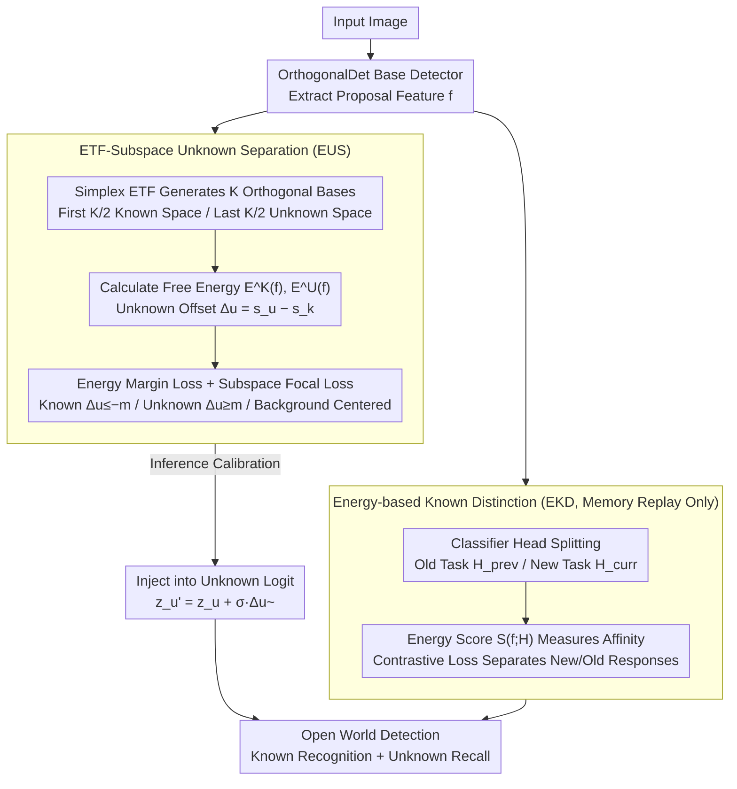

# Detecting Unknown Objects via Energy-Based Separation for Open World Object Detection

**Conference**: CVPR 2026  
**arXiv**: [2603.29954](https://arxiv.org/abs/2603.29954)  
**Code**: None  
**Area**: Object Detection  
**Keywords**: Open World Object Detection, Energy Function, Unknown Object Detection, Incremental Learning, Catastrophic Forgetting

## TL;DR

Ours proposes the DEUS framework, which effectively separates known, unknown, and background proposals in geometrically orthogonal known/unknown subspaces via ETF-Subspace Unknown Separation (EUS). It further introduces Energy-based Known Distinction (EKD) loss to reduce cross-interference between old and new classes during incremental learning, significantly improving unknown object recall on OWOD benchmarks.

## Background & Motivation

Open World Object Detection (OWOD) is a challenging setting that requires the detector to:  
1. **Incrementally learn known classes**: Continuously expand the set of recognizable categories.  
2. **Detect unknown objects**: Identify unseen objects without explicit supervision.  
3. **Avoid catastrophic forgetting**: Learn new classes without losing knowledge of previously learned ones.

Existing OWOD methods face two core issues:

**Problem 1: Insufficient Representation Learning for Unknown Objects**
- Current methods (including energy-based ones) heavily rely on the detector's **known class predictions** to detect unknowns.
- Energy is typically modeled only in the known space to push non-known objects away, but lacks constraints to prevent confusion between unknown objects and the background.
- Result: Known, unknown, and background features remain entangled, leading to missed detections or misclassifications of unknowns.

**Problem 2: Cross-Interference Between Old and New Classes in Memory Replay**
- While memory replay mitigates forgetting, it lacks explicit regularization to prevent mutual interference between old and new classes.
- As the number of tasks and classes increases, cross-interference becomes more severe.
- Result: A performance trade-off exists between maintaining old knowledge and learning new classes.

The two designs of DEUS address these two problems respectively.

## Method

### Overall Architecture

Built upon OrthogonalDet as the base detector, DEUS adds two modules:
- **EUS (ETF-Subspace Unknown Separation)**: Constructs orthogonal known/unknown subspaces to guide proposal feature separation.
- **EKD (Energy-based Known Distinction)**: Separates energy responses of old and new classifiers during memory replay.

Both modules share the same proposal feature $f$: EUS performs three-class separation (known/unknown/background) during training and calibrates the subspace offset into the original unknown logit during inference; EKD is activated only during the memory replay phase of incremental tasks, using energy scores to separate responses between old and new classifiers.

### Key Designs

**1. ETF-Subspace Unknown Separation (EUS): Allocating a dedicated representation space for unknown objects instead of simply pushing them away from knowns.**

Previous methods only modeled energy in the known space and pushed non-known samples outward, which lacked sufficient constraints and resulted in the entanglement of unknown and background features. EUS explicitly constructs two geometrically orthogonal subspaces: using Simplex ETF (Equiangular Tight Frame) to generate $K$ equiangular basis vectors. The first $K/2$ vectors form the known space $W_\mathcal{K}^E$, and the remaining $K/2$ form the unknown space $W_\mathcal{U}^E$ ($K=128$). Since the basis vectors are fixed and non-learnable, orthogonality is guaranteed. For each proposal feature $f$, Helmholtz free energies are calculated for both subspaces:

$$E^\mathcal{K}(f) = -\log \sum_{i=1}^{K/2} \exp(W_{\mathcal{K},i}^E \cdot f)$$
$$E^\mathcal{U}(f) = -\log \sum_{i=1}^{K/2} \exp(W_{\mathcal{U},i}^E \cdot f)$$

An unknown offset $\Delta_u(f) = s_u(f) - s_k(f)$ (unknown score minus known score) characterizes the identity, where a larger positive value indicates a higher likelihood of being unknown. During training, known proposals must satisfy $\Delta_u \leq -m$, unknown proposals must satisfy $\Delta_u \geq m$, and background samples fall into the boundary region. This is enforced by an energy margin loss on $\Delta_u$ for primary separation, supplemented by a subspace focal loss for stable training. During inference, this subspace information is calibrated into the existing unknown logit: $z_u' = z_u + \sigma_{z_u} \tilde{\Delta}_u(f)$ ($\tilde{\Delta}_u$ is the normalized offset), enhancing unknown discrimination without altering the original detection pipeline. The orthogonal subspaces provide "unknowns" with their own geometric location rather than treating them as residuals of the known space, which is key to nearly doubling the recall.

**2. Energy-based Known Distinction (EKD): Separating old and new classes based on energy during memory replay.**

Memory replay mitigates forgetting, but without explicit regularization, interference between old and new classes worsens as tasks accumulate. EKD splits the known class classification head into an old task sub-classifier $H_{prev}$ and a new task sub-classifier $H_{curr}$. It uses the energy score $S(f;H) = \log \sum_{c=1}^{C_H} \exp(z_c(f;H))$ to measure the affinity of a proposal toward a classifier (higher score means higher affinity). A contrastive loss forces old class proposals to have high energy scores on the old classifier and low scores on the new one, and vice versa:

$$\mathcal{L}_{prev} = \log(1 + \exp[S(f_{prev};H_{curr}) - S(f_{prev};H_{prev})])$$
$$\mathcal{L}_{curr} = \log(1 + \exp[S(f_{curr};H_{prev}) - S(f_{curr};H_{curr})])$$

This module is only active during the memory replay phase (incremental task training). It uses a unified energy-based language to decouple "preserving old" and "learning new" into two classifiers, thereby stabilizing known class performance without sacrificing unknown detection.

### Loss & Training

Total loss:
$$\mathcal{L}_{total} = \mathcal{L}_{cls} + \mathcal{L}_{bbox} + \mathcal{L}_{EUS} + \mathcal{L}_{EKD}$$

- $\mathcal{L}_{cls}$: sigmoid focal loss
- $\mathcal{L}_{bbox}$: L1 + GIoU loss
- $\mathcal{L}_{EUS} = \mathcal{L}_{energy} + \mathcal{L}_{subspace}$ (EUS weight 1.0)
- $\mathcal{L}_{EKD}$ (weight 1.0, enabled during incremental tasks only)
- ETF space dimension $K=128$ (64 vectors each for known/unknown)
- Implemented based on MMDetection
- Improved pseudo-labeling strategy: dynamically scaling the number of pseudo-labels and filtering noisy detections.

## Key Experimental Results

### Main Results

**M-OWODB Benchmark**:

| Method | T1 U-Rec | T1 H-Score | T2 U-Rec | T2 H-Score | T3 U-Rec | T3 H-Score | T4 Known mAP |
|------|---------|-----------|---------|-----------|---------|-----------|-------------|
| OrthogonalDet | 36.3 | 46.6 | 30.2 | 38.0 | 28.7 | 35.7 | 44.7 |
| O1O | 49.3 | 56.1 | 50.3 | 51.6 | 49.5 | 47.4 | 42.4 |
| **DEUS** | **65.1** | **65.6** | **66.2** | **59.0** | **69.0** | **58.0** | **46.0** |

**S-OWODB Benchmark**:

| Method | T1 U-Rec | T1 H-Score | T2 U-Rec | T3 U-Rec | T4 Known mAP |
|------|---------|-----------|---------|---------|-------------|
| OrthogonalDet | 24.6 | 36.6 | 27.9 | 31.9 | 46.2 |
| O1O | 49.8 | 59.1 | 51.1 | 48.1 | 45.9 |
| **DEUS** | **68.7** | **70.1** | **62.9** | **60.7** | **48.8** |

DEUS nearly doubles U-Rec (e.g., M-OWODB T1: 36.3→65.1) while maintaining competitive known mAP.

**RS-OWODB (Remote Sensing Data)**:

| Method | T1 H-Score | T2 H-Score | T3 H-Score | T4 mAP |
|------|-----------|-----------|-----------|--------|
| OrthogonalDet | 34.8 | 15.6 | 16.2 | 64.2 |
| **DEUS** | **62.5** | **39.4** | **40.9** | **68.3** |

### Ablation Study

| EUS | EKD | T1 U-Rec | T1 H-Score | T2 Known mAP | T3 H-Score | T4 Known mAP | Note |
|-----|-----|---------|-----------|-------------|-----------|-------------|------|
| ✗ | ✗ | 36.8 | 47.2 | 52.0 | 37.6 | 44.7 | Baseline |
| ✗ | ✓ | 36.8 | 47.2 | 52.6 | 43.9 | 45.9 | EKD improves known |
| ✓ | ✗ | 65.1 | 65.6 | 51.9 | 57.5 | 43.5 | EUS boosts U-Rec |
| ✓ | ✓ | **65.1** | **65.6** | **53.3** | **58.0** | **46.0** | Optimal combo |

### Key Findings

1. **EUS is critical for unknown detection**: U-Rec jumped from 36.8 to 65.1, nearly doubling, proving that dual-subspace modeling is far superior to using known space alone.
2. **EKD independently improves known class performance**: EKD consistently improves mAP across tasks regardless of EUS presence.
3. **Mutual complementarity**: EUS boosts unknown detection while EKD protects known performance, resulting in the best overall H-Score.
4. **Minimal overhead**: Inference time increases by only 1.9%, FLOPs +0.5%, and training time +6.2%.
5. **Generalization to remote sensing**: On RS-OWODB, H-Score improved from 34.8 to 62.5, proving the method is not limited to natural images.
6. **PCA Visualization** clearly shows: In the baseline, known/unknown/background are heavily entangled; DEUS achieves distinct three-class separation.

## Highlights & Insights

1. **Dual-Subspace Energy Modeling**: First to explicitly model the representation space for unknown objects in OWOD instead of merely excluding them from the known space. ETF-guaranteed orthogonality is the key to avoiding subspace overlap.
2. **Unified Use of Energy Functions**: Energy functions are used for both known/unknown separation (EUS) and old/new class distinction (EKD), forming a unified framework.
3. **Geometric Advantages of ETF**: Equiangular Tight Frames provide fixed, uniformly distributed orthogonal basis vectors that ensure spatial separation without the need for learning.
4. **Calibrated Inference**: Injecting the subspace offset into existing logits is a concise and efficient way to enhance detection without disrupting the pipeline.
5. **Pseudo-label Improvements**: While secondary, the dynamic scaling and noise filtering of pseudo-labels contribute practically to baseline performance.

## Limitations & Future Work

1. **Semantic Overlap**: Separation remains difficult when known and unknown categories have high semantic similarity.
2. **ETF Dimension Selection**: $K=128$ is a hyperparameter that may require adjustment for different datasets.
3. **Minor mAP Drop from EUS**: Ablations show EUS alone slightly reduces T4 Known mAP (44.7 to 43.5), as more proposals are labeled unknown.
4. **Faster R-CNN Architecture Dependency**: Whether this is applicable to DETR-style open world detectors remains unknown.
5. **Pseudo-label Quality**: Improving pseudo-label quality further via self-training or consistency regularization could be explored.

## Related Work & Insights

- **OrthogonalDet**: The base model that decouples objectness and classification via orthogonalization.
- **PROB (Zohar et al.)**: Models class-agnostic objectness using normal distributions.
- **Du et al. (Unknown-Aware OD)**: Uses energy uncertainty regularization, but restricted to the known space.
- **Neural Collapse / ETF**: The geometric properties of ETF in classification are cleverly adapted for constructing separation subspaces.
- Insight: The dual-subspace + energy paradigm could be extended to other open-world tasks such as open-world segmentation or tracking.

## Rating

- Novelty: ⭐⭐⭐⭐⭐ — The ETF dual-subspace + energy separation is a fresh design; EKD's energy-based class distinction is also innovative.
- Experimental Thoroughness: ⭐⭐⭐⭐⭐ — Three benchmarks (M-OWODB/S-OWODB/RS-OWODB) with extensive ablation, analysis, and visualization.
- Writing Quality: ⭐⭐⭐⭐ — Motivation and methods are clearly articulated, though mathematical notation requires careful following.
- Value: ⭐⭐⭐⭐⭐ — Nearly doubling the U-Rec in OWOD is a significant contribution that advances open-world learning.

<!-- RELATED:START -->

## Related Papers

- [\[CVPR 2026\] EW-DETR: Evolving World Object Detection via Incremental Low-Rank DEtection TRansformer](ew-detr_evolving_world_object_detection_via_incremental_low-rank_detection_trans.md)
- [\[CVPR 2026\] Show, Don't Tell: Detecting Novel Objects by Watching Human Videos](show_dont_tell_detecting_novel_objects_by_watching.md)
- [\[CVPR 2026\] ElasticFormer: Detecting Objects in HRW Shots via Elastic Computing Vision Transformer](elasticformer_detecting_objects_in_hrw_shots_via_elastic_computing_vision_transf.md)
- [\[AAAI 2026\] CountVid: Open-World Object Counting in Videos](../../AAAI2026/object_detection/open-world_object_counting_in_videos.md)
- [\[CVPR 2026\] WeDetect: Fast Open-Vocabulary Object Detection as Retrieval](wedetect_fast_open-vocabulary_object_detection_as_retrieval.md)

<!-- RELATED:END -->
