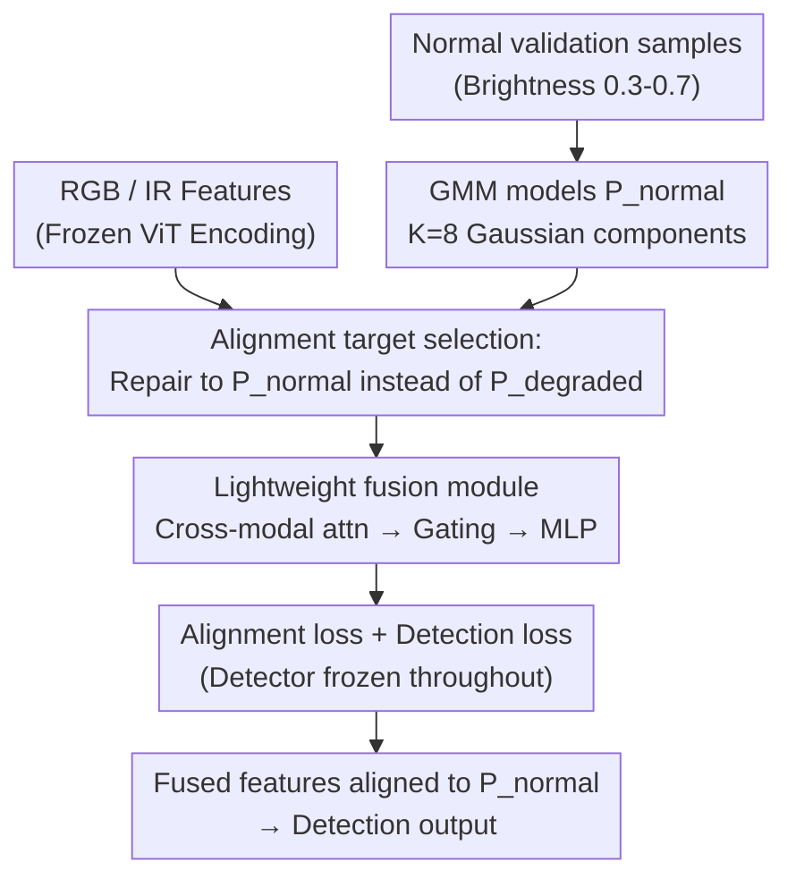

# Distribution-Aligned Multimodal Fusion for Robust Object Detection

**Conference**: CVPR 2026  
**Paper**: [CVF Open Access](https://openaccess.thecvf.com/content/CVPR2026/html/Hao_Distribution-Aligned_Multimodal_Fusion_for_Robust_Object_Detection_CVPR_2026_paper.html)  
**Code**: Not released  
**Area**: Object Detection / Multimodal Fusion  
**Keywords**: RGB-IR Detection, Distribution Alignment, Cross-Degradation Generalization, Parameter-Efficient Fusion, Gaussian Mixture Model  

## TL;DR
To address the poor generalization of RGB-Infrared multimodal detection in "unseen degradation scenarios," this paper freezes the pretrained detector and trains only a lightweight fusion module. It explicitly pulls fused features back to the "normal feature distribution $P_\text{normal}$" (where the pretrained detector performs best) using complementary information from infrared data, rather than adapting to the degradation distributions seen during training. This achieves SOTA on three benchmarks with a $4 \times$ training speedup.

## Background & Motivation

**Background**: Safety-critical scenarios such as autonomous driving and surveillance require robust all-weather detection. RGB cameras are the primary sensors but suffer significant performance drops under adverse lighting conditions like overexposure, underexposure, and nighttime. Infrared (IR) cameras are insensitive to lighting and provide complementary information, making RGB-IR multimodal detection a mainstream solution. Recent fusion methods generally rely on heavy attention mechanisms and complex cross-modal interaction designs.

**Limitations of Prior Work**: Existing methods rely on end-to-end training, where feature learning is implicitly guided only by detection task losses. Preliminary experiments revealed a critical phenomenon: standard end-to-end training performs strongly on "seen degradation types" but fails significantly on "unseen" ones. In real-world deployment, collecting all possible degradation types for the training set is both expensive and impractical. Therefore, cross-degradation generalization is the true bottleneck.

**Key Challenge**: The authors point out that the fundamental problem lies in the "incorrect optimization objective of multimodal fusion." Existing methods implicitly pull fused features toward the "training data distribution," which contains degradation-specific patterns. Once an unseen degradation is encountered, these overfitted patterns fail. In other words, the detector's decision boundaries are calibrated for normal features; end-to-end adaptation to degradations disrupts this calibration.

**Goal**: Enable fused features to maintain detection performance across any unseen degradation, given that training only covers limited degradation types.

**Key Insight**: Based on transfer learning principles, "features from diverse source data generalize better than task-specific adaptations." The pretrained detector possesses the most applicable knowledge and accurate decision boundaries on the normal feature distribution $P_\text{normal}$. Therefore, $P_\text{normal}$ should be treated as a **stable alignment target**, and IR complementary information should be used to "repair" degraded features back to this distribution, rather than forcing the detector to accommodate degradations.

**Core Idea**: Freeze the pretrained detector, train only a lightweight fusion module, and explicitly align fused features to the pretrained normal distribution $P_\text{normal}$ (instead of the training degradation distribution $P_\text{degraded}$), trading the choice of alignment target for cross-degradation generalization.

## Method

### Overall Architecture

The method decouples "repairing degraded multimodal features back to the pretrained normal distribution" into two stages: In the **offline stage**, a Gaussian Mixture Model (GMM) is fitted using the frozen detector on normal samples from the target domain to model the alignment target $P_\text{normal}$. In the **online stage**, the entire detector (ViT encoder + DETR decoder, 86M parameters) is frozen, and only a 13M parameter fusion module is trained. This module merges RGB-IR complementary information while explicitly aligning the fused features to $P_\text{normal}$. The detector remains fixed throughout, ensuring low training costs and preservation of pretrained knowledge.

Formally: Let the pretrained detector $D^*$ consist of an encoder $E$ and a detection head $H$, trained on data dominated by normal scenes (e.g., COCO). Its feature distribution is defined as $P_\text{normal} := P(F), F = E(I), I \sim \mathcal{D}_\text{pretrain}$. When deployed in degraded scenes (overexposure/underexposure/fog), the distribution shifts to $P_\text{degraded}$, but the detector's decision boundaries remain calibrated for $P_\text{normal}$. This paper learns a fusion function $M$ such that the fused feature distribution $P_\text{fused} := P(M(F_\text{rgb}, F_\text{ir}))$ is as close to $P_\text{normal}$ as possible.

### Key Designs

**1. Alignment Target Selection: Repair to $P_\text{normal}$ instead of $P_\text{degraded}$**

This is the core contribution. Given a frozen detector and the same fusion architecture, there are three options for the alignment target: (1) End-to-end training to adapt the detector to training degradations; (2) Aligning features to the training degradation distribution $P_\text{degraded}$; (3) Aligning features to the normal distribution $P_\text{normal}$. Ours chooses (3) based on transfer learning: when training covers limited degradations, $P_\text{normal}$ is where pretrained knowledge is truly applicable and serves as a stable target. Conversely, $P_\text{degraded}$ overfits to the specific patterns of the training degradations. Table 3 validates this: training only on overexposed samples, aligning to $P_\text{normal}$ achieves 76.8 / 40.6 mAP on unseen nighttime/blur degradations, while aligning to $P_\text{degraded}$ yields only 67.5 / 28.5. The cost is only a slight drop on "seen overexposure" from 48.2 to 47.3. In short: use a small loss on seen degradations to gain significant improvements on unseen ones.

**2. Modeling $P_\text{normal}$ with GMM and Explicit Alignment Loss**

To make "alignment to $P_\text{normal}$" optimizable, the paper models the [CLS] token of normal features (global representation $F_\text{cls} \in \mathbb{R}^d$) using a $K$-component GMM:

$$p_\text{normal}(F_\text{cls}) = \sum_{k=1}^{K} w_k\, \mathcal{N}(F_\text{cls} \mid \mu_k, \Sigma_k)$$

Parameters $\{w_k, \mu_k, \Sigma_k\}$ are estimated via the EM algorithm, with $K$ selected using BIC (default $K=8$). GMM is chosen because: $K$ components capture the multimodal structure of different scene types; the log-likelihood has a closed-form gradient for optimization; and diagonal covariance $\Sigma_k$ reduces parameter complexity from $O(Kd^2)$ to $O(Kd)$. Supervision is performed directly via $-\log p_\text{normal}(\cdot)$:

$$\nabla_{F_\text{cls}} \log p_\text{normal}(F_\text{cls}) = \sum_k \gamma_k(F_\text{cls})\, \Sigma_k^{-1}(\mu_k - F_\text{cls})$$

Where $\gamma_k$ is the posterior probability. Geometrically, this gradient pulls the feature toward the nearest Gaussian component center. This contrasts with existing methods that rely only on task losses—this paper provides **direct supervision** on distribution shift. The authors clarify that "normal" here refers to target domain samples without severe degradation (5k images selected via stratified sampling based on brightness $\in[0.3,0.7]$ and contrast $>0.4$).

**3. Lightweight Fusion Module + Frozen Detector: Reducing Tunable Params to 13M**

To fuse RGB-IR without modifying the detector, the fusion module $M$ uses three sequential components to process patch token sequences ($F_\text{rgb}, F_\text{ir} \in \mathbb{R}^{N\times d}$, where $N=197, d=768$ for ViT-Base). **Cross-modal Attention** uses 8-head cross-attention for mutual feature enhancement: $F_\text{rgb}^\text{enh} = F_\text{rgb} + \text{Softmax}(Q_\text{rgb}K_\text{ir}^T/\sqrt{d_k})V_\text{ir}$ (symmetric for IR). **Adaptive Token Gating** concatenates enhanced features into $F_\text{concat}\in\mathbb{R}^{N\times 2d}$ and calculates channel-wise gating weights $G=\sigma(\text{MLP}(\text{Mean}(F_\text{concat})))$ to perform $F_\text{gated}=F_\text{concat}\odot G$. Finally, a **Fusion MLP** projects gated features back to the original dimension $F_\text{rect}=\text{MLP}(F_\text{gated})\in\mathbb{R}^{N\times d}$. The total 13M parameters (Attn 4.7M, Gating 2.4M, MLP 7.1M) are small compared to the 86M frozen detector. Freezing acts as a strong regularizer, preventing overfitting to training patterns when target data is limited.

### Loss & Training

The total loss optimizes both alignment and task objectives:

$$\mathcal{L} = \mathbb{E}_{(I_\text{rgb}, I_\text{ir}, Y)\sim\mathcal{T}}\big[-\log p_\text{normal}(F_\text{rect}^\text{cls}) + \lambda\, \mathcal{L}_\text{det}(H(F_\text{rect}), Y)\big]$$

Where $F_\text{rect}^\text{cls}$ is the [CLS] token of the fused features, and $\lambda=0.5$ balances alignment and detection. Training follows two decoupled stages: **Stage 1 (Offline)** uses the frozen encoder to extract [CLS] features from 5k normal validation samples, initializing with k-means++ and fitting the GMM via EM (max 100 iterations, tol $10^{-4}$). **Stage 2 (Online)** freezes all $D^*$ parameters; for each batch, it extracts frozen features, calculates fused features, and updates only $\theta_M$ using the combined loss.

## Key Experimental Results

### Main Results

Experiments were conducted on three RGB-IR benchmarks: LLVIP (pedestrians, 15,488 pairs), FLIR (vehicles, 10,228 pairs), and DroneVehicle (aerial, 28,439 pairs). All use a frozen ViT-Base + DETR, reporting mAP@0.5 (mean of 3 runs).

| Dataset | Ours | Prev. SOTA (CFMW) | Gain |
|--------|------|----------------------|------|
| LLVIP | 98.1±0.6 | 97.7±0.6 | +0.4 |
| FLIR | 79.5±0.7 | 78.9±0.7 | +0.6 |
| DroneVehicle | 57.8±0.8 | 57.2±0.8 | +0.6 |

| Method Category | Representative Method | Training Time | Parameters |
|----------|----------|----------|------|
| Attention-based | MMTM | 15h | 89M |
| End-to-end SOTA | M2FNet / CFMW | 17h / 14h | 94M / 89M |
| Advanced Fusion | RSDet | 4h | 88M |
| **Ours** | Ours | **3.5h** | 99M |

Ours achieves SOTA results while reducing training time from 14-17h to 3.5h (approx. $4\times$ speedup) by only training 13M parameters.

### Hard Scene Decomposition (LLVIP mAP by Scene)

| Method | Normal | Overexposed | Underexposed | Night |
|------|------|------|------|------|
| MMTM | 96.3 | 36.8 | 41.2 | 74.2 |
| M2FNet | 97.6 | 44.1 | 48.5 | 81.6 |
| **Ours** | 97.8 | **47.3** | **51.8** | **83.5** |

Improvements primarily occur in extreme degradations like overexposure/underexposure (+3.2 / +3.3) where features deviate severely from $P_\text{normal}$. Normal scenes remain level, indicating the method specifically targets distribution drift.

### Ablation Study (Cross-Degradation Generalization)

Training only on overexposure, testing on seen (overexposure) vs. unseen degradations (Table 4):

| Method | Overexp (Seen) | Underexp | Night | Blur |
|------|-----------|------|------|------|
| E2E (Unfrozen) | 41.2 | 38.2 | 70.5 | 32.6 |
| Frozen + Task Loss Only | 43.5 | 41.8 | 73.2 | 35.8 |
| **Ours (Frozen+Aligned)** | **47.3** | **48.5** | **76.8** | **40.6** |

Component Ablation (Table 5):

| Configuration | mAP | Overexp | $-\log p_\text{normal}$ ↓ |
|------|-----|------|---------------------------|
| Baseline (Concat) | 75.3 | 31.5 | 3.45 |
| + Cross-modal Attn | 78.6 | 37.8 | 2.68 |
| + Adaptive Gating | 80.9 | 42.6 | 2.01 |
| + Alignment Loss | **82.5** | **47.3** | **1.52** |

### Key Findings
- **Alignment loss is the most critical**: Adding it jumps overexposed performance from 42.6 to 47.3, and $-\log p_\text{normal}$ drops to 1.52, proving that each component effectively reduces distribution drift.
- **The choice of target determines generalization**: Aligning to $P_\text{degraded}$ plateaus early (overfitting to training patterns), while aligning to $P_\text{normal}$ converges stably.
- **End-to-end training is inferior**: Unfrozen end-to-end training performs worse on both seen and unseen degradations compared to frozen schemes, confirming the risk of "adaptation = loss of generalization."

## Highlights & Insights
- **The "Alignment Target" as a first-class design variable**: While most papers focus on architecture, this work focuses on the "direction of alignment." The shift from adapting to degradations to repairing back to the normal distribution is technically sound and supported by transfer learning theory.
- **Frozen Detector = Free Strong Regularization + $4\times$ Speedup**: 86M frozen and 13M tunable parameters prevent overfitting while saving cost—a strong example of parameter-efficient fusion.
- **Portability of GMM + Alignment Loss**: The mechanism of fitting a reference distribution and using the NLL gradient to pull features back is not limited to RGB-IR. It can be applied to any "pretrained model + degraded input" scenario (e.g., cross-device medical imaging).

## Limitations & Future Work
- **Reliance on target domain normal samples**: Modeling $P_\text{normal}$ offline requires 5k normal images. If the target domain has very few normal samples (e.g., deep sea or permanent low-light), the target might be hard to estimate.
- **Global [CLS] token alignment**: GMM and alignment loss only act on global representations. Patch-level features rely on the architecture implicitly; this might be insufficient for small targets in aerial scenes.
- **Fixed Offline Target**: $P_\text{normal}$ is not updated during training. If the concept of "normal" for fused features evolves, a fixed target might be sub-optimal. Online adaptive distributions could be explored.
- **Degradation types limited to lighting and blur**: Complex composite degradations like rain/snow or sensor noise have not yet been fully validated.

## Related Work & Insights
- **vs. Attention/End-to-End Fusion (MMTM, M2FNet, CFMW)**: These focus on cross-modal interaction architectures and implicit distribution matching via task losses. Ours uses a lightweight architecture with explicit $P_\text{normal}$ alignment, showing advantages in unseen degradations.
- **vs. Advanced Lightweight Fusion (RSDet)**: While also introducing lightweight modules, they still rely on task losses. Ours adds GMM-based explicit supervision.
- **vs. Domain Adaptation (DA)**: Traditional DA adapts models to the "target degradation distribution." Ours does the opposite—it uses multimodal complementarity to "repair" features back to the "pretrained normal distribution."

## Rating
- Novelty: ⭐⭐⭐⭐⭐ Elevated the choice of alignment target to a core variable; theoretically grounded perspective shift.
- Experimental Thoroughness: ⭐⭐⭐⭐ Complete logic chain across three benchmarks; however, lacks complex composite degradations and scenarios with scarce normal samples.
- Writing Quality: ⭐⭐⭐⭐⭐ Motivation, contradiction, method, and validation follow a clear, consistent line.
- Value: ⭐⭐⭐⭐ Practical for all-weather robust detection; the logic of "aligning to the model's preferred feature space" is transferable.

<!-- RELATED:START -->

## Related Papers

- [\[CVPR 2026\] Tri-Modal Fusion Transformers for UAV-based Object Detection](tri-modal_fusion_transformers_for_uav-based_object_detection.md)
- [\[CVPR 2026\] Geometry-Aligned and Anomaly-Aware Reconstruction for 3D Anomaly Detection](geometry-aligned_and_anomaly-aware_reconstruction_for_3d_anomaly_detection.md)
- [\[CVPR 2026\] Towards an Incremental Unified Multimodal Anomaly Detection: Augmenting Multimodal Denoising From an Information Bottleneck Perspective](towards_an_incremental_unified_multimodal_anomaly_detection_augmenting_multimoda.md)
- [\[CVPR 2026\] DyFCLT: Dynamic Frequency-Decoupled Cross-Modal Learning Transformer for Multimodal Tiny Object Detection](dyfclt_dynamic_frequency-decoupled_cross-modal_learning_transformer_for_multimod.md)
- [\[CVPR 2026\] Complementary Prototype Mapping for Efficient Multimodal Anomaly Detection](complementary_prototype_mapping_for_efficient_multimodal_anomaly_detection.md)

<!-- RELATED:END -->
