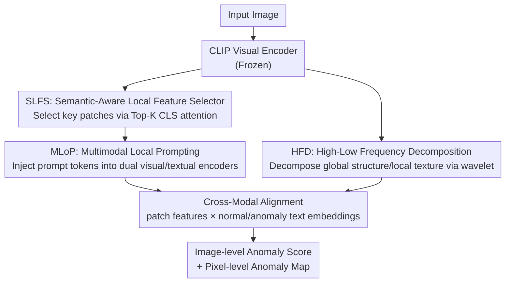

# DLVP-CLIP: Enhancing Fine-Grained Zero-Shot Anomaly Detection via Dynamic Local Visual Prompting

**Conference**: CVPR 2026  
**Paper**: [CVF Open Access](https://openaccess.thecvf.com/content/CVPR2026/html/Zhang_DLVP-CLIP_Enhancing_Fine-Grained_Zero-Shot_Anomaly_Detection_via_Dynamic_Local_Visual_CVPR_2026_paper.html)  
**Code**: None  
**Area**: Zero-Shot Anomaly Detection / Multimodal VLM  
**Keywords**: Zero-Shot Anomaly Detection, CLIP, Dynamic Visual Prompting, Local Features, Wavelet Frequency Decomposition  

## TL;DR
To address the inherent contradiction in anomaly detection where CLIP is sensitive only to global semantics and fails to capture local details, DLVP-CLIP dynamically selects key local patches from images using attention maps as "visual prompts" injected into dual visual/textual encoders. Additionally, it separately strengthens high-frequency textures using wavelet frequency decomposition, pushing zero-shot anomaly detection/segmentation to new SOTA on 13 industrial and medical datasets.

## Background & Motivation
**Background**: Zero-Shot Anomaly Detection (ZSAD) aims to train a model using auxiliary data that can directly generalize to unseen classes, which is highly valuable in industrial quality control and medical diagnosis. Leveraging its powerful zero-shot generalization capabilities, CLIP has become the dominant backbone—aligning image features with text prompts describing "normal/anomaly" without requiring class-specific training. Representative works include WinCLIP, AnomalyCLIP (object-agnostic prompting), AdaCLIP / VCP-CLIP (integrating global image features into text prompts), and TPS (dual-level text prompting).

**Limitations of Prior Work**: The pre-training objective of CLIP is **global semantic alignment** between images and texts, forcing it to extract object-level global semantics while ignoring subtle local visual features. However, anomaly detection highly relies on precise capturing of local details—presenting an **inherent contradiction** between CLIP and anomaly detection.

**Key Challenge**: Existing improvements go to extremes without resolving local perception. Text-driven approaches (AnomalyCLIP / AA-CLIP / TPS) rely on pre-designed text prompts to "describe" local regions, which struggles to dynamically adapt to complex and diverse anomaly patterns. Visual enhancement methods (AdaCLIP / VCP-CLIP) inject global CLS features into text, further strengthening global representation and weakening the depiction of subtle local anomalies. Neither path truly bridges the gap in "insufficient local perception."

**Goal**: To allow the model to explicitly incorporate **key local visual cues** from images into cross-modal alignment while maintaining zero-shot generalization, and to counteract the "low-pass filtering" effect of ViT self-attention (which tends to smooth out high-frequency fine textures).

**Key Insight**: The attention weight of the CLS token inherently encodes "the contribution of each image region to the global semantics"—meaning patch locations with high attention are semantically key local regions. Instead of painstakingly designing texts to describe local areas, it is better to **directly select these key local patches from the image as prompts**.

**Core Idea**: Using **dynamic local visual prompts** instead of pre-defined text prompts to inject fine-grained semantics—where SLFS selects key patches according to CLS attention, MLoP treats them as prompts injected into both visual and textual encoders for joint encoding, and HFD separately reinforces high-frequency textures via wavelet decomposition.

## Method

### Overall Architecture
DLVP-CLIP uses a frozen CLIP (ViT-L/14) as the backbone, and the entire pipeline consists of three steps. First, **SLFS** selects $K$ key patches with high attention from the CLS attention map of the original CLIP visual encoder and extracts their features as "dynamic visual prompt tokens." Next, **MLoP** injects these prompt tokens into the Transformer layers of both the visual and textual encoders—guiding the model to focus on key local details on the visual side, and anchoring the text representation to specific image details on the textual side. Meanwhile, **HFD** performs wavelet decomposition on the intermediate visual features, separating and separately processing global structure (low frequency) and local texture (high frequency) before fusing them. Finally, the visual patch features are aligned with "normal/anomaly" text embeddings to output both image-level anomaly scores and pixel-level anomaly maps.

### Key Designs

**1. Semantic-Aware Local Feature Selector (SLFS): Let attention dictate "where is important" rather than guessing with text**

The bottleneck is straightforward: CLIP is optimized at the global image-text alignment level, making it difficult to capture key local details. Standard practices like AdaCLIP, which treat the CLS token's global feature as a prompt, still inject global information. SLFS does the opposite—**explicitly injecting local visual semantics**. Specifically, it takes the attention matrix $A \in \mathbb{R}^{(N+1)\times(N+1)}$ from the last layer of the Visual Transformer and extracts the attention vector $A_{cls} \in \mathbb{R}^{N}$ corresponding to the CLS token. Each element in this vector represents the importance score of a patch to the global semantics. The Top-K patch indices are selected as $T = \{t_i \mid A_{cls}[t_i] \in \mathrm{Topk}(A_{cls}, K)\}_{i=1}^{K}$, and the features $P = V[T] \in \mathbb{R}^{K\times C}$ are extracted from the visual features. These $K$ semantically key local features serve as the input for subsequent prompt learning. Since attention is naturally a scorer for "global semantic contribution", utilizing it to locate key local details essentially yields an extra local selector without requiring additional learning. In the paper, $K=4$ is optimal (see ablation); larger values tend to introduce background noise.

**2. Multimodal Local Prompting (MLoP): Feed the same set of local features to both vision and text, forcing fine-grained alignment in both spaces**

Selecting local regions is not enough; the text space must also "know" these local details. MLoP projects the local visual feature matrix $P$ into prompt tokens $P' \in \mathbb{R}^{M\times C}$ ($M \ll N$) and injects them bidirectionally. In the visual encoder, $P'$ is appended along the sequence dimension to the normal tokens $T$. For the first $J$ layers, the prompts are only forwarded without updates; after the $J$-th layer, the prompts evolve layer-by-layer:

$$[T_{j+1},\, \cdot] = L^P_j([T_j, P']),\ j \le J; \qquad [T_{j+1}, P'_{j+1}] = L^P_j([T_j, P']),\ j > J$$

In the textual encoder, $P'$ is passed through a projection layer $F_\theta$ and added to a static learnable vector $E_j$ to obtain text prompt tokens $P^t_j = F_\theta(P') + E_j$, which are similarly appended to the text tokens $S_j$ before being injected into the Text Transformer. The key here lies in "homologous dual injection": the visual side guides the model to latch onto key local details during feature extraction, while the textual side **anchors the text representation to specific image details** rather than generic "objects." This establishes fine-grained semantic associations in the cross-modal feature space, alleviating the issue where pre-defined text prompts fail to capture fine-grained correspondences.

**3. High-Low Frequency Decomposition (HFD): Reclaiming smoothed-out high-frequency textures from ViT using wavelets**

The self-attention of ViT behaves like a **low-pass filter** when aggregating global features—it calculates the similarity of each patch to all patches and fuses them, which tends to smooth out high-frequency signals (fine textures) while reinforcing low-frequency globally consistent patterns. However, anomalies often manifest as subtle local texture variations, which end up being erased. HFD uses Discrete Wavelet Transform (DWT) to explicitly decompose these features: the input feature of layer $i$ is first linearly projected into a spatially-aware feature $\tilde F^V_i = F_v(F^V_i)$, and then split into low-frequency components $F^L_i = \mathrm{DWT}_{ll}(\tilde F^V_i)$ (encoding global structure) and high-frequency components $F^H_i = [\mathrm{DWT}_{lh}, \mathrm{DWT}_{hl}, \mathrm{DWT}_{hh}](\tilde F^V_i)$ (encoding edge textures and other details). Handled through separate linear operations, they are reconstructed via inverse transform $F^D_i = \mathrm{IDWT}(F^L_i + F^H_i)$, and finally added back as a residual to the original feature $F^o_i = F^V_i + F^D_i$. Modeling the high-frequency branch independently allows those subtle anomaly cues that would otherwise be suppressed to be preserved. Ablation shows that it outperforms Sobel filtering which only extracts gradients (since DWT provides a structured multi-band decomposition, yielding a richer high-frequency representation).

### Loss & Training
Training simultaneously optimizes classification and segmentation losses: $L_{total} = L_{cls}(S_p, y) + \sum_{l=1}^{L} L^l_{seg}$. The classification loss uses binary cross-entropy on the image-level anomaly score $S_p$ and the ground truth $y$. The segmentation loss operates on the pixel-level anomaly map $M_i$ and anomaly mask $S_{gt}$, combining Dice and Focal: $L_{seg} = \mathrm{Dice}(M^a_l, S_{gt}) + \mathrm{Dice}(M^n_l, I-S_{gt}) + \mathrm{Focal}(M^a_l, S_{gt})$. The image-level score is fused ($X = X_p + X_c$) from the global CLS feature $X_c$ and the multi-scale local features $X_p$ obtained via GAP + linear compression, and then aligned with text features $S_p = \mathrm{Softmax}(\tilde X \tilde F_T)$. During inference, the mean of the multi-layer anomaly maps is taken: $M = \frac{1}{L}\sum_l (M^a_l + I - M^n_l)/2$. The backbone is OpenCLIP ViT-L/14 with an input size of $518\times518$. Patch embeddings from layers 6/12/18/24 are extracted. The number of local prompts is 4, and the prompt depth is 9. Adam optimizer is used with a learning rate of $1.5\mathrm{e}{-4}$ on a single RTX 4090. Following AnomalyCLIP, the model is fine-tuned on MVTec-AD (when evaluating on MVTec, fine-tuning is shifted to VisA to ensure that training and testing categories do not overlap).

## Key Experimental Results

### Main Results
13 real-world datasets: 6 industrial (MVTec-AD / VisA / BTAD / SDD2 / DAGM / DTD-Synthetic) and 7 medical (HeadCT / BrainMRI / Br35H / Endo / Kvasir / ISIC / RESC). Metrics are image-level and pixel-level AUROC. Compared with 5 SOTA methods.

Image-level AUROC (selected datasets, Ours vs prior SOTA Bayes-PFL):

| Dataset | Type | WinCLIP | AnomalyCLIP | AdaCLIP | TPS | Bayes-PFL | Ours |
|--------|------|---------|-------------|---------|-----|-----------|------|
| MVTec-AD | Industrial | 91.8 | 91.5 | 91.1 | 90.1 | 92.3 | **94.2** |
| VisA | Industrial | 78.1 | 82.1 | 84.5 | 83.3 | 87.0 | **87.9** |
| BTAD | Industrial | 68.2 | 88.3 | 90.5 | 88.1 | 90.5 | **92.6** |
| DAGM | Texture | 91.8 | 97.5 | 97.1 | 97.0 | 98.9 | **99.3** |
| DTD-Synthetic | Texture | 93.2 | 93.5 | 94.7 | 93.4 | 95.1 | **96.8** |
| Br35H | Brain | 80.5 | 94.6 | 95.6 | 96.2 | 94.0 | **98.1** |
| BrainMRI | Brain | 86.6 | 90.3 | 96.0 | 92.4 | 91.2 | **96.2** |

The pixel-level AUROC also performs overall leadership (e.g., DAGM 96.8, DTD-Synthetic 98.9, ISIC 92.1, RESC 95.7). Although it is not comprehensively optimal on a few datasets (MVTec-AD pixel-level of 90.4 is slightly lower than Bayes-PFL's 91.8), its advantages are highly pronounced in fine-grained scenarios such as texture defects and medical lesions.

### Ablation Study

| Configuration | MVTec I-AUROC | MVTec P-AUROC | VisA I-AUROC | VisA P-AUROC | Description |
|------|------|------|------|------|------|
| w/o SLFS & MLoP | 89.5 | 89.0 | 84.2 | 95.0 | Remove entire DLVP |
| + SLFS only | 91.0 | 89.3 | 86.3 | 95.2 | Extract local only |
| + MLoP only | 90.4 | 89.6 | 85.1 | 95.1 | Bidirectional injection only |
| + SLFS & MLoP (w/o HFD) | 92.8 | 89.5 | 85.8 | 95.3 | Complete DLVP |
| Full (DLVP + HFD) | **94.2** | **90.4** | **87.9** | **95.7** | Full Model |

Supplementary ablation: SLFS (87.9/95.7) outperforms directly using the Global token (85.6/95.6); HFD (87.9/95.7) outperforms Sobel high-frequency extraction (86.7/95.2). Top-K ablation is shown below, where $K=4$ is optimal.

| Top-K | MVTec I-AUROC | VisA I-AUROC |
|-------|------|------|
| 1 | 92.1 | 84.5 |
| 2 | 92.4 | 85.7 |
| 3 | 92.9 | 86.7 |
| **4** | **94.2** | **87.9** |
| 5 | 92.7 | 85.7 |

### Key Findings
- **SLFS and MLoP are complementary rather than redundant**: Adding either module alone yields only minor gains (MVTec I-AUROC 89.5 $\to$ 91.0/90.4), while combined use jumps to 92.8—SLFS provides local semantic "raw materials" so that MLoP can dynamically couple them with the text space; both are indispensable.
- **A sweet spot exists for Top-K**: Performance monotonically increases when $K$ goes from 1 to 4 (covering more local regions highly relevant to anomalies), but drops back at $K=5$ (low-attention regions begin to introduce background noise/normal textures), indicating that "selecting accurately is better than selecting too many."
- **Structured frequency decomposition > Simple edge operators**: HFD uses DWT for multi-band decomposition, which yields a richer high-frequency representation than the single gradient response of Sobel, explaining its superior performance on subtle anomalies.

## Highlights & Insights
- **Repurposing the "attention map" as a localizer**: The CLS attention represents the global semantic contribution. The authors directly leverage its Top-K as a key local region selector, achieving "where is important" localization at zero extra learning cost—this repurposing idea can be transferred to any CLIP downstream task requiring unsupervised key region localization.
- **Homologous dual-injection breaks the deadlock of "textually describing local regions"**: Traditionally, models either struggle with hard text descriptions of local areas or pollute text with global visual features. DLVP simultaneously injects the same set of real local features into both visual and textual sides, enabling alignment to occur at a fine-grained level, which is logically more direct than "verbally translating pixels."
- **Confronting the low-pass nature of ViT**: The paper explicitly points out that self-attention acts as a low-pass filter smoothing out high-frequency fine textures and compensates for it with a wavelet high-frequency branch—this diagnostic-then-repair approach is highly persuasive, and HFD can serve as a plug-and-play universal detail-enhancement module.

## Limitations & Future Work
- **Dependency on CLS attention quality**: The key local regions in SLFS are determined entirely by the CLS attention map. If the attention itself shifts toward the background or is misled by low-contrast medical images, Top-K selection will go off-track, which lacks fallback strategy discussions in the paper.
- **Fixed hyperparameter for Top-K**: A fixed $K=4$ local patches is taken for every image. However, the number of key regions naturally varies across different images/anomalies. A fixed $K$ might be redundant for simple images and insufficient for complex ones. Adaptive $K$ could be explored in the future.
- **Pixel-level metrics are not comprehensively leading**: The pixel-level AUROC on MVTec-AD (90.4) still lags behind Bayes-PFL (91.8), suggesting that on heavily researched industrial benchmarks, pure text distribution modeling remains highly competitive; this method's strengths are more concentrated in cross-domain texture/medical fine-grained scenarios.
- **Slightly convoluted training/fine-tuning setup**: Evaluating MVTec requires fine-tuning on VisA and vice versa. Although this guarantees non-overlapping categories, the validity of "true zero-shot" still depends on specific data splits.

## Related Work & Insights
- **vs AnomalyCLIP**: It uses object-agnostic static text prompts for domain adaptation, whereas this paper argues that static prompts struggle to adapt to cross-domain anomaly forms. DLVP instead uses dynamic local visual prompts extracted from images, allowing prompts to vary according to the input, highlighting its advantage on medical data.
- **vs AdaCLIP / VCP-CLIP**: They inject **global** CLS features into text prompts to enhance category semantics. This paper points out that this further reinforces global representations and weakens local anomaly depictions; DLVP injects **local** Top-K features, moving in the opposite direction.
- **vs FE-CLIP**: Also introduces frequency information, but FE-CLIP uses dual adapters to inject frequency, whereas HFD utilizes DWT to explicitly decompose high/low frequencies and independently models the high-frequency branch, bringing more focused localization for "retrieving high-frequency textures smoothed out by ViT."
- **vs MaPLe / PromptSRC**: These general prompting methods also perform dual-modal joint tuning, but the prompts are learnable static vectors. In contrast, DLVP's prompts are derived from the actual local features of each image, serving as input-dependent dynamic prompts.

## Rating
- **Novelty**: ⭐⭐⭐⭐ Repurposing CLS attention as a local selector + homologous bidirectional injection + wavelet high-frequency compensation. The combination is clean and directly targets CLIP's local weakness.
- **Experimental Thoroughness**: ⭐⭐⭐⭐⭐ 13 industrial and medical datasets, both image/pixel metrics, complete with extensive ablations of SLFS/MLoP/HFD/Top-K.
- **Writing Quality**: ⭐⭐⭐⭐ The motivation derivation (the conflict between CLIP global representation vs local anomalies) is clearly articulated, and the method's mathematical formulations are complete.
- **Value**: ⭐⭐⭐⭐ ZSAD holds high practical value in industrial quality control and medical diagnosis, and the ideas behind HFD and attention-based region selection are highly transferable.

<!-- RELATED:START -->

## Related Papers

- [\[CVPR 2026\] FB-CLIP: Fine-Grained Zero-Shot Anomaly Detection with Foreground-Background Disentanglement](fb-clip_fine-grained_zero-shot_anomaly_detection_with_foreground-background_dise.md)
- [\[CVPR 2026\] MoECLIP: Patch-Specialized Experts for Zero-shot Anomaly Detection](moeclip_patch-specialized_experts_for_zero-shot_anomaly_detection.md)
- [\[CVPR 2026\] GS-CLIP: Zero-shot 3D Anomaly Detection by Geometry-Aware Prompt and Synergistic View Representation Learning](gs-clip_zero-shot_3d_anomaly_detection_by_geometry-aware_prompt_and_synergistic_.md)
- [\[CVPR 2025\] AA-CLIP: Enhancing Zero-Shot Anomaly Detection via Anomaly-Aware CLIP](../../CVPR2025/object_detection/aa-clip_enhancing_zero-shot_anomaly_detection_via_anomaly-aware_clip.md)
- [\[ICML 2025\] FG-CLIP: Fine-Grained Visual and Textual Alignment](../../ICML2025/object_detection/fg-clip_fine-grained_visual_and_textual_alignment.md)

<!-- RELATED:END -->
