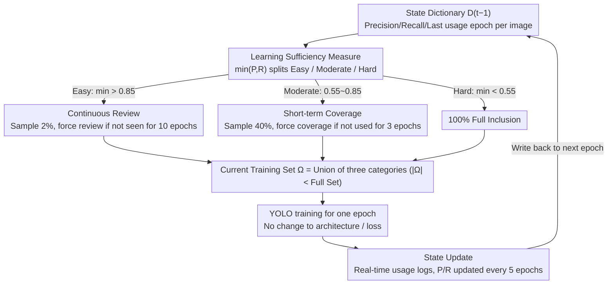

# Does YOLO Really Need to See Every Training Image in Every Epoch?

**Conference**: CVPR 2026  
**arXiv**: [2603.17684](https://arxiv.org/abs/2603.17684)  
**Code**: None  
**Area**: Object Detection  
**Keywords**: YOLO, training acceleration, adaptive sampling, anti-forgetting, data-efficient learning

## TL;DR

Ours proposes the Anti-Forgetting Sampling Strategy (AFSS), which dynamically decides which training images to participate in training and which can be skipped based on the learning sufficiency ($\min(\text{Precision, Recall})$) of each image. This achieves a training acceleration of over 1.43× for the YOLO series detectors while maintaining or even improving detection accuracy.

## Background & Motivation

The YOLO series is renowned for its extremely fast inference speed (YOLO11s reaching 200 FPS), but its training is surprisingly time-consuming:
- Training YOLO11s on COCO requires 43.9 hours (on dual RTX 4090), whereas Faster R-CNN requires only 6.5 hours on the same hardware.
- The reason lies in YOLO's **full-coverage training paradigm**: it traverses the entire training set in every epoch, processing every image hundreds of times.
- Once the model has sufficiently learned certain images, continuing to process them at the same frequency yields diminishing returns.

**Core Problem**: Does YOLO really need to see every training image in every epoch? If not, can training be accelerated by dynamically selecting "what to see" and "when to see"?

Limitations of Prior Work:
- **Curriculum Learning**: Fixed order from easy to hard; insufficient learning of difficult samples.
- **Data Pruning**: Irreversible deletion leads to forgetting and bias.
- **Dataset Distillation**: Synthetic data lacks real-world diversity.

## Method

### Overall Architecture

AFSS seeks to answer a counter-intuitive question: since the model has already learned some images well, why continue feeding them every epoch? The approach installs a "hierarchical gate" on the training set. Before each epoch starts, AFSS uses the state dictionary from the previous round to evaluate the learning sufficiency of each image, partitioning the full set into Easy, Moderate, and Hard categories. It then determines "which and how much to see" based on these categories: Easy samples only 2% for periodic review, Moderate samples 40% to ensure short-term coverage, and Hard samples 100% to ensure thorough learning. After training an epoch, the latest precision, recall, and usage records for each image are written back to the state dictionary for the next epoch. The entire process does not modify the model architecture or loss functions, acting only as a filter before data enters the network, making it plug-and-play for any YOLO variant.

### Key Designs

**1. Learning Sufficiency Measure: Using the bottleneck of Precision and Recall to determine mastery**

To categorize images, a metric is needed to score each image. AFSS defines the learning sufficiency of an image $\mathbf{I}_i$ as the minimum of its current detection precision and recall:

$$\text{Learning Sufficiency}(\mathbf{I}_i) = \min(P_i, R_i)$$

The $\min$ operator is chosen over averaging or F1 because if either classification or localization is unreliable, the image is not yet mastered. Focusing on the bottleneck dimension prevents images with "high precision but low recall" from being misjudged as easy. Based on this, the dataset is divided into three tiers: $\min(P_i,R_i) > 0.85$ is Easy (confidently processed), $0.55 \le \min(P_i,R_i) \le 0.85$ is Moderate (partially stable, needs refinement), and $< 0.55$ is Hard (challenging due to occlusions, small objects, etc.). The paper compares metrics like loss, gradient, and F1, finding $\min(P,R)$ yields the best accuracy and acceleration (see Table 5).

**2. Continuous Review: Periodically rehashing neglected Easy images to prevent forgetting**

Easy images are only sampled at 2% per epoch, risking being forgotten if left aside too long. Continuous Review mitigates this via two-stage sampling. The first part is the mandatory review set $\mathcal{A}_f'$, which selects $E_1$ images from Easy samples not seen for more than 10 epochs. The second part is the random diversity set $\mathcal{A}_r$, which randomly samples $E_2$ images from the remaining Easy pool. They are constrained by $E_1 + E_2 = 0.02 \times |\mathcal{D}_{t-1}^1|$ and $E_1 \le 0.5(E_1+E_2)$. Ablations show a 10-epoch interval is optimal: too short (5) wastes computation, while too long (20) triggers forgetting, dropping AP to 44.8.

**3. Short-term Coverage: Ensuring every Moderate image is scanned within 3 epochs**

Moderate images are those "nearly there." They cannot be skipped as aggressively as Easy ones but do not require every-epoch attention. AFSS samples 40% per epoch but ensures no image is absent for more than 3 consecutive epochs. This is implemented via a mandatory coverage set $\mathcal{B}_f$:

$$\mathcal{B}_f = \{(\mathbf{I}_i, P_i, R_i, ep_i) \in \mathcal{D}_{t-1}^2 \mid t - 1 - ep_i \geq 3\}$$

The remaining slots are filled by a random supplementary set $\mathcal{B}_r$. This reduces Moderate processing frequency while maintaining a "short-term full coverage" floor. If the interval is extended to 5, AP drops to 44.2.

**4. State Update: Efficiently maintaining the state dictionary**

All designs rely on a state dictionary $\mathcal{D}_t$ storing precision, recall, and the last used epoch. Updating this every epoch with full-set inference would consume all saved training time. AFSS compromises: usage records are updated in real-time at near-zero cost, while $P_i$ and $R_i$ are refreshed only every 5 epochs. This "slightly outdated but sufficient" categorization significantly reduces evaluation overhead. Removing State Update in ablations drops the speedup from 1.54× to 1.26× (Table 4). The final training set per epoch is $\Omega = (\mathcal{A}_f' \cup \mathcal{A}_r) \cup (\mathcal{B}_f \cup \mathcal{B}_r) \cup \mathcal{D}_{t-1}^3$, where $|\Omega| < K$ (full set size).

### A Complete Example

Consider a street view image $\mathbf{I}_i$ with an occluded small object. At epoch 30, $P_i=0.6, R_i=0.4$, so $\min=0.4 < 0.55$. It is classified as **Hard** and participates 100% in subsequent epochs. After more training, at a state refresh epoch, it reaches $P_i=0.8, R_i=0.7$ ($\min=0.7$), falling into **Moderate**. It is now no longer used every epoch but caught by short-term coverage every 3 epochs. Eventually, as it is fully learned with $\min > 0.85$, it enters **Easy**, where it is mostly ignored unless summoned by the mandatory review set $\mathcal{A}_f'$ after 10 epochs of absence. This transition from "always seen" to "occasionally reviewed" across the entire dataset provides the 1.43×–1.68× training speedup.

### Loss & Training

AFSS is an **architecture-agnostic** sampling strategy. It does not modify YOLO loss functions or structures. It is implemented on the Ultralytics YOLO framework: COCO for 600 epochs, VOC/DOTA/DIOR-R for 300 epochs, default batch size 64, resolution 640×640.

## Key Experimental Results

### Main Results

**Table 1: Training Acceleration on MS COCO 2017 + PASCAL VOC 2007**

| Model | COCO AP | Speedup | VOC mAP | Speedup |
|------|---------|--------|---------|--------|
| YOLO11s | 47.0 | — | 81.7 | — |
| YOLO11s + AFSS | **47.2** | **1.54×** | **81.8** | **1.64×** |
| YOLO12x | 55.2 | — | 86.2 | — |
| YOLO12x + AFSS | **55.4** | **1.68×** | **86.4** | **1.69×** |

**Table 2: Remote Sensing Detection DOTA-v1.0 + DIOR-R**

| Model | DOTA mAP | Speedup | DIOR-R mAP | Speedup |
|------|----------|--------|-----------|--------|
| YOLO11x-OBB | 81.3 | — | 83.6 | — |
| YOLO11x-OBB + AFSS | **81.4** | **1.69×** | **83.7** | **1.70×** |

Consistently effective across all YOLOv8/v10/11/12 scales (n/s/m/l/x).

### Ablation Study

**Table 3: Comparison with other Training Strategies (YOLO11s on COCO)**

| Method | AP | Speedup |
|------|-----|--------|
| Curriculum Learning | 43.7 | 1.35× |
| Self-paced Learning | 44.5 | 1.30× |
| Data Pruning | 40.5 | 1.38× |
| Data Distillation | 35.6 | 1.50× |
| **AFSS** | **47.2** | **1.54×** |

**Table 4: Module Contribution Ablation**

| LSM | CR | STC | SU | AP | Speedup |
|-----|----|----|-----|------|--------|
| ✓ | | | | 44.8 | 1.45× |
| ✓ | ✓ | | | 45.5 | 1.34× |
| ✓ | | ✓ | | 46.6 | 1.31× |
| ✓ | ✓ | ✓ | | 47.2 | 1.26× |
| ✓ | ✓ | ✓ | ✓ | **47.2** | **1.54×** |

State Update (SU) is crucial for speedup.

**Table 5: Comparison of Learning Sufficiency Measures**

| Measure | AP | Speedup |
|------|-----|--------|
| Loss-based | 46.0 | 1.52× |
| Gradient-based | 46.9 | 1.45× |
| F1 score | 46.6 | 1.51× |
| **$\min(P, R)$** | **47.2** | **1.54×** |

### Key Findings

1. **Larger models yield more significant speedup**: From n (1.43×) to x (1.68×), larger models have stronger learning capabilities, making more images "Easy" faster.
2. **Continuous Review interval of 10 epochs is optimal**: Too short (5) wastes computation; too long (20) leads to forgetting (AP drops to 44.8).
3. **Short-term Coverage interval of 3 epochs is optimal**: AP drops to 44.2 at interval 5.
4. **State Update interval of 5 epochs is optimal**: Per-epoch updates incur high overhead (1.26× speedup), while 15-epoch updates lead to outdated information.
5. The number of Hard images decreases over time while Easy/Moderate increases, reflecting model learning progress.

## Highlights & Insights

1. **Deep Insight**: Reveals the contradiction between YOLO's "look once" inference philosophy and its "look repeatedly" training paradigm.
2. **Simple and Practical Design**: No modification to architecture or loss; pure data sampling strategy that is plug-and-play.
3. **Refined Anti-Forgetting Mechanism**: Tiered sampling + mandatory review + short-term coverage balances acceleration and retention.
4. **Exceptional Experimental Thoroughness**: Covers 4 YOLO versions (v8/v10/11/12) across 5 scales (n/s/m/l/x) and 4 datasets.

## Limitations & Future Work

1. Learning sufficiency evaluation requires extra inference (though only every 5 epochs), which might be a bottleneck for extremely large datasets.
2. Thresholds (0.85/0.55) and sampling ratios (2%/40%/100%) are manually set and not adaptive.
3. Only validated on the YOLO series; applicability to Transformer-based detectors like DETR is unknown.
4. Image correlation and complementarity (e.g., scene diversity) are not considered.

## Related Work & Insights

- **Curriculum Learning/Self-paced Learning**: Fixed easy-to-hard order leads to insufficient learning of Hard samples; AFSS always retains Hard samples.
- **Data Pruning**: Static irreversible deletion causes forgetting; AFSS is dynamic and reversible.
- **Dataset Distillation**: Synthetic data lacks diversity; AFSS uses real data subsets.
- The concept of AFSS can be generalized to other long-duration training tasks like segmentation and pose estimation.

## Rating

- **Novelty**: ★★★★☆ — Insightful problem identification and effective design.
- **Technical Depth**: ★★★☆☆ — Method is engineering-oriented with limited theoretical depth.
- **Experimental Thoroughness**: ★★★★★ — Extremely broad coverage and detailed ablations.
- **Writing Quality**: ★★★★★ — Engaging title, smooth narrative, and intuitive visuals.

<!-- RELATED:START -->

## Related Papers

- [\[CVPR 2026\] See What We Cannot See: A Geo-guided Reasoning Benchmark for Object Counting under Adverse Earth Observation Conditions](see_what_we_cannot_see_a_geo-guided_reasoning_benchmark_for_object_counting_unde.md)
- [\[CVPR 2026\] YOLO-Master: MOE-Accelerated with Specialized Transformers for Enhanced Real-time Detection](yolo-master_moe-accelerated_with_specialized_transformers_for_enhanced_real-time.md)
- [\[CVPR 2026\] AKCMamba-YOLO: Selective State Space Models For Real-Time Object Detection](akcmamba-yolo_selective_state_space_models_for_real-time_object_detection.md)
- [\[ICML 2025\] When Every Millisecond Counts: Real-Time Anomaly Detection via the Multimodal Asynchronous Hybrid Network](../../ICML2025/object_detection/when_every_millisecond_counts_real-time_anomaly_detection_via_the_multimodal_asy.md)
- [\[ICCV 2025\] YOLO-Count: Differentiable Object Counting for Text-to-Image Generation](../../ICCV2025/object_detection/yolo-count_differentiable_object_counting_for_text-to-image_generation.md)

<!-- RELATED:END -->
