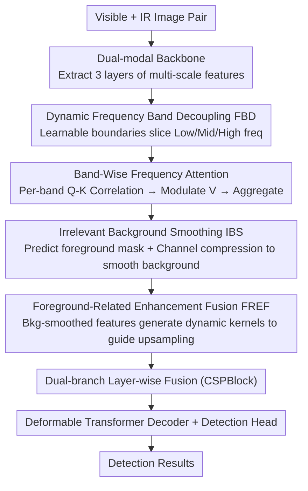

# DyFCLT: Dynamic Frequency-Decoupled Cross-Modal Learning Transformer for Multimodal Tiny Object Detection

**Conference**: CVPR 2026  
**Paper**: [CVF Open Access](https://openaccess.thecvf.com/content/CVPR2026/html/Li_DyFCLT_Dynamic_Frequency-Decoupled_Cross-Modal_Learning_Transformer_for_Multimodal_Tiny_Object_CVPR_2026_paper.html)  
**Code**: Not public  
**Area**: Multimodal Object Detection  
**Keywords**: RGBT Tiny Object Detection, Frequency Domain Learning, Cross-Modal Attention, Dynamic Frequency Band Decoupling, Noise Suppression  

## TL;DR
For Visible-Infrared (RGBT) tiny object detection, DyFCLT first decouples cross-modal features into low/mid/high-frequency sub-bands using learnable dynamic frequency bands, performs Band-Wise Frequency Cross-modal Attention (DFCA) within each sub-band, and utilizes a foreground mask-guided Selective Smoothing and Enhancement (SSE) module to suppress background noise and enhance foreground details. It achieves SOTA AP on two RGBT tiny object benchmarks (48.2 AP on RGBT-Tiny, +9.5 over the previous best multimodal method).

## Background & Motivation
**Background**: Tiny Object Detection (TOD) is critical in UAV remote sensing, security, and disaster rescue. However, relying solely on visible light (RGB) results in weak representations under low light or occlusion. Thus, RGBT (Visible + Infrared) multimodal detection has become a research hotspot. Simultaneously, frequency domain enhancement (amplifying target responses in the spectrum) is becoming popular since tiny objects are rich in high-frequency signals.

**Limitations of Prior Work**: Existing frequency-domain methods are mostly implemented for single-modality visible light and fail to utilize complementary frequency cues from cross-modalities. A few works introducing frequency domains to RGBT rely on an overly simple assumption—that infrared images are primarily low-frequency and RGB images are high-frequency—allocating frequency bands based on this fixed prior. This binary assumption lacks systematic analysis of the frequency distribution of objects at different scales across modalities and may be invalid.

**Key Challenge**: The authors conducted a frequency characteristic analysis on RGBT-Tiny (using radial frequency decomposition to slice normalized spectra into low/mid/high segments and calculating energy ratios). They discovered a counter-intuitive fact—**as target size decreases, the proportion of mid-to-high frequency energy increases in both RGB and infrared modalities**. Even if infrared is dominated by low frequencies overall, tiny objects in infrared still contain rich information across multiple frequency bands. This indicates that fixed "Infrared = Low Poly" partitioning discards key cross-modal frequency complementary cues. Furthermore, fine-grained frequency mining has side effects: directly enhancing frequency responses in complex environments (occlusion, background clutter) amplifies background noise, harming detection.

**Goal**: In RGBT tiny object scenarios, (1) adaptively decouple cross-modal features by frequency bands and perform fine-grained complementary fusion within each band; (2) simultaneously suppress background noise introduced by frequency enhancement and highlight the foreground.

**Core Idea**: A Transformer (DyFCLT) replaces "fixed band priors" with "learnable dynamic frequency band decoupling + band-wise cross-modal attention," coupled with a refinement module that "selects masks—smooths background—guides upsampling to enhance foreground," allowing frequency enhancement and noise suppression to work synergistically.

## Method

### Overall Architecture
DyFCLT is a dual-branch (RGB branch + IR branch) RGBT detector built on an RT-DETR-style detection framework. Given a pair of visible $I_{vis}$ and infrared $I_{ir}$ images, modality-specific backbones (ResNet50) extract $L=3$ layers of multi-scale features $\{F^l_{vis}\}$ and $\{F^l_{ir}\}$. Then, two collaborative components of DyFCLT emerge: **DFCA** (Dynamic Frequency-Decoupled Cross-Modal Attention) performs cross-modal frequency interaction at each layer to obtain features $\tilde F^l_{ir}$ rich in complementary cues; **SSE** (Selective Smoothing and Enhancement) suppresses noise and enhances the foreground during multi-scale fusion. After processing each layer for both modalities, they are fused layer-by-layer, concatenated, flattened, and fed into a Transformer decoder with deformable attention and detection heads. Unless otherwise specified, the infrared branch is used as an example (RGB is symmetrical).

The entire workflow follows a two-step "Cross-modal feature **enrichment** (DFCA mining frequency cues) → **refinement** (SSE noise suppression/foreground enhancement)" process.

Where FBD + Band-Wise Attention constitute **DFCA**, and IBS + FREF constitute **SSE**.

### Key Designs

**1. Dynamic Frequency Band Decoupling (FBD): Replacing "IR = Low Frequency" priors with learnable boundaries**

Addressing the issue where fixed frequency priors lose 정보 from tiny targets across bands, FBD adaptively partitions each feature into multiple sub-bands based on radial frequency. After performing FFT on the $l$-th layer feature, a binary mask $M_b$ isolates the $b$-th sub-band radially: $F^l_{m,b} = M_b \odot \mathcal{F}(F^l_m)$, $m\in\{q,k,v\}$, where the mask is defined as:

$$M_b(u,v) = \begin{cases} 1, & k_b \le \sqrt{u^2+v^2} < k_{b+1} \\ 0, & \text{otherwise} \end{cases}$$

$\sqrt{u^2+v^2}$ is the radial distance from the frequency component to the origin in the 2D Fourier domain. Crucially, **band boundaries $\{k_b\}$ are learnable parameters** rather than fixed constants. Internal boundaries are parameterized as cumulative positive increments (ensuring bands are monotonic and non-overlapping) and initialized with an octave-based scheme (for $B=3$, initialized to $\{0,\tfrac18,\tfrac14,\tfrac12\}$). During training, boundaries drift adaptively to match the true cross-modal frequency distribution of targets. Normalizing frequency range $[0,\tfrac12]$ per Nyquist theorem, $k_0$ and $k_B$ are fixed at 0 and $\tfrac12$. Frequency analysis suggests $B=3$ (Low/Mid/High). Ablations show learnable bands significantly outperform static ones (46.5 → 48.2 AP) and no partitioning ($B=1$, 46.1 AP).

**2. Band-Wise Frequency Attention: Cross-modal correlation and modulation within clean sub-bands**

DFCA takes query from visible and key/value from infrared (each processed via 1×1 point-wise + 3×3 depth-wise convolution to generate $F^l_q, F^l_k, F^l_v$). After FBD splits all three into sub-bands, **cross-modal interaction occurs independently within each sub-band**. First, the cross-modal correlation weight for each band is calculated in the frequency domain: $A^l_b = \mathcal{F}^{-1}(F^l_{q,b} \odot \overline{F^l_{k,b}})$ (frequency-domain multiplication with complex conjugate then inverse FFT, equivalent to spatial correlation). Then, a 3×3 convolution + sigmoid modulates the spatial response of weights to multiply the value: $R^l_b = \sigma(\text{Conv}_{3\times3}(A^l_b)) \odot \mathcal{F}^{-1}(F^l_{v,b})$. Finally, all sub-bands are aggregated, layer normalized, and linearly projected to obtain fused features $\tilde F^l_{ir} = \text{Proj}(\text{LN}(\sum_b R^l_b))$. The advantage is that "band-wise interaction" prevents cross-band interference—ablation shows decoupling only the query leads to performance drops (frequency leakage prevents learning stable correspondences), whereas decoupling Q, K, and V together achieves optimal results (48.2 AP).

**3. Irrelevant Background Smoothing (IBS): Suppressing noise before enhancement to avoid amplification**

Mining fine frequency information has the side effect of amplifying background noise. IBS addresses this by predicting a **binary foreground mask** $M$ from the DFCA output $\tilde F^l_{ir}$ (supervised by focal tversky loss during training, which is more suited for extreme foreground-background imbalance in TOD). Masking yields foreground $F^l_{fg}=M\odot\tilde F^l_{ir}$ and background $F^l_{bg}=(1-M)\odot\tilde F^l_{ir}$ features. For the background, two sequential 3×3 convolutions **compress then restore channel dimensions** (compression ratio $r$): $\hat F^l_{bg}=\text{Conv}^C_{3\times3}(\text{Conv}^{C/r}_{3\times3}(F^l_{bg}))$. This channel bottleneck spatially smooths high-frequency clutter in the background. Finally, the smoothed background is added back to the foreground: $F^l_{bgs}=F^l_{fg}+\hat F^l_{bg}$. This implements "foreground retention, background smoothing" rather than crude deletion. Adding SSE alone increases tiny object $\text{AP}^s_t$ by 3.1 points.

**4. Foreground-Related Enhancement Fusion (FREF): Using denoised features to generate dynamic kernels for guided upsampling**

FREF addresses the loss of tiny object details in low-resolution high-level semantic features. It uses the denoised $F^l_{bgs}$ from IBS to **guide** the upsampling of the next-level infrared feature $\tilde F^{l+1}_{ir}$. First, a convolution predicts local filtering kernels $V^l=\text{Conv}_{3\times3}(F^l_{bgs})$ for each spatial location. Softmax normalization over the neighborhood yields position-adaptive dynamic kernels $W^l$ (which emphasize foreground-related high-frequency structures). After pixel-unshuffle rearrangement to align upsampling resolution and splitting into 4 groups, these act as spatially varying kernels to modulate corresponding regions of $\tilde F^{l+1}_{ir}$. A pixel-shuffle restores resolution to obtain the guided upsampling result $Y^{l+1}_{guided}$. This is added to standard bilinear upsampling $\hat Y^{l+1}=Y^{l+1}_{guided}+\text{Upsample}(\tilde F^{l+1}_{ir})$ and concatenated with $F^l_{bgs}$ through a CSPBlock. Removing FREF (leaving only IBS) drops 0.8 AP / 1.2 $\text{AP}^s_t$, proving guided upsampling recovers critical tiny object details.

> ⚠️ DFCA and SSE are synergistic: DFCA "enriches" (extracting multi-band cross-modal complementary cues), while SSE "refines" (suppressing noise from enrichment and enhancing foreground).

### Loss & Training
Backbones use ImageNet pre-trained ResNet50 (dual-branch). Feature layers $L=3$, DFCA bands $B=3$. IBS mask supervision uses focal tversky loss. Data augmentation includes basic random resize/crop/flip. RGBT-Tiny and RGBTDronePerson are trained for 20 epochs, FLIR for 50 epochs. Learning rate 0.00025 on a single A100. The baseline is RT-DETR with an additional modality branch.

## Key Experimental Results

### Main Results
Three benchmarks: RGBT-Tiny (93k frames, >81% targets <16×16), RGBTDronePerson (98% targets <20 pixels), and FLIR (verifying generalization on regular scale targets). Evaluation follows COCO protocols.

| Dataset | Metric | DyFCLT | Prev. SOTA | Gain |
|--------|------|--------|----------|------|
| RGBT-Tiny | AP | **48.2** | 43.6 (DQ-DETR, single-modal) | +4.6 |
| RGBT-Tiny | AP (vs multi) | **48.2** | 38.7 (M2D-LIF) | +9.5 |
| RGBT-Tiny | AP₅₀ | **69.1** | 54.9 (M2D-LIF) | +14.2 |
| RGBT-Tiny | AR | **63.2** | 60.8 (DQ-DETR) | +2.4 |
| RGBTDronePerson | AP₅₀ | **61.0** | 45.5 (COXNet) | +15.5 |
| RGBTDronePerson | AP₅₀ᵗ (tiny) | **62.4** | 47.1 (COXNet) | +15.3 |
| FLIR | AP₅₀ / AP | **84.1 / 45.0** | 82.9 / 44.8 | +1.2 / +0.2 |

On RGBT-Tiny, DyFCLT achieves the best results across tiny, extremely small, and large targets, with competitive small/medium results (61.5 $\text{AP}^s_s$, 49.1 $\text{AP}^s_m$). Performance on FLIR remains leading, showing generalization beyond tiny objects. Parameter count is 85.5M, moderate compared to RSDet (386M) or DiffusionDet (151M).

### Ablation Study
On RGBT-Tiny, progressively adding modules (baseline 45.4 AP):

| Configuration | AP | AP₅₀ | APₜˢ | Description |
|------|-----|------|------|------|
| Baseline | 45.4 | 65.9 | 36.6 | RT-DETR + modality branch |
| + DFCA | 46.8 | 67.5 | 37.8 | Add band-wise attention +1.4 AP |
| + SSE (IBS+FREF) | 46.9 | 67.4 | 39.7 | Add smoothing/enhancement, tiny +3.1 |
| DFCA + SSE (IBS only) | 47.4 | 68.2 | 40.1 | Without FREF |
| **Full (DFCA+SSE)** | **48.2** | **69.1** | **41.3** | Complete model |

Ablation on band decoupling targets (which to decouple Q/K/V):

| Decoupled Target | AP | AP₅₀ | APₜˢ | Description |
|----------|-----|------|------|------|
| None | 46.1 | 66.5 | 37.5 | — |
| Query Only | 45.2 | 66.0 | 37.3 | Performance drop (Leakage) |
| Q & K | 47.1 | 67.8 | 39.3 | Performance gains |
| Q & K & V | **48.2** | **69.1** | **41.3** | Full decoupling is best |

Band count/type ablation: $B=3$ (learnable) is optimal 48.2 AP; $B=1$ (none) 46.1, $B=2$ 46.4, $B=4$ drops to 47.0. $B=3$ static is only 46.5—proving the value of "adaptive bands."

### Key Findings
- **Learnable bands are the core gain source**: With $B=3$, learnable is 1.7 AP higher than static. Bands are not "the more the better" ($B=4$ drops), suggesting boundaries must match the target's true frequency distribution rather than just quantity.
- **Decoupling only the Query hurts performance** (45.2 < 46.1 none): Isolating Q introduces frequency leakage; Q, K, and V must be decoupled together for clean band-wise interaction.
- **DFCA and SSE exhibit strong synergy**: SSE contributes +3.1 to tiny object $\text{AP}^s_t$ individually, but gains more when built on DFCA—confirming that "enriching with frequency cues then suppressing noise" is superior to either task separately. Heatmap visualizations show suppressed background noise and cleaner responses for dense tiny objects.

## Highlights & Insights
- **Overturning fixed priors with data**: Empirical frequency analysis revealed "infrared tiny objects are rich in mid-high frequencies," refuting the old "IR=Low/RGB=High" assumption. This observation directly inspired the "learnable dynamic frequency band" design.
- **Frequency correlation via FFT dot product + Conjugate**: $A^l_b=\mathcal{F}^{-1}(F_q\odot\overline{F_k})$ moves spatial correlation to the frequency domain. Implementing this band-wise avoids cross-band interference, a transferable idea for any multi-modal or super-resolution task requiring fine-grained frequency interaction.
- **"Select mask—smooth background—guide upsampling" is a clean denoising-enhancement chain**: Rather than discarding the background, it smooths it via channel compression and uses denoised features to generate dynamic kernels for guiding high-level feature upsampling. This integrates noise suppression and detail enhancement into a coherent pipeline.

## Limitations & Future Work
- **Computational overhead of FFT/IFFT + Band-wise Attention**: Inference speed/FLOPs are not reported. Running frequency attention for $B$ sub-bands plus mask prediction in IBS raises real-time feasibility questions (⚠️ no latency data provided).
- **Dependency on RGBT registration**: The method assumes modalities are aligned (FLIR aligned version used). Robustness to unaligned/weakly aligned real-world scenarios is unverified.
- **Mask supervision requires foreground labels**: IBS binary masks rely on focal tversky loss, indirectly depending on foreground regions derived from bounding boxes. The impact of mask quality under extreme occlusion is not analyzed.
- **Fixed band count $B=3$**: While boundaries are adaptive, the number of sub-bands $B$ remains a hyperparameter coupled with target scale distribution; whether $B$ needs tuning for other datasets is not discussed.

## Related Work & Insights
- **vs. Fixed-band RGBT methods (e.g., FD2Net, RSDet)**: These follow the "IR-Low/RGB-High" prior for frequency fusion. This work uses learnable bands and frequency analysis to refute that prior, achieving 84.1 AP₅₀ on FLIR vs. FD2Net's 82.9.
- **vs. Single-modal frequency TOD (e.g., HS-FPN)**: HS-FPN only performs frequency enhancement in visible light. This work extends frequency learning to cross-modal, band-wise interaction, achieving 48.2 AP on RGBT-Tiny vs. HS-FPN's 35.8.
- **vs. Other RGBT TOD methods (QFDet/COXNet/IM-CMDet)**: These rely on label assignment, multi-scale alignment, or difference fusion. This work approaches from a frequency perspective with noise suppression, outperforming COXNet (45.5) on RGBTDronePerson by 15.5 points (61.0 AP₅₀).

## Rating
- Novelty: ⭐⭐⭐⭐⭐ Overturns RGBT fixed-band priors with frequency analysis; learnable bands + band-wise attention is a novel perspective.
- Experimental Thoroughness: ⭐⭐⭐⭐ Three benchmarks + extensive ablations (bands/targets), though lacks speed/FLOPs and unaligned robustness analysis.
- Writing Quality: ⭐⭐⭐⭐ Analysis-driven motivation, complete formulas, and clear module naming.
- Value: ⭐⭐⭐⭐ Massive gains on RGBT TOD; the band-wise cross-modal interaction idea is highly transferable.

<!-- RELATED:START -->

## Related Papers

- [\[CVPR 2026\] Incremental Object Detection via Future-Aware Decoupled Cross-Head Distillation](incremental_object_detection_via_future-aware_decoupled_cross-head_distillation.md)
- [\[CVPR 2026\] Thermal-Det: Language-Guided Cross-Modal Distillation for Open-Vocabulary Thermal Object Detection](thermal-det_language-guided_cross-modal_distillation_for_open-vocabulary_thermal.md)
- [\[CVPR 2026\] PaQ-DETR: Learning Pattern and Quality-Aware Dynamic Queries for Object Detection](paq-detr_learning_pattern_and_quality-aware_dynamic_queries_for_object_detection.md)
- [\[CVPR 2026\] Balanced Hierarchical Contrastive Learning with Decoupled Queries for Fine-grained Object Detection in Remote Sensing Images](balanced_hierarchical_contrastive_learning_with_decoupled_queries_for_fine-grain.md)
- [\[CVPR 2026\] Tri-Modal Fusion Transformers for UAV-based Object Detection](tri-modal_fusion_transformers_for_uav-based_object_detection.md)

<!-- RELATED:END -->
