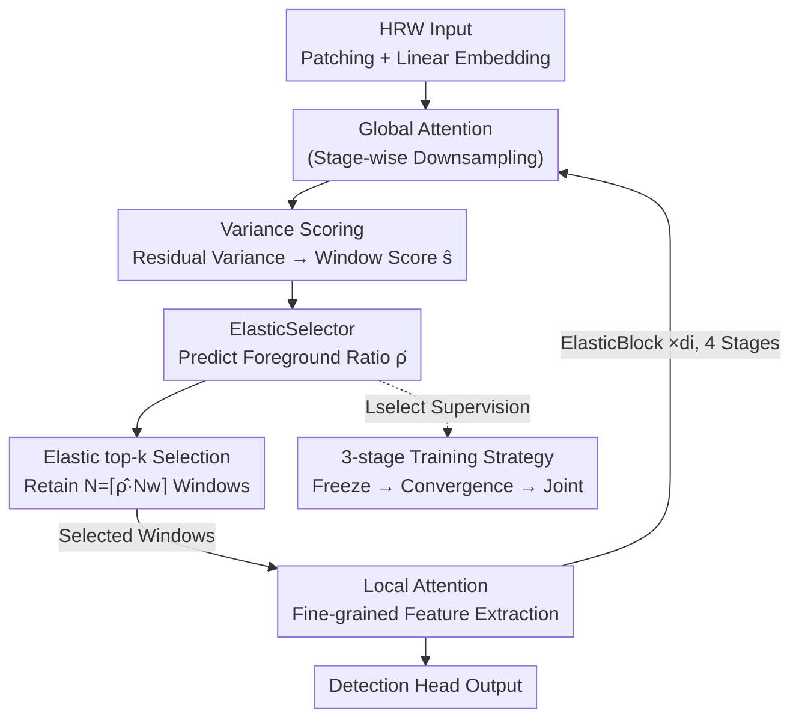

# ElasticFormer: Detecting Objects in HRW Shots via Elastic Computing Vision Transformer

**Conference**: CVPR 2026  
**Paper**: [CVF Open Access](https://openaccess.thecvf.com/content/CVPR2026/html/Li_ElasticFormer_Detecting_Objects_in_HRW_Shots_via_Elastic_Computing_Vision_CVPR_2026_paper.html)  
**Code**: None  
**Area**: Object Detection  
**Keywords**: High-resolution wide-field detection, Sparse ViT backbone, Adaptive sparsity rate, Foreground ratio prediction, Weakly supervised detection  

## TL;DR
ElasticFormer equips a sparse ViT backbone with a lightweight module called ElasticSelector, allowing it to dynamically determine the number of windows retained for local attention based on the "foreground ratio" of the image during the forward pass. This reduces backbone FLOPs by 80% on PANDA gigapixel detection while simultaneously improving AP50.

## Background & Motivation
**Background**: High-Resolution Wide-field (HRW) detection—finding targets in gigapixel-level images captured by UAVs, satellites, or panoramic cameras—is becoming a focal point. Datasets like PANDA average 25,000×16,000 pixels per image, where traditional detectors (Faster R-CNN, DINO, Deformable DETR, etc.) trained on close-up shots are both slow and inaccurate.

**Limitations of Prior Work**: HRW images present three concurrent challenges. First, the foreground is extremely sparse—regular datasets have >50% foreground coverage, while HRW images often have <15%, with the rest being background like sky or vegetation, causing detectors to waste computation. Second, resolution scales from millions (COCO) to billions (PANDA), leading to polynomial growth in computation for traditional detectors and inference times two orders of magnitude slower, despite requirements for real-time UAV inspection or medical detection. Third, the number of objects fluctuates drastically from a few to dozens within the same dataset, requiring the model to handle both extremes.

**Key Challenge**: Existing sparse backbones (SaccadeDet, SparseFormer) attempt to "only compute informative regions" but employ a **fixed sparsity rate**—for instance, SparseFormer presets a 70% token retention. Fixed ratios waste computation on sparse images (retaining many windows despite few targets) and under-allocate on dense images (discarding clustered targets), failing to match the spatially varying object distributions in HRW scenarios.

**Goal**: To make backbone computation "elastic"—calculating less for sparse images and more for dense ones—and to ensure this judgment is fine-grained across different backbone stages and local regions rather than a fixed global ratio.

**Core Idea**: Utilize a lightweight module to **predict the global foreground ratio $\hat{p}$** based on intermediate features, which then serves as the sparsity rate for top-k window selection. This transforms "how many windows to keep" from a human-defined constant into an adaptive variable driven by input content.

## Method

### Overall Architecture
ElasticFormer is a pyramid-style sparse ViT backbone that follows the Swin-like structure of "patch partitioning → stage-wise downsampling and channel doubling," consisting of 4 stages with depths [2, 2, 6, 2]. The input image is first split into $\frac{H}{4}\times\frac{W}{4}\times48$ non-overlapping patches and projected into $C$ channels via linear embedding; subsequently, height and width are halved and channels doubled at each stage. Inside each stage, multiple "ElasticBlocks" are stacked, where each ElasticBlock = **Global Attention + Elastic Selection + Local Attention** pair.

The critical "elasticity" occurs before local attention: feature maps from global attention are divided into $w\times w$ windows (the diagram uses $w=3$, totaling 9 windows). A **variance-based scoring module** first scores each window (windows with more foreground have higher variance and higher scores). Then, the **ElasticSelector** predicts the global foreground ratio $\hat{\rho}$, calculates the number of windows to retain $N=\lceil \hat{\rho}\cdot N_w\rceil$, and performs top-k selection. Only the selected windows are passed to local attention for fine-grained feature extraction, while discarded windows are skipped. For the same image, it might select 2 out of 9 windows when sparse and 8 out of 9 when dense, scaling computation with foreground density rather than image size. ElasticSelector is supervised by a specific loss $\mathcal{L}_{\text{select}}$ and works with a 3-stage training strategy even when labels are scarce.

### Key Designs

**1. Variance Scoring: Identifying Target Windows at Zero Cost via "Background is Flatter than Foreground" Prior**

To perform sparse selection, an efficient and reliable way to determine "which windows likely contain objects" is needed. The observation is that backgrounds like sky or roads have more uniform pixel distributions (lower variance), while target regions are rich in texture (higher variance). Instead of a separate prediction head, variance is extracted directly from features. For a feature map $\mathbf{F}$ (shape $B\times H\times W\times C$), a $w\times w$ average pooling is performed and interpolated back to the original size. The residual $\mathbf{R}=\mathbf{F}-\text{Interpolate}(\text{AvgPool}_{w\times w}(\mathbf{F}))$ captures local variance. After window partitioning into $\mathbf{R}_k$, scores are calculated and normalized via softmax:

$$s_k = f_{\text{score}}(\text{Flatten}(\mathbf{R}_k)), \qquad \hat{s}_k = \frac{\exp(s_k)}{\sum_{j=1}^{N_w}\exp(s_j)}$$

This makes window scores positively correlated with variance, providing an ordered sequence for subsequent selection. Ablations comparing this to "small objectness heads" or "gradient density" show that variance scoring reduces single-stage latency from 1.213ms (objectness) to 0.397ms, with a slight improvement in AP50 (0.806 vs 0.803), as it introduces no extra network components and is less sensitive to noise.

**2. ElasticSelector: Converting "Retention Rate" from a Constant to Per-stage Predicted Foreground Ratio**

This is the core innovation addressing the "wasteful on sparse, insufficient on dense" issue of fixed rates. The authors define the foreground ratio as the area of the union of all ground-truth bounding boxes relative to the image area, multiplied by a scaling factor $\alpha\in(0,1)$ (fixed at 0.8). Since the backbone does not need all regions within a box for feature extraction, a smaller ratio forces the model to select more critical windows:

$$\rho = \alpha\cdot\frac{\cup_i \text{BBox}_i}{H\cdot W}$$

ElasticSelector learns to **predict** this $\rho$ from features. Since MLP inputs must be fixed, features are compressed to stage-wise resolutions $[32^2, 16^2, 8^2, 4^2]$ via adaptive average pooling and flattened before being fed into a two-layer lightweight MLP. A Sigmoid ensures the output stays in $[0,1]$: $\hat{\rho}^t = \sigma(f_{\text{pred}}(\mathbf{F}^t_{\text{flat}}))$. The predicted $\hat{\rho}$ acts as the sparsity rate, determining $N=\lceil \hat{\rho}\cdot N_w\rceil$ high-score windows per stage. Each stage predicts and selects independently, ensuring computation varies with spatial foreground density. Remarkably, this module is **backbone-agnostic**—replacing self-attention with convolution results in ElasticNet, proving its applicability to CNNs.

**3. Label-free Loss + 3-stage Training: Learning Foreground Ratios Without Bounding Box Supervision**

As a new module, ElasticSelector requires its own loss. The authors designed $\mathcal{L}_{\text{select}}=(\rho-\hat{\rho})^2+\gamma\cdot\hat{\rho}$, where the first term aligns predictions with the true foreground ratio and the second is an L1 penalty on $\hat{\rho}$ ($\gamma=0.1$) to **actively compress the retention rate** once accuracy is sufficient. The total loss is $\mathcal{L}_{\text{total}}=\mathcal{L}_{\text{bbox}}+\mathcal{L}_{\text{select}}$. The target $\rho$ can come from ground-truth or pseudo-ground-truth bounding boxes, enabling self-supervised training in weakly supervised detection (WSOD).

However, pseudo-labels introduce a "chicken-and-egg" problem: early in training, pseudo-boxes are noisy, providing unreliable density estimates that can hinder the ElasticSelector and the backbone. To address this, a **3-stage training strategy** is introduced: ① Freeze ElasticSelector and force the backbone to use **all** tokens (ignoring $\hat{\rho}$) to ensure backbone convergence; ② Unfreeze ElasticSelector to let it converge on reliable density estimates while $\hat{\rho}$ still does not affect selection; ③ Fully enable $\hat{\rho}$ to let the network autonomous balance computation and accuracy. The 33-epoch schedule balances these phases (Phase 1 being 24 epochs yielded the highest AP50 in experiments).

### Loss & Training
- ElasticSelector Loss: $\mathcal{L}_{\text{select}}=(\rho-\hat{\rho})^2+\gamma\hat{\rho}$, with $\gamma=0.1$; calculated per stage to learn stage-specific feature characteristics.
- Total Loss: $\mathcal{L}_{\text{total}}=\mathcal{L}_{\text{bbox}}+\mathcal{L}_{\text{select}}$.
- 3-stage Strategy: Freeze backbone for full-token training → Unfreeze ElasticSelector for independent convergence (without $\hat{\rho}$ selection) → Joint optimization with $\hat{\rho}$ enabled. Total 33 epochs; Phase 2 is approximately 3 epochs.
- Implementation based on MMDetection with a 36-epoch protocol; inference on 1280×800 crops, where elastic FLOPs are averaged over the test set.

## Key Experimental Results

### Main Results (PANDA Gigapixel Benchmark)
GFLOPs involve the backbone and neck. F/B/O denote Foreground, Background, and Overall. ElasticFormer FLOPs are estimated based on test set averages.

| Detector Combination | Backbone | GFLOPs-O | AP50 | AP_small |
|------|------|------|------|------|
| DINO | Swin-T | 132.84 | 0.606 | 0.367 |
| DINO + SparseFormer | SparseFormer | 75.71 | 0.780 | 0.508 |
| **DINO + ElasticFormer** | **ElasticFormer** | **13.13** | **0.806** | **0.515** |
| Dynamic-Head + SparseFormer | SparseFormer | 64.64 | 0.771 | 0.364 |
| **Dynamic-Head + ElasticFormer** | **ElasticFormer** | **13.49** | **0.782** | **0.409** |
| DINO + ElasticNet (CNN) | ElasticNet | 16.54 | 0.754 | 0.388 |

When paired with DINO, ElasticFormer outperforms SparseFormer by 3.3% AP50 while overall FLOPs are only 13.13 GFLOPs—an 82.7% reduction relative to SparseFormer and 90.2% compared to Swin-T. In background regions, it uses only 8.9% of the computation SparseFormer wastes. The CNN-based ElasticNet remains competitive while saving 87% computation compared to ResNet-50.

### Ablation Study

**Training Strategy (Table 3)**: Window retention rate per stage and AP50.

| Strategy | Supervision | Stage1 | Stage2 | Stage3 | Stage4 | AP50 |
|------|------|------|------|------|------|------|
| 1-phase | GT | 15.11 | 15.32 | 12.79 | 15.73 | 0.791 |
| 1-phase | Pseudo-GT | 14.02 | 14.24 | 9.80 | 12.97 | 0.784 |
| 3-phase | GT | 14.15 | 14.55 | 13.28 | 14.95 | 0.798 |
| **3-phase** | **Pseudo-GT** | 11.31 | 10.41 | 7.56 | 12.09 | **0.806** |

**Joint Ablation of $\alpha$ / $\gamma$ (Table 4, F-ratio = FLOPs-F/FLOPs-O)**:

| $\alpha$ | $\gamma$ | AP50 | GFLOPs-O | F-ratio (%) |
|------|------|------|------|------|
| 1.0 | 0.1 | 0.802 | 14.98 | 45.7 |
| **0.8** | **0.1** | **0.806** | 13.13 | 53.5 |
| 0.8 | 0.3 | 0.795 | 10.28 | 53.3 |
| 0.6 | 0.1 | 0.799 | 11.52 | 55.2 |

### Key Findings
- **3-phase is superior to 1-phase**, proving that $\hat{\rho}$ noise in early stages is harmful and requires stable backbone and selector training. Interestingly, **Pseudo-GT slightly outperforms GT** (0.806 vs 0.798) in the 3-phase setup, potentially due to pseudo-label noise acting as a regularizer during joint optimization.
- **Stage 3 systematically exhibits the lowest retention rate (7.56%)**. Authors speculate this relates to network depth: deeper selection in Stage 3 (depth=6) allows for fewer but more critical window selections that accumulate into total foreground coverage.
- **$\alpha=0.8$ is the sweet spot for AP50**: While smaller $\alpha$ reduces $\rho$ and GFLOPs while increasing F-ratio (more foreground focus), AP50 peaks at 0.8. Higher $\gamma$ saves computation at the cost of AP50, showing an efficiency-accuracy trade-off.
- **Generalization to non-HRW scenarios**: In the WSOD task on PASCAL VOC 2007 (images around $10^5$ pixels), ElasticFormer saves 70% computation vs Swin-T while leading SparseFormer in mAP (50.9) and CorLoc (63.9).

## Highlights & Insights
- **Turning "Sparsity Rate" from a Hyperparameter to a Learnable Image Attribute**: Unlike fixed-rate methods that use a prior constant for foreground density, ElasticFormer predicts the foreground ratio directly. This transition from "human-set threshold" to "data-driven" is a clean conceptual leap with clear geometric interpretability.
- **Variance Scoring as a Zero-cost Trick**: Differentiating foreground/background using the residual `F - Interpolate(AvgPool(F))` as a variance proxy avoids expensive prediction heads and achieves 3x lower latency without accuracy loss.
- **Backbone Agnosticism as a Key Selling Point**: The same ElasticSelector works for both Transformer (ElasticFormer) and CNN (ElasticNet) backbones, demonstrating it is a universal mechanism for density-based compute allocation rather than an architecture-specific trick.
- **3-stage Training Tackles Pseudo-label Cold Start**: The sequence of saturating the backbone with tokens, then stabilizing the selector, and finally joint optimization provides a roadmap for internal modules that control their own host backbone's compute budget.

## Limitations & Future Work
- The mechanism behind the **significantly lower retention rate in Stage 3** remains speculative and lacks deep explanation; why elastic allocation behaves this way in deeper layers remains a black box.
- The definition of foreground ratio depends on box union area, and key coefficients like $\alpha=0.8$ are determined by grid search. Whether these are robust across datasets or require retuning for extreme aspect ratios/densities is not fully explored.
- Evaluation is primarily on PANDA (human-centric gigapixel) and VOC; validation on other HRW modalities like satellite or medical images, or long-tailed distributions, is missing.
- Top-k window selection is inherently a hard selection; if a discarded window contains a tiny object, it will be missed. The risk of adaptive sparsity in safety-sensitive "extremely sparse but critical target" scenarios requires further analysis.

## Related Work & Insights
- **vs SparseFormer**: Both use sparse tokens, but SparseFormer uses a fixed rate (e.g., 0.7), leading to waste in sparse images and insufficiency in dense ones. ElasticFormer predicts foreground ratios per stage, achieving superior results (+3.3% AP50) with lower FLOPs.
- **vs SaccadeDet**: SaccadeDet uses an auxiliary network for proposal prediction, introducing cascading latency and struggling with HRW scale variations. ElasticFormer's variance scoring involves no extra network and minimal latency.
- **vs DynamicDet**: DynamicDet uses coarse-grained routing with dual branches based on prediction difficulty. ElasticFormer performs fine-grained window modulation within the backbone across stages without needing dual branches.

## Rating
- Novelty: ⭐⭐⭐⭐ Replacing fixed sparsity with learnable foreground ratio prediction, paired with variance scoring and label-free loss, is a clean approach that fills the gap in density-based token modulation.
- Experimental Thoroughness: ⭐⭐⭐⭐ Extensive main experiments on PANDA, WSOD generalization, backbone independence, and multiple ablations ($\alpha/\gamma$/scoring/training). Non-human centric HRW modalities were not covered.
- Writing Quality: ⭐⭐⭐ Logic is clear and motives are well-explained, but there are minor typos in English phrasing, and some mechanisms (Stage 3 phenomena) are discussed only briefly.
- Value: ⭐⭐⭐⭐ Achieving 80%+ FLOP reduction with improved accuracy is highly practical for real-time gigapixel detection; elastic computing and variance scoring are highly transferable tricks.

<!-- RELATED:START -->

## Related Papers

- [\[CVPR 2026\] Detecting Unknown Objects via Energy-Based Separation for Open World Object Detection](detecting_unknown_objects_via_energy-based_separation.md)
- [\[CVPR 2026\] VisualAD: Language-Free Zero-Shot Anomaly Detection via Vision Transformer](visualad_language-free_zero-shot_anomaly_detection_via_vision_transformer.md)
- [\[ECCV 2024\] GRA: Detecting Oriented Objects Through Group-Wise Rotating and Attention](../../ECCV2024/object_detection/gra_detecting_oriented_objects_through_group-wise_rotating_and_attention.md)
- [\[CVPR 2025\] Show, Don't Tell: Detecting Novel Objects by Watching Human Videos](../../CVPR2025/object_detection/show_dont_tell_detecting_novel_objects_by_watching_human_videos.md)
- [\[AAAI 2026\] Temporal Object-Aware Vision Transformer for Few-Shot Video Object Detection](../../AAAI2026/object_detection/temporal_object-aware_vision_transformer_for_few-shot_video_object_detection.md)

<!-- RELATED:END -->
