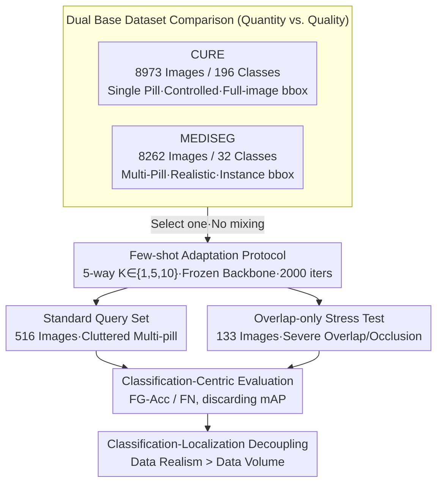

# Evaluating Few-Shot Pill Recognition Under Visual Domain Shift

**Conference**: CVPR 2026  
**arXiv**: [2603.10833](https://arxiv.org/abs/2603.10833)  
**Code**: None (Based on FsDet/Detectron2 framework)  
**Area**: Object Detection / Medical Imaging  
**Keywords**: few-shot object detection, pill recognition, domain shift, deployment readiness, cross-dataset evaluation

## TL;DR
This paper systematically evaluates the generalization of pill recognition under cross-domain few-shot conditions from a deployment perspective. It reveals a decoupling phenomenon where semantic classification saturates at 1-shot while localization and recall drop sharply under overlapping occlusions. Furthermore, it demonstrates that the visual realism of training data is significantly more critical than data volume or the number of shots.

## Background & Motivation

**Background**: Adverse Drug Events (ADEs) are a major source of preventable medical harm, and automated pill recognition systems are highly anticipated. Existing systems are mostly trained and evaluated under controlled conditions (single pill, clean background, uniform lighting), where they perform excellently.

**Limitations of Prior Work**: Actual deployment scenarios differ greatly from controlled environments—pills are stored in dosette boxes with multiple pills overlapping, occluded, reflecting light, and against cluttered backgrounds. Existing few-shot pill recognition research almost exclusively evaluates on in-distribution data (training and testing come from similar visual conditions), which may lead to high reported accuracies that severely overestimate real-world robustness.

**Key Challenge**: Can few-shot learning maintain effectiveness in cross-domain scenarios? Existing evaluation protocols avoid the most critical deployment challenge—the systematic domain shift between training data (controlled single pills) and deployment environments (cluttered multi-pill scenes). Standard mAP metrics also fail to provide fair comparisons under heterogeneous annotation conditions.

**Goal**
   - What is the true generalization capability of few-shot adaptation under cross-dataset domain shift?
   - Which factor more significantly affects few-shot performance: visual realism or the data volume of the base training data?
   - Are semantic classification and localization performance consistent under few-shot and occlusion conditions?
   - Can few-shot fine-tuning serve as a diagnostic tool for deployment readiness?

**Key Insight**: Instead of pursuing architectural innovation, this work designs a rigorous cross-domain evaluation protocol (CURE controlled single pill vs. MEDISEG real multi-pill → new deployment environment) using classification-centric metrics instead of traditional mAP for fair evaluation.

**Core Idea**: Reposition few-shot fine-tuning as a diagnostic tool for deployment readiness, exposing systematic failure modes of classification-localization decoupling through cross-domain and overlap stress tests.

## Method

### Overall Architecture
The paper does not propose a new model but constructs an evaluation setup capable of **exposing real deployment failures**. The backbone is a classic two-stage few-shot detector based on FsDet (Frustratingly Simple Few-Shot Object Detection) / Faster R-CNN. It first trains on a base dataset to obtain general detection capabilities, then fine-tunes on a small number of samples (1/5/10-shot) from the deployment dataset for novel classes.

The key lies in the "input" and "evaluation." For the input, the authors deliberately prepare two base datasets with vastly different visual realism (controlled single pill vs. realistic multi-pill) to isolate the variable of "training data realism." For evaluation, the authors abandon mAP, which can be distorted under heterogeneous annotations, and adopt classification-centric metrics, supplemented by an additional stress test set specifically for overlapping occlusions. The pipeline is: base training on CURE or MEDISEG → fine-tuning with a K-shot support set from the deployment dataset → evaluation on a 516-image multi-pill cluttered query set, followed by an overlap-only stress test on 133 images with severe overlapping.

### Key Designs

**1. Dual Base Dataset Comparison: Disentangling "Data Volume" and "Visual Realism"**

Standard few-shot detection often partitions base/novel classes within a single distribution, failing to measure the impact of the training world differs from the deployment world. This work creates a comparison using two base domains where classes do not overlap with each other or the novel classes: CURE has 8,973 images and 196 classes but features only single pills, controlled lighting, and full-image level bbox annotations ("high volume/variety but simple"); MEDISEG has only 8,262 images and 32 classes but features realistic multi-pill scenes and instance-level bbox annotations ("low volume/variety but visually complex"). This natural "quantity vs. quality" experiment allows the authors to attribute MEDISEG's superior performance in difficult conditions to "visual realism" rather than data scale.

**2. Few-shot Adaptation Protocol: Fixed Budget + Frozen Backbone to Isolate Variables**

To ensure the credibility of the base domain comparison, confounding variables are eliminated. The authors perform 5-way $K$-shot adaptation on the novel deployment dataset, with $K \in \{1, 5, 10\}$. The support sets are sampled from the deployment set, while the query set (516 images) and overlap-only set (133 images) are strictly separated. Fine-tuning is fixed at 2,000 iterations using SGD with momentum 0.9 and lr $=1\times10^{-3}$. The backbone is frozen, with only ROI heads and parts of the RPN (at a limited learning rate) being trainable. Fixed iterations eliminate training duration as a confounder, the frozen backbone preserves general features learned in the base stage, and strict data separation prevents leakage, ensuring observed performance differences stem from the base domain characteristics.

**3. Classification-Centric Metrics: Using FG-Acc and FN to Avoid mAP Distortion**

Since CURE uses full-image bboxes and MEDISEG uses instance bboxes, their IoU matching criteria are inconsistent. Directly comparing AP across labeling strategies is unfair, and AP conflates "misclassification" with "localization error," masking true failure modes. The authors replace the primary metric with Foreground Classification Accuracy (FG-Acc) and False Negative (FN) rate:

$$\text{FG-Acc} = \frac{\text{Correct Foreground Classifications}}{\text{Total Foreground Proposals}}, \qquad \text{FN} = \frac{\text{Missed GT Objects}}{\text{Total GT Objects}}$$

RPN classification loss and total loss are used as auxiliary metrics. FG-Acc measures semantic recognition ("is it identified correctly if localized?"), while FN measures localization/recall ("is it detected at all?"). Decoupling these reveals the phenomenon of successful classification despite localization collapse—a core finding of the study.

**4. Overlap-only Stress Test: Isolating Occlusion Scenarios**

In the standard query set, simple and difficult images are mixed, which might dilute the observation of failures in occlusion scenarios. The authors manually filtered 133 images from the deployment dataset that exhibit significant occlusion or blurry boundaries, providing instance-level bbox and segmentation mask annotations. This independent test set shares the label space with the standard evaluation but alters the scene structure. It isolates the most challenging visual conditions, exposing the vulnerability of models under overlapping. For instance, CURE 1-shot FG-Acc plummeted from 0.989 on the standard set to 0.131 here, a drop that would otherwise be obscured.

### Loss & Training
Base training uses standard Faster R-CNN with a fixed configuration. The few-shot fine-tuning stage employs SGD (momentum 0.9, weight decay $1\times10^{-4}$, lr $1\times10^{-3}$) for 2,000 iterations. The backbone (ResNet + FPN) is frozen, the RPN is partially trainable with a limited learning rate, and the ROI heads are fully fine-tuned, with the classification layer re-initialized for novel classes. No additional data augmentation beyond Detectron2 defaults is used to prevent augmentation from becoming a confounding factor.

## Key Experimental Results

### Main Results: Few-shot Adaptation on Standard Query Set

| Configuration | FG-Classification Acc | False Negative Rate | Class Loss | Total Loss |
|------|-------------|---------|---------|--------|
| CURE 1-shot | 0.989 ± 0.001 | 0.011 | 0.008 | 0.015 |
| CURE 5-shot | 0.981 ± 0.002 | 0.009 | 0.023 | 0.036 |
| CURE 10-shot | 0.977 ± 0.003 | 0.009 | 0.034 | 0.055 |
| MEDISEG 1-shot | 0.994 ± 0.005 | 0.006 | 0.011 | 0.021 |
| MEDISEG 5-shot | 0.990 ± 0.002 | 0.005 | 0.010 | 0.019 |
| MEDISEG 10-shot | 0.983 ± 0.002 | 0.005 | 0.019 | 0.030 |

**Key Findings**: Semantic classification saturates at 1-shot (CURE 0.989, MEDISEG 0.994), with accuracy slightly decreasing as shots increase. MEDISEG base training achieves a 45% lower false negative rate than CURE (0.006 vs 0.011).

### Ablation Study: Overlap-only Stress Test

| Configuration | FG-Classification Acc | False Negative Rate | Class Loss | RPN Loss | Total Loss |
|------|-------------|---------|---------|----------|--------|
| CURE 1-shot | 0.131 | 0.816 | 0.351 | 0.863 | 1.326 |
| CURE 5-shot | 0.372 | 0.465 | 0.421 | 0.224 | 0.844 |
| CURE 10-shot | 0.558 | 0.342 | 0.320 | 0.133 | 0.674 |
| MEDISEG 1-shot | 0.406 | 0.513 | 0.383 | 0.312 | 0.963 |
| MEDISEG 5-shot | 0.625 | 0.246 | 0.279 | 0.182 | 0.680 |
| MEDISEG 10-shot | 0.740 | 0.210 | 0.191 | 0.059 | 0.445 |

### Key Findings

- **Classification vs. Localization Decoupling**: While FG-Acc is near 1.0 in standard evaluation, it crashes to 0.131 (-87%) for CURE 1-shot in overlapping scenes. Semantic recognition remains reliable when localization succeeds, but overlapping causes localization and recall to collapse.
- **Visual Realism > Data Volume**: In the most difficult 1-shot overlap condition, MEDISEG (fewer classes, less data, but realistic) achieves an FG-Acc 3.1 times higher than CURE (more classes, more data, but simple) (0.406 vs 0.131). This advantage is consistent across all shot settings.
- **Diminishing Returns**: The leap from 1→5-shot is massive (MEDISEG overlap FG-Acc from 0.406→0.625, +54%), while the improvement from 5→10-shot significantly slows down (+18%), supporting the practical suggestion that moderate supervision is often sufficient.
- **Reduction in Standard Deviation**: The standard deviation of MEDISEG 1-shot FG-Acc is ±0.005, which drops to ±0.002 at 5-shot (-60%), indicating that additional supervision primarily enhances stability rather than precision.

## Highlights & Insights

- **Few-shot Fine-tuning as a Diagnostic Tool**: This is the most insightful contribution. Rather than viewing few-shot merely as a data-efficient adaptation strategy, the authors use different shot levels to expose the trade-offs between stability and robustness, providing direct guidance for deployment decisions.
- **Clear Revelation of Classification-Localization Decoupling**: By using classification-centric metrics and overlap stress tests, the study quantitatively isolates the failure modes of semantic recognition versus spatial localization. This finding is transferable to all dense/occluded object detection scenarios.
- **Evaluation Protocol Design**: The pragmatic approach to handling heterogeneous labeling—abandoning AP in favor of classification metrics—is worth adopting in cross-dataset evaluations.

## Limitations & Future Work

- **Acknowledged Limitations**: Full-image bboxes in CURE limited the use of localization metrics; the non-standard few-shot benchmark makes direct comparison with other methods difficult; the number of novel classes was limited by annotation costs.
- **Unexplored Architectures**: The study only used FsDet/Faster R-CNN, without testing stronger few-shot detectors (e.g., DeFRCN, FSCE) or different backbones. It is unclear if the observed decoupling is architecture-agnostic.
- **Lack of Solutions**: The paper identifies problems but does not propose mitigation methods. Potential directions include: (1) Occlusion-aware region proposal enhancement; (2) Introducing overlap-aware data augmentation in the few-shot stage; (3) Base+novel hybrid training strategies.
- **Localization Improvement**: Future work could attempt to utilize the instance segmentation masks (already annotated in the paper) for training rather than just evaluation to improve localization in overlapping scenes.

## Related Work & Insights

- **vs. Traditional Few-Shot Detection Benchmarks**: Traditional methods (TFA, FsDet, FSCE, etc.) evaluate on PASCAL VOC/COCO subsets where training and testing are in-distribution. The cross-dataset evaluation introduced here reveals real failure modes masked by in-distribution evaluation.
- **vs. EPillID / CURE Original Works**: These works showed promising results under controlled conditions, but this paper proves those results are unreliable in deployment environments, particularly in overlapping scenes.
- **Insight**: The concept of "few-shot as diagnosis" could be transferred to other safety-critical fields like autonomous driving or industrial inspection—probing model weaknesses with varying shot levels and out-of-distribution data is often more valuable for deployment than chasing SOTA.

## Rating
- Novelty: ⭐⭐⭐ Not an architectural innovation, but the "few-shot as diagnostic tool" perspective is novel, and the evaluation protocol is creative.
- Experimental Thoroughness: ⭐⭐⭐⭐ Rigorous design using two base domain comparisons, standard/overlap dual evaluation, multi-shot settings, and both quantitative and qualitative analysis.
- Writing Quality: ⭐⭐⭐⭐ Clear arguments, complete logical chain from motivation to conclusion, and a step-by-step demonstration of the decoupling phenomenon.
- Value: ⭐⭐⭐⭐ Direct practical significance for medical AI deployment; the findings regarding "realism > volume" and "classification-localization decoupling" have universal reference value.

<!-- RELATED:START -->

## Related Papers

- [\[CVPR 2026\] Remedying Target-Domain Astigmatism for Cross-Domain Few-Shot Object Detection](remedying_target-domain_astigmatism_for_cross-domain_few-shot_object_detection.md)
- [\[CVPR 2026\] UniSpector: Towards Universal Open-set Defect Recognition via Spectral-Contrastive Visual Prompting](unispector_towards_universal_open-set_defect_recognition_via_spectral-contrastiv.md)
- [\[CVPR 2026\] A Closer Look at Cross-Domain Few-Shot Object Detection: Fine-Tuning Matters and Parallel Decoder Helps](a_closer_look_at_cross-domain_few-shot_object_detection_fine-tuning_matters_and_.md)
- [\[CVPR 2026\] Learning Multi-Modal Prototypes for Cross-Domain Few-Shot Object Detection](learning_multi-modal_prototypes_for_cross-domain_few-shot_object_detection.md)
- [\[CVPR 2026\] SubspaceAD: Training-Free Few-Shot Anomaly Detection via Subspace Modeling](subspacead_training-free_few-shot_anomaly_detection_via_subspace_modeling.md)

<!-- RELATED:END -->
