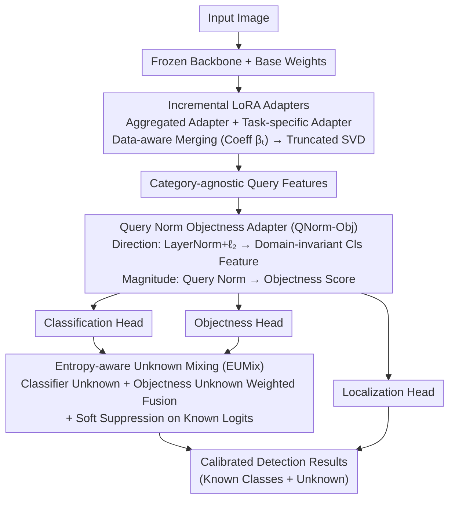

# EW-DETR: Evolving World Object Detection via Incremental Low-Rank DEtection TRansformer

**Conference**: CVPR2026  
**arXiv**: [2602.20985](https://arxiv.org/abs/2602.20985)  
**Code**: To be confirmed  
**Area**: Object Detection  
**Keywords**: Open World Object Detection, Incremental Learning, Domain Adaptation, Unknown Object Detection, LoRA, DETR

## TL;DR

This paper proposes the Evolving World Object Detection (EWOD) paradigm and the EW-DETR framework. By synergizing three modules—Incremental LoRA Adapters, Query Norm Objectness Adapter, and Entropy-aware Unknown Mixing—the framework simultaneously addresses class-incremental learning, domain adaptation, and unknown object detection under no-replay constraints, achieving a 57.24% improvement in the FOGS metric.

## Background & Motivation

**Real-world Deployment Requirements**: Scenarios such as autonomous driving and warehouse robotics require detectors to continuously recognize new object classes (e.g., new vehicle types), adapt to varying environments (day → night → fog), and mark unseen objects as "unknown" to avoid catastrophic failures.

**Limitations of Prior Work**: Open World Object Detection (OWOD) assumes a single static domain and relies on exemplar replay. Domain Incremental Object Detection (DIOD) and Dual Incremental Object Detection (DuIOD) adopt closed-set assumptions, failing to handle unknown objects.

**No-replay Constraint**: Privacy regulations and storage limits make retaining past training data impractical. Existing OWOD methods (ORE, OW-DETR, CAT, PROB, OWOBJ) rely on replay buffers and fail under strict no-replay conditions.

**Coupling of Domain Shift and Forgetting**: The simultaneous evolution of class space and visual domains leads to drastic changes in the feature space. Standard methods either misclassify unknowns as known classes or absorb them into the background class.

**Key Challenge of Data Imbalance**: Significant differences in domain and class distributions across tasks result in highly uneven sample sizes. Simple adapter merging strategies fail to effectively balance stability and plasticity.

**Lack of Unified Metric**: Existing metrics either measure only forgetting (e.g., $\mathcal{F}_{\text{map}}$) or focus solely on unknown detection (U-Recall), failing to comprehensively evaluate the coupled performance of the three EWOD dimensions.

## Method

### Overall Architecture

EW-DETR is based on the DETR family (supporting Deformable DETR and RF-DETR). It freezes the backbone and base weights, attaching two sets of LoRA adapters to the linear layers of the Transformer encoder-decoder. Input images are processed by the frozen backbone and the adapted encoder-decoder to generate category-agnostic query features. These are then reparameterized by the Query Norm Objectness Adapter (QNorm-Obj) and fed into the classification, objectness, and localization heads. Finally, the Entropy-aware Unknown Mixing (EUMix) module fuses the outputs to produce calibrated detection results.

### Key Designs

**1. Incremental LoRA Adapters: Countering Forgetting without Replay**

Under privacy and storage constraints where old data cannot be retained, simple adapter merging fails to balance stability and plasticity. EW-DETR resolves this with dual adapters: an **Aggregated Adapter** $\Delta\mathbf{W}_{\text{agg}}^{t-1}$ acts as a non-trainable buffer accumulating compressed knowledge from all historical tasks; a **Task-specific Adapter** $\Delta\mathbf{W}_{\text{task}}^{t}$ contains trainable parameters capturing current class/domain changes and is reset after task switches. The key is **Data-aware Merging**—calculating a merging coefficient $\beta_t$ based on the ratio of current task samples $N_t$ to historical samples $N_{1:t-1}$. This allows tasks with fewer samples to have a greater influence, preventing them from being overwhelmed.

$$\Delta\mathbf{W}_{\text{merged}}^{t} = (1-\beta_t)\Delta\mathbf{W}_{\text{agg}}^{t-1} + \beta_t\Delta\mathbf{W}_{\text{task}}^{t}$$

Post-merging, a truncated SVD projects the weights back into a low-rank space to maintain parameter efficiency. This mechanism enables anti-forgetting at zero-replay (FSS reaching 98.11) with only millions of trainable parameters.

**2. Query Norm Objectness Adapter: DETR Query Norm as Domain-Robust Objectness**

Domain shifts cause standard methods to misidentify unknowns as knowns or background. EW-DETR exploits the category-agnostic nature of DETR decoder queries to decouple semantics and magnitude. For **Direction**, it applies LayerNorm followed by $\ell_2$ normalization to decoder features to obtain domain-invariant classification features $\mathbf{h}_{\text{norm}}$, combined via a learnable $\alpha_{\text{mix}}$. For **Magnitude**, it leverages the empirical observation that queries matching real objects have larger norms. The scalar norm $\|\mathbf{h}_i\|_2$ is fed into an objectness MLP with temperature scaling to serve as a category-agnostic objectness score. This design requires no auxiliary loss or extra supervision, training implicitly via standard detection losses to produce domain-robust objectness estimates.

**3. Entropy-aware Unknown Mixing (EUMix): Calibrated Unknown Scores**

Neither the classifier nor the objectness score alone is sufficient for robust unknown detection. EUMix fuses evidence from both: **Objectness-driven unknown probability** $p_{\text{obj}}^{\text{unk}}$ increases when the detector perceives an object but is uncertain about known classes; **Classifier-driven unknown probability** $p_{\text{cls}}^{\text{unk}}$ comes from learned unknown logits. These are mixed using a learnable weight $\alpha$: $p_{\text{final}}^{\text{unk}} = \alpha\, p_{\text{cls}}^{\text{unk}} + (1-\alpha)\, p_{\text{obj}}^{\text{unk}}$, while applying soft suppression to known class logits proportional to the objectness unknown score.

### Loss & Training

The framework utilizes standard DETR detection losses (Hungarian matching + classification loss + box regression loss), requiring no additional unknown supervision or auxiliary losses.

## Key Experimental Results

### Main Results

**Pascal Series: VOC→Clipart (Two-stage)**

| Method | Trainable Params (M) | FSS↑ | OSS↑ | GSS↑ | FOGS↑ |
|------|-------------|------|------|------|-------|
| ORE (CVPR'21) | — | 5.05 | 0 | 55.48 | 11.37 |
| OW-DETR (CVPR'22) | — | 5.54 | 11.42 | 40.47 | 7.96 |
| ORTH (CVPR'24) | 105.9 | 16.59 | 5.83 | 51.06 | 32.44 |
| DuET (ICCV'25) | 24.22 | 8.47 | 41.05 | 35.49 | 11.46 |
| **EW-DETR (D-DETR)** | **0.46** | 25.73 | 64.86 | 61.67 | 47.92 |
| **EW-DETR (RF-DETR)** | **1.8** | 45.08 | **96.19** | **78.62** | **61.08** |

EW-DETR (RF-DETR) achieves a **61.08** FOGS score, representing a **105%** improvement over the best baseline ORTH (29.78).

**Diverse Weather Multi-stage Results**

EW-DETR (RF-DETR) achieves the highest FOGS across all domain shift scenarios, with an average FOGS of 52.33, showing consistent leadership across 10 benchmarks.

### Ablation Study

| Configuration | FSS↑ | OSS↑ | GSS↑ | FOGS↑ |
|------|------|------|------|-------|
| Baseline | 7.52 | 33.78 | 51.49 | 30.87 |
| + Incre. LoRA | **98.11** | 33.53 | 0.07 | 43.90 |
| + LoRA + QNorm-Obj | 97.78 | 42.04 | 5.07 | 48.30 |
| + LoRA + QNorm-Obj + EUMix | 96.19 | **78.62** | **8.42** | **61.08** |

### Key Findings

1. **Incremental LoRA Adapters** are core to anti-forgetting (FSS jumps from 7.52 to 98.11), reducing trainable parameters by 94.2%, though at a severe cost to plasticity (current task mAP drops to 0.07).
2. **QNorm-Obj** partially restores open-set capability (improving U-Recall) by decoupling objectness features while maintaining high forgetting resistance.
3. **EUMix** shows the most significant synergy with the first two modules, drastically improving unknown detection (OSS from 42.04 to 78.62) and enhancing current task generalization.
4. t-SNE visualization indicates that EW-DETR is the only method maintaining clear class separation under severe domain shift (VOC→Clipart).

## Highlights & Insights

- **Pioneering the EWOD Paradigm**: Unifies three major challenges—incremental learning, domain adaptation, and unknown detection—aligning more closely with real-world deployment than OWOD/DuIOD.
- **Extreme Parameter Efficiency**: Requires only 1.8M trainable parameters (vs. 105.9M for ORTH), achieving zero-replay incremental learning via dual LoRA + SVD compression.
- **Unknown Detection without Auxiliary Loss**: QNorm-Obj ingeniously uses query norms as objectness signals, detecting unknowns without external supervision.
- **Introduction of FOGS Metric**: Provides a unified evaluation across three dimensions: forgetting, openness, and generalization, filling a gap in the EWOD evaluation system.
- **High Versatility**: The framework generalizes across different DETR variants, successfully enabling the SOTA RF-DETR to work in open-world settings.

## Limitations & Future Work

- **Low Generalization Sub-scores**: While FOGS leads overall, GSS (cross-domain generalization) remains in the single digits in some scenarios, indicating that transferring new classes to old domains is still a bottleneck.
- **Verified only on DETR series**: Applicability to non-Transformer detectors like YOLO has not been explored.
- **Limited Dataset Scale**: Pascal Series and Diverse Weather have few classes (up to 20); performance in large-scale scenarios (e.g., COCO-level) remains unknown.
- **Simple Merging Coefficient Design**: $\beta_t$ is based solely on sample size ratios and does not account for inter-domain similarity or class difficulty.
- **No Fine-grained Unknown Distinction**: All unknowns are unified into a single class, with no capability for further discovery or clustering of unknown subclasses.

## Related Work & Insights

- **OWOD Series**: ORE → OW-DETR → CAT → PROB → ORTH → OWOBJ, all assuming a single static domain + sample replay.
- **Incremental Detection**: CIOD methods rely on knowledge distillation and replay; DIOD (LDB) learns domain bias but remains closed-set; DuET uses task arithmetic for dual incremental learning but lacks unknown modeling.
- **LoRA in Detection**: This work is the first to apply dual LoRA adapters with data-aware merging for incremental object detection.
- **DETR Objectness Modeling**: Estimates objectness using the category-agnostic properties of decoder queries, differing from the probabilistic modeling of OWOBJ.

## Rating

- Novelty: ⭐⭐⭐⭐⭐ — The EWOD paradigm definition and the three-module synergistic design are original.
- Experimental Thoroughness: ⭐⭐⭐⭐ — 10 benchmarks + complete ablations + t-SNE, though lacking large-scale dataset validation.
- Writing Quality: ⭐⭐⭐⭐ — Clear problem definition, high-quality figures, and complete derivations.
- Value: ⭐⭐⭐⭐ — Fills a critical gap for real-world deployment; the FOGS metric has potential for wider adoption.

<!-- RELATED:START -->

## Related Papers

- [\[CVPR 2026\] Detecting Unknown Objects via Energy-Based Separation for Open World Object Detection](detecting_unknown_objects_via_energy-based_separation.md)
- [\[CVPR 2026\] FSLoRA: Harmonizing Detection and Re-Identification via Freq-Spatial Low-Rank Adapter for One-Stage Person Search](fslora_harmonizing_detection_and_re-identification_via_freq-spatial_low-rank_ada.md)
- [\[CVPR 2026\] Parameterized Prompt for Incremental Object Detection](parameterized_prompt_for_incremental_object_detection.md)
- [\[CVPR 2026\] RARE: Learn to RAnk and REtrieve for Monocular 3D Object Detection](rare_learn_to_rank_and_retrieve_for_monocular_3d_object_detection.md)
- [\[CVPR 2026\] Multi-view Crowd Tracking Transformer with View-Ground Interactions Under Large Real-World Scenes](multi-view_crowd_tracking_transformer_with_view-ground_interactions_under_large_.md)

<!-- RELATED:END -->
