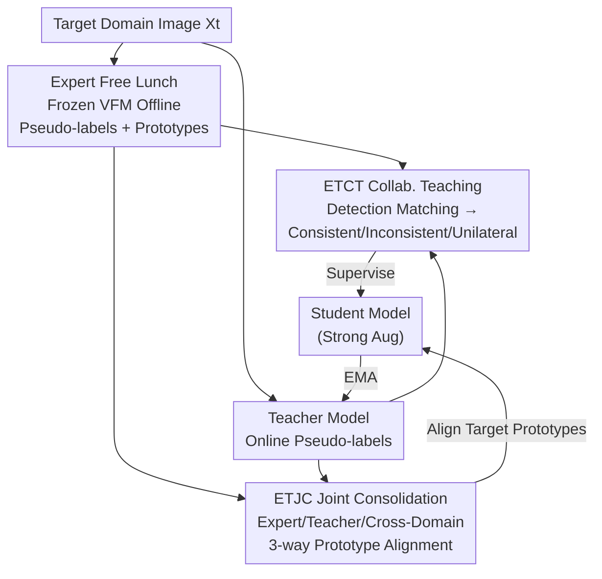

# Expert-Teacher-Student Collaborative Learning for Domain Adaptive Object Detection

**Conference**: CVPR 2026  
**Paper**: [CVF Open Access](https://openaccess.thecvf.com/content/CVPR2026/html/Cui_Expert-Teacher-Student_Collaborative_Learning_for_Domain_Adaptive_Object_Detection_CVPR_2026_paper.html)  
**Code**: To be confirmed  
**Area**: Object Detection / Domain Adaptive Object Detection  
**Keywords**: Domain Adaptive Object Detection, Teacher-Student Framework, Visual Foundation Models, Pseudo-labeling, Prototype Alignment

## TL;DR
To address the complementarity dilemma in domain adaptive object detection (DAOD)—where Visual Foundation Model (VFM) knowledge is too broad and teacher model knowledge is too narrow—this paper proposes the Expert-Teacher-Student (ETS) framework. By treating VFM as a "free lunch" expert model to generate offline pseudo-labels and prototypes, and employing a dual-layer mechanism of ETCT (Label-level Collaborative Teaching) and ETJC (Representation-level Joint Consolidation), the expert and teacher collaboratively supervise the student. ETS outperforms SOTA on three DAOD benchmarks (e.g., reaching 49.8% mAP on Cityscapes→BDD100k, 2.0% higher than DT).

## Background & Motivation
**Background**: The mainstream paradigm for Domain Adaptive Object Detection (DAOD) is the **teacher-student self-training framework**, where a teacher model generates pseudo-labels on the target domain to supervise a student, and the teacher is updated via Exponential Moving Average (EMA) of the student's weights. The core challenge has always been "how to produce high-quality pseudo-labels to prevent self-training collapse." Recently, a new category of methods has emerged: directly introducing **Visual Foundation Models (VFMs, such as DINOv2/DINOv3/Grounding DINO)** pre-trained on web-scale data to inject generalized knowledge. For example, DT replaces the teacher model with a frozen DINOv2, treating it as an offline labeler and performing feature alignment.

**Limitations of Prior Work**: Both routes have critical weaknesses. Pure teacher-student frameworks are limited by **small backbones and closed-loop internal knowledge**, leading to high pseudo-label noise and performance bottlenecks (or even training collapse) when facing domain shifts. Conversely, the pure VFM route (DT) suffers because VFM generalization knowledge is **not customized for specific target domains**. While VFMs excel at capturing domain-invariant cues (e.g., identifying a partially occluded car by its silhouette), they struggle to provide precise guidance on target domain characteristics (e.g., identifying a car heavily obscured by thick fog).

**Key Challenge**: The "generalized knowledge" of the expert (VFM) and the "domain-specific knowledge" of the teacher are **complementary**, but existing methods choose one over the other—either sacrificing VFM generalization or discarding the teacher's progressive domain adaptation capability. The key lies in making them **collaborate** rather than choosing between them.

**Goal**: To enable the student model to simultaneously inherit the generalized representations of the expert and the domain-specific adaptation of the teacher, without introducing significant additional training overhead.

**Key Insight**: Utilize VFM as an "expert model" in a **free lunch** manner—all pseudo-labels and prototypes are generated **offline** in a single pass. The VFM is not used for forward passes during training, resulting in near-zero extra computation. Subsequently, the expert, teacher, and student collaborate at both the **label level** and **representation level**.

**Core Idea**: A "teach-then-consolidate" progressive strategy—first, the expert and teacher **collaboratively generate labels** at the label level to supervise the student (ETCT), then they **jointly consolidate** the category prototypes learned by the student at the representation level (ETJC), injecting both types of complementary knowledge into the lightweight student model.

## Method

### Overall Architecture
ETS inserts an **expert branch** (a frozen VFM) into the standard teacher-student DAOD framework and bridges the three parties using two modules. The workflow is: ① The expert model (frozen DINOv3 ViT-H+ as a Faster R-CNN backbone, with the detection head trained only on the source domain) generates pseudo-labels and category prototypes for the target domain **offline**, incurring zero training overhead. ② During online training, the teacher generates online pseudo-labels for weakly augmented target images; the **ETCT module** performs detection matching between offline expert labels and online teacher labels to fuse them into "collaborative pseudo-labels" for supervising the student (on strongly augmented images). ③ The **ETJC module** attaches a prototype network to each of the three models, aligning the student's target domain prototypes with those of the expert, the teacher, and the student's own source domain prototypes to consolidate generalization and adaptation at the representation level. ④ The teacher is updated via EMA as usual, and the teacher's performance is reported.

### Key Designs

**1. "Free Lunch" Expert Usage: Compressing VFM into Offline One-time Pseudo-labels and Prototypes**

This step directly addresses the high training cost of VFMs. Instead of using DINOv3 as an online backbone, the authors use a frozen DINOv3 ViT-H+ as a Faster R-CNN backbone and train only the RPN and ROI heads **using source domain data only** (Equation $\mathcal{L}_{sup}=\mathcal{L}^{cls}_{sup}+\mathcal{L}^{reg}_{sup}$) to obtain an expert detector. A **single forward pass** is performed on the target training set to produce all pseudo-labels $\tilde{Y}(\tilde{B},\tilde{C})$ and extract category prototypes. Both tasks are completed **offline** before training begins; thus, ETS does not touch the VFM during training, achieving throughput (1.82 it/s) even higher than the VFM-based DT (1.79 it/s). This is the "free lunch": enjoying VFM generalization without pay the price of online inference. Expert labels are filtered using a confidence threshold $\delta$.

**2. ETCT Expert-Teacher Collaborative Teaching: Fusing Two Types of Labels into High-Quality Supervision**

This label-level collaboration addresses who to trust between expert generalized labels and teacher domain-specific labels. Given target image $X_t$, offline expert labels $\tilde{Y}$ and online teacher labels $\hat{Y}$ undergo **detection matching**: a matching matrix $M_{i,j}=1$ is constructed if the $i$-th expert box and $j$-th teacher box have $\text{IoU}\geq\tau$. Detections are classified into three types: **Consistent** ($M_{i,j}=1$ and same class), **Inconsistent** ($M_{i,j}=1$ but different classes), and **Unilateral** (only one side has a box). Fusion strategies are:

$$\bar{B}_n = \frac{\tilde{s}_i\cdot\tilde{B}_i + \hat{s}_j\cdot\hat{B}_j}{\tilde{s}_i + \hat{s}_j}$$

For consistent and inconsistent detections, box coordinates are **weighted-fused** by confidence $\tilde{s}_i,\hat{s}_j$, as confidence correlates with localization accuracy. For inconsistent **classes**, the teacher's class is adopted only if its confidence exceeds the expert's by a threshold $\epsilon$ (i.e., $\hat{s}_j-\tilde{s}_i\geq\epsilon$); otherwise, the expert is trusted. For unilateral detections: expert boxes are kept if they pass threshold $\delta$, while teacher boxes face a stricter threshold $\delta'>\delta$ to filter noise. The union $Y_{col}=P_c\cup P_i\cup P_u$ supervises the student via $\mathcal{L}_{colsup}=\mathcal{L}_{unsup}(X_t,B_{col},C_{col})$.

**3. ETJC Expert-Teacher Joint Consolidation: Injecting Generalization and Adaptation via Prototype Alignment**

While label-level supervision constrains "boxes and classes," the student's **feature space** remains unaligned. ETJC adds a lightweight prototype network (2-layer MLP on ROI features) to each model. A prototype is defined as the **confidence-weighted average** of all ROI features for a category:

$$p^{new}_k = \frac{\sum_n s_{k,n} P(R(F(X),B_n))}{\sum_n s_{k,n}}$$

Prototypes are updated via EMA ($\alpha'=0.999$). ETJC then performs **three-way cosine alignment** (loss is $1-\cos(\cdot,\cdot)$ averaged over valid classes $V$): **Expert-Student Alignment** $\mathcal{L}^{E-S}_{Prot}$ pulls the student's target prototype toward the frozen expert prototype (frozen from iteration 20,000) to inherit generalization; **Teacher-Student Alignment** $\mathcal{L}^{T-S}_{Prot}$ lets the student mimic the teacher's distilled domain-specific features; **Cross-Domain Alignment** $\mathcal{L}^{C-D}_{Prot}$ pulls the student's source and target prototypes together. The total objective is:

$$L = \lambda_1\mathcal{L}_{sup}+\lambda_2\mathcal{L}_{colsup}+\lambda_3\mathcal{L}^{E-S}_{Prot}+\lambda_4\mathcal{L}^{T-S}_{Prot}+\lambda_5\mathcal{L}^{C-D}_{Prot}$$

### Loss & Training
The Teacher-Student models use VGG16 (C→F, C→B) or ResNet101 (P→Cl) backbones, while the expert defaults to DINOv3 ViT-H+. The expert is trained for 40,000 iterations. For T-S training: 20,000 iterations of burn-in, followed by 80,000 iterations of mutual learning. Prototype alignment starts at iteration 25,000. Key hyperparameters: $\delta=0.8$, $\delta'=1.0$, $\epsilon=0.15$, $\tau=0.5$, $\alpha'=0.999$.

## Key Experimental Results

### Main Results
ETS sets new SOTAs across three benchmarks (mAP@0.5, reporting teacher performance):

| Benchmark (Source→Target) | Ours (ETS) | Prev. SOTA | Gain |
|----------------|----------|-----------|------|
| Cityscapes→BDD100k (C→B) | **49.8** | 47.8 (DT) | +2.0 |
| Cityscapes→Foggy (C→F) | **56.2** | 55.4 (DT) | +0.8 |
| Pascal VOC→Clipart1k (P→Cl) | **49.0** | 47.7 (CDMT) | +1.3 |

Compared to traditional T-S methods, ETS exceeds AT by 3.3% and CMT by 2.0% on P→Cl, confirming the necessity of introducing an expert.

### Ablation Study
Component ablation (C→B):

| Config | mAP | Description |
|------|-----|------|
| Baseline (Teacher only) | 36.4 | Performance drops after peak (training collapse) |
| + Consistent Detections (CD) | 43.9 | +7.5; Expert anchors optimization and prevents collapse |
| + Unilateral Detections (UD) | 47.9 | +4.0; Gains from complementary knowledge |
| Full ETCT (+Inconsistent ID) | 48.1 | Already exceeds all existing SOTA |
| + Cross-Domain Alignment (C-D) | 48.6 | +0.5 |
| + Teacher-Student Alignment (T-S) | 49.2 | +0.6 |
| + Expert-Student Alignment (E-S) | **49.8** | Full ETS, Best |

### Key Findings
- **Expert introduction is the key switch to prevent collapse**: Teacher-only supervision collapses after 36.4% mAP; adding Consistent Detections immediately yields +7.5% and stable convergence.
- **Expert performance $\neq$ Student upper bound**: A DINOv2 ViT-L expert (45.3%) led ETS to 47.7% (higher than the expert), as the teacher compensates when the expert underperforms.
- **Negligible efficiency loss**: Offline expert usage ensures ETS throughput (1.82 it/s) is slightly higher than DT (1.79 it/s).

## Highlights & Insights
- **"Free Lunch" VFM**: Compressing VFM into offline static assets (labels/prototypes) allows using large models without the online inference cost.
- **Elegant Detection Matching**: Tri-categorization (consistent, inconsistent, unilateral) provides a structured way to handle the "which labeler to trust" problem beyond simple union/intersection.
- **Teach-then-Consolidate Layering**: Decouples DAOD into label-level ("what to learn") and representation-level ("how to cluster features") stages.

## Limitations & Future Work
- **Storage and Expert Training Cost**: While online efficiency is high, storing offline labels for large datasets and the initial expert training (DINOv3 ViT-H+) are costly.
- **Static Offline Labels**: Expert labels do not update; if the initial expert quality is poor, the system cannot self-correct through student progress.
- **Hyperparameter Sensitivity**: Requires tuning $\delta, \delta', \epsilon, \tau$ and five loss weights.

## Related Work & Insights
- **vs. DT (CVPR'25)**: DT replaces the teacher with a frozen VFM; ETS retains the teacher to keep domain-specific knowledge, outperforming DT by 2.0% on C→B.
- **vs. Traditional T-S (AT/MIC/CMT)**: These are limited by closed-loop knowledge; ETS breaks this loop by introducing an external VFM expert.

## Rating
- Novelty: ⭐⭐⭐⭐ Shifting from "replacing teacher" to "collaborating with teacher" via a free lunch approach is practical.
- Experimental Thoroughness: ⭐⭐⭐⭐⭐ Comprehensive ablation and cross-benchmark validation.
- Writing Quality: ⭐⭐⭐⭐ Clear framework and logic.
- Value: ⭐⭐⭐⭐ High utility for DAOD with resource constraints.

<!-- RELATED:START -->

## Related Papers

- [\[CVPR 2026\] DA-Mamba: Learning Domain-Aware State Space Model for Global-Local Alignment in Domain Adaptive Object Detection](da-mamba_learning_domain-aware_state_space_model_for_global-local_alignment_in_d.md)
- [\[CVPR 2025\] Large Self-Supervised Models Bridge the Gap in Domain Adaptive Object Detection](../../CVPR2025/object_detection/large_self-supervised_models_bridge_the_gap_in_domain_adaptive_object_detection.md)
- [\[CVPR 2026\] Remedying Target-Domain Astigmatism for Cross-Domain Few-Shot Object Detection](remedying_target-domain_astigmatism_for_cross-domain_few-shot_object_detection.md)
- [\[CVPR 2026\] Learning Multi-Modal Prototypes for Cross-Domain Few-Shot Object Detection](learning_multi-modal_prototypes_for_cross-domain_few-shot_object_detection.md)
- [\[CVPR 2026\] Bridge: Basis-Driven Causal Inference Marries VFMs for Domain Generalization](bridge_basis-driven_causal_inference_marries_vfms_for_domain_generalization.md)

<!-- RELATED:END -->
