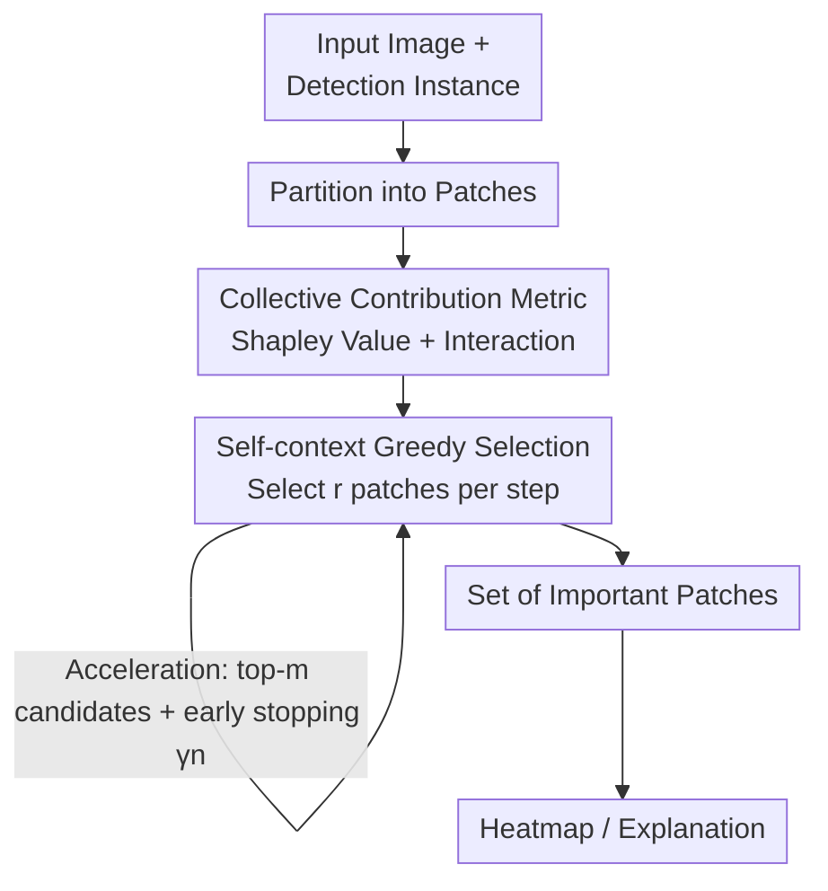

# Explaining Object Detectors via Collective Contribution of Pixels

**Conference**: CVPR 2026  
**arXiv**: [2412.00666](https://arxiv.org/abs/2412.00666)  
**Code**: https://github.com/tttt-0814/VX-CODE (Available)  
**Area**: Object Detection / Explainability  
**Keywords**: Detector Explainability, Shapley Value, Pixel Interaction, Greedy Patch Selection, Faithfulness

## TL;DR
This paper proposes VX-CODE, which explains object detectors using Shapley values (individual contribution) and interactions (collective contribution) from game theory. By utilizing a self-context variant and greedy patch selection, the exponential computation is reduced to a practical level, generating faithful heatmaps that cover both "primary features + collaborative background cues." Insertion/deletion AUC is improved by up to approximately 19% compared to the state-of-the-art (SOTA).

## Background & Motivation
**Background**: Object detectors are widely used in safety-sensitive scenarios such as autonomous driving and medical imaging. Understanding "which pixels in an image influence the detection" is crucial for identifying biases and improving robustness. Existing explanation methods generally fall into three categories: gradient-based (ODAM), CAM-based (SSGrad-CAM++), and perturbation-based (D-RISE, BSED).

**Limitations of Prior Work**: These methods only measure the **independent contribution of individual pixels**, highlighting regions with high gradients, activations, or marginal gains. However, detectors rely on the **synergy of multiple visual features**. A pixel might seem unimportant in isolation but becomes decisive for bounding box size or classification when combined with others. Focusing solely on independent contributions misses these "ancillary but critical" combinatorial cues or captures spurious correlations.

**Key Challenge**: Detection decisions are inherently "collective," whereas mainstream explanation metrics are "individual." The paper provides an intuitive example: in surfer detection, existing methods only highlight the surfboard while ignoring the combination of "surfboard + surrounding sea" that jointly supports the detection. When explaining biased models, existing methods either highlight only the implanted square markers or blur the entire box, failing to pinpoint both "object + marker" cues that the model simultaneously relies upon.

**Key Insight**: Game theory provides suitable tools—Shapley values measure the average marginal contribution of a single player, and interaction measures how much "two players together contribute more/less than the sum of their individual parts." By treating image patches as players and detection scores as rewards, collective contributions can be explicitly characterized. The difficulty lies in the exact computation of these metrics, which grows exponentially with the number of patches ($\mathcal{O}(n\cdot 2^n)$).

**Core Idea**: Utilize Shapley values + interaction to model both individual and collective contributions. These are then efficiently integrated into the explanation process using a **greedy patch insertion/deletion** strategy. The paper also provides a theoretical justification for this greedy approach from the perspective of sequential coalitional games ($\pi^*$-index).

## Method

### Overall Architecture
VX-CODE addresses the following problem (Problem 1): given an image and a detected instance $(L^x, P^x)$, find the smallest subset of patches $S_k$ of size $k$ such that **only inserting** these patches into a blank image reproduces the detection (insertion setup, finding minimal sufficient information), or **deleting** them causes the detection to fail (deletion setup, finding complete necessary information). The reward function measuring "reproduction degree" considers both localization and classification:

$$f(\mathcal{D}(x_S);(L^x,P^x))=\max_{(L,P)}\in\mathcal{D}(x_S)\mathrm{IoU}(L^x,L)\cdot\frac{P^x\cdot P}{\|P^x\|\|P\|}$$

where the $\mathrm{IoU}$ term handles box alignment and the cosine term handles category consistency. The process is: divide input image into patches $\rightarrow$ score candidate patch combinations at each step using "game-theoretic metrics" $\rightarrow$ greedily select $r$ most valuable patches $\rightarrow$ accumulate into an important patch set $\rightarrow$ render as a heatmap. The key is that the scoring at each step considers more than single patches; it naturally blends Shapley values and interactions through the self-context value.

### Key Designs

**1. Simultaneous characterization of individual and collective contributions using Shapley values + interaction: surfacing "combination matters" cues.**

To address the limitation where existing methods only look at independent pixel contributions and miss combinatorial cues, this paper treats patches as players in a coalitional game. The Shapley value $\phi(i|N)$ represents the average marginal gain of player $i$ when joining various subsets, characterizing individual contribution. The interaction $I(i,j|N)=\phi(S_{ij}|N')-\phi(i|N\setminus\{j\})-\phi(j|N\setminus\{i\})$ treats $i,j$ as a merged player to measure the "joint contribution" minus "individual contributions." The sign of this value is informative: when two patches encode nearly identical information (joining provides no more than one), the interaction becomes **negative**—useful for identifying **minimal, non-redundant** explanation patches. Conversely, only selecting patches with high Shapley values (the old way) biases towards the object's body, missing auxiliary information (like background or context) that only becomes effective in synergy with the main object, which is precisely the critical cue for explaining biases and failed cases.

**2. Self-context variant + greedy patch selection: compressing exponential computation and naturally surfacing interaction.**

Exact Shapley/interaction values are $\mathcal{O}(n\cdot 2^n)$ and computationally infeasible. This paper introduces the self-context value as a bypass: the self-context Shapley value $\phi^{sc}(S)=f(S)-f(\emptyset)$ treats the entire subset $S$ as one player; the self-context interaction $I^{sc}(S)=\phi^{sc}(S)-\sum_{S'\in\mathcal{P}^*(S)}\phi^{sc}(S')$ (where $\mathcal{P}^*(S)$ are all proper subsets of $S$) is a natural generalization of the interaction definition. The greedy strategy operates as such: at each step $k$, select a set of $r$ patches $B_k=\arg\max_{B}\phi^{sc}(\{\mathcal{B}_{k-1}\}\cup B)$ from the remaining patches, where $\mathcal{B}_{k-1}$ is the set of accumulated patches (treated as a single player). The beauty is that this objective can be decomposed as:

$$\phi^{sc}(\{\mathcal{B}_{k-1}\}\cup B)=I^{sc}(\{\mathcal{B}_{k-1}\}\cup B)+\sum_{B'}\in\mathcal{P}^*(\{\mathcal{B}_{k-1}\}\cup B)\phi^{sc}(B')$$

Thus, while it appears to merely select a set of size $r$, the interaction terms and various subset Shapley terms **automatically surface**. The greedy selection maximizes the sum of "individual contribution + collective interaction," thereby selecting informative and non-redundant patches. This transforms "considering interaction" from a concept into a specific, computable objective (degenerating to individual contribution when $r=1$).

**3. $\pi^*$-index: Providing a theoretical explanation for the greedy approach via sequential coalitional games.**

The self-context value is a "conceptual analogy" of the original metrics and does not satisfy all coalitional game axioms (like efficiency). To provide a solid theoretical foundation, this paper proposes the $\pi^*$-index: consider a **sequential** coalitional game where players join one by one in some order. The optimal order $\pi^*=\arg\max_{\pi}\sum_{k=1}^n f(\pi(1),\dots,\pi(k))$ maximizes total rewards (i.e., "signing the most important players first"). Each player's index $\psi(k|\pi^*)=f(\pi^*(1),\dots,\pi^*(k))-f(\pi^*(1),\dots,\pi^*(k-1))$ is the reward increment it brings upon joining. This satisfies coalitional game axioms and has a beautiful relationship—averaging $\psi(k|\pi)$ over all permutations restores the Shapley value ($\pi^*$ focuses on the "best case," Shapley on the "average case"). Finding the exact $\pi^*$ is NP-hard, and the aforementioned greedy strategy is exactly its greedy approximation: $\psi(k|\hat\pi)=\phi^{sc}(\{\mathcal{B}_{k-1}\}\cup B_k)-\phi^{sc}(\mathcal{B}_{k-1})$. While $\hat\pi=\pi^*$ is not guaranteed, experiments show this approximation is sufficiently strong.

**4. Patch selection + step restriction: Cutting the combinatorial explosion of $r\ge2$.**

When $r\ge2$, enumerating $\binom{|N\setminus\mathcal{B}_{k-1}|}{r}$ combinations per step is computationally heavy. Two lightweight modules are added: **patch selection** only allows the top $m$ candidates (ranked by single-patch reward, $m=30$) to participate in combinations, reducing the complexity from $\binom{|N|}{r}$ to $\binom{m}{r}$; **step restriction** stops combination search after identifying $\gamma n$ patches ($\gamma=0.1$) and reverts to selecting patches one by one ($r=1$), as the most important patches are usually picked in the first few steps. Together, they reduce complexity from $\mathcal{O}(n^{r+1}/r)$ to $\mathcal{O}(\frac{\gamma n}{r}m^r+(1-\gamma)n^2)$, drastically reducing generation time with minimal accuracy loss—interestingly, step restriction actually **improved** insertion/deletion metrics, confirming that high-information patches are concentrated in the initial steps.

### Loss & Training
VX-CODE is a **post-hoc explanation method** that does not train any model and has no loss function. It performs forward inference directly on trained detectors (DETR, Faster R-CNN, ResNet-50 backbone, based on detectron2). It uses local zero masking or blurring to simulate patch absence. The only "hyperparameters" are the number of patches selected per step $r\in\{1,2,3\}$, candidate size $m=30$, and early stopping ratio $\gamma=0.1$.

## Key Experimental Results

### Main Results
Faithfulness is measured by insertion/deletion AUC: insertion gradually adds important patches to a blank image (higher AUC is better), while deletion removes important patches from the original image (lower AUC is better). Overall Accuracy (OA) = Ins − Del. Results are averaged over 1,000 instances with prediction scores > 0.7.

| Dataset / Detector | Method | Ins ↑ | Del ↓ | OA ↑ |
|--------|------|------|------|------|
| MS-COCO / DETR | SSGrad-CAM++ (Next Best) | .871 | .114 | .757 |
| MS-COCO / DETR | VX-CODE (r=1) | .904 | **.053** | .851 |
| MS-COCO / DETR | VX-CODE (r=3) | **.909** | .052 | **.857** |
| MS-COCO / Faster R-CNN | SSGrad-CAM++ | .900 | .126 | .774 |
| MS-COCO / Faster R-CNN | VX-CODE (r=3) | **.922** | **.067** | **.855** |
| PASCAL VOC / DETR | SSGrad-CAM++ | .813 | .166 | .647 |
| PASCAL VOC / DETR | VX-CODE (r=3) | **.838** | **.067** | **.771** |
| PASCAL VOC / Faster R-CNN | SSGrad-CAM++ | .890 | .140 | .750 |
| PASCAL VOC / Faster R-CNN | VX-CODE (r=3) | .850 | **.063** | **.787** |

VX-CODE (r=1) already outperforms existing methods in almost all metrics; increasing $r$ further improves results. $r=3$ achieves the best OA across all detectors and datasets. The paper emphasizes an insertion/deletion AUC Gain of up to **19%**. On COCO, at 10% area, VX-CODE's insertion is 20% higher and deletion is 50% lower than the next best method, indicating it identifies key regions using **fewer pixels**.

Performance on failure cases (DETR/COCO, 200 instances each):

| Failure Type | Method | Ins ↑ | Del ↓ |
|------|------|------|------|
| Misclassification | SSGrad-CAM++ | .647 | .220 |
| Misclassification | VX-CODE (r=3) | **.738** | **.168** |
| Mislocalization | SSGrad-CAM++ | .766 | .120 |
| Mislocalization | VX-CODE (r=3) | **.787** | **.078** |

### Ablation Study
Effect of patch selection (PS) and step restriction (SR) (DETR/COCO, 50 instances, RTX A6000, $r=2$):

| PS | SR | Ins ↑ | Del ↓ | OA ↑ | Time per instance (s) ↓ |
|----|----|------|------|------|------|
| ✗ | ✗ | .917 | .057 | .860 | 768.13 |
| ✓ | ✗ | .917 | .059 | .858 | 287.61 |
| ✗ | ✓ | .922 | .056 | **.866** | 281.78 |
| ✓ | ✓ | .921 | .058 | .863 | **96.25** |

### Key Findings
- **Two acceleration modules cut ~87% of time with almost no performance drop**: Time decreased from 768s to 96s (~8×) while Ins/Del/OA remained stable. Step restriction alone even increased OA from .860 to .866.
- **Larger $r$ provides better coverage**: In the giraffe example, $r=1,2$ only highlighted neck/forehead/ears, while $r=3$ also captured the nose. In the mug example, $r=1$ missed the rim and handle, while $r=2,3$ identified them earlier. A large $r$ mitigates "flat reward" issues where reward increments are nearly equal.
- **Insertion vs. deletion emphasizes different aspects**: Patch insertion highlights collaborative backgrounds like "surfboard + sea," whereas patch deletion prioritizes removing specific instance features that drop confidence fastest, resulting in a more "object-centric" explanation that improves localization understanding.
- **Generalizability**: VX-CODE achieved Ins .962 / Del .211 / OA .751 on Grounding DINO, significantly outperforming VPS (OA .646). It is also verified effective on single-stage RetinaNet.

## Highlights & Insights
- **Turning the "collective contribution" intuition into a computable target**: Negative interaction precisely corresponds to information redundancy between two patches, providing a clean criterion for finding the "minimal non-redundant explanation set," which is more aligned with the "synergistic decision" nature of detectors than just picking high Shapley values.
- **Clever algebraic decomposition of the greedy objective**: $\phi^{sc}(\{\mathcal{B}_{k-1}\}\cup B)$ appears to just select a set of size $r$, but its expansion automatically includes interaction and subset Shapley terms—interaction is included "for free" without explicit enumeration.
- **$\pi^*$-index anchors engineering heuristics in theory**: Under the sequential coalitional game perspective, greedy selection is explained as an approximation of an NP-hard optimal sequence. The "$\pi^*$-index average = Shapley value" relationship is elegant, giving the non-axiomatic self-context variant a solid theoretical standing.
- **Transferability**: This framework is not tied to object detection. Any task where output depends on regional synergy and requires minimal faithful explanations (segmentation, VLM grounding, medical imaging) can adopt it by replacing the reward function $f$.

## Limitations & Future Work
- **Computational weight**: Even after acceleration, ~96s per instance (A6000) is far from real-time or large-scale auditing; deletion setups and larger $r$ further increase costs.
- **No global optimality for greedy approach**: $\hat\pi=\pi^*$ is not guaranteed. The authors observed that "insufficient early information" at $r=1$ can lead to failures in some cases (mitigated by increasing $r$), showing that explanation quality is sensitive to selection order.
- **Patch granularity and masking are implicit variables**: Explanations depend on patch partitioning and zero-masking/blurring to "simulate absence." Out-of-distribution artifacts introduced by masking might affect rewards.
- **Metric limitations**: Insertion/deletion AUC are proxy metrics and do not directly equate to "human-perceived correctness." Pointing games are only provided in the appendix. The self-context value lacks the efficiency axiom, making the explanation additivity/conservation weaker.

## Related Work & Insights
- **vs. ODAM / SSGrad-CAM++ (Gradient/CAM categories)**: These rely on gradient-weighted features to calculate single-pixel importance, reflecting only independent contributions. VX-CODE explicitly models patch interactions to identify "ancillary but collaborative" cues.
- **vs. D-RISE (Perturbation category)**: D-RISE uses 5,000 random masks to estimate importance, which is still inherently individual and produces noisy explanations. VX-CODE uses structured greedy selection, requiring fewer evaluations and producing cleaner results.
- **vs. BSED / FSOD (Previous Shapley detection explanations)**: These use Shapley values for per-pixel/region importance but **do not model interactions**. This paper is the first to analyze greedy patch selection from the combined perspective of Shapley, interaction, and sequential coalitional games.
- **vs. MoXI / PredDiff (Classification collective contribution)**: Modeling collective contributions has been shown to be more faithful in classification. This paper migrates and extends this concept (including self-context variants) to object detection and adds the $\pi^*$-index theory.

## Rating
- Novelty: ⭐⭐⭐⭐ First to use Shapley + interaction + sequential games to explain detectors with a theoretical basis for greediness.
- Experimental Thoroughness: ⭐⭐⭐⭐ Covers 2 datasets × 2 detectors + Grounding DINO/RetinaNet + bias/failure cases + acceleration ablation.
- Writing Quality: ⭐⭐⭐⭐ Motivation is intuitive with bias/failure examples; theoretical derivation is clear, though self-context nuances are complex.
- Value: ⭐⭐⭐⭐ Faithfulness is significantly improved; useful for detector auditing in safety-sensitive scenarios.

<!-- RELATED:START -->

## Related Papers

- [\[CVPR 2026\] AnomalyVFM -- Transforming Vision Foundation Models into Zero-Shot Anomaly Detectors](anomalyvfm_--_transforming_vision_foundation_models_into_zero-shot_anomaly_detec.md)
- [\[ECCV 2024\] On Calibration of Object Detectors: Pitfalls, Evaluation and Baselines](../../ECCV2024/object_detection/on_calibration_of_object_detectors_pitfalls_evaluation_and_baselines.md)
- [\[ECCV 2024\] Can OOD Object Detectors Learn from Foundation Models?](../../ECCV2024/object_detection/can_ood_object_detectors_learn_from_foundation_models.md)
- [\[ICCV 2025\] Visual Modality Prompt for Adapting Vision-Language Object Detectors](../../ICCV2025/object_detection/visual_modality_prompt_for_adapting_vision-language_object_detectors.md)
- [\[AAAI 2026\] Correcting False Alarms from Unseen: Adapting Graph Anomaly Detectors at Test Time](../../AAAI2026/object_detection/correcting_false_alarms_from_unseen_adapting_graph_anomaly_detectors_at_test_tim.md)

<!-- RELATED:END -->
