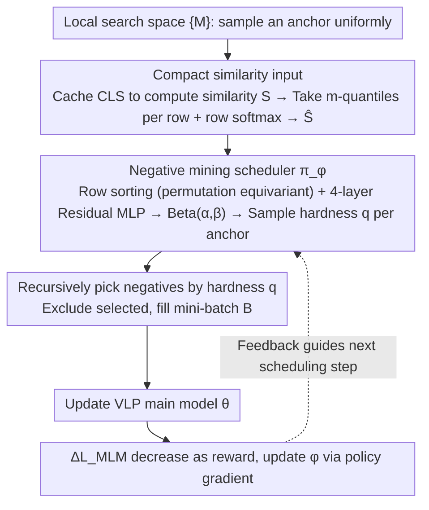

# FALCON: False-Negative Aware Learning of Contrastive Negatives in Vision-Language Alignment

**Conference**: CVPR2026  
**arXiv**: [2505.11192](https://arxiv.org/abs/2505.11192)  
**Code**: TBD  
**Area**: Object Detection / Vision-Language Pre-training  
**Keywords**: False Negatives, Contrastive Learning, Vision-Language Pre-training, Negative Mining, Mini-batch Construction, Scheduler

## TL;DR

FALCON is proposed as a **learning-based mini-batch construction strategy**. It utilizes a negative mining scheduler to adaptively balance the trade-off between hard negatives and false negatives, significantly improving cross-modal alignment quality in vision-language pre-training.

## Background & Motivation

**False negatives are a core challenge in VLP**: Large-scale web-crawled datasets exhibit many-to-many correspondences between images and text. High-similarity "negatives" in contrastive learning are often actually matching positive samples (false negatives), introducing contradictory supervisory signals.

**The dilemma of hard negative mining**: Selecting negative samples highly similar to the anchor can accelerate learning, but higher similarity increases the risk of false negatives. Conversely, selecting low-similarity negatives provides insufficient informative signal.

**The optimal similarity range is dynamic**: Semantic complexity varies across anchors. Simple anchors have compact positive distributions, allowing for safer mining of harder negatives. Complex anchors have noisy embeddings, requiring more conservative mining strategies. This optimal range evolves continuously throughout the training process.

**Assistance from pre-trained models is not a panacea**: Methods like MAFA use fixed pre-trained models' ITM scores to filter false negatives, but they suffer from misjudgment on complex semantic pairs (assigning low ITM scores even when semantically matched). Fixed thresholds are either too conservative or insufficient.

**Heuristic scheduling strategies lack flexibility**: Fixed hardness (e.g., $q=1.0$ in GRIT-VLP) or progressive curriculum strategies (Progressive-Hardening/Softening) cannot capture instance-level and training-stage-level dynamic changes.

**Existing methods depend on hyperparameters and have limited generalization**: Two-stage "mining + filtering" frameworks are highly sensitive to thresholds, with false negative rates reaching up to 60%.

## Method

### Overall Architecture

FALCON addresses a long-standing issue in contrastive vision-language pre-training: mining hard negatives accelerates alignment, but harder samples are more likely to be "actually matching" false negatives, injecting contradictory supervision. The approach transforms the decision of "how hard to mine" from a manual heuristic (fixed quantiles, curriculum annealing) into a learnable decision—training a lightweight **negative mining scheduler** $\pi_\phi$. This scheduler reads the current batch's similarity distribution and decides the mining hardness for each anchor on the fly.

The framework follows the grouping idea of GRIT-VLP, partitioning the dataset into several local search spaces $\{M\}$. When constructing a mini-batch: an anchor is first sampled uniformly from some $M$; the scheduler reads the current normalized similarity distribution $\widehat{\mathbf{S}}$ and outputs a hardness quantile $q\in[0,1]$ ($q=1.0$ degenerates to the "hardest" in GRIT-VLP, $q=0.0$ selects the simplest negative); samples are then enqueued from the candidate pool according to the similarity level corresponding to $q$, recursively excluding already selected samples until the batch $B$ is full. Subsequently, the VLP main model $\theta$ is updated using this batch. The decrease in MLM loss before and after the update is used as a reward to update the scheduler $\phi$ via policy gradient, making the next scheduling step more accurate—thus forming a closed-loop system.

### Key Designs

**1. Learnable Hardness Scheduler: Entrusting mining hardness to optimization rather than heuristics**

The optimal mining hardness is instance-dependent and drifts during training. Simple anchors with compact positive distributions can safely mine harder negatives, while complex anchors require conservative strategies. Fixed $q$ or preset curricula fail to capture this dynamics. FALCON uses a lightweight 4-layer Residual MLP to map the similarity distribution to parameters $(\alpha, \beta)$ of a Beta distribution, from which the hardness quantile $q$ is sampled. The Beta distribution naturally falls within $[0, 1]$ and can express continuous preferences from conservative to aggressive, while the sampling form enables policy gradient optimization.

**2. Compact Similarity Input and Row-level Normalization: Neutralizing scale drift with zero overhead**

The scheduler cannot directly ingest the entire similarity matrix due to its size and numerical scale drift during training. FALCON sums I2T and T2I cosine similarity matrices to obtain a unified matrix $\mathbf{S}$ (reusing existing CLS embedding queues without additional forward passes). Each row is compressed by taking $m$ uniformly spaced quantiles ($m \ll |M|$). Row-wise softmax normalization is then applied to obtain $\widehat{\mathbf{S}}$. Consequently, regardless of the training stage or similarity magnitude, the scheduler perceives only the shape of the distribution. Combined with the scheduler being a small MLP, the computational overhead is negligible.

**3. Permutation Equivariance + Instance-level Scheduling: Independent adjustment for each anchor**

The order of samples in a batch should not affect decisions, but using Transformers for equivariance is too heavy. FALCON achieves permutation equivariance efficiently by sorting the rows of $\widehat{\mathbf{S}}$ before feeding them into the MLP. Furthermore, hardness is predicted individually for each anchor rather than sharing a single threshold across the batch. Ablations show instance-level scheduling (TR R@1 61.72) significantly outperforms batch-level (58.78), confirming that optimal hardness is anchor-dependent.

### Loss & Training

The reward signal for the scheduler is the **decrease in MLM loss**, serving as a proxy for improvement in cross-modal alignment. The policy gradient update is formulated as:

$$\phi_{k+1} = \phi_k + \gamma \cdot \mathbb{E}_{\pi_{\phi_k}}\left[\Delta_k^{V,T} \cdot \nabla_{\phi_k} \log \pi_{\phi_k}(V,T|\widehat{\mathbf{S}})\right]$$

where $\Delta_k^{V,T} = \mathcal{L}_{\text{MLM}}(V,T;\theta_k) - \mathcal{L}_{\text{MLM}}(V,T;\theta_{k+1})$ is the improvement in MLM loss from that step. MLM is preferred over ITC/ITM because contrastive objectives can induce the scheduler to "cheat" by mining trivial negatives to minimize loss, which harms alignment. Generative MLM is robust to this; using only $\mathcal{L}_\text{MLM}$ (TR R@1 61.72) is significantly better than combinations including contrastive terms (57.64 / 57.80).

## Experimental Results

### Main Results: Comparison with Heuristic Negative Mining (MSCOCO Pre-training)

| Method | TR R@1 | TR R@5 | IR R@1 | IR R@5 | VQA test-dev | NLVR2 dev |
|------|--------|--------|--------|--------|-------------|-----------|
| ALBEF | 55.60 | 81.92 | 41.16 | 70.63 | 70.46 | 72.98 |
| GRIT-VLP | 60.60 | 83.52 | 44.61 | 69.54 | 71.04 | 74.63 |
| MAFA | 60.96 | 83.24 | 44.77 | 69.49 | 71.13 | 75.16 |
| **FALCON** | **62.28** | **86.18** | **46.18** | **74.65** | **71.24** | **75.17** |

### Cross-framework Compatibility (BLIP-2 & SigLIP-2)

| Framework | Baseline COCO TR R@1 | +FALCON TR R@1 | Baseline COCO IR R@1 | +FALCON IR R@1 |
|------|------------------|----------------|------------------|----------------|
| BLIP-2 | 75.22 | **75.56** | 57.98 | **58.52** |
| SigLIP-2 | 69.96 | **72.96** | 54.21 | 54.15 |

### Ablation Study Key Findings

**Impact of Search Space Size**:
- $|M|=480 \rightarrow$ TR R@1: 58.48; $|M|=5664 \rightarrow$ 61.72; $|M|=28320 \rightarrow$ 61.94.
- FALCON is robust to large search spaces, whereas baselines (e.g., GRIT-VLP) degrade due to increased false negatives.

**Selection of Training Objective**:
- Only $\mathcal{L}_\text{MLM}$: TR R@1 = 61.72 (Best).
- $\mathcal{L}_\text{ITC}+\mathcal{L}_\text{ITM}$: TR R@1 = 57.64 (Significant drop).
- $\mathcal{L}_\text{ITC}+\mathcal{L}_\text{ITM}+\mathcal{L}_\text{MLM}$: TR R@1 = 57.80.
- Conclusion: Contrastive objectives lure the scheduler toward trivial negatives; generative objectives (MLM) are more suitable proxies.

**Scheduling Granularity**:
- Instance-level scheduling (61.72) is much better than Batch-level (58.78), confirming that optimal hardness is anchor-dependent and a uniform threshold is insufficient for diverse semantic complexities.

### Training Dynamics & Generalization

- **Adaptive Scheduling Behavior**: In early training, FALCON samples high quantiles (hard negatives) to accelerate embedding learning. As the embedding space matures and false negatives cluster at high quantiles, the scheduler automatically lowers the quantile to avoid false negative risks.
- **4M Standard Dataset**: Achieves best performance on the 4M setup including noisy web data like CC and SBU (COCO zero-shot TR R@1: 74.1 vs. MAFA 72.6 vs. ALBEF 68.7).
- **Convergence Efficiency**: Convergence time is $0.83C$ relative to ALBEF, slightly higher than GRIT-VLP ($0.65C$) and MAFA ($0.76C$), but the performance-time curve (Recall@1 vs. wall-clock) consistently outperforms all baselines.
- **Robustness to Search Space**: FALCON's performance improves and then stabilizes as $|M|$ expands from 480 to 28320, while GRIT-VLP degrades in large search spaces due to increased false negatives.

## Highlights & Insights

- **First Learning-based Negative Scheduling Method**: Elevates the hard/false negative trade-off from manual heuristics to a learnable optimization problem, establishing a new paradigm for negative sample management in contrastive learning.
- **Elegant and Efficient Design**: Uses a 4-layer Residual MLP + Beta distribution parameterization + row sorting for equivariance. The computational overhead is minimal and does not bottleneck training.
- **Clear Theoretical Motivation**: Uses MLM loss decrease as a proxy for cross-modal alignment improvement. Experimental results validate that contrastive objectives lead to trivial negative traps, providing sound logic for the design choices.
- **Broad Applicability**: Effective across three different architectures (Fusion/ALBEF, Q-Former/BLIP-2, Dual-tower/SigLIP-2), proving the method's universality.
- **Detailed Visualization Analysis**: Provides visualizations of scheduler behavior over training, quantile sampling examples, and evolution of similarity distributions, intuitively demonstrating the adaptive mechanism.

## Limitations & Future Work

- Limited improvement on the text-side for SigLIP-2 (almost no gain in IR R@1), as the auxiliary generative loss only passes through the vision encoder, biasing scheduling signals toward the vision side.
- Gains diminish on heavily noisy web datasets compared to clean MSCOCO, as semantically misaligned raw captions interfere with hardness estimation.
- The scheduler requires additional forward passes and updates, making the per-epoch cost slightly higher than GRIT-VLP and MAFA ($0.83C$ vs. $0.65C/0.76C$).
- Dependence on cached CLS embeddings to build the similarity matrix; embedding lag might impact accuracy during early training.
- Proxy signals need to be associated with both modality encoders to be fully effective; generative goals solely on the vision or text side have limited impact.
- Currently only validated on retrieval, VQA, and NLVR; not yet tested on broader downstream tasks like visual grounding or image generation.

## Related Work & Insights

- **Hard Negative Mining**: GRIT-VLP (fixed $q=1.0$, search space grouping), DiHT (debiased contrastive learning), SRCL (self-regulated contrastive learning).
- **False Negative Handling**: MAFA (pre-trained ITM threshold filtering + re-labeling), FFF (Fixing Faults in Foundation contrastive pre-training), VL-Match (token-level and instance-level matching enhancement).
- **Learning to Optimize / Meta-Learning**: Learning to learn by gradient descent, Neural optimizer search (RL-based optimizer search).
- **Vision-Language Pre-training**: ALBEF (momentum distillation + ITC/ITM/MLM), BLIP series (unified understanding and generation), SigLIP-2 (sigmoid contrastive + generative objectives), CLIP/ALIGN (large-scale contrastive pre-training).

## Rating

- Novelty: ⭐⭐⭐⭐ — First to model negative hardness scheduling as a learnable optimization problem; Beta distribution parameterization and MLM proxy design are novel.
- Experimental Thoroughness: ⭐⭐⭐⭐⭐ — Covers three VLP frameworks, multiple downstream tasks, detailed ablations, training dynamics visualization, and wall-clock comparisons.
- Writing Quality: ⭐⭐⭐⭐ — Arguing motivation is thorough (false negative rate analysis in Fig 2 is compelling), complete formula derivations, and clear charts.
- Value: ⭐⭐⭐⭐ — General-purpose and plug-and-play; false negatives are a universal issue in large-scale VLP, making this highly practical.

<!-- RELATED:START -->

## Related Papers

- [\[CVPR 2026\] Saliency-R1: Enforcing Interpretable and Faithful Vision-language Reasoning via Saliency-map Alignment Reward](saliency-r1_enforcing_interpretable_and_faithful_vision-language_reasoning_via_s.md)
- [\[CVPR 2026\] DA-Mamba: Learning Domain-Aware State Space Model for Global-Local Alignment in Domain Adaptive Object Detection](da-mamba_learning_domain-aware_state_space_model_for_global-local_alignment_in_d.md)
- [\[CVPR 2026\] CrossVL: Complexity-Aware Feature Routing and Paired Curriculum for Cross-View Vision-Language Detection](crossvl_complexity-aware_feature_routing_and_paired_curriculum_for_cross-view_vi.md)
- [\[ICML 2025\] Causality-Aware Contrastive Learning for Robust Multivariate Time-Series Anomaly Detection](../../ICML2025/object_detection/causality-aware_contrastive_learning_for_robust_multivariate_time-series_anomaly.md)
- [\[AAAI 2026\] MovSemCL: Movement-Semantics Contrastive Learning for Trajectory Similarity (Extension)](../../AAAI2026/object_detection/movsemcl_movement-semantics_contrastive_learning_for_trajectory_similarity_exten.md)

<!-- RELATED:END -->
